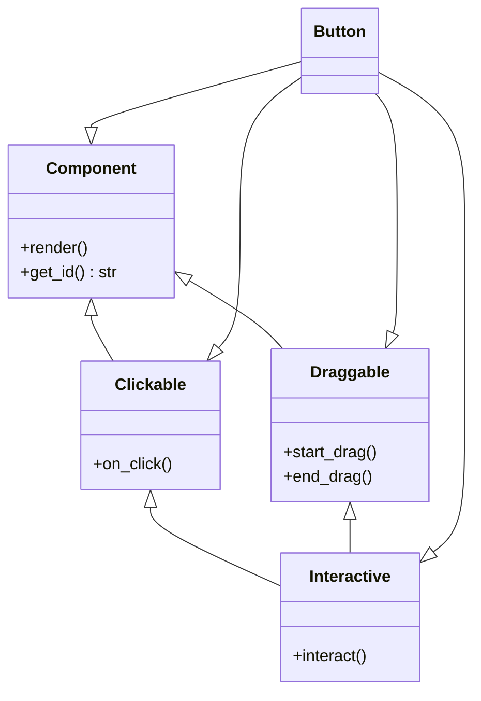

# Rust Supertraits

## Introduction

When designing code in Rust, you'll often need to express relationships between different traits. **Supertraits** are Rust's way of creating a form of trait inheritance, allowing you to build more complex traits on top of simpler ones. This mechanism helps you create cleaner, more composable APIs while maintaining Rust's type safety.

In this tutorial, we'll explore how supertraits work in Rust, why they're useful, and how to effectively use them in your code. If you're already familiar with basic traits in Rust, supertraits will be your next step in mastering Rust's powerful trait system.

## What Are Supertraits?

A **supertrait** indicates that a trait depends on another trait. In other words, if trait `B` is a supertrait of trait `A`, then you cannot implement `A` without also implementing `B`. This creates a relationship similar to inheritance in object-oriented programming, but with Rust's composition-focused approach.

The syntax for declaring a supertrait uses the colon (`:`) after the trait name:

```rust
trait SuperTrait {
    fn super_method(&self);
}

// SubTrait requires SuperTrait
trait SubTrait: SuperTrait {
    fn sub_method(&self);
}
```

This means that any type implementing `SubTrait` must also implement `SuperTrait`.

## Basic Supertrait Example

Let's start with a simple example to demonstrate how supertraits work:

```rust
// Define a basic trait for printing information
trait Printable {
    fn print(&self);
}

// Define a trait that extends Printable with JSON formatting capability
trait JsonPrintable: Printable {
    fn print_json(&self);
}

// Implement both traits for a Person struct
struct Person {
    name: String,
    age: u32,
}

impl Printable for Person {
    fn print(&self) {
        println!("Name: {}, Age: {}", self.name, self.age);
    }
}

impl JsonPrintable for Person {
    fn print_json(&self) {
        println!("{{ \"name\": \"{}\", \"age\": {} }}", self.name, self.age);
    }
}

fn main() {
    let person = Person {
        name: String::from("Alice"),
        age: 30,
    };
    
    // We can call both methods
    person.print();      // Basic printing
    person.print_json(); // JSON printing
}
```

**Output:**
```
Name: Alice, Age: 30
{ "name": "Alice", "age": 30 }
```

In this example:
1. We define `Printable` as a basic trait with a `print` method
2. We define `JsonPrintable` as a trait that requires `Printable` (making `Printable` a supertrait)
3. For our `Person` struct, we must implement both traits

## Why Use Supertraits?

Supertraits are useful for several reasons:

1. **Code Reuse**: You can build complex behaviors from simpler ones
2. **Constraints**: You can ensure that types have certain capabilities
3. **API Design**: You can create more intuitive interfaces with progressive complexity
4. **Composition**: You can compose behavior in a way that's more flexible than classical inheritance

## Using Methods from Supertraits

One of the most powerful aspects of supertraits is that you can use methods from the supertrait within the implementation of the subtrait:

```rust
trait Machine {
    fn start(&self) -> bool;
    fn stop(&self);
}

trait AdvancedMachine: Machine {
    fn process(&self, data: &str) -> String {
        // We can call start() because it's guaranteed to be implemented
        if self.start() {
            let result = format!("Processed: {}", data);
            self.stop();
            result
        } else {
            String::from("Failed to start machine")
        }
    }
}

struct Computer {
    is_on: bool,
}

impl Machine for Computer {
    fn start(&self) -> bool {
        println!("Computer starting up...");
        true
    }
    
    fn stop(&self) {
        println!("Computer shutting down...");
    }
}

impl AdvancedMachine for Computer {
    // We can use the default implementation of process()
    // or override it if needed
}

fn main() {
    let my_computer = Computer { is_on: false };
    let output = my_computer.process("Hello, world!");
    println!("{}", output);
}
```

**Output:**
```
Computer starting up...
Computer shutting down...
Processed: Hello, world!
```

Notice how the `process` method in `AdvancedMachine` can call `start()` and `stop()` methods from the `Machine` trait. This is possible because we've declared `Machine` as a supertrait of `AdvancedMachine`.

## Multiple Supertraits

Rust allows a trait to have multiple supertraits by using the `+` syntax:

```rust
trait Draw {
    fn draw(&self);
}

trait Resize {
    fn resize(&self, width: u32, height: u32);
}

// Widget requires both Draw and Resize
trait Widget: Draw + Resize {
    fn show(&self) {
        self.draw();
        println!("Widget is visible!");
    }
}

struct Button {
    label: String,
    width: u32,
    height: u32,
}

impl Draw for Button {
    fn draw(&self) {
        println!("Drawing button with label: {}", self.label);
    }
}

impl Resize for Button {
    fn resize(&self, width: u32, height: u32) {
        println!("Resizing button to {}x{}", width, height);
    }
}

impl Widget for Button {
    // Using the default implementation for show()
}

fn main() {
    let button = Button {
        label: String::from("Click me"),
        width: 100,
        height: 30,
    };
    
    button.draw();
    button.resize(150, 40);
    button.show();
}
```

**Output:**
```
Drawing button with label: Click me
Resizing button to 150x40
Drawing button with label: Click me
Widget is visible!
```

In this example, the `Widget` trait has two supertraits: `Draw` and `Resize`. Any type that implements `Widget` must also implement both these traits.

## Using Supertraits in Generic Functions

Supertraits can be very useful when writing generic functions that require specific behavior:

```rust
trait HasArea {
    fn area(&self) -> f64;
}

trait HasPerimeter: HasArea {
    fn perimeter(&self) -> f64;
    
    fn describe(&self) {
        println!("Area: {}, Perimeter: {}", self.area(), self.perimeter());
    }
}

struct Rectangle {
    width: f64,
    height: f64,
}

impl HasArea for Rectangle {
    fn area(&self) -> f64 {
        self.width * self.height
    }
}

impl HasPerimeter for Rectangle {
    fn perimeter(&self) -> f64 {
        2.0 * (self.width + self.height)
    }
}

struct Circle {
    radius: f64,
}

impl HasArea for Circle {
    fn area(&self) -> f64 {
        std::f64::consts::PI * self.radius * self.radius
    }
}

impl HasPerimeter for Circle {
    fn perimeter(&self) -> f64 {
        2.0 * std::f64::consts::PI * self.radius
    }
}

// This function can work with any type that implements HasPerimeter
// (which also guarantees it implements HasArea)
fn print_shape_info<T: HasPerimeter>(shape: &T) {
    shape.describe();
}

fn main() {
    let rect = Rectangle { width: 5.0, height: 3.0 };
    let circle = Circle { radius: 2.0 };
    
    print_shape_info(&rect);
    print_shape_info(&circle);
}
```

**Output:**
```
Area: 15, Perimeter: 16
Area: 12.566370614359172, Perimeter: 12.566370614359172
```

In this example, `print_shape_info` requires a type that implements `HasPerimeter`, which in turn requires `HasArea`. This allows the function to use methods from both traits.

## Supertraits vs. Where Clauses

There are two ways to express trait dependencies in Rust:

1. Using supertraits (as we've seen):
```rust
trait Summary: Display {
    // methods...
}
```

2. Using a where clause:
```rust
trait Summary where Self: Display {
    // methods...
}
```

Both approaches create the same requirement: any type implementing `Summary` must also implement `Display`. However, there's a subtle difference:

- The supertrait syntax (`trait Summary: Display`) makes the relationship part of the trait's definition and public API
- The where clause syntax makes it an implementation detail that might be less visible to users

Choose based on whether you want to emphasize the dependency as part of your public API design.

## Real-World Application: Building a Component System

Let's look at a more practical example of using supertraits to build a flexible component system:

```rust
// Base trait for all UI components
trait Component {
    fn render(&self);
    fn get_id(&self) -> &str;
}

// Clickable components must implement Component
trait Clickable: Component {
    fn on_click(&self);
}

// Draggable components must implement Component
trait Draggable: Component {
    fn start_drag(&self);
    fn end_drag(&self);
}

// Interactive components are both Clickable and Draggable
trait Interactive: Clickable + Draggable {
    fn interact(&self) {
        println!("Interacting with component: {}", self.get_id());
        self.on_click();
        self.start_drag();
        self.end_drag();
    }
}

struct Button {
    id: String,
    label: String,
}

impl Component for Button {
    fn render(&self) {
        println!("Rendering button: {}", self.label);
    }
    
    fn get_id(&self) -> &str {
        &self.id
    }
}

impl Clickable for Button {
    fn on_click(&self) {
        println!("Button clicked: {}", self.label);
    }
}

impl Draggable for Button {
    fn start_drag(&self) {
        println!("Started dragging button: {}", self.label);
    }
    
    fn end_drag(&self) {
        println!("Stopped dragging button: {}", self.label);
    }
}

impl Interactive for Button {}  // Use default implementation

fn main() {
    let button = Button {
        id: String::from("btn-submit"),
        label: String::from("Submit"),
    };
    
    button.render();
    button.interact();
}
```

**Output:**
```
Rendering button: Submit
Interacting with component: btn-submit
Button clicked: Submit
Started dragging button: Submit
Stopped dragging button: Submit
```

This component system demonstrates how supertraits can be used to build complex behavior from simpler traits. Each component has base functionality, and more interactive components inherit capabilities while potentially adding their own.

## Visual Representation of Supertraits

Here's a diagram showing the relationship between traits in our component system example:



## Common Challenges and Solutions

### Challenge: Conflicting Method Names

Sometimes, you might have traits with methods that have the same name:

```rust
trait Animal {
    fn make_sound(&self) -> String;
}

trait Machine {
    fn make_sound(&self) -> String;
}

// A robot animal implements both traits
struct RobotDog;

impl Animal for RobotDog {
    fn make_sound(&self) -> String {
        String::from("Woof but electronic")
    }
}

impl Machine for RobotDog {
    fn make_sound(&self) -> String {
        String::from("Beep boop")
    }
}
```

To call these methods with the same name, you need to use fully qualified syntax:

```rust
fn main() {
    let robo_dog = RobotDog;
    
    // These won't work because it's ambiguous:
    // let sound = robo_dog.make_sound();
    
    // Use fully qualified syntax instead:
    let animal_sound = <RobotDog as Animal>::make_sound(&robo_dog);
    let machine_sound = <RobotDog as Machine>::make_sound(&robo_dog);
    
    println!("Animal sound: {}", animal_sound);
    println!("Machine sound: {}", machine_sound);
}
```

**Output:**
```
Animal sound: Woof but electronic
Machine sound: Beep boop
```

### Challenge: Circular Dependencies

Rust doesn't allow circular trait dependencies. This won't compile:

```rust
trait A: B {}
trait B: A {}  // Error: circular dependency
```

Instead, consider using trait objects or refactoring your traits to avoid circularity.

## Supertraits and Associated Types

Supertraits work well with Rust's associated types:

```rust
trait Container {
    type Item;
    fn add(&mut self, item: Self::Item);
    fn is_empty(&self) -> bool;
}

trait Stack: Container {
    fn push(&mut self, item: Self::Item) {
        self.add(item);
    }
    
    fn pop(&mut self) -> Option<Self::Item>;
}

struct SimpleStack<T> {
    items: Vec<T>,
}

impl<T> Container for SimpleStack<T> {
    type Item = T;
    
    fn add(&mut self, item: T) {
        self.items.push(item);
    }
    
    fn is_empty(&self) -> bool {
        self.items.is_empty()
    }
}

impl<T> Stack for SimpleStack<T> {
    fn pop(&mut self) -> Option<T> {
        self.items.pop()
    }
}

fn main() {
    let mut stack = SimpleStack { items: Vec::new() };
    
    // Using methods from Container
    stack.add(42);
    println!("Is empty: {}", stack.is_empty());
    
    // Using methods from Stack
    stack.push(10);
    
    // Pop and print items
    while let Some(item) = stack.pop() {
        println!("Popped: {}", item);
    }
}
```

**Output:**
```
Is empty: false
Popped: 10
Popped: 42
```

Note how `Stack` uses the associated type from its supertrait `Container`.

## Summary

Supertraits in Rust provide a powerful way to build complex trait hierarchies and express relationships between traits. They allow you to:

1. Create dependencies between traits
2. Access methods from supertraits in your implementations
3. Design more expressive and intuitive APIs
4. Build complex behaviors from simpler ones
5. Express constraints on generic code

By mastering supertraits, you'll be able to create more sophisticated type relationships while maintaining Rust's strong type safety. This trait composition approach aligns well with Rust's philosophy of preferring composition over inheritance.

## Additional Resources

- [Rust Book: Advanced Traits](https://doc.rust-lang.org/book/ch19-03-advanced-traits.html)
- [Rust by Example: Supertraits](https://doc.rust-lang.org/rust-by-example/trait/supertraits.html)
- [Rust Reference: Trait Bounds](https://doc.rust-lang.org/reference/trait-bounds.html)

## Exercises

1. Create a trait hierarchy for different shapes (Circle, Rectangle, Triangle) with appropriate supertraits for calculating area and perimeter.

2. Implement a logging system with different log levels using supertraits (Debug, Info, Warning, Error) where each level includes capabilities from previous levels.

3. Design a simple game entity system where characters can have different abilities (Walk, Run, Jump, Attack) using supertraits to represent character classes.

4. Extend the component example from this tutorial to include more UI elements like Slider, Checkbox, and TextField that implement various combinations of the traits we defined.

5. Create a file system abstraction using supertraits, with traits for reading, writing, and executing files, then implement these for different types of files.