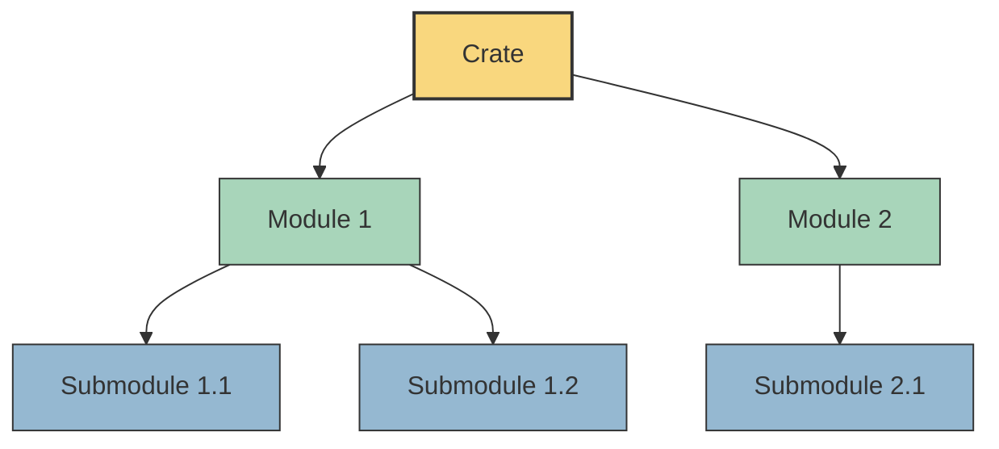

# Rust Modules Basics

## Introduction

Organizing code is essential for managing complexity in any programming project. As your Rust programs grow, you'll need a way to structure your code logically. This is where Rust's module system comes in.

Modules in Rust allow you to:
- Group related code together
- Control the privacy of items (public vs. private)
- Organize your code into a hierarchical structure
- Prevent naming conflicts

In this tutorial, we'll explore the basics of Rust's module system, how to create and use modules, and best practices for organizing your code.

## What are Modules?

A module in Rust is a namespace that contains definitions of functions, structs, traits, impl blocks, or even other modules. Think of modules as containers that help you organize related code together and control how it's accessed from other parts of your program.



## Creating Your First Module

Let's start with a simple example. We'll create a module called `greetings` that contains various greeting functions.

```rust
// Define a module named "greetings"
mod greetings {
    // Functions inside the module
    fn say_hello() {
        println!("Hello, world!");
    }
    
    fn say_goodbye() {
        println!("Goodbye, world!");
    }
}

fn main() {
    // This won't work! These functions are private by default
    // greetings::say_hello();
    // greetings::say_goodbye();
}
```

If you try to run this code, you'll get an error because by default, everything inside a module is private. Let's fix that by making our functions public:

```rust
mod greetings {
    // Use the "pub" keyword to make items public
    pub fn say_hello() {
        println!("Hello, world!");
    }
    
    pub fn say_goodbye() {
        println!("Goodbye, world!");
    }
}

fn main() {
    // Now we can access these functions
    greetings::say_hello();
    greetings::say_goodbye();
}
```

**Output:**
```
Hello, world!
Goodbye, world!
```

## Module Privacy Rules

Rust has a simple but powerful privacy system for modules:

1. By default, everything is private
2. Use the `pub` keyword to make items public
3. You can access:
   - Public items from any parent or child module
   - Private items only within the same module or child modules

Let's see this in action:

```rust
mod outer {
    pub fn public_function() {
        println!("This is a public function");
        private_function(); // Can access private function
    }
    
    fn private_function() {
        println!("This is a private function");
    }
    
    pub mod inner {
        pub fn inner_public_function() {
            println!("This is a public function in an inner module");
            // Can access parent's private function
            super::private_function();
        }
        
        fn inner_private_function() {
            println!("This is a private function in an inner module");
        }
    }
}

fn main() {
    // Can access public function
    outer::public_function();
    
    // Can access public function in public inner module
    outer::inner::inner_public_function();
    
    // These would fail - private functions
    // outer::private_function();
    // outer::inner::inner_private_function();
}
```

**Output:**
```
This is a public function
This is a private function
This is a public function in an inner module
This is a private function
```

## Module Organization in Files

As your projects grow, you'll want to split your code across multiple files. Rust offers several ways to organize modules in files:

### 1. Module in the same file

We've already seen this approach:

```rust
// In main.rs
mod math {
    pub fn add(a: i32, b: i32) -> i32 {
        a + b
    }
}

fn main() {
    println!("2 + 3 = {}", math::add(2, 3));
}
```

### 2. Module in a separate file

For larger modules, place them in separate files:

File structure:
```
src/
  main.rs
  math.rs
```

```rust
// In math.rs
pub fn add(a: i32, b: i32) -> i32 {
    a + b
}

pub fn subtract(a: i32, b: i32) -> i32 {
    a - b
}
```

```rust
// In main.rs
// Tell Rust to load the "math" module from math.rs
mod math;

fn main() {
    println!("2 + 3 = {}", math::add(2, 3));
    println!("5 - 2 = {}", math::subtract(5, 2));
}
```

### 3. Module in a directory

For even larger modules with submodules:

File structure:
```
src/
  main.rs
  math/
    mod.rs
    advanced.rs
```

```rust
// In math/mod.rs
pub fn add(a: i32, b: i32) -> i32 {
    a + b
}

pub fn subtract(a: i32, b: i32) -> i32 {
    a - b
}

// Include the advanced submodule
pub mod advanced;
```

```rust
// In math/advanced.rs
pub fn square(x: i32) -> i32 {
    x * x
}

pub fn cube(x: i32) -> i32 {
    x * x * x
}
```

```rust
// In main.rs
mod math;

fn main() {
    println!("2 + 3 = {}", math::add(2, 3));
    println!("5 - 2 = {}", math::subtract(5, 2));
    println!("4² = {}", math::advanced::square(4));
    println!("3³ = {}", math::advanced::cube(3));
}
```

**Output:**
```
2 + 3 = 5
5 - 2 = 3
4² = 16
3³ = 27
```

## The `use` Keyword

Typing full paths can become tedious. The `use` keyword allows you to bring items into scope:

```rust
mod math {
    pub fn add(a: i32, b: i32) -> i32 {
        a + b
    }
    
    pub mod advanced {
        pub fn square(x: i32) -> i32 {
            x * x
        }
    }
}

// Bring functions into scope
use math::add;
use math::advanced::square;

fn main() {
    // Now we can call them directly
    println!("2 + 3 = {}", add(2, 3));
    println!("4² = {}", square(4));
    
    // We can still use the full path if needed
    println!("3 + 4 = {}", math::add(3, 4));
}
```

**Output:**
```
2 + 3 = 5
4² = 16
3 + 4 = 7
```

## Practical Example: Building a Calculator

Let's build a simple calculator application to demonstrate how modules can organize real-world code:

```rust
// Define our calculator module
mod calculator {
    // Basic operations
    pub mod basic {
        pub fn add(a: f64, b: f64) -> f64 {
            a + b
        }
        
        pub fn subtract(a: f64, b: f64) -> f64 {
            a - b
        }
        
        pub fn multiply(a: f64, b: f64) -> f64 {
            a * b
        }
        
        pub fn divide(a: f64, b: f64) -> Result<f64, String> {
            if b == 0.0 {
                Err("Division by zero".to_string())
            } else {
                Ok(a / b)
            }
        }
    }
    
    // Scientific operations
    pub mod scientific {
        pub fn square(x: f64) -> f64 {
            x * x
        }
        
        pub fn square_root(x: f64) -> Result<f64, String> {
            if x < 0.0 {
                Err("Cannot take square root of negative number".to_string())
            } else {
                Ok(x.sqrt())
            }
        }
        
        pub fn power(base: f64, exponent: i32) -> f64 {
            base.powi(exponent)
        }
    }
    
    // Memory operations
    pub mod memory {
        use std::cell::RefCell;
        
        thread_local! {
            static MEMORY: RefCell<f64> = RefCell::new(0.0);
        }
        
        pub fn store(value: f64) {
            MEMORY.with(|m| *m.borrow_mut() = value);
        }
        
        pub fn recall() -> f64 {
            MEMORY.with(|m| *m.borrow())
        }
        
        pub fn clear() {
            MEMORY.with(|m| *m.borrow_mut() = 0.0);
        }
    }
}

// Import the parts we need
use calculator::basic::{add, subtract, multiply, divide};
use calculator::scientific::{square, square_root};
use calculator::memory::{store, recall};

fn main() {
    // Basic operations
    println!("3 + 4 = {}", add(3.0, 4.0));
    println!("7 - 2 = {}", subtract(7.0, 2.0));
    println!("5 × 6 = {}", multiply(5.0, 6.0));
    
    // Handle potential errors
    match divide(10.0, 2.0) {
        Ok(result) => println!("10 ÷ 2 = {}", result),
        Err(e) => println!("Error: {}", e),
    }
    
    match divide(10.0, 0.0) {
        Ok(result) => println!("10 ÷ 0 = {}", result),
        Err(e) => println!("Error: {}", e),
    }
    
    // Scientific operations
    println!("5² = {}", square(5.0));
    
    match square_root(16.0) {
        Ok(result) => println!("√16 = {}", result),
        Err(e) => println!("Error: {}", e),
    }
    
    // Memory operations
    let result = add(5.0, 7.0);
    println!("5 + 7 = {}", result);
    
    store(result);
    println!("Stored in memory: {}", recall());
    
    let new_result = multiply(recall(), 2.0);
    println!("Memory × 2 = {}", new_result);
}
```

**Output:**
```
3 + 4 = 7
7 - 2 = 5
5 × 6 = 30
10 ÷ 2 = 5
Error: Division by zero
5² = 25
√16 = 4
5 + 7 = 12
Stored in memory: 12
Memory × 2 = 24
```

This example shows how modules allow you to:
1. Organize related functionality (basic, scientific, memory operations)
2. Control visibility (all functions are public for this example)
3. Create a clear and maintainable structure

## Common Issues and Solutions

### Issue 1: "Not found in this scope"

```rust
mod math {
    pub fn add(a: i32, b: i32) -> i32 {
        a + b
    }
}

fn main() {
    // This will cause an error
    let sum = add(2, 3);
}
```

**Solution:** Either use the full path or bring it into scope:

```rust
mod math {
    pub fn add(a: i32, b: i32) -> i32 {
        a + b
    }
}

fn main() {
    // Option 1: Use full path
    let sum1 = math::add(2, 3);
    
    // Option 2: Bring into scope
    use math::add;
    let sum2 = add(4, 5);
}
```

### Issue 2: "Private module"

```rust
mod outer {
    mod inner {
        pub fn inner_function() {
            println!("Inner function");
        }
    }
}

fn main() {
    // This will cause an error
    outer::inner::inner_function();
}
```

**Solution:** Make sure all modules in the path are public:

```rust
mod outer {
    pub mod inner {
        pub fn inner_function() {
            println!("Inner function");
        }
    }
}

fn main() {
    // Now this works
    outer::inner::inner_function();
}
```

## Summary

In this tutorial, we've covered the basics of Rust's module system:

1. **Creating modules** using the `mod` keyword
2. **Privacy controls** with the `pub` keyword
3. **Organizing modules** across files and directories
4. **Importing items** with the `use` keyword
5. **Building modular code** with a real-world calculator example

Modules are a powerful tool in Rust for organizing your code as your projects grow. They help you create a logical structure, control access to your code's components, and prevent naming conflicts.

## Exercises

1. **Basic Module Structure**
   - Create a module called `geometry` with functions to calculate the area of various shapes (circle, rectangle, triangle)
   - Make the functions accessible from outside the module
   - Use the module in a main function to calculate and print different areas

2. **Module Hierarchy**
   - Create a module called `utils` with submodules for `string`, `math`, and `file` operations
   - Implement at least two functions in each submodule
   - Create a main function that uses functions from each submodule

3. **File Organization**
   - Create a project with a module structure spread across files
   - Implement a simple "to-do list" application with modules for tasks, users, and storage
   - Practice using the `use` statement to simplify your code

4. **Module Privacy**
   - Create a module with both public and private functions
   - Implement helper functions that are only used within the module
   - Demonstrate how privacy controls can be used to hide implementation details

## Additional Resources

- [Rust Book: Managing Growing Projects with Packages, Crates, and Modules](https://doc.rust-lang.org/book/ch07-00-managing-growing-projects-with-packages-crates-and-modules.html)
- [Rust By Example: Modules](https://doc.rust-lang.org/rust-by-example/mod.html)
- [Rust Reference: Visibility and Privacy](https://doc.rust-lang.org/reference/visibility-and-privacy.html)