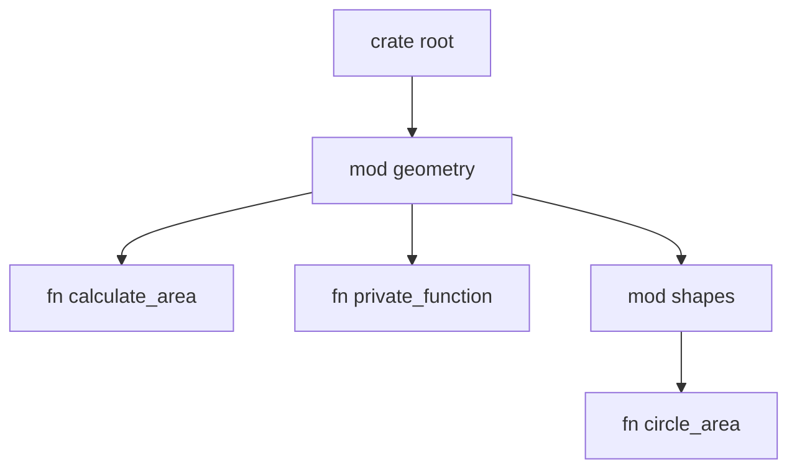

# Rust Module Structure

## Introduction

When your Rust programs grow beyond a few functions, organizing your code becomes essential. Rust's module system helps you structure your code into logical units, control visibility between different parts of your program, and create reusable components.

In this guide, we'll explore how to create and organize modules in Rust, understand the module hierarchy, and learn how to control item visibility with privacy rules.

## What Are Modules?

Modules in Rust are containers for organizing related items such as functions, structs, enums, traits, and even other modules. They help in:

- **Organizing code**: Group related functionality together
- **Controlling privacy**: Decide what's public (accessible from outside) and what's private
- **Managing scope**: Control which names are in scope
- **Preventing naming conflicts**: Same name can exist in different modules

## Creating Modules

### Basic Module Structure

Let's start with a simple example of how to create and use modules:

```rust
// Define a module named 'geometry'
mod geometry {
    // Items inside a module are private by default
    fn private_function() {
        println!("This function is private to the geometry module");
    }
    
    // Use 'pub' keyword to make items public
    pub fn calculate_area(width: f64, height: f64) -> f64 {
        width * height
    }
    
    // Nested module
    pub mod shapes {
        pub fn circle_area(radius: f64) -> f64 {
            std::f64::consts::PI * radius * radius
        }
    }
}

fn main() {
    // Access public items from a module using path syntax
    let area = geometry::calculate_area(5.0, 10.0);
    println!("Rectangle area: {}", area);
    
    // Access items from nested modules
    let circle_area = geometry::shapes::circle_area(3.0);
    println!("Circle area: {}", circle_area);
    
    // This would not compile - private function is not accessible
    // geometry::private_function();
}
```

Output:
```
Rectangle area: 50
Circle area: 28.274333882308138
```

In this example, we defined a module called `geometry` containing functions related to geometry calculations, and we defined a nested module called `shapes`.

## Module Organization in Files and Directories

As your project grows, keeping all modules in a single file becomes unwieldy. Rust provides several ways to organize modules across files.

### Module in a Separate File

You can move a module to its own file:

1. Create a file with the module name (e.g., `geometry.rs`)
2. Move the module contents to that file (without the `mod geometry { ... }` wrapper)
3. Declare the module in your main file with `mod geometry;`

Here's an example:

**File: src/main.rs**
```rust
// Declare the module - this tells Rust to look for either:
// - A file named geometry.rs, or
// - A directory named geometry with a file named mod.rs inside
mod geometry;

fn main() {
    let area = geometry::calculate_area(5.0, 10.0);
    println!("Rectangle area: {}", area);
    
    let circle_area = geometry::shapes::circle_area(3.0);
    println!("Circle area: {}", circle_area);
}
```

**File: src/geometry.rs**
```rust
// Content goes directly in the file, without the mod geometry { } wrapper
fn private_function() {
    println!("This function is private to the geometry module");
}

pub fn calculate_area(width: f64, height: f64) -> f64 {
    width * height
}

// Nested module
pub mod shapes {
    pub fn circle_area(radius: f64) -> f64 {
        std::f64::consts::PI * radius * radius
    }
}
```

### Directory-Based Modules

For more complex modules with submodules, you can use a directory structure:

```
src/
├── main.rs
├── geometry/
│   ├── mod.rs      // Declares the geometry module
│   └── shapes.rs   // Contains the shapes submodule
```

**File: src/main.rs**
```rust
mod geometry;

fn main() {
    let area = geometry::calculate_area(5.0, 10.0);
    println!("Rectangle area: {}", area);
    
    let circle_area = geometry::shapes::circle_area(3.0);
    println!("Circle area: {}", circle_area);
}
```

**File: src/geometry/mod.rs**
```rust
// Declare the shapes submodule
pub mod shapes;

fn private_function() {
    println!("This function is private to the geometry module");
}

pub fn calculate_area(width: f64, height: f64) -> f64 {
    width * height
}
```

**File: src/geometry/shapes.rs**
```rust
pub fn circle_area(radius: f64) -> f64 {
    std::f64::consts::PI * radius * radius
}
```

### Modern File-Based Structure (Rust 2018+)

Rust 2018 introduced a simpler way to organize modules:

```
src/
├── main.rs
├── geometry.rs      // Declares and implements the geometry module
└── geometry/        // Directory for submodules of geometry
    └── shapes.rs    // Contains the shapes submodule
```

**File: src/main.rs**
```rust
mod geometry;

fn main() {
    let area = geometry::calculate_area(5.0, 10.0);
    println!("Rectangle area: {}", area);
    
    let circle_area = geometry::shapes::circle_area(3.0);
    println!("Circle area: {}", circle_area);
}
```

**File: src/geometry.rs**
```rust
// Declare submodules
pub mod shapes;

fn private_function() {
    println!("This function is private to the geometry module");
}

pub fn calculate_area(width: f64, height: f64) -> f64 {
    width * height
}
```

**File: src/geometry/shapes.rs**
```rust
pub fn circle_area(radius: f64) -> f64 {
    std::f64::consts::PI * radius * radius
}
```

## Module Hierarchy and Path Resolution

Rust uses a hierarchical path system to find items in modules:



### Absolute vs. Relative Paths

You can refer to items using absolute or relative paths:

```rust
mod front_of_house {
    pub mod hosting {
        pub fn add_to_waitlist() {
            println!("Added to waitlist");
        }
    }
}

// Using a relative path
fn eat_at_restaurant() {
    front_of_house::hosting::add_to_waitlist();
}

// Using absolute path starting from crate root
fn drink_at_restaurant() {
    crate::front_of_house::hosting::add_to_waitlist();
}
```

### The `use` Keyword

The `use` keyword brings items into scope to avoid typing long paths:

```rust
mod geometry {
    pub mod shapes {
        pub fn circle_area(radius: f64) -> f64 {
            std::f64::consts::PI * radius * radius
        }
    }
}

// Bring function into scope
use geometry::shapes::circle_area;

// Bring module into scope
use geometry::shapes;

fn main() {
    // Direct usage after 'use'
    let area1 = circle_area(3.0);
    println!("Area: {}", area1);
    
    // Using the imported module
    let area2 = shapes::circle_area(3.0);
    println!("Area: {}", area2);
}
```

### Common `use` Patterns

Rust has conventions for importing different types of items:

```rust
// For functions, typically import the parent module:
use std::io;
fn main() {
    io::stdin().read_line(&mut String::new()).unwrap();
}

// For structs, enums, and other types, import the type directly:
use std::collections::HashMap;
fn main() {
    let mut map = HashMap::new();
    map.insert(1, "hello");
}

// To avoid naming conflicts, use the 'as' keyword:
use std::fmt::Result;
use std::io::Result as IoResult;
```

## Visibility and Privacy

By default, all items in Rust (functions, types, modules, etc.) are private. You can control visibility using the `pub` keyword:

### Basic Privacy Rules

1. **Private (default)**: Only accessible within the current module and its child modules
2. **Public (`pub`)**: Accessible from outside the module

### Nested Module Privacy

Privacy becomes more nuanced with nested modules:

```rust
mod outer {
    // Private to 'outer'
    fn private_function() {
        println!("This is private to outer");
    }
    
    // Public to everyone
    pub fn public_function() {
        println!("This is public to everyone");
        // Can access private_function since it's in the same module
        private_function();
    }
    
    // Public module
    pub mod inner {
        // Private to 'inner'
        fn inner_private() {
            println!("Private to inner");
        }
        
        // Public function in public module
        pub fn inner_public() {
            println!("Public in inner module");
            inner_private(); // Can access its own private item
            // super::private_function(); // Can access parent's private items
        }
    }
    
    // Private module (the default)
    mod secret {
        // Even public items in private modules can't be accessed from outside
        pub fn technically_public() {
            println!("Can't access from outside outer");
        }
    }
}

fn main() {
    // Public function in module: accessible
    outer::public_function();
    
    // Public function in public submodule: accessible
    outer::inner::inner_public();
    
    // These would not compile:
    // outer::private_function();         // Private function
    // outer::inner::inner_private();     // Private function in public module
    // outer::secret::technically_public(); // Public function in private module
}
```

### Struct and Enum Visibility

Structs and enums have more granular privacy controls:

```rust
mod shapes {
    // Public struct with some private fields
    pub struct Rectangle {
        pub width: f64,   // Public field
        pub height: f64,  // Public field
        inner_data: u32,  // Private field
    }
    
    impl Rectangle {
        // Public constructor
        pub fn new(width: f64, height: f64) -> Rectangle {
            Rectangle {
                width, 
                height,
                inner_data: 42, // Initialize private field
            }
        }
        
        // Public method that can access private fields
        pub fn area(&self) -> f64 {
            self.width * self.height
        }
    }
    
    // Public enum - all variants are automatically public
    pub enum Shape {
        Circle(f64),  // These are all public
        Rectangle(f64, f64),
        Triangle(f64, f64, f64),
    }
}

fn main() {
    // Create using constructor
    let rect = shapes::Rectangle::new(5.0, 10.0);
    println!("Area: {}", rect.area());
    
    // Access public fields
    println!("Width: {}", rect.width);
    
    // This would not compile - can't access private field
    // println!("Inner data: {}", rect.inner_data);
    
    // Using enum variants
    let shape = shapes::Shape::Circle(3.0);
}
```

## Practical Example: Building a Mini Library

Let's put everything together in a practical example - a mini library for a blog system.

Here's our file structure:

```
src/
├── main.rs
├── blog.rs
├── blog/
│   ├── post.rs
│   └── comment.rs
```

**File: src/main.rs**
```rust
mod blog;

fn main() {
    // Create a new post
    let mut post = blog::post::Post::new(
        "Understanding Rust Modules",
        "This post explains the module system in Rust"
    );
    
    // Add some comments
    post.add_comment("Great post!", "Jane");
    post.add_comment("Very helpful, thanks!", "John");
    
    // Display the post
    post.display();
}
```

**File: src/blog.rs**
```rust
pub mod post;
pub mod comment;
```

**File: src/blog/post.rs**
```rust
use super::comment::Comment;

pub struct Post {
    pub title: String,
    pub content: String,
    comments: Vec<Comment>,
}

impl Post {
    pub fn new(title: &str, content: &str) -> Post {
        Post {
            title: String::from(title),
            content: String::from(content),
            comments: Vec::new(),
        }
    }
    
    pub fn add_comment(&mut self, content: &str, author: &str) {
        let comment = Comment::new(content, author);
        self.comments.push(comment);
    }
    
    pub fn display(&self) {
        println!("# {}", self.title);
        println!("{}", self.content);
        println!("
Comments:");
        
        if self.comments.is_empty() {
            println!("No comments yet.");
        } else {
            for (i, comment) in self.comments.iter().enumerate() {
                println!("{}. {} says: {}", i+1, comment.author, comment.content);
            }
        }
    }
}
```

**File: src/blog/comment.rs**
```rust
pub struct Comment {
    pub content: String,
    pub author: String,
}

impl Comment {
    pub fn new(content: &str, author: &str) -> Comment {
        Comment {
            content: String::from(content),
            author: String::from(author),
        }
    }
}
```

Output:
```
# Understanding Rust Modules
This post explains the module system in Rust

Comments:
1. Jane says: Great post!
2. John says: Very helpful, thanks!
```

## Summary

In this guide, we've covered:

1. **Basic module creation** - using the `mod` keyword to organize related code
2. **Module organization in files** - splitting modules across files and directories
3. **Module paths and importing** - using absolute and relative paths with the `use` keyword
4. **Visibility and privacy** - controlling what's accessible with the `pub` keyword
5. **Struct and enum visibility** - managing field-level privacy
6. **A practical example** - building a mini-library using Rust's module system

Understanding Rust's module system is essential for building maintainable and organized code. As your projects grow, proper module structure will help you keep your code manageable, reusable, and easier to reason about.

## Additional Resources

- [Rust Book: Chapter on Modules](https://doc.rust-lang.org/book/ch07-00-managing-growing-projects-with-packages-crates-and-modules.html)
- [Rust By Example: Modules](https://doc.rust-lang.org/rust-by-example/mod.html)
- [Rust API Guidelines](https://rust-lang.github.io/api-guidelines/)

## Exercises

1. Create a simple calculator library with modules for different operations (arithmetic, trigonometry, etc.)
2. Build a mini file system module that organizes files by type (document, image, etc.)
3. Refactor the blog example to add categories and tags to posts
4. Create a module for a simple game with submodules for character, inventory, and combat systems