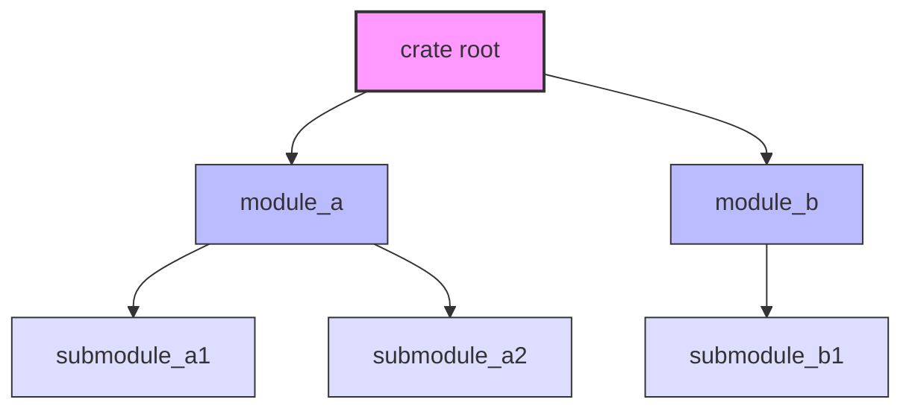

# Rust Paths

## Introduction

When working with Rust's module system, you need a way to navigate the module tree and refer to items located in different parts of it. This is where **paths** come in. Paths in Rust work similarly to file paths in a filesystem - they tell the compiler exactly where to find an item within your code's module structure.

In this guide, we'll explore how paths work in Rust, the different types of paths, and how to use them effectively in your code. Understanding paths is essential for organizing your code into modules and creating clear, maintainable Rust programs.

## Path Basics

A path is a way to name an item, such as a struct, function, or module, within Rust's module hierarchy. Paths can be:

- **Absolute**: starts from the crate root using a crate name or the literal `crate`
- **Relative**: starts from the current module using `self`, `super`, or an identifier in the current module

Let's look at some code examples to better understand paths:

```rust
// Defining a module structure
mod front_of_house {
    pub mod hosting {
        pub fn add_to_waitlist() {
            println!("Added to waitlist!");
        }
    }
}

fn main() {
    // Absolute path - starts from the crate root
    crate::front_of_house::hosting::add_to_waitlist();
    
    // Relative path - starts from the current module
    front_of_house::hosting::add_to_waitlist();
}
```

Output:
```
Added to waitlist!
Added to waitlist!
```

In this example, both paths refer to the same function but use different starting points.

## Absolute Paths

Absolute paths start from the crate root, which is the top level of your project's module hierarchy. There are two ways to start an absolute path:

1. Using the literal `crate` to start from your current crate
2. Using an external crate name to reference items from that crate

### Example of Absolute Paths

```rust
mod garden {
    pub mod vegetables {
        pub struct Carrot {}
        
        pub fn plant_vegetable() {
            println!("Planting a vegetable!");
        }
    }
}

fn main() {
    // Absolute path using the crate keyword
    let carrot = crate::garden::vegetables::Carrot {};
    
    // Calling a function using an absolute path
    crate::garden::vegetables::plant_vegetable();
}
```

Output:
```
Planting a vegetable!
```

Absolute paths are clear and unambiguous since they always start from a known location (the crate root), but they can be longer to write and less flexible when code is moved around.

## Relative Paths

Relative paths start from the current module and use `self`, `super`, or identifiers in the current scope.

- `self` - Refers to the current module
- `super` - Refers to the parent module
- Identifiers - Refers to an item in the current module

### Example of Relative Paths

```rust
mod parent {
    pub fn parent_function() {
        println!("This is a parent function");
    }
    
    mod child {
        pub fn child_function() {
            println!("This is a child function");
            
            // Using super to access the parent module
            super::parent_function();
            
            // Using self to refer to the current module
            self::nested::nested_function();
        }
        
        mod nested {
            pub fn nested_function() {
                println!("This is a nested function");
                
                // Using super::super to go up two levels
                super::super::parent_function();
            }
        }
    }
    
    pub fn call_child() {
        // Relative path to the child function
        child::child_function();
    }
}

fn main() {
    parent::call_child();
}
```

Output:
```
This is a child function
This is a parent function
This is a nested function
This is a parent function
```

Relative paths are often shorter and more convenient, especially when referring to items that are nearby in the module tree. They can also make your code more adaptable to refactoring, as moving a set of items together will maintain their relative relationships.

## The `use` Keyword and Paths

Writing out full paths every time you want to use an item can be repetitive and verbose. The `use` keyword allows you to bring paths into scope, making them shorter and easier to use:

```rust
mod garden {
    pub mod vegetables {
        pub struct Carrot {}
        pub struct Cucumber {}
        
        pub fn plant_all() {
            println!("Planting all vegetables!");
        }
    }
}

use crate::garden::vegetables::Carrot;  // Bring Carrot into scope
use crate::garden::vegetables::plant_all;  // Bring plant_all function into scope

fn main() {
    // Now we can use Carrot directly without the full path
    let carrot = Carrot {};
    
    // And call plant_all directly
    plant_all();
    
    // But we still need the full path for Cucumber
    let cucumber = crate::garden::vegetables::Cucumber {};
}
```

Output:
```
Planting all vegetables!
```

## Idiomatic `use` Paths

There are conventions for how to bring items into scope with `use`:

- For **functions**, it's idiomatic to bring the parent module into scope, not the function itself:

```rust
// Preferred
use crate::garden::vegetables;
// Then call
vegetables::plant_all();

// Rather than
use crate::garden::vegetables::plant_all;
// Then call
plant_all();
```

- For **structs**, **enums**, and other items, it's idiomatic to bring the full path:

```rust
// Preferred for structs
use crate::garden::vegetables::Carrot;
// Then use
let carrot = Carrot {};
```

This convention helps make it clear where each item is defined.

## Handling Name Conflicts

When bringing items with the same name into scope, you have a few options:

### 1. Use the parent modules

```rust
use std::fmt;
use std::io;

fn function1() -> fmt::Result {
    // ...
    Ok(())
}

fn function2() -> io::Result<()> {
    // ...
    Ok(())
}
```

### 2. Use aliases with `as`

```rust
use std::fmt::Result;
use std::io::Result as IoResult;

fn function1() -> Result {
    // ...
    Ok(())
}

fn function2() -> IoResult<()> {
    // ...
    Ok(())
}
```

## Re-exporting with `pub use`

You can combine `pub` and `use` to re-export items, making them available to external code using your crate's path:

```rust
mod front_of_house {
    pub mod hosting {
        pub fn add_to_waitlist() {
            println!("Added to waitlist!");
        }
    }
}

// Re-export the function from a different location
pub use crate::front_of_house::hosting::add_to_waitlist;

fn main() {
    // Now we can call it directly
    add_to_waitlist();
}
```

Output:
```
Added to waitlist!
```

This is particularly useful for creating a public API that is more convenient than your internal module structure.

## Visualizing Module Structure

Understanding paths is easier when you can visualize the module structure. Let's look at a diagram of a typical module hierarchy:



In this structure, you would refer to `submodule_a1` using:
- Absolute path: `crate::module_a::submodule_a1`
- Relative path from `module_b`: `super::module_a::submodule_a1`
- Relative path from `module_a`: `self::submodule_a1` or just `submodule_a1`

## Practical Example: Building a Restaurant Order System

Let's see a real-world example of organizing code with modules and using paths appropriately:

```rust
// lib.rs
mod front_of_house;
mod back_of_house;

// Re-export for a cleaner public API
pub use crate::front_of_house::hosting;
pub use crate::back_of_house::cooking;

pub fn serve_order() {
    // Using relative paths
    hosting::add_to_waitlist();
    hosting::seat_at_table();
    back_of_house::cooking::cook_order();
    println!("Order served!");
}

// front_of_house.rs
pub mod hosting {
    pub fn add_to_waitlist() {
        println!("Customer added to waitlist");
    }
    
    pub fn seat_at_table() {
        println!("Customer seated at table");
        // Using super to access a sibling module
        super::serving::take_order();
    }
}

mod serving {
    pub fn take_order() {
        println!("Order taken");
        // Using an absolute path
        crate::back_of_house::cooking::cook_order();
    }
}

// back_of_house.rs
pub mod cooking {
    pub fn cook_order() {
        println!("Order cooked");
        // Using self to refer to another function in the same module
        self::prepare_ingredients();
    }
    
    fn prepare_ingredients() {
        println!("Ingredients prepared");
    }
}
```

When you use this restaurant crate in a binary:

```rust
// main.rs
use restaurant::serve_order;
use restaurant::hosting;

fn main() {
    hosting::add_to_waitlist();
    serve_order();
}
```

Output:
```
Customer added to waitlist
Customer added to waitlist
Customer seated at table
Order taken
Order cooked
Ingredients prepared
Order served!
```

This example demonstrates a real-world application with multiple files and modules, showing how paths help organize and connect the different parts of your code.

## Summary

Understanding paths in Rust is crucial for effectively navigating and organizing your code. Here's what we've covered:

- **Absolute paths** start from the crate root and provide clear, unambiguous references
- **Relative paths** start from the current module and can be more concise
- Use `self` for the current module, `super` for the parent module
- The `use` keyword brings paths into scope, making your code cleaner
- Follow Rust's conventions for bringing items into scope
- Handle name conflicts with parent module specification or the `as` keyword
- Re-export items with `pub use` to create a more convenient API

Paths are the glue that holds together Rust's module system, allowing you to organize your code logically while maintaining the ability to reference any item from anywhere else in your code.

## Exercises

1. Create a module structure for a simple blog application with modules for `posts`, `users`, and `comments`. Practice referring to items in different modules using both absolute and relative paths.

2. Refactor an existing project to use more idiomatic path imports with the `use` keyword.

3. Create a library crate with a public API that re-exports internal functionality in a more convenient structure using `pub use`.

## Additional Resources

- [Rust Book Chapter on Paths](https://doc.rust-lang.org/book/ch07-03-paths-for-referring-to-an-item-in-the-module-tree.html)
- [Rust By Example: Modules](https://doc.rust-lang.org/rust-by-example/mod.html)
- [Rust API Guidelines](https://rust-lang.github.io/api-guidelines/naming.html)