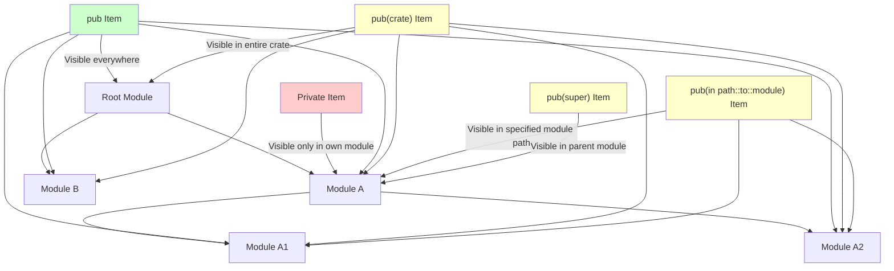

# Rust Visibility Rules

## Introduction

In programming, visibility rules (also called accessibility or privacy rules) determine which parts of your code can access other parts of your code. Rust has a robust system for controlling visibility, helping you create clean interfaces and hide implementation details.

In this guide, we'll explore Rust's visibility rules, which define how modules, functions, structs, and other items can be accessed from different parts of your codebase. Understanding these rules is essential for writing well-structured Rust programs.

## The Default: Private Visibility

In Rust, **everything is private by default**. This means that functions, structs, enums, modules, and other items are only accessible within the module where they are defined and any child modules.

Let's start with a simple example:

```rust
// Define a module
mod math {
    // This function is private (default)
    fn add(a: i32, b: i32) -> i32 {
        a + b
    }
    
    // This function calls the private add function
    pub fn calculate_sum(a: i32, b: i32) -> i32 {
        // We can call add() here because we're in the same module
        add(a, b)
    }
}

// In the main function
fn main() {
    // This works because calculate_sum is public
    let result = math::calculate_sum(5, 3);
    println!("Sum: {}", result);
    
    // This would NOT work - uncomment to see the error
    // let direct_sum = math::add(5, 3);
    // Error: function `add` is private
}
```

When you run this code, you'll get:

```
Sum: 8
```

If you uncomment the line trying to call `math::add()` directly, the compiler will produce an error because `add()` is private to the `math` module.

## Making Items Public with `pub`

To make an item accessible from outside its defining module, you use the `pub` keyword:

```rust
mod shapes {
    // Public struct
    pub struct Rectangle {
        // Private fields
        width: f64,
        height: f64,
    }
    
    impl Rectangle {
        // Public constructor
        pub fn new(width: f64, height: f64) -> Rectangle {
            Rectangle { width, height }
        }
        
        // Public method
        pub fn area(&self) -> f64 {
            self.width * self.height
        }
    }
}

fn main() {
    // We can use Rectangle because it's public
    let rect = shapes::Rectangle::new(5.0, 3.0);
    println!("Rectangle area: {}", rect.area());
    
    // This would NOT work - uncomment to see the error
    // let bad_rect = shapes::Rectangle { width: 5.0, height: 3.0 };
    // Error: fields width and height of struct Rectangle are private
}
```

When you run this code, you'll get:

```
Rectangle area: 15
```

Notice that even though the `Rectangle` struct is public, its fields are still private. This demonstrates Rust's granular control over visibility.

## Visibility Levels

Rust offers several levels of visibility:

1. **Private (default)**: Accessible only within the current module and its child modules
2. **Public (`pub`)**: Accessible from anywhere that can access the containing module
3. **Restricted public**: Several finer-grained visibility modifiers

Let's look at these in more detail:

### The `pub(crate)` Modifier

The `pub(crate)` modifier makes an item visible within the entire current crate, but not to external crates:

```rust
mod database {
    // Visible only within our crate
    pub(crate) struct Connection {
        server: String,
        port: u32,
    }
    
    impl Connection {
        pub fn new(server: String, port: u32) -> Connection {
            Connection { server, port }
        }
    }
}

// We can use Connection here because we're in the same crate
fn connect_to_db() {
    let conn = database::Connection::new(String::from("localhost"), 5432);
    // Use connection...
}

// In another file that imports our crate, Connection would not be accessible
```

### The `pub(super)` Modifier

The `pub(super)` modifier makes an item visible to the parent module:

```rust
mod parent {
    pub mod child {
        // Visible to parent module
        pub(super) fn helper() {
            println!("Helper function");
        }
        
        // Public to everyone
        pub fn public_api() {
            // We can call our helper
            helper();
        }
    }
    
    fn parent_function() {
        // We can call helper because it's pub(super)
        child::helper();
    }
}

fn main() {
    // We can call the public function
    parent::child::public_api();
    
    // This would NOT work - uncomment to see the error
    // parent::child::helper();
    // Error: function `helper` is private
}
```

### The `pub(in path)` Modifier

The `pub(in path)` modifier makes an item visible within a specific module path:

```rust
mod outer {
    pub mod middle {
        // Visible in the outer module and its children
        pub(in crate::outer) struct Config {
            setting: String,
        }
        
        pub fn create_config(setting: String) -> Config {
            Config { setting }
        }
    }
    
    fn use_config() {
        // We can use Config here because we're in the outer module
        let config = middle::create_config(String::from("debug"));
    }
}

fn main() {
    // We can get a Config through the public function
    let config = outer::middle::create_config(String::from("production"));
    
    // This would NOT work - uncomment to see the error
    // let direct_config = outer::middle::Config { setting: String::from("error") };
    // Error: struct `Config` is private
}
```

## Visualizing Visibility Rules

Here's a diagram showing how Rust's visibility rules work across modules:



## Struct and Enum Field Visibility

For structs and enums, you can control the visibility of individual fields:

```rust
mod models {
    pub struct User {
        // Public fields
        pub username: String,
        pub email: String,
        // Private fields
        password_hash: String,
        login_attempts: u32,
    }
    
    impl User {
        pub fn new(username: String, email: String, password: String) -> User {
            // In reality, you would hash the password
            User {
                username,
                email,
                password_hash: password,
                login_attempts: 0,
            }
        }
        
        pub fn is_password_correct(&self, password: &str) -> bool {
            // In reality, you would hash and compare properly
            self.password_hash == password
        }
    }
}

fn main() {
    let user = models::User::new(
        String::from("alice"),
        String::from("alice@example.com"),
        String::from("secret123")
    );
    
    // We can access public fields
    println!("Username: {}", user.username);
    println!("Email: {}", user.email);
    
    // We can use public methods to interact with private fields
    let password_check = user.is_password_correct("secret123");
    println!("Password check: {}", password_check);
    
    // This would NOT work - uncomment to see the error
    // println!("Password hash: {}", user.password_hash);
    // Error: field `password_hash` of struct `User` is private
}
```

This pattern is very common in Rust – public structs with some private fields provide encapsulation, a key principle of good software design.

## Re-exporting with `pub use`

Sometimes, you want to make an item from a nested module available at a higher level. This is where `pub use` comes in:

```rust
mod network {
    mod connection {
        pub fn establish_connection() {
            // Connection details...
        }
    }
    
    // Re-export the function from the connection module
    pub use connection::establish_connection;
}

fn main() {
    // We can call the function directly from the network module
    network::establish_connection();
    
    // This would NOT work - uncomment to see the error
    // network::connection::establish_connection();
    // Error: module `connection` is private
}
```

This technique is useful for creating a clean public API while keeping your code organized in modules.

## Real-world Example: Building a Library

Let's put all this together in a more complete example of a simple math library:

```rust
// In a file called lib.rs
pub mod arithmetic {
    // Public functions for external use
    pub fn add(a: f64, b: f64) -> f64 {
        a + b
    }
    
    pub fn subtract(a: f64, b: f64) -> f64 {
        a - b
    }
    
    pub fn multiply(a: f64, b: f64) -> f64 {
        a * b
    }
    
    pub fn divide(a: f64, b: f64) -> Result<f64, String> {
        if b == 0.0 {
            Err(String::from("Division by zero"))
        } else {
            Ok(a / b)
        }
    }
}

pub mod statistics {
    // Private helper function
    fn sum(numbers: &[f64]) -> f64 {
        numbers.iter().sum()
    }
    
    // Public functions that use the private helper
    pub fn mean(numbers: &[f64]) -> Option<f64> {
        if numbers.is_empty() {
            None
        } else {
            Some(sum(numbers) / numbers.len() as f64)
        }
    }
    
    pub fn median(numbers: &[f64]) -> Option<f64> {
        if numbers.is_empty() {
            None
        } else {
            let mut sorted = numbers.to_vec();
            sorted.sort_by(|a, b| a.partial_cmp(b).unwrap());
            
            let mid = sorted.len() / 2;
            if sorted.len() % 2 == 0 {
                Some((sorted[mid - 1] + sorted[mid]) / 2.0)
            } else {
                Some(sorted[mid])
            }
        }
    }
}

// Re-export commonly used functions at the top level
pub use arithmetic::{add, subtract, multiply, divide};
pub use statistics::mean;

// Internal module not exposed to users
mod internal {
    pub(crate) fn log_operation(op: &str, a: f64, b: f64) {
        println!("Operation: {} on {} and {}", op, a, b);
    }
}
```

Now users of your library can import and use it like this:

```rust
// In a user's code
use math_library::{add, subtract, mean};

fn main() {
    let sum = add(5.0, 3.0);
    println!("Sum: {}", sum);
    
    let difference = subtract(10.0, 4.0);
    println!("Difference: {}", difference);
    
    let data = vec![1.0, 2.0, 3.0, 4.0, 5.0];
    let average = mean(&data).unwrap();
    println!("Average: {}", average);
    
    // We can also access other functions through the module path
    let product = math_library::arithmetic::multiply(6.0, 7.0);
    println!("Product: {}", product);
    
    // This would NOT work - uncomment to see the error
    // math_library::internal::log_operation("add", 1.0, 2.0);
    // Error: module `internal` is private
}
```

This example demonstrates how to create a well-structured library with:
- Public functions for users
- Private helper functions 
- Internal modules for implementation details
- Re-exports for a cleaner API

## Best Practices for Visibility in Rust

Here are some guidelines for effectively using Rust's visibility rules:

1. **Keep most items private by default** - Only make public what users of your code need to access.

2. **Use `pub(crate)` for internal APIs** - Items that should be shared across your crate but not externally.

3. **Create "sealed traits" when needed** - Using visibility modifiers to prevent external implementations:

```rust
pub mod sealed {
    pub trait Sealed {}
}

pub trait MyFeature: sealed::Sealed {
    fn feature_method(&self);
}

// Users can't implement MyFeature because they can't implement Sealed
```

4. **Expose structs but keep fields private** - Provide methods to interact with the data.

5. **Use re-exports (`pub use`) to create a clean API** - Hide your module hierarchy while exposing the items users need.

## Summary

Rust's visibility rules provide fine-grained control over which parts of your code can be accessed from where. This system helps you:

- Create clean, well-defined interfaces
- Hide implementation details
- Enforce encapsulation
- Prevent misuse of internal APIs
- Structure your code in a modular way

By default, everything in Rust is private, and you selectively expose items with `pub` and its more specific variants like `pub(crate)`, `pub(super)`, and `pub(in path)`.

Master these visibility rules to write Rust code that's modular, maintainable, and provides the right level of abstraction to users of your code.

## Exercises

1. Create a library module with a public API that includes some private helper functions.

2. Build a struct with some public fields and some private fields. Implement methods to safely interact with the private fields.

3. Use `pub(crate)` to create utilities that can be used throughout your crate but aren't exposed to users.

4. Practice using `pub use` to re-export items from nested modules to create a cleaner API.

## Additional Resources

- [Rust Book: Defining Modules to Control Scope and Privacy](https://doc.rust-lang.org/book/ch07-02-defining-modules-to-control-scope-and-privacy.html)
- [Rust By Example: Visibility](https://doc.rust-lang.org/rust-by-example/mod/visibility.html)
- [Rust Reference: Visibility and Privacy](https://doc.rust-lang.org/reference/visibility-and-privacy.html)