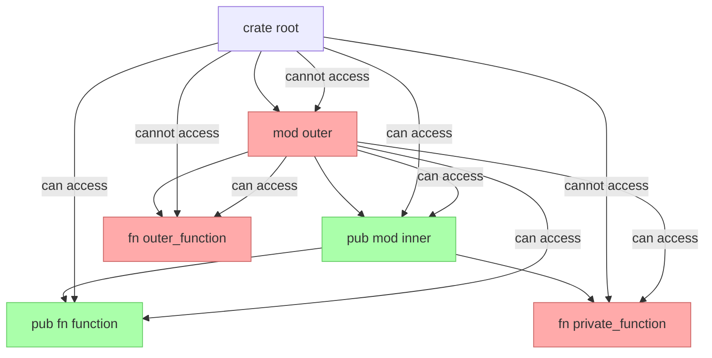

# Rust Public Interface

## Introduction

When building software in Rust, organizing code into modules helps maintain structure and readability. An essential aspect of modular design is controlling what parts of your code are visible and accessible to other parts of your program or to external code. This concept is known as the **public interface** of your module.

In this guide, we'll explore how Rust's visibility system works, how to create well-defined public interfaces for your modules, and best practices for designing APIs that are both usable and maintainable.

## Understanding Public Interfaces in Rust

In Rust, everything is **private by default**. This means that functions, structs, enums, and other items defined in a module can only be accessed by code within that same module, unless you explicitly make them public.

The `pub` keyword is Rust's way of exposing parts of your code to the outside world, creating what we call a "public interface."

### The `pub` Keyword

The `pub` keyword can be applied to:
- Modules
- Functions
- Structs and their fields
- Enums and their variants
- Traits
- Type aliases
- Implementations

Let's see how this works in practice:

```rust
// A private module by default
mod database {
    // A private struct
    struct Connection {
        server: String,
        port: u32,
    }
    
    // A private function
    fn connect_internal() {
        println!("Connecting internally...");
    }
    
    // A public function - part of the module's public interface
    pub fn connect() {
        println!("Connecting to database...");
        connect_internal();
    }
}

fn main() {
    // We can call the public function
    database::connect();
    
    // This would cause a compiler error - private items are not accessible
    // database::connect_internal();
    // database::Connection { server: "localhost".to_string(), port: 5432 };
}
```

**Output:**
```
Connecting to database...
```

## Designing a Public Interface

Let's build a more complete example of how to design a public interface for a module.

### Example: Temperature Conversion Module

```rust
// Define a module for temperature conversions
pub mod temperature {
    // Public struct with private fields
    pub struct Temperature {
        // Private field - not directly accessible outside
        celsius: f64,
    }
    
    impl Temperature {
        // Public constructor
        pub fn new(celsius: f64) -> Self {
            Temperature { celsius }
        }
        
        // Public methods to access data
        pub fn celsius(&self) -> f64 {
            self.celsius
        }
        
        pub fn fahrenheit(&self) -> f64 {
            (self.celsius * 9.0 / 5.0) + 32.0
        }
        
        pub fn kelvin(&self) -> f64 {
            self.celsius + 273.15
        }
        
        // Public method to modify data
        pub fn set_celsius(&mut self, celsius: f64) {
            self.celsius = celsius;
        }
        
        pub fn set_fahrenheit(&mut self, fahrenheit: f64) {
            self.celsius = (fahrenheit - 32.0) * 5.0 / 9.0;
        }
    }
    
    // Public functions for one-off conversions
    pub fn celsius_to_fahrenheit(celsius: f64) -> f64 {
        (celsius * 9.0 / 5.0) + 32.0
    }
    
    pub fn fahrenheit_to_celsius(fahrenheit: f64) -> f64 {
        (fahrenheit - 32.0) * 5.0 / 9.0
    }
    
    // Private helper function
    fn validate_temperature(celsius: f64) -> bool {
        celsius > -273.15 // Cannot be below absolute zero
    }
    
    // Public function that uses private helper
    pub fn create_validated_temperature(celsius: f64) -> Option<Temperature> {
        if validate_temperature(celsius) {
            Some(Temperature { celsius })
        } else {
            None
        }
    }
}

fn main() {
    // Using the public interface
    let mut temp = temperature::Temperature::new(25.0);
    
    println!("Temperature in Celsius: {}", temp.celsius());
    println!("Temperature in Fahrenheit: {}", temp.fahrenheit());
    println!("Temperature in Kelvin: {}", temp.kelvin());
    
    // Modifying through public methods
    temp.set_fahrenheit(98.6);
    println!("Body temperature in Celsius: {}", temp.celsius());
    
    // One-off conversion
    let boiling_f = temperature::celsius_to_fahrenheit(100.0);
    println!("Water boils at {} degrees Fahrenheit", boiling_f);
    
    // Using validation
    match temperature::create_validated_temperature(-300.0) {
        Some(t) => println!("Created temperature: {} C", t.celsius()),
        None => println!("Invalid temperature value!"),
    }
}
```

**Output:**
```
Temperature in Celsius: 25
Temperature in Fahrenheit: 77
Temperature in Kelvin: 298.15
Body temperature in Celsius: 37
Water boils at 212 degrees Fahrenheit
Invalid temperature value!
```

In this example:
1. We've created a `temperature` module with a public interface
2. The `Temperature` struct has private fields but public methods
3. We've provided public constructors and access methods
4. We've included public utility functions
5. We've kept implementation details private

## Public Items in Nested Modules

When working with nested modules, you need to understand how visibility propagates:

```rust
mod outer {
    pub mod inner {
        pub fn function() {
            println!("This is accessible from outside!");
        }
        
        fn private_function() {
            println!("This is NOT accessible from outside!");
        }
    }
    
    fn outer_function() {
        // We can access inner items from here
        inner::function();
        inner::private_function(); // This works because we're in the outer module
    }
}

fn main() {
    // We need to make our way through the module hierarchy
    outer::inner::function(); // This works because both outer::inner and inner::function are public
    
    // These would fail:
    // outer::outer_function(); // Error: outer_function is private
    // outer::inner::private_function(); // Error: private_function is private
}
```

## Visibility Rules for Structs and Enums

Structs and enums have additional visibility rules:

```rust
pub mod shapes {
    // A public struct with private fields
    pub struct Rectangle {
        width: f64,  // Private field
        height: f64, // Private field
    }
    
    // A public struct with public fields
    pub struct Circle {
        pub radius: f64, // Public field
        pub x: f64,      // Public field
        pub y: f64,      // Public field
    }
    
    // A public enum with public variants
    pub enum Shape {
        Rect(Rectangle),
        Circ(Circle),
    }
    
    impl Rectangle {
        // Public constructor
        pub fn new(width: f64, height: f64) -> Self {
            Rectangle { width, height }
        }
        
        // Public methods to access private fields
        pub fn width(&self) -> f64 {
            self.width
        }
        
        pub fn height(&self) -> f64 {
            self.height
        }
        
        pub fn area(&self) -> f64 {
            self.width * self.height
        }
    }
}

fn main() {
    // Using the public interface
    let rect = shapes::Rectangle::new(10.0, 5.0);
    println!("Rectangle area: {}", rect.area());
    
    // We can create a Circle directly and access its fields
    let circle = shapes::Circle {
        radius: 5.0,
        x: 0.0,
        y: 0.0,
    };
    
    println!("Circle radius: {}", circle.radius);
    
    // This would fail because Rectangle's fields are private:
    // let invalid_rect = shapes::Rectangle { width: 10.0, height: 5.0 };
}
```

**Output:**
```
Rectangle area: 50
Circle radius: 5
```

Notice how:
- `Rectangle` has private fields, requiring the use of constructor and accessor methods
- `Circle` has public fields that can be directly accessed and modified
- Both approaches are valid but serve different design goals

## Visualizing Module Visibility

Here's a diagram showing how visibility works in nested modules:



## Re-exporting with `pub use`

Sometimes you want to make an item from a nested module available directly from the parent module. This is where `pub use` comes in:

```rust
mod math {
    pub mod advanced {
        pub fn square_root(x: f64) -> f64 {
            x.sqrt()
        }
    }
    
    // Re-export the function directly from the math module
    pub use self::advanced::square_root;
    
    pub fn add(a: i32, b: i32) -> i32 {
        a + b
    }
}

fn main() {
    // We can access square_root in two ways:
    let result1 = math::advanced::square_root(16.0);
    let result2 = math::square_root(16.0); // Thanks to re-exporting
    
    println!("Square root via long path: {}", result1);
    println!("Square root via re-export: {}", result2);
}
```

**Output:**
```
Square root via long path: 4
Square root via re-export: 4
```

This technique is useful for creating a cleaner API without restructuring your internal code organization.

## Best Practices for Public Interfaces

Here are some best practices to follow when designing public interfaces in Rust:

1. **Minimize your public interface**: Only make public what others need to use.

2. **Encapsulate implementation details**: Keep fields private and provide accessor methods.

3. **Use meaningful names**: Public items should have clear, descriptive names.

4. **Document public items**: Use `///` comments for all public items.

5. **Follow the principle of least surprise**: Public interfaces should behave as users expect.

6. **Consider future compatibility**: Once published, changing a public interface can break dependent code.

7. **Use re-exports to simplify your API**: Use `pub use` to create a more ergonomic interface.

### Example with Documentation

```rust
/// A module for working with temperatures in different scales
pub mod temperature {
    /// Represents a temperature with conversions between scales
    pub struct Temperature {
        celsius: f64,
    }
    
    impl Temperature {
        /// Creates a new Temperature from a Celsius value
        ///
        /// # Examples
        ///
        /// ```
        /// let temp = temperature::Temperature::new(25.0);
        /// assert_eq!(temp.celsius(), 25.0);
        /// ```
        pub fn new(celsius: f64) -> Self {
            Temperature { celsius }
        }
        
        /// Returns the temperature in Celsius
        pub fn celsius(&self) -> f64 {
            self.celsius
        }
        
        /// Returns the temperature in Fahrenheit
        pub fn fahrenheit(&self) -> f64 {
            (self.celsius * 9.0 / 5.0) + 32.0
        }
    }
}
```

## Real-World Application: Building a Library

Let's put everything together in a real-world example of a mini library for managing a bookstore:

```rust
pub mod bookstore {
    // Models
    pub struct Book {
        pub title: String,
        pub author: String,
        pub isbn: String,
        price: f64, // Private field
        stock: u32, // Private field
    }
    
    pub struct Customer {
        id: u32,
        name: String,
        email: String,
    }
    
    // Errors
    pub enum BookstoreError {
        OutOfStock,
        InvalidISBN,
        CustomerNotFound,
    }
    
    // Result type
    pub type BookstoreResult<T> = Result<T, BookstoreError>;
    
    // Implementation
    impl Book {
        pub fn new(title: String, author: String, isbn: String, price: f64) -> Self {
            Book {
                title,
                author,
                isbn,
                price,
                stock: 0,
            }
        }
        
        pub fn price(&self) -> f64 {
            self.price
        }
        
        pub fn stock(&self) -> u32 {
            self.stock
        }
        
        pub fn add_stock(&mut self, amount: u32) {
            self.stock += amount;
        }
        
        pub fn sell(&mut self, amount: u32) -> BookstoreResult<()> {
            if amount <= self.stock {
                self.stock -= amount;
                Ok(())
            } else {
                Err(BookstoreError::OutOfStock)
            }
        }
    }
    
    impl Customer {
        pub fn new(name: String, email: String) -> Self {
            static mut NEXT_ID: u32 = 1;
            
            let id = unsafe {
                let id = NEXT_ID;
                NEXT_ID += 1;
                id
            };
            
            Customer { id, name, email }
        }
        
        pub fn id(&self) -> u32 {
            self.id
        }
        
        pub fn name(&self) -> &str {
            &self.name
        }
        
        pub fn email(&self) -> &str {
            &self.email
        }
    }
    
    // Module-private helper functions
    fn validate_isbn(isbn: &str) -> bool {
        isbn.len() == 13 && isbn.chars().all(|c| c.is_digit(10) || c == '-')
    }
    
    // Public API functions
    pub fn register_book(title: String, author: String, isbn: String, price: f64) -> BookstoreResult<Book> {
        if validate_isbn(&isbn) {
            Ok(Book::new(title, author, isbn, price))
        } else {
            Err(BookstoreError::InvalidISBN)
        }
    }
    
    pub fn register_customer(name: String, email: String) -> Customer {
        Customer::new(name, email)
    }
}

fn main() {
    // Using the bookstore library
    use bookstore::*;
    
    // Create a new book
    let mut book = match register_book(
        "Rust Programming".to_string(),
        "Jane Doe".to_string(),
        "978-0123456789".to_string(),
        29.99,
    ) {
        Ok(book) => book,
        Err(BookstoreError::InvalidISBN) => {
            println!("Invalid ISBN provided!");
            return;
        }
        Err(_) => {
            println!("An error occurred!");
            return;
        }
    };
    
    // Add stock
    book.add_stock(10);
    
    // Register a customer
    let customer = register_customer(
        "John Smith".to_string(),
        "john@example.com".to_string(),
    );
    
    println!("Book: {} by {}", book.title, book.author);
    println!("Price: ${:.2}", book.price());
    println!("In stock: {}", book.stock());
    
    println!("Customer ID: {}", customer.id());
    println!("Customer: {}", customer.name());
    
    // Sell books
    match book.sell(3) {
        Ok(()) => println!("Sold 3 copies. Remaining stock: {}", book.stock()),
        Err(BookstoreError::OutOfStock) => println!("Not enough books in stock!"),
        Err(_) => println!("An error occurred during sale"),
    }
}
```

This example demonstrates:
1. A public module with clear interfaces
2. Structs with mixed public/private fields
3. Accessor methods for private data
4. Error handling using custom types
5. Helper functions kept private
6. A clean, well-documented API

## Summary

Understanding and properly designing public interfaces in Rust is crucial for creating maintainable, modular code. By carefully controlling what parts of your code are visible to the outside world, you can:

1. **Hide implementation details**: Allowing you to change internals without breaking external code
2. **Prevent misuse**: By only exposing safe operations
3. **Provide a clean API**: Making your code easier to use and understand
4. **Enable encapsulation**: Keeping related functionality together and protected

Rust's default private visibility combined with the `pub` keyword provides a powerful system for designing interfaces that are both secure and user-friendly.

## Exercises

1. Create a module for a simple bank account system with:
   - A `BankAccount` struct with private balance field
   - Methods for deposit, withdrawal, and checking balance
   - Proper error handling for invalid operations (e.g., overdrafts)

2. Extend the temperature module with:
   - Support for additional temperature scales (e.g., Rankine)
   - Validation to prevent temperatures below absolute zero
   - A method to compare two temperatures

3. Refactor the bookstore example to include:
   - A shopping cart system
   - Discount calculations
   - Multiple book categories

## Additional Resources

- [Rust Book Chapter on Modules](https://doc.rust-lang.org/book/ch07-00-managing-growing-projects-with-packages-crates-and-modules.html)
- [Rust API Guidelines](https://rust-lang.github.io/api-guidelines/)
- [Rust By Example: Modules](https://doc.rust-lang.org/rust-by-example/mod.html)
- [Rust Design Patterns](https://rust-lang.github.io/patterns/)