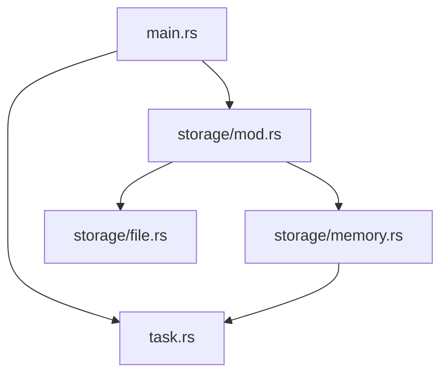

# The Rust `use` Keyword

## Introduction

When working with Rust projects that contain multiple files and modules, you'll need a way to access items (functions, structs, enums, etc.) defined in one module from another. This is where the `use` keyword comes in. The `use` keyword allows you to bring paths into scope, making your code more concise and readable.

In this guide, we'll explore how the `use` keyword works in Rust, its various syntax options, and how it helps you organize your code effectively.

## Understanding the `use` Keyword

The `use` keyword in Rust serves a similar purpose to `import` in Python or `#include` in C/C++. It brings items from other modules into scope so you can reference them directly without using their full path.

### Basic Usage

Let's start with a simple example of how to use the `use` keyword:

```rust
// Without 'use'
fn main() {
    std::collections::HashMap::new();
}

// With 'use'
use std::collections::HashMap;

fn main() {
    HashMap::new();
}
```

Using the `use` keyword, we bring `HashMap` into scope, allowing us to use it directly without specifying the full path each time.

## Different Ways to Use the `use` Keyword

### Importing a Single Item

The most basic way to use the `use` keyword is to import a single item:

```rust
use std::fmt::Formatter;

fn example(f: &mut Formatter) -> std::fmt::Result {
    // Now we can use Formatter directly
    // ...
    Ok(())
}
```

### Importing Multiple Items from the Same Module

You can import multiple items from the same module using curly braces:

```rust
use std::collections::{HashMap, HashSet, BTreeMap};

fn main() {
    let mut map = HashMap::new();
    let mut set = HashSet::new();
    let mut btree = BTreeMap::new();
    
    // Use these types directly
}
```

### Nested Paths

For deeply nested paths, you can use nested braces:

```rust
use std::{
    collections::{HashMap, HashSet},
    fmt::{self, Display, Formatter},
};

fn main() {
    // Now HashMap, HashSet, fmt, Display, and Formatter are all in scope
}
```

### The glob operator (`*`)

To import all public items from a module, you can use the glob operator (`*`):

```rust
use std::collections::*;

fn main() {
    // Now all public items from std::collections are available
    let mut map = HashMap::new();
    let mut set = HashSet::new();
    // ...
}
```

> **Note**: Using the glob operator is generally discouraged in production code as it can make it unclear where certain items are coming from, potentially causing name conflicts. It's better to be explicit about which items you're importing.

### Re-exporting with `pub use`

The `pub use` syntax allows you to re-export items from other modules as part of your own module's public API:

```rust
// In lib.rs
mod math;

// Re-export the add function from the math module
pub use math::add;

// In math.rs
pub fn add(a: i32, b: i32) -> i32 {
    a + b
}
```

Now, users of your crate can use the `add` function directly:

```rust
use my_crate::add;

fn main() {
    println!("Sum: {}", add(5, 3)); // Output: Sum: 8
}
```

### Using Aliases with `as`

If you want to import an item but give it a different name (perhaps to avoid name conflicts), you can use the `as` keyword:

```rust
use std::io::Error as IoError;
use std::fmt::Error as FmtError;

fn main() {
    let io_error = IoError::new(std::io::ErrorKind::Other, "an IO error occurred");
    let fmt_error = FmtError;
    
    // Now we can use both error types without confusion
}
```

## Real-World Example: A Project Structure

Let's look at a practical example of how you might organize a small project and use the `use` keyword effectively.

Imagine we're building a simple task management application:

```
src/
├── main.rs
├── task.rs
└── storage/
    ├── mod.rs
    ├── file.rs
    └── memory.rs
```

### task.rs

```rust
// Define a Task struct
pub struct Task {
    pub id: u32,
    pub title: String,
    pub completed: bool,
}

impl Task {
    pub fn new(id: u32, title: &str) -> Self {
        Task {
            id,
            title: title.to_string(),
            completed: false,
        }
    }
    
    pub fn complete(&mut self) {
        self.completed = true;
    }
}
```

### storage/mod.rs

```rust
pub mod file;
pub mod memory;

pub trait Storage {
    fn save_task(&mut self, task: &crate::Task) -> Result<(), String>;
    fn get_task(&self, id: u32) -> Option<crate::Task>;
    fn list_tasks(&self) -> Vec<crate::Task>;
}
```

### storage/memory.rs

```rust
use crate::Task;
use std::collections::HashMap;
use super::Storage;

pub struct MemoryStorage {
    tasks: HashMap<u32, Task>,
}

impl MemoryStorage {
    pub fn new() -> Self {
        MemoryStorage {
            tasks: HashMap::new(),
        }
    }
}

impl Storage for MemoryStorage {
    fn save_task(&mut self, task: &Task) -> Result<(), String> {
        self.tasks.insert(task.id, task.clone());
        Ok(())
    }
    
    fn get_task(&self, id: u32) -> Option<Task> {
        self.tasks.get(&id).cloned()
    }
    
    fn list_tasks(&self) -> Vec<Task> {
        self.tasks.values().cloned().collect()
    }
}
```

### main.rs

```rust
mod task;
mod storage;

use task::Task;
use storage::{Storage, memory::MemoryStorage};

fn main() {
    let mut storage = MemoryStorage::new();
    
    let mut task1 = Task::new(1, "Learn Rust");
    let task2 = Task::new(2, "Build a project");
    
    storage.save_task(&task1).unwrap();
    storage.save_task(&task2).unwrap();
    
    task1.complete();
    storage.save_task(&task1).unwrap();
    
    println!("All tasks:");
    for task in storage.list_tasks() {
        let status = if task.completed { "Done" } else { "Pending" };
        println!("- [{}] {}: {}", task.id, task.title, status);
    }
}
```

Output:
```
All tasks:
- [1] Learn Rust: Done
- [2] Build a project: Pending
```

In this example, we've used the `use` keyword in several different ways:
- In `storage/memory.rs`, we used `use crate::Task` to import the `Task` struct from the crate root
- In `storage/memory.rs`, we used `use std::collections::HashMap` to import `HashMap` from the standard library
- In `storage/memory.rs`, we used `use super::Storage` to import the `Storage` trait from the parent module
- In `main.rs`, we used `use task::Task` to import the `Task` struct
- In `main.rs`, we used `use storage::{Storage, memory::MemoryStorage}` to import multiple items with a nested path

## Visualizing Module Relationships

Here's a diagram showing the relationship between modules in our example project:



## Where to Use the `use` Statement

You can place `use` statements:

1. At the crate root (main.rs or lib.rs)
2. Inside a module
3. Inside a function or block

When placed at the module level, the imported items are available throughout the module. When placed inside a function or block, they're only available within that scope:

```rust
fn process_data() {
    // HashMap is only available inside this function
    use std::collections::HashMap;
    
    let mut map = HashMap::new();
    // ...
}

fn main() {
    // Error: HashMap is not in scope here
    // let map = HashMap::new();
    
    process_data();
}
```

## Best Practices for Using the `use` Keyword

1. **Be explicit**: Avoid using glob imports (`*`) in production code
2. **Group related imports**: Use nested paths to group related imports
3. **Use consistent styling**: Follow a consistent pattern for organizing imports
4. **Re-export for API design**: Use `pub use` to create a clean public API
5. **Use local imports**: For large modules, consider using local imports inside functions instead of module-level imports
6. **Use aliases when needed**: Use `as` to avoid name conflicts or to provide more context

## Summary

The `use` keyword in Rust is a powerful tool for organizing your code and making it more readable. It allows you to:

- Import items from other modules into the current scope
- Import multiple items with nested paths
- Re-export items using `pub use`
- Create aliases with `as`

By understanding how to use the `use` keyword effectively, you can write Rust code that is more concise, more readable, and better organized.

## Exercises

1. Create a simple project with multiple modules and practice importing items between them using different `use` patterns.
2. Experiment with re-exporting items using `pub use` to create a clean public API.
3. Try to refactor some existing Rust code to improve its import organization.

## Additional Resources

- [Rust Book: Packages and Crates](https://doc.rust-lang.org/book/ch07-01-packages-and-crates.html)
- [Rust Book: Defining Modules to Control Scope and Privacy](https://doc.rust-lang.org/book/ch07-02-defining-modules-to-control-scope-and-privacy.html)
- [Rust By Example: Modules](https://doc.rust-lang.org/rust-by-example/mod.html)
- [Rust API Guidelines: Re-exports](https://rust-lang.github.io/api-guidelines/naming.html#re-export-important-traits-c-reexport)