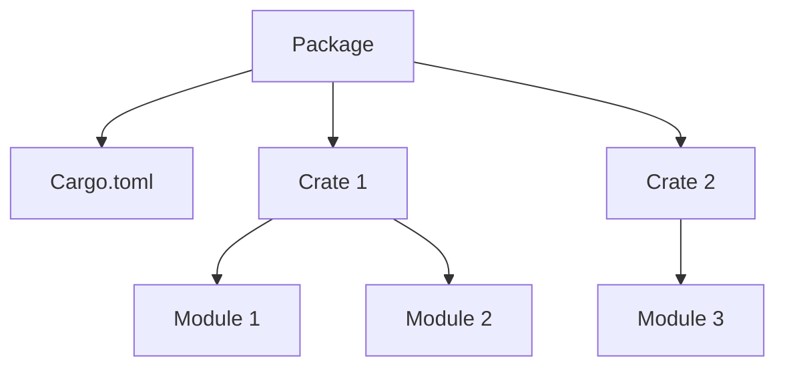

# Rust External Packages

## Introduction

In Rust, external packages (often called "crates") are pre-written pieces of code that provide additional functionality beyond what's available in Rust's standard library. Using external packages allows you to build on the work of other developers instead of reinventing the wheel. This is a fundamental practice in modern software development that makes your code more maintainable and helps you develop applications faster.

In this guide, we'll learn:
- What Rust packages are and how they work
- How to add and manage external dependencies
- How to use external code in your projects
- Best practices for working with external packages

## Understanding Rust's Package Ecosystem

Rust has a thriving ecosystem of open-source packages hosted on [crates.io](https://crates.io), the official Rust package registry. These packages are managed by Cargo, Rust's package manager and build system.

### What is a Crate?

In Rust terminology:
- A **crate** is a compilation unit - the smallest amount of code the Rust compiler can work with
- A **package** is a bundle of one or more crates with a Cargo.toml file
- A **module** is an organizational unit within a crate



## Adding External Dependencies

To use an external package in your Rust project, you need to:

1. Add it as a dependency in your `Cargo.toml` file
2. Import and use it in your Rust code

### Step 1: Adding a Dependency to Cargo.toml

Your `Cargo.toml` file contains a `[dependencies]` section where you list the external packages your project needs. For each dependency, you specify its name and version.

```toml
[package]
name = "my_project"
version = "0.1.0"
edition = "2021"

[dependencies]
rand = "0.8.5"
serde = { version = "1.0", features = ["derive"] }
tokio = { version = "1", features = ["full"] }
```

In this example:
- We've added the `rand` crate (for random number generation) at version 0.8.5
- We've added `serde` (for serialization/deserialization) with its "derive" feature
- We've added `tokio` (for asynchronous programming) with all its features

### Step 2: Using the External Package in Your Code

Once you've added a dependency to your `Cargo.toml`, you can use it in your Rust code by adding `use` statements:

```rust
// Import the Rng trait from the rand crate
use rand::Rng;

fn main() {
    // Use the rand crate's functionality
    let random_number = rand::thread_rng().gen_range(1..=100);
    println!("Random number: {}", random_number);
}
```

**Output:**
```
Random number: 42
```

The exact number will vary each time you run the program.

## Practical Example: Creating a Simple Weather App

Let's see how we might use external packages to build a simple weather app. We'll use:
- `reqwest` for making HTTP requests
- `serde` and `serde_json` for handling JSON data

First, update your `Cargo.toml`:

```toml
[dependencies]
reqwest = { version = "0.11", features = ["blocking", "json"] }
serde = { version = "1.0", features = ["derive"] }
serde_json = "1.0"
```

Now, here's a simple weather app that fetches current weather for a location:

```rust
use serde::{Deserialize, Serialize};
use std::error::Error;

#[derive(Serialize, Deserialize, Debug)]
struct WeatherData {
    main: MainData,
    name: String,
}

#[derive(Serialize, Deserialize, Debug)]
struct MainData {
    temp: f64,
    humidity: i32,
}

fn main() -> Result<(), Box<dyn Error>> {
    // Replace with an actual API key from OpenWeatherMap
    let api_key = "your_api_key_here";
    let city = "London";
    
    let url = format!(
        "https://api.openweathermap.org/data/2.5/weather?q={}&units=metric&appid={}",
        city, api_key
    );

    // Make the HTTP request
    let response = reqwest::blocking::get(&url)?;
    
    // Parse the JSON response
    let weather_data: WeatherData = response.json()?;
    
    // Display the results
    println!("Current weather in {}:", weather_data.name);
    println!("Temperature: {}°C", weather_data.main.temp);
    println!("Humidity: {}%", weather_data.main.humidity);

    Ok(())
}
```

**Sample Output:**
```
Current weather in London:
Temperature: 12.5°C
Humidity: 76%
```

This example demonstrates how external packages make complex tasks much simpler. Without these packages, we would need to implement HTTP requests and JSON parsing from scratch!

## Version Requirements

When specifying dependencies, you can use different version requirement formats:

- `"0.8.5"`: Exact version
- `"^0.8.5"` or `"0.8.5"`: Compatible with 0.8.5 (same as ^0.8.5)
- `"~0.8.5"`: Minor updates only (0.8.x)
- `"*"`: Any version
- `">= 1.0, < 2.0"`: Version range

Most commonly, you'll use the caret requirement (^) which allows compatible updates according to [Semantic Versioning](https://semver.org/).

## Managing Dependencies

Cargo offers several commands to help you manage dependencies:

- `cargo update`: Updates dependencies to their latest compatible versions
- `cargo tree`: Shows a tree of dependencies
- `cargo audit`: Checks for security vulnerabilities (requires `cargo-audit` tool)

Example of checking your dependency tree:

```bash
$ cargo tree
my_project v0.1.0
├── rand v0.8.5
│   ├── rand_chacha v0.3.1
│   │   ├── ppv-lite86 v0.2.16
│   │   └── rand_core v0.6.3
│   └── rand_core v0.6.3
│       └── getrandom v0.2.6
│           ├── cfg-if v1.0.0
│           └── libc v0.2.123
└── serde v1.0.136
    └── serde_derive v1.0.136 (proc-macro)
```

## Development Dependencies

Some dependencies are only needed during development, not at runtime. You can add these to a separate section in your `Cargo.toml`:

```toml
[dev-dependencies]
pretty_assertions = "1.0"
criterion = "0.3"
```

These will only be used for tests and benchmarks but won't be included in your final binary.

## Publishing Your Own Packages

Once you've created a useful Rust library, you might want to share it with others. To publish to crates.io:

1. Create an account on [crates.io](https://crates.io)
2. Get an API token from your account settings
3. Run `cargo login <your-token>`
4. Run `cargo publish` from your package directory

Before publishing, ensure your `Cargo.toml` includes required metadata:

```toml
[package]
name = "my_package"
version = "0.1.0"
edition = "2021"
description = "A helpful package that does things"
license = "MIT OR Apache-2.0"
repository = "https://github.com/yourusername/my_package"
```

## Best Practices

When working with external packages:

1. **Check popularity and maintenance**: Look at download counts, GitHub stars, and recent commits before choosing a package
2. **Minimize dependencies**: Each dependency adds complexity and potential security risks
3. **Pin versions** for production code to ensure reproducible builds
4. **Regularly update** dependencies to get security fixes
5. **Read documentation** carefully to use packages effectively

## Summary

External packages are a powerful way to extend Rust's capabilities and avoid reinventing the wheel. In this guide, we've learned:

- How to add dependencies to your `Cargo.toml` file
- How to use external packages in your code
- How to manage dependencies with Cargo commands
- Best practices for working with external packages

Rust's package ecosystem is one of its greatest strengths. By leveraging the work of the community, you can build sophisticated applications more quickly and with less code.

## Additional Resources

- [The Cargo Book](https://doc.rust-lang.org/cargo/): The official guide to Cargo
- [crates.io](https://crates.io): Browse and search for Rust packages
- [lib.rs](https://lib.rs): An alternative Rust package directory with additional metrics
- [Rust API Guidelines](https://rust-lang.github.io/api-guidelines/): Best practices for developing Rust libraries

## Exercises

1. Add the `chrono` crate to a project and create a function that returns the current date formatted as "YYYY-MM-DD".
2. Create a command-line tool that converts JSON to YAML using the `serde_json` and `serde_yaml` crates.
3. Find three popular crates for web development in Rust and compare their features and documentation.
4. Add error handling to the weather app example using the `thiserror` crate.
5. Create a small library crate that provides utility functions, then use it in another project as a path dependency.