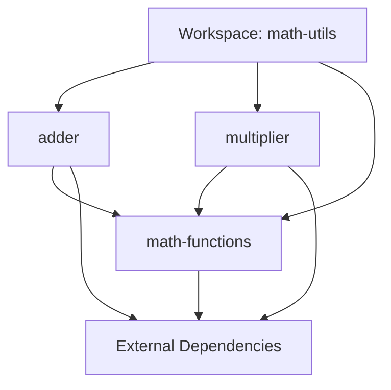

# Rust Workspaces

## Introduction

As your Rust projects grow in complexity, you might find yourself wanting to split your code into multiple packages (crates) while still maintaining them as part of a single project. Rust workspaces solve this problem by allowing you to manage multiple related packages from a single location.

Workspaces enable you to:
- Share dependencies between packages
- Optimize compilation by building shared dependencies once
- Organize related code into logical, separate units
- Test and build all packages together with a single command

This guide will walk you through creating and managing Rust workspaces, from basic setup to practical applications.

## What is a Rust Workspace?

A Rust workspace is a collection of packages (crates) that share the same `Cargo.lock` file and output directory. These packages are developed and managed together, making it easier to organize large codebases into smaller, more manageable parts.

Think of a workspace as a family of related packages that:
- Live in the same parent directory
- Can depend on each other
- Share common build artifacts and dependencies
- Can be built, tested, and released together

## Creating a Basic Workspace

Let's create a simple workspace with two binary crates: `adder` and `multiplier`.

### Step 1: Create the Workspace Directory

Start by creating a directory for your workspace:

```bash
mkdir math-utils
cd math-utils
```

### Step 2: Configure the Workspace

Create a `Cargo.toml` file in the root directory with the following content:

```toml
[workspace]
members = [
    "adder",
    "multiplier",
]
```

This tells Cargo that we have a workspace with two member packages.

### Step 3: Create the Member Packages

Now let's create the two member crates:

```bash
cargo new adder
cargo new multiplier
```

Your directory structure should now look like this:

```
math-utils/
├── Cargo.toml
├── adder/
│   ├── Cargo.toml
│   └── src/
│       └── main.rs
└── multiplier/
    ├── Cargo.toml
    └── src/
        └── main.rs
```

### Step 4: Implement the Crates

Let's add some simple code to each crate.

For `adder/src/main.rs`:

```rust
fn main() {
    let a = 5;
    let b = 7;
    println!("{} + {} = {}", a, b, a + b);
}
```

For `multiplier/src/main.rs`:

```rust
fn main() {
    let a = 5;
    let b = 7;
    println!("{} × {} = {}", a, b, a * b);
}
```

### Step 5: Building the Workspace

You can build all crates in the workspace with a single command:

```bash
cargo build
```

The output should show that both packages were compiled:

```
   Compiling adder v0.1.0 (/path/to/math-utils/adder)
   Compiling multiplier v0.1.0 (/path/to/math-utils/multiplier)
    Finished dev [unoptimized + debuginfo] target(s) in 1.89s
```

### Step 6: Running a Specific Package

To run a specific package in the workspace:

```bash
cargo run -p adder
```

Output:
```
5 + 7 = 12
```

```bash
cargo run -p multiplier
```

Output:
```
5 × 7 = 35
```

## Adding a Shared Library Crate

Now, let's improve our workspace by adding a shared library crate that both binaries can use.

### Step 1: Create a Library Crate

```bash
cargo new math-functions --lib
```

### Step 2: Update the Workspace Configuration

Update the root `Cargo.toml` to include the new member:

```toml
[workspace]
members = [
    "adder",
    "multiplier",
    "math-functions",
]
```

### Step 3: Implement the Library Functions

In `math-functions/src/lib.rs`:

```rust
pub fn add(a: i32, b: i32) -> i32 {
    a + b
}

pub fn multiply(a: i32, b: i32) -> i32 {
    a * b
}

#[cfg(test)]
mod tests {
    use super::*;

    #[test]
    fn test_add() {
        assert_eq!(add(2, 3), 5);
    }

    #[test]
    fn test_multiply() {
        assert_eq!(multiply(2, 3), 6);
    }
}
```

### Step 4: Update the Binary Crates to Use the Library

First, update both `adder/Cargo.toml` and `multiplier/Cargo.toml` to include a dependency on our library:

For `adder/Cargo.toml`:

```toml
[dependencies]
math-functions = { path = "../math-functions" }
```

For `multiplier/Cargo.toml`:

```toml
[dependencies]
math-functions = { path = "../math-functions" }
```

Now update the binary crates to use the library functions:

For `adder/src/main.rs`:

```rust
use math_functions::add;

fn main() {
    let a = 5;
    let b = 7;
    println!("{} + {} = {}", a, b, add(a, b));
}
```

For `multiplier/src/main.rs`:

```rust
use math_functions::multiply;

fn main() {
    let a = 5;
    let b = 7;
    println!("{} × {} = {}", a, b, multiply(a, b));
}
```

### Step 5: Build and Test the Workspace

```bash
# Build all packages
cargo build

# Test all packages
cargo test
```

The output should show that all tests pass:

```
   Compiling math-functions v0.1.0 (/path/to/math-utils/math-functions)
   Compiling adder v0.1.0 (/path/to/math-utils/adder)
   Compiling multiplier v0.1.0 (/path/to/math-utils/multiplier)
    Finished test [unoptimized + debuginfo] target(s) in 1.23s
     Running unittests src/lib.rs (target/debug/deps/math_functions-abcdef1234)

running 2 tests
test tests::test_add ... ok
test tests::test_multiply ... ok

test result: ok. 2 passed; 0 failed; 0 ignored; 0 measured; 0 filtered out
```

## Understanding Workspace Dependencies

Let's visualize how dependencies work in a workspace:



Key points about workspace dependencies:

1. **Shared `Cargo.lock`**: All workspace members share the same lock file, ensuring consistent dependencies across packages.

2. **Target Directory**: Compiled artifacts from all packages are stored in a shared `target` directory at the workspace root.

3. **Path Dependencies**: Within a workspace, you can easily specify dependencies between packages using relative paths.

4. **Version Resolution**: Cargo treats all workspace members as compatible, resolving external dependencies to ensure all packages use the same version.

## Real-World Example: A Web API Project

Let's look at a more practical example: a web API project with separate packages for the core logic, database access, and API server.

### Project Structure

```
api-project/
├── Cargo.toml
├── api/
│   ├── Cargo.toml
│   └── src/
│       └── main.rs
├── core/
│   ├── Cargo.toml
│   └── src/
│       └── lib.rs
└── database/
    ├── Cargo.toml
    └── src/
        └── lib.rs
```

### Workspace Configuration

In `api-project/Cargo.toml`:

```toml
[workspace]
members = [
    "api",
    "core",
    "database",
]
```

### Package Implementation

For `core/Cargo.toml`:

```toml
[package]
name = "core"
version = "0.1.0"
edition = "2021"

[dependencies]
serde = { version = "1.0", features = ["derive"] }
```

For `core/src/lib.rs`:

```rust
use serde::{Deserialize, Serialize};

#[derive(Debug, Serialize, Deserialize)]
pub struct User {
    pub id: u64,
    pub username: String,
    pub email: String,
}

pub fn validate_email(email: &str) -> bool {
    // Simple validation: check if contains @ and .
    email.contains('@') && email.contains('.')
}
```

For `database/Cargo.toml`:

```toml
[package]
name = "database"
version = "0.1.0"
edition = "2021"

[dependencies]
core = { path = "../core" }
```

For `database/src/lib.rs`:

```rust
use core::User;

pub struct Database {
    // In a real app, this would be a connection to a database
    users: Vec<User>,
}

impl Database {
    pub fn new() -> Self {
        Database { users: Vec::new() }
    }

    pub fn add_user(&mut self, user: User) {
        self.users.push(user);
    }

    pub fn get_user(&self, id: u64) -> Option<&User> {
        self.users.iter().find(|u| u.id == id)
    }

    pub fn list_users(&self) -> &[User] {
        &self.users
    }
}
```

For `api/Cargo.toml`:

```toml
[package]
name = "api"
version = "0.1.0"
edition = "2021"

[dependencies]
core = { path = "../core" }
database = { path = "../database" }
```

For `api/src/main.rs`:

```rust
use core::{User, validate_email};
use database::Database;

fn main() {
    let mut db = Database::new();
    
    // Add some users
    add_user(&mut db, 1, "alice", "alice@example.com");
    add_user(&mut db, 2, "bob", "bob@example.com");
    
    // List all users
    println!("All users:");
    for user in db.list_users() {
        println!("- User {}: {} ({})", user.id, user.username, user.email);
    }
}

fn add_user(db: &mut Database, id: u64, username: &str, email: &str) {
    if validate_email(email) {
        let user = User {
            id,
            username: username.to_string(),
            email: email.to_string(),
        };
        db.add_user(user);
        println!("Added user: {}", username);
    } else {
        println!("Invalid email for user: {}", username);
    }
}
```

To run this API example:

```bash
cargo run -p api
```

Output:
```
Added user: alice
Added user: bob
All users:
- User 1: alice (alice@example.com)
- User 2: bob (bob@example.com)
```

## Advanced Workspace Features

### Default Members

You can specify default members that Cargo will build if no specific package is selected:

```toml
[workspace]
members = [
    "adder",
    "multiplier",
    "math-functions",
]
default-members = ["adder"]
```

With this configuration, running `cargo build` without the `-p` flag will build only the `adder` package.

### Workspace-Wide Dependencies

You can specify dependencies that all workspace members will inherit:

```toml
[workspace]
members = [
    "adder",
    "multiplier",
    "math-functions",
]

[workspace.dependencies]
serde = "1.0"
log = "0.4"
```

Then in each member's `Cargo.toml`, you can reference these shared dependencies:

```toml
[dependencies]
serde = { workspace = true }
log = { workspace = true }
```

### Package Exclusion

You can use `exclude` to exclude directories that would otherwise be detected as packages:

```toml
[workspace]
members = [
    "adder",
    "multiplier",
    "math-functions",
]
exclude = ["old-package", "experimental"]
```

### Virtual Manifests

A workspace doesn't need to have a package at its root. If the root `Cargo.toml` only contains `[workspace]` information, it's called a "virtual manifest."

## Best Practices for Rust Workspaces

1. **Logical Separation**: Split your crates based on logical boundaries and responsibilities.

2. **Clear Dependencies**: Keep the dependency graph as simple as possible to avoid circular dependencies.

3. **Consistent Versioning**: Use the same version number across all packages in a workspace that are released together.

4. **Documentation**: Include clear README files for each package explaining its purpose and usage.

5. **Testing Strategy**: 
   - Unit tests within each package
   - Integration tests that span multiple packages

6. **Conditional Features**: Use feature flags to enable optional functionality consistently across packages.

## Common Issues and Solutions

### Circular Dependencies

Rust doesn't allow circular dependencies between crates. To solve this:

1. Create a new crate that both dependent crates can use
2. Use trait objects to break the dependency cycle
3. Rethink your architecture to avoid the circular dependency

### Dependency Resolution Conflicts

If you encounter dependency resolution conflicts:

1. Update the `Cargo.toml` in the workspace root to specify the desired versions
2. Use `cargo update -p <package>` to update specific dependencies
3. Consider using fewer external dependencies

## Summary

Rust workspaces are a powerful tool for organizing large Rust projects into manageable, independent components while maintaining the benefits of a unified build system. By structuring your code into logical crates within a workspace, you can improve compilation times, clarify code organization, and make your project more maintainable.

In this guide, we've covered:
- Creating basic workspaces
- Adding shared library crates
- Specifying dependencies between workspace members
- Building and testing workspace packages
- Real-world workspace organization
- Advanced workspace features and best practices

## Additional Resources

For further exploration of Rust workspaces:

1. [Official Cargo Documentation on Workspaces](https://doc.rust-lang.org/cargo/reference/workspaces.html)
2. [The Cargo Book](https://doc.rust-lang.org/cargo/index.html)
3. [Rust by Example](https://doc.rust-lang.org/rust-by-example/)

## Exercises

To practice using Rust workspaces:

1. Create a workspace with three crates: a CLI interface, a library for business logic, and a crate for data persistence.
2. Refactor an existing single-crate Rust project into a workspace with multiple crates.
3. Create a workspace for a web application with separate crates for the frontend, backend API, and shared models.
4. Add workspace-wide dependency specifications to standardize dependency versions across all crates.