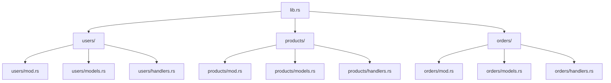
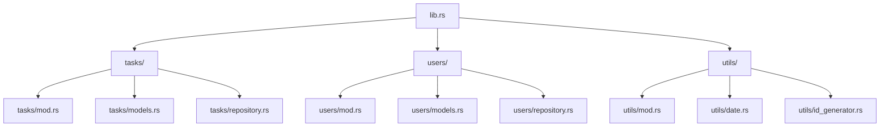

# Rust Module Design

## Introduction

Module design is a critical aspect of writing maintainable and scalable Rust programs. As your projects grow in size and complexity, thoughtful organization of your code becomes increasingly important. In this tutorial, we'll explore best practices for designing Rust modules, which serve as the fundamental building blocks for organizing code.

Rust's module system allows you to:

- Split your code into logical units
- Control visibility and privacy
- Create clear boundaries between components
- Enable code reuse through well-defined interfaces

By the end of this tutorial, you'll understand how to design effective module structures for your Rust projects.

## Module Fundamentals

Before diving into design patterns, let's review the basics of how modules work in Rust.

### Module Declaration

You can declare modules in two ways:

1. **Inline modules** - defined within a file using the `mod` keyword:

```rust
// In main.rs or lib.rs
mod utils {
    pub fn helper() {
        println!("Helper function called");
    }
}

fn main() {
    utils::helper(); // Output: Helper function called
}
```

2. **File-based modules** - defined in separate files:

```rust
// In main.rs or lib.rs
mod utils; // Declares the module (Rust will look for utils.rs or utils/mod.rs)

fn main() {
    utils::helper(); // Output: Helper function called
}

// In utils.rs
pub fn helper() {
    println!("Helper function called");
}
```

### Module Visibility

Rust's modules have a strong privacy system using the `pub` keyword:

```rust
mod math {
    // Private by default (only accessible within this module)
    fn add(a: i32, b: i32) -> i32 {
        a + b
    }

    // Public (accessible from outside this module)
    pub fn calculate_sum(a: i32, b: i32) -> i32 {
        // We can call private functions from within the module
        add(a, b)
    }
}

fn main() {
    // This works because calculate_sum is public
    let result = math::calculate_sum(5, 7);
    println!("Sum: {}", result); // Output: Sum: 12
    
    // This would fail to compile because add is private
    // let result = math::add(5, 7);
}
```

### Module Hierarchies

Modules can be nested to create hierarchies:

```rust
mod graphics {
    pub mod shapes {
        pub struct Rectangle {
            pub width: f64,
            pub height: f64,
        }
        
        impl Rectangle {
            pub fn new(width: f64, height: f64) -> Self {
                Rectangle { width, height }
            }
            
            pub fn area(&self) -> f64 {
                self.width * self.height
            }
        }
    }
    
    pub mod rendering {
        use super::shapes::Rectangle;
        
        pub fn render_rectangle(rect: &Rectangle) {
            println!("Rendering rectangle with area: {}", rect.area());
        }
    }
}

fn main() {
    let rect = graphics::shapes::Rectangle::new(10.0, 5.0);
    graphics::rendering::render_rectangle(&rect);
    // Output: Rendering rectangle with area: 50
}
```

## Module Design Patterns

Now that we understand the basics, let's explore some common design patterns for organizing Rust modules.

### Pattern 1: API Design with Public Interfaces

A clean module design often separates public interfaces from their implementations:

```rust
mod database {
    // Internal implementation details
    struct Connection {
        server: String,
    }
    
    impl Connection {
        fn new(server: &str) -> Self {
            Connection { server: server.to_string() }
        }
        
        fn execute_query(&self, query: &str) -> Vec<String> {
            println!("Executing '{}' on server {}", query, self.server);
            vec!["result1".to_string(), "result2".to_string()]
        }
    }
    
    // Public interface
    pub struct Database {
        connection: Connection,
    }
    
    impl Database {
        pub fn connect(server: &str) -> Self {
            Database {
                connection: Connection::new(server),
            }
        }
        
        pub fn query(&self, query: &str) -> Vec<String> {
            self.connection.execute_query(query)
        }
    }
}

fn main() {
    // Users interact with the public interface only
    let db = database::Database::connect("db.example.com");
    let results = db.query("SELECT * FROM users");
    
    println!("Query returned {} results", results.len());
    // Output: Executing 'SELECT * FROM users' on server db.example.com
    // Output: Query returned 2 results
}
```

### Pattern 2: Feature-Based Organization

For larger applications, organizing modules by feature can improve maintainability:



Implementation example:

```rust
// lib.rs
pub mod users;
pub mod products;
pub mod orders;

// users/mod.rs
pub mod models;
pub mod handlers;

pub use models::User;
pub use handlers::create_user;

// users/models.rs
pub struct User {
    pub id: u64,
    pub username: String,
}

// users/handlers.rs
use super::models::User;

pub fn create_user(username: &str) -> User {
    User {
        id: 1,  // In a real app, we'd generate an ID
        username: username.to_string(),
    }
}

// main.rs
use my_app::users::{User, create_user};

fn main() {
    let user = create_user("alice");
    println!("Created user {} with ID {}", user.username, user.id);
    // Output: Created user alice with ID 1
}
```

### Pattern 3: Public Re-exports with Facade Pattern

The facade pattern simplifies your public API by re-exporting only what users need:

```rust
// lib.rs
mod config;
mod database;
mod utils;
mod models;

// Re-export only what we want to be part of our public API
pub use config::Config;
pub use database::Database;
pub use models::{User, Product};

// This allows users to import everything they need directly:
// use my_library::{Config, Database, User, Product};
```

### Pattern 4: Tests Module

Rust has a convention for organizing tests within modules:

```rust
// calculator.rs
pub fn add(a: i32, b: i32) -> i32 {
    a + b
}

pub fn subtract(a: i32, b: i32) -> i32 {
    a - b
}

#[cfg(test)]
mod tests {
    use super::*;
    
    #[test]
    fn test_add() {
        assert_eq!(add(2, 3), 5);
    }
    
    #[test]
    fn test_subtract() {
        assert_eq!(subtract(5, 2), 3);
    }
}
```

The `#[cfg(test)]` attribute ensures that the test module is only compiled when running tests.

## Real-World Module Design Example

Let's design modules for a more complex application - a simple task management system:



Here's how we might implement this:

```rust
// lib.rs
pub mod tasks;
pub mod users;
mod utils;

// Re-exports for a cleaner public API
pub use tasks::{Task, TaskStatus, TaskRepository};
pub use users::{User, UserRepository};

// tasks/mod.rs
mod models;
mod repository;

pub use models::{Task, TaskStatus};
pub use repository::TaskRepository;

// tasks/models.rs
use chrono::{DateTime, Utc};

pub enum TaskStatus {
    Todo,
    InProgress,
    Done,
}

pub struct Task {
    pub id: String,
    pub title: String,
    pub description: Option<String>,
    pub status: TaskStatus,
    pub created_at: DateTime<Utc>,
    pub assigned_to: Option<String>, // User ID
}

impl Task {
    pub fn new(title: &str, description: Option<&str>) -> Self {
        Task {
            id: crate::utils::id_generator::generate_id(),
            title: title.to_string(),
            description: description.map(|d| d.to_string()),
            status: TaskStatus::Todo,
            created_at: Utc::now(),
            assigned_to: None,
        }
    }
    
    pub fn mark_in_progress(&mut self) {
        self.status = TaskStatus::InProgress;
    }
    
    pub fn mark_done(&mut self) {
        self.status = TaskStatus::Done;
    }
}

// tasks/repository.rs
use super::models::Task;
use std::collections::HashMap;
use std::sync::{Arc, Mutex};

pub struct TaskRepository {
    tasks: Arc<Mutex<HashMap<String, Task>>>,
}

impl TaskRepository {
    pub fn new() -> Self {
        TaskRepository {
            tasks: Arc::new(Mutex::new(HashMap::new())),
        }
    }
    
    pub fn add(&self, task: Task) -> Result<(), String> {
        let mut tasks = self.tasks.lock().unwrap();
        tasks.insert(task.id.clone(), task);
        Ok(())
    }
    
    pub fn get(&self, id: &str) -> Option<Task> {
        let tasks = self.tasks.lock().unwrap();
        tasks.get(id).cloned()
    }
    
    // Additional repository methods...
}

// utils/id_generator.rs
use uuid::Uuid;

pub(crate) fn generate_id() -> String {
    Uuid::new_v4().to_string()
}
```

Using our task management library:

```rust
use task_management::{Task, TaskRepository, TaskStatus};

fn main() {
    let repo = TaskRepository::new();
    
    // Create a new task
    let mut task = Task::new(
        "Learn Rust Module Design", 
        Some("Study how to organize Rust code effectively")
    );
    
    // Store the task
    repo.add(task.clone()).unwrap();
    
    // Update task status
    task.mark_in_progress();
    
    println!("Created task: {}", task.title);
    // Output: Created task: Learn Rust Module Design
}
```

## Best Practices for Module Design

Here are some guidelines to follow when designing modules in Rust:

1. **Single Responsibility**: Each module should have a single, well-defined purpose.

2. **Minimize Public Interface**: Only make items public (`pub`) when they need to be accessed from outside the module.

3. **Use Re-exports**: Use `pub use` to create a clean, coherent public API without exposing your internal structure.

4. **Logical Grouping**: Group related functionality together in the same module.

5. **Separation of Concerns**: Keep different aspects of your program in separate modules (e.g., separate data models from business logic).

6. **Consistent Naming**: Use consistent naming conventions for your modules and their contents.

7. **Documentation**: Document your module structure using comments and clear naming.

8. **Visibility Control**: Use `pub(crate)`, `pub(super)`, and `pub(in path)` for fine-grained visibility control.

## Common Module Design Mistakes

Watch out for these common pitfalls:

1. **Circular Dependencies**: Modules that depend on each other. Refactor to break these cycles.

2. **Overly Complex Hierarchies**: Too many nested modules can make code hard to navigate. Aim for a flat structure when possible.

3. **Inconsistent Public API**: Exposing implementation details that should be private.

4. **Monolithic Modules**: Modules that are too large and try to do too many things.

5. **Tight Coupling**: Modules that are too interdependent, making changes difficult.

## Summary

Effective module design is essential for building maintainable Rust applications. In this tutorial, we've learned:

- How to declare and organize modules in Rust
- Common module design patterns and when to use them
- How to control visibility with Rust's privacy system
- Real-world examples of module organization
- Best practices for designing module structures

By applying these principles, you'll be able to create Rust code that is easier to understand, test, and maintain. Remember that good module design is an iterative process - as your application grows, you may need to refactor your module structure to keep it clean and organized.

## Additional Resources

- [Rust Book: Packages and Crates](https://doc.rust-lang.org/book/ch07-01-packages-and-crates.html)
- [Rust Book: Defining Modules](https://doc.rust-lang.org/book/ch07-02-defining-modules-to-control-scope-and-privacy.html)
- [Rust API Guidelines](https://rust-lang.github.io/api-guidelines/)
- [Rust By Example: Modules](https://doc.rust-lang.org/rust-by-example/mod.html)

## Exercises

1. **Module Refactoring**: Take an existing Rust project and refactor its module structure to improve organization.

2. **Feature Implementation**: Add a new feature to the task management example, placing it in an appropriate module.

3. **Privacy Design**: Practice designing modules with appropriate visibility by creating a library with both public interfaces and private implementation details.

4. **Re-export Practice**: Create a module hierarchy and then use re-exports to create a simplified public API.

5. **Test Organization**: Create a module with comprehensive tests using the `#[cfg(test)]` attribute.