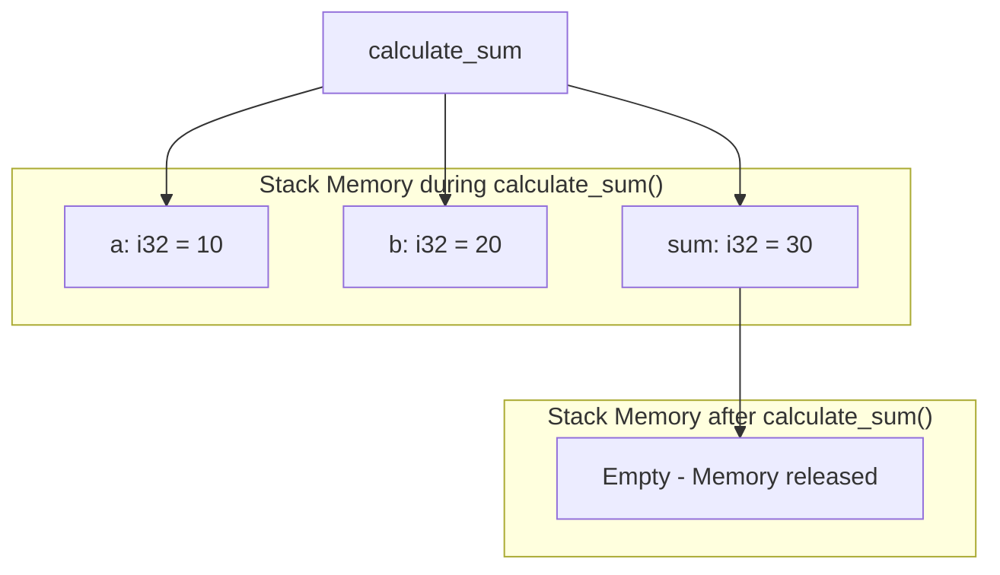
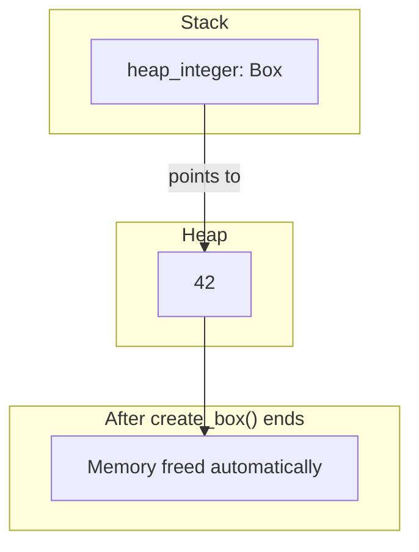
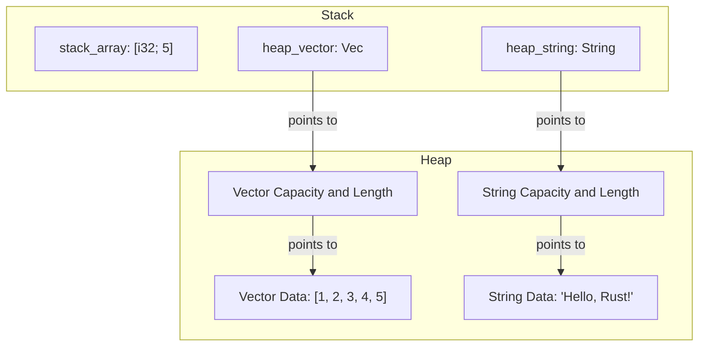

# Stack vs Heap in Rust

Memory management is a fundamental concept in programming, and Rust provides a unique approach that combines safety with performance. In this guide, we'll explore how Rust uses both the stack and heap for memory allocation, and why understanding the difference is crucial for writing efficient Rust code.

## Introduction

When your Rust program runs, it has access to two main regions of memory:

1. **The Stack**: A fast, automatically managed region with a fixed size
2. **The Heap**: A more flexible region that allows for dynamic memory allocation

Understanding when and how Rust uses each memory region helps you write more efficient and safer code. Let's dive into the details!

## The Stack

### What is the Stack?

The stack is a region of memory that operates in a "last in, first out" (LIFO) manner, similar to a stack of plates. When a function is called, Rust allocates a chunk of memory on the stack for all the function's local variables.

Key characteristics of stack memory:

- **Fast allocation**: Adding or removing data is very quick
- **Size must be known at compile time**: All data stored on the stack must have a fixed, known size
- **Automatic cleanup**: When a function exits, all its stack memory is automatically freed
- **Limited in size**: The stack size is typically smaller than the heap

### When Does Rust Use the Stack?

Rust uses the stack for:

- All primitive types (integers, floats, booleans, etc.)
- Fixed-size collections like arrays (when their size is known at compile time)
- Function parameters and local variables (when possible)
- Tuples and structs containing only stack-based types

### Stack Example

Let's look at a simple example of stack allocation:

```rust
fn calculate_sum() {
    // All these variables are stored on the stack
    let a: i32 = 10;
    let b: i32 = 20;
    let sum = a + b;
    
    println!("Sum: {}", sum);
    
    // When this function ends, all stack memory is automatically freed
}

fn main() {
    calculate_sum();
    // Stack memory from calculate_sum has been freed here
}
```

Output:
```
Sum: 30
```

### Stack Memory Visualization

Here's a visualization of how the stack changes as the program runs:



## The Heap

### What is the Heap?

The heap is a region of memory that allows for dynamic allocation. Unlike the stack, the size of data on the heap doesn't need to be known at compile time.

Key characteristics of heap memory:

- **Dynamic sizing**: Can store data whose size is determined at runtime
- **Slower allocation**: Allocating memory on the heap is slower than on the stack
- **Manual cleanup**: In many languages, you need to explicitly free heap memory (Rust handles this automatically through ownership)
- **Larger capacity**: The heap can typically store much more data than the stack

### When Does Rust Use the Heap?

Rust uses the heap for:

- Data with a size unknown at compile time
- Data that needs to live beyond the scope of the current function
- Large amounts of data that might cause a stack overflow
- Data that needs to be shared between different parts of the program

In Rust, heap allocation is typically done through smart pointers like `Box<T>`, `Vec<T>`, `String`, and other collection types.

### Heap Example

Let's see how to allocate data on the heap using `Box<T>`:

```rust
fn create_box() {
    // Allocate an integer on the heap
    let heap_integer = Box::new(42);
    
    println!("Value on the heap: {}", heap_integer);
    
    // When heap_integer goes out of scope, Rust automatically frees the heap memory
}

fn main() {
    create_box();
    // Heap memory is freed here thanks to Rust's ownership system
}
```

Output:
```
Value on the heap: 42
```

### Heap Memory Visualization



## Comparing Stack and Heap

Let's look at a more complex example that uses both stack and heap allocation:

```rust
fn stack_and_heap() {
    // Stack allocation
    let stack_array = [1, 2, 3, 4, 5]; // Fixed-size array on stack
    
    // Heap allocation
    let heap_vector = vec![1, 2, 3, 4, 5]; // Vector on heap
    let heap_string = String::from("Hello, Rust!"); // String on heap
    
    println!("Stack array: {:?}", stack_array);
    println!("Heap vector: {:?}", heap_vector);
    println!("Heap string: {}", heap_string);
}

fn main() {
    stack_and_heap();
    // All memory (stack and heap) is freed here
}
```

Output:
```
Stack array: [1, 2, 3, 4, 5]
Heap vector: [1, 2, 3, 4, 5]
Heap string: Hello, Rust!
```

### Memory Layout Visualization



## When to Use Stack vs Heap

### Use the Stack When:

- You're working with small, fixed-size data
- The data needs to be accessed quickly
- You don't need to transfer ownership of the data between functions
- You're working with primitive types or small structs
- Performance is critical

### Use the Heap When:

- You're working with data whose size might change
- You need the data to outlive the current function
- You're working with large amounts of data
- You need to share ownership of data (using Rc or Arc)
- You need dynamic dispatch (using trait objects)

## Real-World Applications

### Example 1: Processing Configuration

Let's build a simple configuration processor that demonstrates how to use both stack and heap memory:

```rust
struct AppConfig {
    // Small fixed-size values on the stack
    port: u16,
    max_connections: u32,
    debug_mode: bool,
    
    // Variable-sized data on the heap
    server_name: String,
    allowed_domains: Vec<String>,
}

fn process_config(config: AppConfig) {
    println!("Server: {} running on port {}", config.server_name, config.port);
    println!("Max connections: {}", config.max_connections);
    println!("Debug mode: {}", config.debug_mode);
    println!("Allowed domains: {:?}", config.allowed_domains);
}

fn main() {
    let config = AppConfig {
        port: 8080,
        max_connections: 1000,
        debug_mode: true,
        server_name: String::from("MainServer"),
        allowed_domains: vec![
            String::from("example.com"),
            String::from("rust-lang.org"),
        ],
    };
    
    process_config(config);
}
```

Output:
```
Server: MainServer running on port 8080
Max connections: 1000
Debug mode: true
Allowed domains: ["example.com", "rust-lang.org"]
```

### Example 2: Processing Large Data Sets

When working with large data sets, heap allocation becomes necessary:

```rust
fn analyze_data(data: &[u32]) -> (u32, f64) {
    let sum: u32 = data.iter().sum();
    let average: f64 = sum as f64 / data.len() as f64;
    (sum, average)
}

fn main() {
    // This large vector is allocated on the heap
    let large_dataset: Vec<u32> = (1..10001).collect();
    
    let (sum, average) = analyze_data(&large_dataset);
    
    println!("Sum of {} numbers: {}", large_dataset.len(), sum);
    println!("Average: {:.2}", average);
}
```

Output:
```
Sum of 10000 numbers: 50005000
Average: 5000.50
```

## Performance Considerations

Understanding stack vs heap allocation can significantly impact your application's performance:

```rust
use std::time::Instant;

fn measure_stack_allocation() {
    let start = Instant::now();
    
    // Stack allocation
    for _ in 0..1_000_000 {
        let data = [0u8; 100]; // 100 bytes on stack
        let _ = data[0]; // Prevent optimization
    }
    
    let duration = start.elapsed();
    println!("Stack allocation: {:?}", duration);
}

fn measure_heap_allocation() {
    let start = Instant::now();
    
    // Heap allocation
    for _ in 0..1_000_000 {
        let data = vec![0u8; 100]; // 100 bytes on heap
        let _ = data[0]; // Prevent optimization
    }
    
    let duration = start.elapsed();
    println!("Heap allocation: {:?}", duration);
}

fn main() {
    measure_stack_allocation();
    measure_heap_allocation();
}
```

Sample output (actual times will vary by system):
```
Stack allocation: 2.8ms
Heap allocation: 28.6ms
```

This demonstrates how much faster stack allocation is compared to heap allocation!

## Common Pitfalls and Solutions

### Pitfall 1: Stack Overflow

Stack memory is limited, and if you try to allocate too much, you'll get a stack overflow error:

```rust
fn stack_overflow_risk() {
    // This might cause a stack overflow on some systems
    let huge_array = [0u8; 10_000_000]; // 10MB on stack
    println!("First byte: {}", huge_array[0]);
}

// Better approach using heap
fn heap_alternative() {
    // Same size but on the heap
    let huge_vec = vec![0u8; 10_000_000]; // 10MB on heap
    println!("First byte: {}", huge_vec[0]);
}
```

### Pitfall 2: Returning References to Stack Data

This code won't compile because it attempts to return a reference to data that will be dropped:

```rust
// This won't compile!
fn return_stack_reference() -> &i32 {
    let x = 42;
    &x // Error: x doesn't live long enough
}

// Fixed version using heap allocation
fn return_heap_value() -> Box<i32> {
    let x = 42;
    Box::new(x) // Moves x to the heap and transfers ownership
}
```

## Summary

Understanding the difference between stack and heap memory in Rust is crucial for writing efficient code:

- **Stack**: Fast, fixed-size, automatically managed
- **Heap**: Flexible, dynamic size, managed through Rust's ownership system

When deciding where to allocate data:
- Use the stack for small, fixed-size data with a limited lifetime
- Use the heap for dynamic, large, or long-lived data

Rust's ownership system ensures memory safety for both stack and heap allocations, preventing common memory errors like use-after-free or double-free bugs.

## Additional Resources

- [The Rust Book: Understanding Ownership](https://doc.rust-lang.org/book/ch04-01-what-is-ownership.html)
- [The Rust Book: Using the Stack and the Heap](https://doc.rust-lang.org/book/ch04-01-what-is-ownership.html#the-stack-and-the-heap)
- [Rust By Example: Scoping Rules](https://doc.rust-lang.org/rust-by-example/scope.html)

## Exercises

1. **Basic Stack Usage**: Write a function that creates several primitive values on the stack, performs operations with them, and returns a result.

2. **Heap Allocation**: Create a program that dynamically allocates memory for a string on the heap, modifies the string, and then prints it.

3. **Performance Comparison**: Write a benchmark that compares the performance of stack vs heap allocation for different data sizes.

4. **Memory Visualization**: Create a small Rust program and draw a diagram showing which parts of the program use stack memory and which use heap memory.

5. **Ownership Transfer**: Write a program that demonstrates how ownership of heap data can be transferred between functions in Rust.