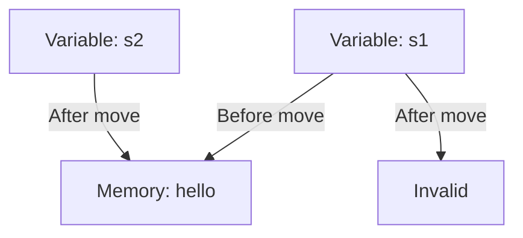
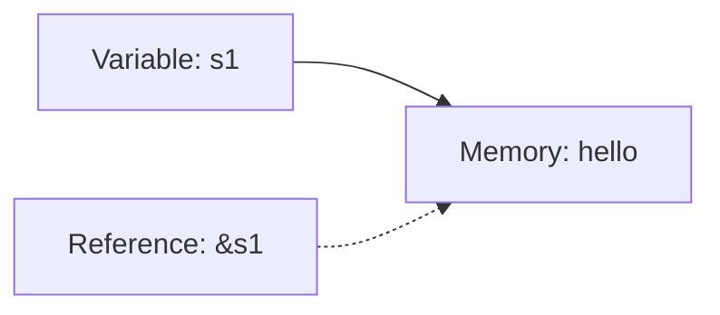

# Rust Ownership Model

## Introduction

One of Rust's most distinctive features is its **ownership model**, which allows the language to make memory safety guarantees without needing a garbage collector. If you're coming from languages like Python, JavaScript, or Java, this concept might seem unusual at first, but mastering it is key to becoming proficient in Rust.

In this tutorial, we'll explore how Rust's ownership system works, why it exists, and how to work with it effectively. By the end, you'll understand how this innovative system enables Rust to prevent common programming errors like null pointer dereferencing, double-free errors, and data races.

## What is Ownership?

Ownership is Rust's approach to memory management. Rather than relying on a garbage collector (like Java or Python) or manual memory allocation/deallocation (like C or C++), Rust uses a set of rules that the compiler checks at compile time.

The three core rules of ownership in Rust are:

1. Each value in Rust has a variable that is its **owner**
2. There can only be **one owner** at a time
3. When the owner goes out of scope, the value will be **dropped** (freed from memory)

Let's break these down with examples.

## Rule 1: Each Value Has an Owner

In Rust, when you create a value and assign it to a variable, that variable becomes the owner of the value:

```rust
fn main() {
    // s becomes the owner of the string "hello"
    let s = String::from("hello");
    
    // the variable s is used here
    println!("The string is: {}", s);
    
} // s goes out of scope and is dropped automatically
```

Output:
```
The string is: hello
```

## Rule 2: One Owner at a Time

When you assign a value from one variable to another, the ownership transfers:

```rust
fn main() {
    let s1 = String::from("hello");
    
    // Ownership of the string moves from s1 to s2
    let s2 = s1;
    
    // This would cause an error as s1 no longer owns the value
    // println!("s1: {}", s1); // Error: value borrowed here after move
    
    // Only s2 can be used now
    println!("s2: {}", s2);
}
```

Output:
```
s2: hello
```

This behavior differs from shallow copying in other languages. In Rust, the first variable becomes invalid after the assignment - we say the value has been **moved** from `s1` to `s2`.

Let's visualize what happens in memory:



This prevents double-free errors where the same memory might be freed twice.

### Cloning: When You Want a Deep Copy

If you do want to create a deep copy (not just transfer ownership), you can use the `clone` method:

```rust
fn main() {
    let s1 = String::from("hello");
    
    // Create a deep copy of s1's data
    let s2 = s1.clone();
    
    // Now both are valid as they own different data
    println!("s1: {}, s2: {}", s1, s2);
}
```

Output:
```
s1: hello, s2: hello
```

### Stack-Only Data: Copy Trait

Types that have a known size at compile time and are stored entirely on the stack (like integers, booleans, etc.) are automatically copied rather than moved:

```rust
fn main() {
    let x = 5;
    let y = x;  // x is copied, not moved
    
    // Both x and y are valid
    println!("x: {}, y: {}", x, y);
}
```

Output:
```
x: 5, y: 5
```

These types implement the `Copy` trait, which tells Rust to copy the value instead of moving it.

## Rule 3: Values are Dropped When Owner Goes Out of Scope

When a variable goes out of scope, Rust automatically calls the `drop` function for that value, freeing its memory:

```rust
fn main() {
    {
        let s = String::from("hello"); // s is valid from this point
        println!("Inside block: {}", s);
        
        // do stuff with s
    } // scope ends, s is no longer valid as drop is called
    
    // This would be an error
    // println!("Outside block: {}", s);
}
```

Output:
```
Inside block: hello
```

This automatic memory management removes the burden of manual freeing while preventing memory leaks.

## Ownership and Functions

When you pass a value to a function, the ownership transfers to the function's parameter:

```rust
fn main() {
    let s = String::from("hello");
    
    // Ownership moves to the takes_ownership function
    takes_ownership(s);
    
    // s is no longer valid here
    // println!("After function: {}", s); // This would cause an error
    
    let x = 5;
    makes_copy(x); // x is copied, not moved
    
    // x is still valid here
    println!("After function with Copy type: {}", x);
}

fn takes_ownership(some_string: String) {
    println!("In function: {}", some_string);
} // some_string goes out of scope and drop is called

fn makes_copy(some_integer: i32) {
    println!("In function with Copy type: {}", some_integer);
} // some_integer goes out of scope, nothing special happens
```

Output:
```
In function: hello
In function with Copy type: 5
After function with Copy type: 5
```

### Returning Ownership

Functions can also return ownership:

```rust
fn main() {
    let s1 = gives_ownership();
    println!("From function: {}", s1);
    
    let s2 = String::from("hello");
    let s3 = takes_and_gives_back(s2);
    
    // s2 is invalid here, but s3 is valid
    println!("Returned from function: {}", s3);
}

fn gives_ownership() -> String {
    let some_string = String::from("hello from function");
    some_string // returned and ownership moves to the calling function
}

fn takes_and_gives_back(a_string: String) -> String {
    a_string // returned and ownership moves back to the calling function
}
```

Output:
```
From function: hello from function
Returned from function: hello
```

## Borrowing: References and Ownership

Transferring ownership every time can be tedious. Instead, Rust allows "borrowing" values using references:

```rust
fn main() {
    let s1 = String::from("hello");
    
    // We pass a reference to s1, not ownership
    let len = calculate_length(&s1);
    
    // s1 is still valid here
    println!("The length of '{}' is {}.", s1, len);
}

// The function takes a reference to a String, not ownership
fn calculate_length(s: &String) -> usize {
    s.len()
} // s goes out of scope, but since it doesn't own the value, nothing happens
```

Output:
```
The length of 'hello' is 5.
```

The `&` symbol creates a reference that allows you to refer to a value without taking ownership of it.



### Mutable References

By default, references are immutable. To modify borrowed data, you need a mutable reference:

```rust
fn main() {
    let mut s = String::from("hello");
    
    change(&mut s);
    
    println!("After change: {}", s);
}

fn change(some_string: &mut String) {
    some_string.push_str(", world");
}
```

Output:
```
After change: hello, world
```

#### Restriction: Only One Mutable Reference

Rust enforces an important rule: you can have only one mutable reference to a particular piece of data in a particular scope:

```rust
fn main() {
    let mut s = String::from("hello");
    
    let r1 = &mut s;
    // let r2 = &mut s; // This would cause an error
    
    println!("{}", r1);
}
```

This restriction prevents data races at compile time!

#### Restriction: No Mutable and Immutable References Together

You also cannot have a mutable reference while having immutable ones to the same value:

```rust
fn main() {
    let mut s = String::from("hello");
    
    let r1 = &s; // no problem
    let r2 = &s; // no problem
    // let r3 = &mut s; // BIG PROBLEM
    
    println!("{} and {}", r1, r2);
    
    // r1 and r2 are no longer used after this point
    
    let r3 = &mut s; // This is OK because r1 and r2 are no longer used
    println!("{}", r3);
}
```

This prevents a scenario where other parts of code might not expect the value to change.

## The Slice Type: References to Parts of Data

Rust has a "slice" type that references a contiguous sequence of elements rather than the whole collection:

```rust
fn main() {
    let s = String::from("hello world");
    
    let hello = &s[0..5];
    let world = &s[6..11];
    
    println!("Slices: '{}' and '{}'", hello, world);
    
    // Find the first word in a string
    let first_word = get_first_word(&s);
    println!("First word: {}", first_word);
}

fn get_first_word(s: &String) -> &str {
    let bytes = s.as_bytes();
    
    for (i, &item) in bytes.iter().enumerate() {
        if item == b' ' {
            return &s[0..i];
        }
    }
    
    &s[..]
}
```

Output:
```
Slices: 'hello' and 'world'
First word: hello
```

Slices are references, so they don't take ownership, and they ensure the data remains valid as long as the slice exists.

## Real-World Application: Safe String Processing

Let's solve a common problem: finding the first word in a string. Without Rust's ownership system, we might run into bugs where we invalidate our reference by modifying the string:

```rust
fn main() {
    let mut text = String::from("Hello world from Rust");
    
    // Get the first word
    let first = get_first_word(&text);
    println!("First word: {}", first);
    
    // Attempt to clear the string - this would compile in many languages
    // but potentially cause problems
    // text.clear(); // Error! Cannot borrow `text` as mutable because it's also borrowed as immutable
    
    // Rust prevents us from modifying text while first is in use
    println!("First word is still safe: {}", first);
    
    // Now first is no longer used, we can modify text
    text.clear();
    println!("Text after clearing: '{}'", text);
}

fn get_first_word(s: &String) -> &str {
    let bytes = s.as_bytes();
    
    for (i, &item) in bytes.iter().enumerate() {
        if item == b' ' {
            return &s[0..i];
        }
    }
    
    &s[..]
}
```

Output:
```
First word: Hello
First word is still safe: Hello
Text after clearing: ''
```

In this example, Rust's borrow checker prevents us from clearing the string while we still have a reference to part of it - avoiding a common class of bugs.

## Working with Structs and Ownership

The ownership model becomes even more powerful when working with your own data types:

```rust
struct User {
    username: String,
    email: String,
    sign_in_count: u64,
    active: bool,
}

fn main() {
    // Create a new user
    let user1 = User {
        email: String::from("user@example.com"),
        username: String::from("someusername123"),
        active: true,
        sign_in_count: 1,
    };
    
    // Create a second user, reusing some fields from user1
    // Note that user1 is partially moved and some fields become invalid
    let user2 = User {
        email: String::from("another@example.com"),
        ..user1
    };
    
    // This works because active is a Copy type
    println!("User2 is active: {}", user2.active);
    
    // This would fail because username was moved to user2
    // println!("User1 username: {}", user1.username);
    
    // But this works because sign_in_count is a Copy type
    println!("User1 sign in count: {}", user1.sign_in_count);
}
```

Output:
```
User2 is active: true
User1 sign in count: 1
```

## Summary

Rust's ownership system is a revolutionary approach to memory management that provides safety without sacrificing performance:

- **Ownership rules** ensure each value has exactly one owner and is properly cleaned up
- **Borrowing** allows code to use values without taking ownership
- **References** can be immutable (multiple allowed) or mutable (only one allowed)
- **Slices** provide safe, reference-based access to portions of collections
- The compiler's **borrow checker** enforces these rules at compile time, preventing entire classes of bugs

While the ownership system may seem restrictive at first, it enables Rust to make powerful guarantees about your code. As you become more familiar with these patterns, you'll find they lead to more robust, efficient, and maintainable programs.

## Exercises

1. Create a function that takes a string as an argument and returns its length without taking ownership of the string.
2. Write a program that demonstrates the difference between the Copy and Move behaviors.
3. Create a function that modifies a string by adding an exclamation mark at the end. Use a mutable reference.
4. Write a program that takes a string and returns the first and last words as slices.
5. Create a struct with fields of different types and demonstrate how ownership works when creating instances of it.

## Additional Resources

- [Rust Book: Understanding Ownership](https://doc.rust-lang.org/book/ch04-00-understanding-ownership.html)
- [Rust By Example: Ownership and Borrowing](https://doc.rust-lang.org/rust-by-example/scope.html)
- [Rust Reference: Ownership](https://doc.rust-lang.org/reference/ownership.html)
- Practice exercises on [Exercism's Rust Track](https://exercism.io/tracks/rust)
- Join the [Rust Programming Language Forum](https://users.rust-lang.org/) to ask questions and share your learning