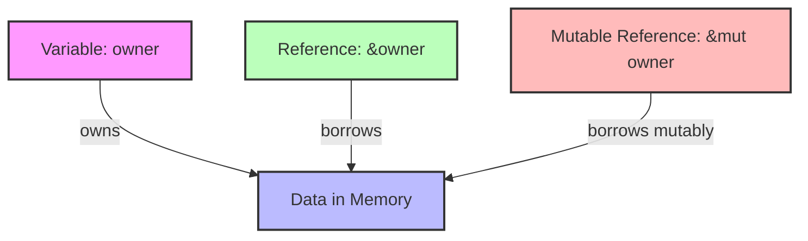

# Rust Memory Safety

## Introduction

Memory safety is a critical aspect of programming that many languages struggle with. Traditional systems programming languages like C and C++ offer manual memory management, which provides control but can lead to bugs like segmentation faults, use-after-free errors, and memory leaks. Higher-level languages like Python or JavaScript use garbage collection, which is safer but adds runtime overhead and unpredictability.

Rust takes a revolutionary approach: it ensures memory safety at compile time through its ownership system and borrow checker, without requiring a garbage collector. This means Rust programs are both safe and efficient, offering the performance of low-level languages with the safety of high-level ones.

In this guide, we'll explore how Rust achieves memory safety, why it matters, and how to work with Rust's memory model.

## Why Memory Safety Matters

Before diving into Rust's approach, let's understand some common memory-related issues in programming:

1. **Dangling pointers**: References to memory that has been freed
2. **Double free**: Attempting to free memory that's already been freed
3. **Memory leaks**: Allocating memory that is never freed
4. **Buffer overflows**: Writing beyond the bounds of allocated memory
5. **Data races**: Multiple threads accessing the same memory concurrently without proper synchronization

These issues can lead to crashes, security vulnerabilities, and unpredictable behavior. Rust's memory safety guarantees prevent all of these problems at compile time.

## Rust's Ownership System

At the heart of Rust's memory safety is its ownership system. This consists of three key concepts:

1. Ownership
2. Borrowing
3. Lifetimes

Let's explore each one.

### Ownership Rules

Rust's ownership system follows three fundamental rules:

1. Each value in Rust has a variable that is its **owner**.
2. There can only be **one owner** at a time.
3. When the owner goes out of scope, the value will be **dropped** (freed).

Let's see ownership in action:

```rust
fn main() {
    // s1 is the owner of the String
    let s1 = String::from("hello");
    
    // Ownership moves from s1 to s2
    let s2 = s1;
    
    // This would cause an error! s1 no longer owns the String
    // println!("{}", s1); // ❌ Error: value borrowed after move
    
    // This works fine because s2 is the current owner
    println!("{}", s2); // ✅ Output: hello
    
    // When main ends, s2 goes out of scope and the String is freed
}
```

When we assign `s1` to `s2`, the ownership of the String moves to `s2`, and `s1` is no longer valid. This prevents potential issues like double frees and use-after-free errors.

### Copying vs. Moving

For simple types that have a known size at compile time (like integers, booleans, etc.), Rust makes a copy instead of moving ownership:

```rust
fn main() {
    let x = 5;
    let y = x;
    
    // Both are valid because integers are copied, not moved
    println!("x = {}, y = {}", x, y); // ✅ Output: x = 5, y = 5
}
```

These types implement the `Copy` trait, which tells Rust to copy the value instead of moving ownership.

### Functions and Ownership

When you pass a value to a function, ownership is transferred to the function parameter:

```rust
fn main() {
    let s = String::from("hello");
    
    take_ownership(s);
    
    // Error! s is no longer valid here
    // println!("{}", s); // ❌ Error: value borrowed after move
}

fn take_ownership(some_string: String) {
    println!("{}", some_string); // ✅ Output: hello
    // some_string goes out of scope and is freed
}
```

If you want to use a value after passing it to a function, you have several options:

1. Return the value from the function
2. Pass a reference instead (borrowing)
3. Make a clone of the value

### Returning Ownership

Functions can return ownership:

```rust
fn main() {
    let s1 = String::from("hello");
    
    let s2 = take_and_give_back(s1);
    
    // s1 is invalid, but s2 is valid
    println!("{}", s2); // ✅ Output: hello
}

fn take_and_give_back(some_string: String) -> String {
    // Returns ownership back to the caller
    some_string
}
```

## Borrowing

Passing ownership back and forth can be tedious. Instead, Rust allows you to borrow values by passing references:

```rust
fn main() {
    let s1 = String::from("hello");
    
    // Pass a reference to s1
    let len = calculate_length(&s1);
    
    // s1 is still valid here!
    println!("The length of '{}' is {}.", s1, len); // ✅ Output: The length of 'hello' is 5.
}

fn calculate_length(s: &String) -> usize {
    s.len()
    // s goes out of scope, but it doesn't have ownership,
    // so nothing happens to the String
}
```

References are immutable by default, meaning you can't modify the borrowed value:

```rust
fn main() {
    let s = String::from("hello");
    
    change(&s); // This won't compile
}

fn change(s: &String) {
    s.push_str(", world"); // ❌ Error: cannot borrow as mutable
}
```

### Mutable References

To modify a borrowed value, you need a mutable reference:

```rust
fn main() {
    let mut s = String::from("hello");
    
    change(&mut s);
    
    println!("{}", s); // ✅ Output: hello, world
}

fn change(s: &mut String) {
    s.push_str(", world");
}
```

However, mutable references come with restrictions:

1. You can have only **one** mutable reference to a value at a time.
2. You cannot have a mutable reference while you have immutable references.

These restrictions prevent data races at compile time!

```rust
fn main() {
    let mut s = String::from("hello");
    
    let r1 = &mut s;
    let r2 = &mut s; // ❌ Error: cannot borrow `s` as mutable more than once
    
    println!("{}, {}", r1, r2);
}
```

```rust
fn main() {
    let mut s = String::from("hello");
    
    let r1 = &s; // immutable borrow
    let r2 = &s; // immutable borrow
    let r3 = &mut s; // ❌ Error: cannot borrow `s` as mutable because it is also borrowed as immutable
    
    println!("{}, {}, and {}", r1, r2, r3);
}
```

### Dangling References

Rust prevents dangling references at compile time:

```rust
fn main() {
    let reference_to_nothing = dangle();
}

fn dangle() -> &String { // ❌ Error: missing lifetime specifier
    let s = String::from("hello");
    &s // we're returning a reference to s, but s goes out of scope!
}
```

The compiler catches this error because the value `s` would be dropped when the function ends, leaving a reference to invalid memory.

## The Slice Type

Slices are another way to reference a contiguous sequence of elements without taking ownership:

```rust
fn main() {
    let s = String::from("hello world");
    
    // Create a slice that references part of the string
    let hello = &s[0..5];
    let world = &s[6..11];
    
    println!("{} {}", hello, world); // ✅ Output: hello world
}
```

String literals are actually slices:

```rust
let s: &str = "Hello, world!";
```

This is why string literals are immutable—`&str` is an immutable reference.

## Visual Representation of Ownership and Borrowing

Here's a diagram showing how ownership and borrowing work in Rust:



## Practical Examples

### Example 1: String Processing

Let's create a function that takes a string and returns the first word:

```rust
fn first_word(s: &str) -> &str {
    let bytes = s.as_bytes();
    
    for (i, &item) in bytes.iter().enumerate() {
        if item == b' ' {
            return &s[0..i];
        }
    }
    
    &s[..]
}

fn main() {
    let my_string = String::from("Hello world");
    
    // Works on both String and &str
    let word = first_word(&my_string);
    println!("First word: {}", word); // ✅ Output: First word: Hello
    
    let my_string_literal = "Hello world";
    let word = first_word(my_string_literal);
    println!("First word: {}", word); // ✅ Output: First word: Hello
}
```

Notice that we used `&str` instead of `&String` as the parameter. This is more flexible since both `String` and string literals can be converted to `&str`.

### Example 2: Vector Management

Here's an example of managing a vector of integers:

```rust
fn main() {
    // Create a new vector
    let mut numbers = vec![1, 2, 3, 4, 5];
    
    // Pass reference to print_vector
    print_vector(&numbers);
    
    // Pass mutable reference to add_one
    add_one(&mut numbers);
    
    // Vector is still valid and modified
    print_vector(&numbers);
}

fn print_vector(v: &Vec<i32>) {
    println!("Vector: {:?}", v);
}

fn add_one(v: &mut Vec<i32>) {
    for i in v {
        *i += 1;
    }
}
```

Output:
```
Vector: [1, 2, 3, 4, 5]
Vector: [2, 3, 4, 5, 6]
```

### Example 3: Custom Type with Drop Trait

Let's implement a simple custom type that demonstrates ownership and dropping:

```rust
struct CustomResource {
    name: String,
}

impl CustomResource {
    fn new(name: &str) -> CustomResource {
        println!("Creating resource: {}", name);
        CustomResource {
            name: String::from(name),
        }
    }
}

impl Drop for CustomResource {
    fn drop(&mut self) {
        println!("Dropping resource: {}", self.name);
    }
}

fn main() {
    let resource1 = CustomResource::new("Resource 1");
    
    {
        let resource2 = CustomResource::new("Resource 2");
        println!("Resource 2 is available in this scope");
        // resource2 gets dropped here
    }
    
    println!("Resource 1 is still available");
    // resource1 gets dropped at the end of main
}
```

Output:
```
Creating resource: Resource 1
Creating resource: Resource 2
Resource 2 is available in this scope
Dropping resource: Resource 2
Resource 1 is still available
Dropping resource: Resource 1
```

## Common Memory Safety Patterns in Rust

### 1. Cloning When Needed

If you need to keep data around after passing it to a function, you can clone it:

```rust
fn main() {
    let s1 = String::from("hello");
    
    // Create a deep copy
    let s2 = s1.clone();
    
    takes_ownership(s1);
    
    // s2 is still valid
    println!("{}", s2); // ✅ Output: hello
}

fn takes_ownership(s: String) {
    println!("{}", s);
}
```

### 2. Using Scopes to Control Lifetimes

```rust
fn main() {
    let mut data = String::from("Hello");
    
    {
        // Mutable borrow starts here
        let mutable_ref = &mut data;
        mutable_ref.push_str(", world");
        // Mutable borrow ends here
    }
    
    // Now we can borrow immutably
    let r1 = &data;
    let r2 = &data;
    println!("{} and {}", r1, r2); // ✅ Output: Hello, world and Hello, world
}
```

### 3. Moving Out of Closures

```rust
fn main() {
    let list = vec![1, 2, 3];
    println!("Before closure: {:?}", list);
    
    // The closure takes ownership of list
    let only_borrows = || {
        println!("From closure: {:?}", list);
    };
    
    // We can still use list here
    only_borrows();
    println!("After closure: {:?}", list); // ✅ Output: After closure: [1, 2, 3]
    
    // This closure takes ownership
    let consumes = move || {
        println!("Consuming: {:?}", list);
    };
    
    consumes();
    // Cannot use list anymore
    // println!("After consuming: {:?}", list); // ❌ Error: value borrowed after move
}
```

## Summary

Rust's approach to memory safety is built on three key principles:

1. **Ownership**: Each value has exactly one owner, and when the owner goes out of scope, the value is dropped.
2. **Borrowing**: References allow you to use values without taking ownership, either immutably (multiple allowed) or mutably (only one at a time).
3. **Lifetimes**: The compiler tracks how long references are valid to prevent dangling references.

These mechanisms ensure memory safety without runtime overhead, giving Rust programs both safety and performance. The compiler's borrow checker enforces these rules at compile time, preventing common memory-related bugs and security vulnerabilities.

What makes Rust unique is that it achieves memory safety without a garbage collector. This makes it suitable for systems programming, embedded development, and other performance-critical applications where predictable resource usage is important.

## Additional Resources

- [The Rust Book - Understanding Ownership](https://doc.rust-lang.org/book/ch04-00-understanding-ownership.html)
- [The Rust Book - References and Borrowing](https://doc.rust-lang.org/book/ch04-02-references-and-borrowing.html)
- [Rust By Example - Ownership and Moves](https://doc.rust-lang.org/rust-by-example/scope/move.html)
- [The Rust Reference - Memory Model](https://doc.rust-lang.org/reference/memory-model.html)

## Exercises

1. **Basic Ownership**: Write a function that takes a String, modifies it, and returns it. Call this function multiple times with the same variable.

2. **Borrowing Challenge**: Create a function that takes a vector of strings by reference and returns the longest string without taking ownership.

3. **Mutable References**: Write a program that maintains a list of tasks. Implement functions to add a task, mark a task as complete, and print all tasks. Use appropriate borrowing.

4. **Dangling Reference**: Try to create a function that returns a dangling reference, observe the compiler error, and then fix it.

5. **Lifetimes**: Implement a function that takes two string slices and returns the longer one. Add the necessary lifetime annotations.

6. **Custom Type**: Create a struct that contains a String field. Implement methods to modify the string and to print it. Ensure proper borrowing in your implementation.

Happy coding with Rust's memory safety features!