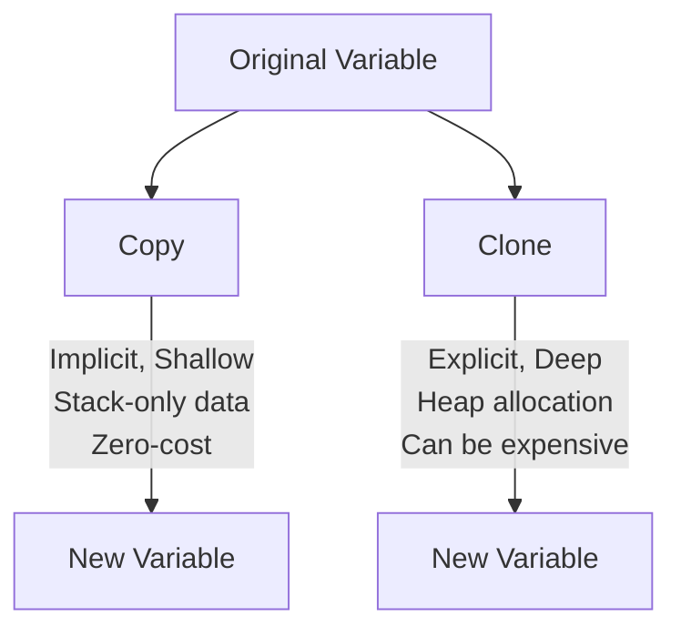

# Rust Copy and Clone

When learning Rust, understanding how data is moved, copied, and cloned is fundamental to mastering the language's memory management system. In this tutorial, we'll explore Rust's `Copy` and `Clone` traits, which provide different ways to duplicate data.

## Introduction

In many programming languages, when you assign one variable to another, the data is implicitly copied. Rust takes a different approach with its ownership system:

- By default, Rust **moves** data from one variable to another
- For simple types, Rust can automatically **copy** data
- For complex types, you need to explicitly **clone** data

Let's understand each of these concepts and how they affect your Rust code.

## Ownership and Moving

Before diving into `Copy` and `Clone`, let's understand the default behavior in Rust.

```rust
fn main() {
    let s1 = String::from("hello");
    let s2 = s1;
    
    // The following line would cause a compile error
    // println!("{}", s1); 
    
    // This works fine
    println!("{}", s2);
}
```

**Output:**
```
hello
```

In the example above, when we assign `s1` to `s2`, Rust **moves** the ownership of the data from `s1` to `s2`. After the move, `s1` is no longer valid. This prevents multiple variables from trying to free the same memory when they go out of scope, avoiding a "double free" error.

## The Copy Trait

Some types in Rust are simple enough that they don't need complex memory management. These types implement the `Copy` trait.

When a type implements `Copy`, the value is copied rather than moved during assignment:

```rust
fn main() {
    let x = 5;
    let y = x;
    
    // Both x and y are valid here
    println!("x = {}, y = {}", x, y);
}
```

**Output:**
```
x = 5, y = 5
```

### Types That Implement Copy

Types that implement `Copy` include:

- All integer types (`i32`, `u64`, etc.)
- Boolean type (`bool`)
- Floating point types (`f32`, `f64`)
- Character type (`char`)
- Tuples if they only contain types that also implement `Copy`
- Arrays of fixed size containing `Copy` types
- Immutable references (`&T`)

### Implementing Copy for Your Types

You can implement `Copy` for your own types using the derive attribute:

```rust
#[derive(Copy, Clone)]
struct Point {
    x: i32,
    y: i32,
}

fn main() {
    let p1 = Point { x: 10, y: 20 };
    let p2 = p1;
    
    // Both p1 and p2 are valid
    println!("p1: ({}, {}), p2: ({}, {})", p1.x, p1.y, p2.x, p2.y);
}
```

**Output:**
```
p1: (10, 20), p2: (10, 20)
```

Note that:
- `Copy` requires that the type also implements `Clone`
- Types that implement `Drop` cannot implement `Copy`
- Types that contain references to owned data (like `String` or `Vec`) cannot implement `Copy`

## The Clone Trait

For more complex types where a simple bit-by-bit copy isn't appropriate, Rust provides the `Clone` trait. Unlike `Copy`, which happens implicitly, `Clone` must be called explicitly using the `.clone()` method.

```rust
fn main() {
    let s1 = String::from("hello");
    let s2 = s1.clone();
    
    // Both s1 and s2 are valid here
    println!("s1 = {}, s2 = {}", s1, s2);
}
```

**Output:**
```
s1 = hello, s2 = hello
```

### When to Use Clone

You should use `clone()` when:

1. You need a duplicate of complex data
2. You want to prevent a value from being moved
3. You need to pass ownership to multiple functions

### Performance Considerations

While `clone()` is convenient, it comes with performance implications:

- `Clone` can involve deep copying of data
- For complex structures, this may involve allocating new memory
- Excessive cloning can lead to performance bottlenecks

## Copy vs. Clone: A Visual Comparison

Let's visualize the difference between `Copy` and `Clone`:



## Practical Examples

### Example 1: Function Arguments

```rust
fn print_string(s: String) {
    println!("{}", s);
    // s is dropped here
}

fn main() {
    let name = String::from("Rust");
    
    // This would move ownership of name
    print_string(name.clone());
    
    // We can still use name here because we cloned it
    println!("I'm learning {}", name);
}
```

**Output:**
```
Rust
I'm learning Rust
```

### Example 2: Returning Values

```rust
fn process_data(data: Vec<i32>) -> (Vec<i32>, i32) {
    let sum: i32 = data.iter().sum();
    // Return both the original data and the computed sum
    (data, sum)
}

fn main() {
    let numbers = vec![1, 2, 3, 4, 5];
    let (original_data, sum) = process_data(numbers);
    
    println!("Original data: {:?}", original_data);
    println!("Sum: {}", sum);
}
```

**Output:**
```
Original data: [1, 2, 3, 4, 5]
Sum: 15
```

### Example 3: Working with Complex Structures

```rust
#[derive(Clone)]
struct User {
    id: u32,
    name: String,
    email: String,
}

fn main() {
    let user = User {
        id: 1,
        name: String::from("John Doe"),
        email: String::from("john@example.com"),
    };
    
    // Create a backup
    let user_backup = user.clone();
    
    // Modify the original
    let mut modified_user = user;
    modified_user.email = String::from("johndoe@example.com");
    
    println!("Original user: {} ({})", user_backup.name, user_backup.email);
    println!("Modified user: {} ({})", modified_user.name, modified_user.email);
}
```

**Output:**
```
Original user: John Doe (john@example.com)
Modified user: John Doe (johndoe@example.com)
```

## Real-World Application: Caching

Here's a more advanced example showing how `Clone` can be used in a simple caching system:

```rust
use std::collections::HashMap;

#[derive(Clone)]
struct CacheEntry {
    data: String,
    timestamp: u64,
}

struct Cache {
    entries: HashMap<String, CacheEntry>,
}

impl Cache {
    fn new() -> Self {
        Cache {
            entries: HashMap::new(),
        }
    }
    
    fn insert(&mut self, key: String, data: String, timestamp: u64) {
        let entry = CacheEntry { data, timestamp };
        self.entries.insert(key, entry);
    }
    
    fn get(&self, key: &str) -> Option<CacheEntry> {
        // Return a clone of the entry if it exists
        self.entries.get(key).cloned()
    }
}

fn main() {
    let mut cache = Cache::new();
    
    // Insert data into cache
    cache.insert(
        "user:1".to_string(),
        "John Doe".to_string(),
        1677849600
    );
    
    // Get data from cache
    if let Some(entry) = cache.get("user:1") {
        println!("Found cached data: {} (timestamp: {})", 
                 entry.data, entry.timestamp);
    }
    
    // The original data is still in the cache
    if let Some(entry) = cache.get("user:1") {
        println!("Data is still in cache: {}", entry.data);
    }
}
```

**Output:**
```
Found cached data: John Doe (timestamp: 1677849600)
Data is still in cache: John Doe
```

## Copy/Clone Best Practices

1. **Use `Copy` for simple types:**
   - For small, stack-allocated data structures
   - When a bitwise copy is sufficient

2. **Use `Clone` for complex types:**
   - When deep copying is needed
   - For types that own heap resources

3. **Consider alternatives before cloning:**
   - Use references when possible
   - Consider borrowing instead of taking ownership
   - Use smart pointers like `Rc` or `Arc` for shared ownership

4. **Be aware of performance:**
   - Cloning large structures can be expensive
   - Look for ways to avoid unnecessary clones

## Summary

In Rust:

- **Ownership and moves** are the default behavior
- **Copy** provides implicit, shallow copying for simple types
- **Clone** enables explicit, deep copying for complex types

Understanding when to use each is crucial for writing efficient and correct Rust code. By mastering these concepts, you'll be well on your way to becoming proficient in Rust's memory management system.

## Exercises

1. Create a struct that contains both `Copy` and non-`Copy` types. Can it implement `Copy`?
2. Write a function that takes a vector and returns both the vector and its length without cloning.
3. Modify the caching example to add an expiry mechanism that returns `None` for expired cache entries.

## Additional Resources

- [Rust Book: Copy and Clone Types](https://doc.rust-lang.org/book/ch04-01-what-is-ownership.html#stack-only-data-copy)
- [Rust Standard Library: Clone Trait](https://doc.rust-lang.org/std/clone/trait.Clone.html)
- [Rust Standard Library: Copy Trait](https://doc.rust-lang.org/std/marker/trait.Copy.html)
- [Rust by Example: Copy Types](https://doc.rust-lang.org/rust-by-example/trait/clone.html)