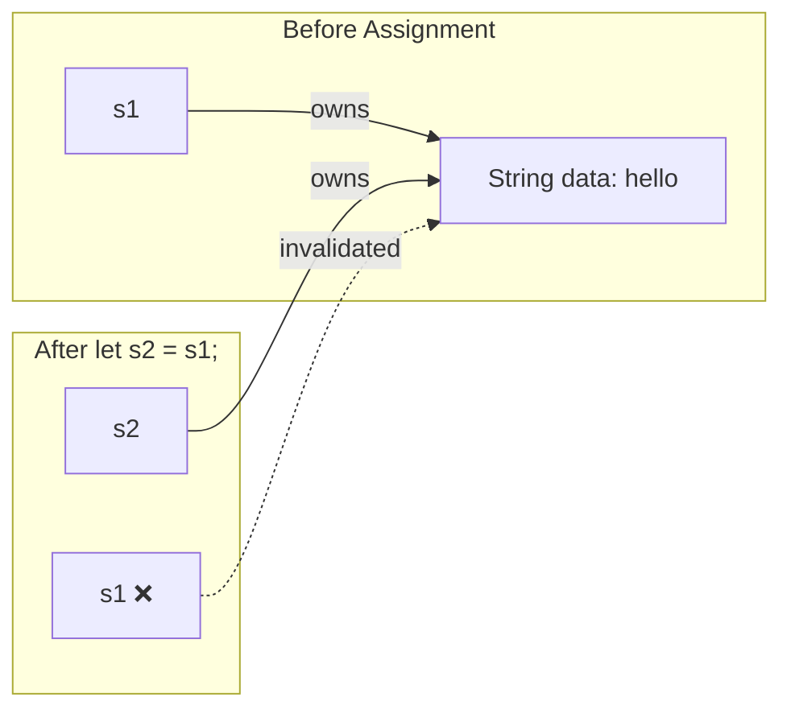

# Rust Move Semantics

## Introduction

One of Rust's most distinctive features is its ownership system, which manages memory without a garbage collector. At the heart of this system is a concept called **move semantics**. Unlike many other programming languages where variables are copied by default, Rust "moves" values from one variable to another when assigned or passed to functions.

Move semantics is a crucial concept to understand because it directly affects how you write Rust code and how your data is handled in memory. This approach helps Rust guarantee memory safety at compile time while still allowing for efficient performance.

## Understanding Ownership in Rust

Before diving into move semantics, let's review the core principles of Rust's ownership system:

1. Each value in Rust has a single owner variable
2. When the owner goes out of scope, the value is dropped (memory is freed)
3. Ownership can be transferred through moves

These rules form the foundation for understanding move semantics.

## What Are Move Semantics?

In Rust, when you assign a value from one variable to another or pass it to a function, the **ownership** of that value is transferred. This is called a "move" rather than a copy.

Let's look at a simple example:

```rust
fn main() {
    // s1 owns the String value
    let s1 = String::from("hello");
    
    // Ownership moves from s1 to s2
    let s2 = s1;
    
    // This would cause an error!
    // println!("{}", s1); // ❌ Error: value borrowed here after move
    
    // s2 can be used because it's the new owner
    println!("{}", s2); // ✅ Output: hello
}
```

After assigning `s1` to `s2`, the original variable `s1` can no longer be used. The ownership has been transferred to `s2`. This behavior prevents double-free errors and other memory safety issues.

## Move Semantics vs. Copy Semantics

Not all types in Rust use move semantics. Simple types like integers, floating-point numbers, booleans, and characters implement the `Copy` trait, which means they use **copy semantics** instead:

```rust
fn main() {
    let x = 5;
    let y = x;  // x is copied, not moved
    
    // Both variables are still usable
    println!("x = {}, y = {}", x, y);  // Output: x = 5, y = 5
}
```

Here's a comparison of types that are moved versus copied:

| Moved (Non-Copy Types)      | Copied (Copy Types)               |
|-----------------------------|-----------------------------------|
| `String`                      | Integers (i32, u64, etc.)         |
| `Vec<T>`                      | Floating-point (f32, f64)         |
| `HashMap<K, V>`               | Boolean (bool)                    |
| `Custom structs (by default)` | Characters (char)                 |
| `Box<T>`                      | Tuples (if all elements are Copy) |

## Visualizing Move Semantics

Let's visualize what happens in memory when a move occurs:



When a move happens, the compiler invalidates the original variable, preventing you from using it after the move.

## Function Parameters and Move Semantics

Move semantics also apply when passing values to functions:

```rust
fn main() {
    let s = String::from("hello");
    
    take_ownership(s);
    
    // Cannot use s anymore!
    // println!("{}", s); // ❌ Error: value borrowed here after move
}

fn take_ownership(some_string: String) {
    println!("{}", some_string);
    // some_string is dropped when function ends
}
```

In this example, the ownership of the String is transferred to the `take_ownership` function. After calling the function, `s` is no longer valid in the `main` function.

## Returning Ownership

Functions can also return ownership, allowing you to get back values:

```rust
fn main() {
    let s1 = String::from("hello");
    
    let s2 = take_and_give_back(s1);
    
    // s1 is invalid, but s2 is valid
    println!("{}", s2); // Output: hello
}

fn take_and_give_back(a_string: String) -> String {
    // This function takes ownership and returns it
    a_string
}
```

## Using Moves in Real-World Code

Let's explore some practical examples of move semantics in action:

### Example 1: Vector Management

```rust
fn main() {
    let mut data = vec![1, 2, 3, 4, 5];
    
    // The vector is moved to the process_vector function
    let processed_data = process_vector(data);
    
    // Now we use the processed_data instead of the original
    println!("Processed data: {:?}", processed_data); // Output: Processed data: [2, 4, 6, 8, 10]
}

fn process_vector(mut vec: Vec<i32>) -> Vec<i32> {
    // Double each value in the vector
    for item in &mut vec {
        *item *= 2;
    }
    
    // Return ownership of the modified vector
    vec
}
```

### Example 2: Resource Management with Move Semantics

```rust
struct Database {
    connection_string: String,
    // Other fields...
}

impl Database {
    fn new(conn_str: String) -> Database {
        println!("Opening database connection to: {}", conn_str);
        Database {
            connection_string: conn_str,
        }
    }
}

// When Database goes out of scope, it will be dropped automatically
impl Drop for Database {
    fn drop(&mut self) {
        println!("Closing database connection to: {}", self.connection_string);
    }
}

fn main() {
    let conn = String::from("postgres://localhost:5432/mydb");
    
    {
        // Create a new scope to demonstrate the Drop trait
        let db = Database::new(conn);
        
        // conn has been moved, cannot use it anymore
        // println!("{}", conn); // ❌ Error
        
        // Do some database operations...
        println!("Performing database operations...");
    } // db goes out of scope here and its drop method is called
    
    println!("Database connection has been closed");
}
```

Output:
```
Opening database connection to: postgres://localhost:5432/mydb
Performing database operations...
Closing database connection to: postgres://localhost:5432/mydb
Database connection has been closed
```

This example demonstrates how move semantics helps with resource management - the connection string is moved into the Database struct, ensuring it lives as long as needed.

## Avoiding Moves: Cloning and Borrowing

If you need to keep using a value after transferring it, you have two main options:

### 1. Cloning (Making a Deep Copy)

```rust
fn main() {
    let s1 = String::from("hello");
    
    // Create a deep copy of s1 by cloning it
    let s2 = s1.clone();
    
    // Both variables are valid
    println!("s1 = {}, s2 = {}", s1, s2); // Output: s1 = hello, s2 = hello
}
```

Cloning creates a new copy of the data in memory, which allows both variables to own their own data. However, this can be less efficient for large data structures.

### 2. Borrowing (Using References)

```rust
fn main() {
    let s1 = String::from("hello");
    
    // This function borrows s1 but doesn't take ownership
    print_string(&s1);
    
    // s1 can still be used here
    println!("Original: {}", s1); // Output: Original: hello
}

fn print_string(s: &String) {
    println!("Borrowed: {}", s); // Output: Borrowed: hello
}
```

Borrowing with references is a fundamental concept in Rust that works alongside move semantics to provide memory safety without sacrificing performance.

## Common Patterns with Move Semantics

Here are some common patterns you'll see in Rust code:

### Pattern 1: Taking Ownership and Returning a Result

```rust
fn main() {
    let text = String::from("hello world");
    
    // Word count takes ownership of text and returns a result
    let count = word_count(text);
    
    println!("Word count: {}", count); // Output: Word count: 2
}

fn word_count(s: String) -> usize {
    s.split_whitespace().count()
}
```

### Pattern 2: Moving into Closures

```rust
fn main() {
    let list = vec![1, 2, 3];
    
    // The closure takes ownership of list
    let closure = move || {
        println!("List inside closure: {:?}", list);
    };
    
    // list can no longer be used here
    // println!("{:?}", list); // ❌ Error
    
    // But we can call the closure which now owns list
    closure(); // Output: List inside closure: [1, 2, 3]
}
```

The `move` keyword forces the closure to take ownership of the values it uses from the environment.

### Pattern 3: Builder Pattern

```rust
struct EmailBuilder {
    to: Option<String>,
    subject: Option<String>,
    body: Option<String>,
}

impl EmailBuilder {
    fn new() -> EmailBuilder {
        EmailBuilder {
            to: None,
            subject: None,
            body: None,
        }
    }
    
    // Each method takes ownership of self and returns ownership back
    fn to(mut self, to: String) -> Self {
        self.to = Some(to);
        self
    }
    
    fn subject(mut self, subject: String) -> Self {
        self.subject = Some(subject);
        self
    }
    
    fn body(mut self, body: String) -> Self {
        self.body = Some(body);
        self
    }
    
    fn build(self) -> Result<Email, String> {
        let to = self.to.ok_or("'To' field is required")?;
        let subject = self.subject.ok_or("'Subject' field is required")?;
        let body = self.body.ok_or("'Body' field is required")?;
        
        Ok(Email { to, subject, body })
    }
}

struct Email {
    to: String,
    subject: String,
    body: String,
}

fn main() {
    let email = EmailBuilder::new()
        .to(String::from("friend@example.com"))
        .subject(String::from("Hello!"))
        .body(String::from("How are you doing?"))
        .build();
    
    match email {
        Ok(e) => println!("Email created to: {}", e.to),
        Err(err) => println!("Error: {}", err),
    }
}
```

In this builder pattern example, each method takes ownership of `self` and returns it, allowing for method chaining while leveraging move semantics.

## Common Pitfalls and Solutions

### Pitfall 1: Using a Moved Value

```rust
fn main() {
    let s1 = String::from("hello");
    let s2 = s1;
    
    // ❌ This won't compile
    // println!("{}", s1);
}
```

**Solution**: Either clone the value if you need to use it in multiple places, or use a reference if you just need to read it:

```rust
fn main() {
    let s1 = String::from("hello");
    let s2 = s1.clone();  // Clone approach
    
    println!("s1: {}, s2: {}", s1, s2);
    
    // Alternative: reference approach
    let s3 = String::from("hello");
    let s4 = &s3;  // Borrow rather than move
    
    println!("s3: {}, s4: {}", s3, s4);
}
```

### Pitfall 2: Partial Moves

```rust
fn main() {
    let person = ("John", String::from("Doe"));
    
    // The String part is moved out, but the &str remains
    let last_name = person.1;
    
    // ❌ Can't use the entire tuple anymore
    // println!("{:?}", person);
    
    // ✅ But you can still use parts that weren't moved
    println!("First name: {}", person.0);
}
```

**Solution**: Be aware of partial moves and either clone values or restructure your code:

```rust
fn main() {
    let person = ("John", String::from("Doe"));
    
    // Clone the string instead of moving it
    let last_name = person.1.clone();
    
    // Now the whole tuple is still usable
    println!("{:?}", person);
}
```

## Summary

Rust's move semantics is a powerful feature that:

- Ensures memory safety without a garbage collector
- Prevents common bugs like use-after-free and double-free errors
- Makes ownership explicit in your code
- Enables efficient memory management

Key points to remember:

1. Assignment in Rust transfers ownership by default (moves)
2. After a move, the original variable can't be used
3. Types with the `Copy` trait are copied instead of moved
4. You can use `.clone()` to create a deep copy of a value
5. References (`&`) allow you to borrow values without taking ownership

Understanding move semantics is essential for writing effective Rust code and is the foundation for more advanced concepts like borrowing and lifetimes.

## Exercises

1. Create a function that takes a vector, transforms its contents, and returns both the original vector and the transformed one. How would you handle ownership?

2. Implement a custom struct with some fields and experiment with moving it between variables. Add the `#[derive(Clone)]` attribute and compare the behavior.

3. Write a program that demonstrates the difference between move semantics with `String` and copy semantics with primitives like `i32`.

## Additional Resources

- [Rust Book: Ownership Chapter](https://doc.rust-lang.org/book/ch04-00-understanding-ownership.html)
- [Rust By Example: Ownership and Moves](https://doc.rust-lang.org/rust-by-example/scope/move.html)
- [Rust Playground](https://play.rust-lang.org/) - Try experimenting with move semantics online
- [The Rustonomicon](https://doc.rust-lang.org/nomicon/ownership.html) - For more advanced understanding