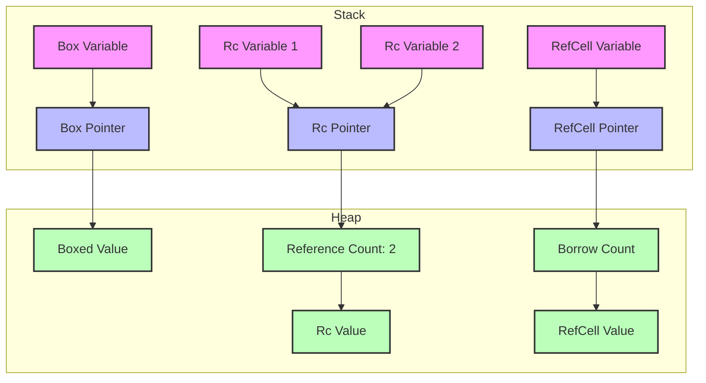

# Rust Smart Pointers

## Introduction

In Rust, a smart pointer is a data structure that acts like a pointer but also has additional metadata and capabilities. Unlike regular references that only borrow data, smart pointers often own the data they point to. They implement memory management strategies that go beyond Rust's basic borrowing rules, giving you more flexibility while maintaining memory safety.

Smart pointers in Rust are different from pointers in languages like C++ because they're designed to be safe. The Rust compiler ensures that smart pointers don't create memory leaks, dangling references, or data races, making them powerful tools for memory management.

## Why Do We Need Smart Pointers?

Before diving into specific smart pointers, let's understand why they're necessary:

1. **Heap Allocation**: When you need to store data with an unknown size at compile time or a size that might change
2. **Ownership Sharing**: When multiple parts of your code need to own the same data
3. **Interior Mutability**: When you need to mutate data even when there are immutable references to that data
4. **Recursive Data Structures**: When you need to create data structures like trees or linked lists

## Common Smart Pointers in Rust

Let's explore the most commonly used smart pointers in Rust:

### Box\<T\>: Heap Allocation

`Box<T>` is the simplest smart pointer in Rust. It stores data on the heap rather than the stack.

#### When to use Box\<T\>:

- When you have data with a size unknown at compile time
- When you have a large amount of data and want to transfer ownership without copying
- When you want to own a value of trait type (trait objects)
- When implementing recursive data structures

#### Basic Example:

```rust
fn main() {
    // Create a Box pointing to a value on the heap
    let box_integer = Box::new(5);
    println!("Box contains: {}", box_integer);
    
    // The value is automatically freed when the box goes out of scope
}
```

**Output:**
```
Box contains: 5
```

#### Example: Recursive Data Structure

Without `Box`, this would be impossible because Rust can't determine the size of a recursive type at compile time:

```rust
// This wouldn't work without Box
enum List {
    Cons(i32, Box<List>),
    Nil,
}

fn main() {
    // Create a linked list: 1 -> 2 -> 3 -> Nil
    let list = List::Cons(1, Box::new(
        List::Cons(2, Box::new(
            List::Cons(3, Box::new(List::Nil))
        ))
    ));
    
    // Use the list...
}
```

### Rc\<T\>: Reference Counted Smart Pointer

`Rc<T>` (Reference Counting) allows multiple ownership of the same data. It keeps track of the number of references to a value and cleans up the value when no references remain.

#### When to use Rc\<T\>:

- When data needs to be shared between multiple parts of your program
- When you don't know at compile time which part will be the last to use the data
- When you need to share ownership in a single-threaded context (Rc is not thread-safe)

#### Example: Sharing Data Between Multiple Variables

```rust
use std::rc::Rc;

fn main() {
    // Create a reference-counted string
    let original = Rc::new(String::from("Hello, Rust!"));
    println!("Reference count after creation: {}", Rc::strong_count(&original));
    
    // Create a clone (increases the reference count, doesn't copy the data)
    let clone1 = Rc::clone(&original);
    println!("Reference count after clone1: {}", Rc::strong_count(&original));
    
    // Create another clone
    let clone2 = Rc::clone(&original);
    println!("Reference count after clone2: {}", Rc::strong_count(&original));
    
    // Print the values
    println!("Original: {}", original);
    println!("Clone 1: {}", clone1);
    println!("Clone 2: {}", clone2);
    
    // When clone2 goes out of scope, the count decreases by 1
    drop(clone2);
    println!("Reference count after dropping clone2: {}", Rc::strong_count(&original));
    
    // When clone1 goes out of scope, the count decreases by 1
    drop(clone1);
    println!("Reference count after dropping clone1: {}", Rc::strong_count(&original));
    
    // When original goes out of scope, the count becomes 0 and the memory is freed
}
```

**Output:**
```
Reference count after creation: 1
Reference count after clone1: 2
Reference count after clone2: 3
Original: Hello, Rust!
Clone 1: Hello, Rust!
Clone 2: Hello, Rust!
Reference count after dropping clone2: 2
Reference count after dropping clone1: 1
```

### RefCell\<T\>: Interior Mutability

`RefCell<T>` allows you to mutate data even when there are immutable references to that data, through a pattern called "interior mutability." Unlike `Box<T>` and `Rc<T>`, `RefCell<T>` enforces borrowing rules at runtime instead of compile time.

#### When to use RefCell\<T\>:

- When you need to mutate data that's behind an immutable reference
- When you're certain your code follows borrowing rules but the compiler can't verify it
- In combination with `Rc<T>` to create data that can be shared and mutated

#### Example: Mutating Data Through an Immutable Reference

```rust
use std::cell::RefCell;

fn main() {
    // Create a RefCell containing a value
    let data = RefCell::new(5);
    
    // Create an immutable reference
    let reference = &data;
    
    // Even though we only have an immutable reference,
    // we can mutate the value inside the RefCell
    println!("Before mutation: {:?}", reference.borrow());
    
    // Mutate the value
    *reference.borrow_mut() += 10;
    
    // See the updated value
    println!("After mutation: {:?}", reference.borrow());
}
```

**Output:**
```
Before mutation: 5
After mutation: 15
```

#### Example: Combining Rc and RefCell

A common pattern in Rust is to combine `Rc<T>` and `RefCell<T>` to create data that can be shared and mutated:

```rust
use std::rc::Rc;
use std::cell::RefCell;

fn main() {
    // Create a value that is both shared and mutable
    let shared_mutable_data = Rc::new(RefCell::new(vec![1, 2, 3]));
    
    // Create a clone of the reference
    let data_clone = Rc::clone(&shared_mutable_data);
    
    // Modify the original data through the shared reference
    shared_mutable_data.borrow_mut().push(4);
    
    // Modify the data through the cloned reference
    data_clone.borrow_mut().push(5);
    
    // Both references see all modifications
    println!("Shared data: {:?}", shared_mutable_data.borrow());
    println!("Cloned data: {:?}", data_clone.borrow());
}
```

**Output:**
```
Shared data: [1, 2, 3, 4, 5]
Cloned data: [1, 2, 3, 4, 5]
```

## Visual Representation of Smart Pointers

Let's visualize how these smart pointers relate to memory:



## Smart Pointer Traits

Smart pointers in Rust are implemented using traits. The key traits that make a type act like a smart pointer are:

1. **Deref**: Allows a smart pointer to be dereferenced with the `*` operator
2. **Drop**: Customizes what happens when a value goes out of scope

### Implementing Deref

Here's a simple example of implementing the `Deref` trait:

```rust
use std::ops::Deref;

// A basic smart pointer type
struct MyBox<T>(T);

impl<T> MyBox<T> {
    fn new(x: T) -> MyBox<T> {
        MyBox(x)
    }
}

// Implement Deref to make MyBox behave like a reference
impl<T> Deref for MyBox<T> {
    type Target = T;
    
    fn deref(&self) -> &Self::Target {
        &self.0
    }
}

fn main() {
    let x = 5;
    let y = MyBox::new(x);
    
    // Because we implemented Deref, we can use * to access the value
    assert_eq!(5, *y);
    println!("Value inside MyBox: {}", *y);
}
```

**Output:**
```
Value inside MyBox: 5
```

### Implementing Drop

The `Drop` trait lets you customize what happens when a value goes out of scope:

```rust
struct CustomSmartPointer {
    data: String,
}

impl Drop for CustomSmartPointer {
    fn drop(&mut self) {
        println!("Dropping CustomSmartPointer with data `{}`!", self.data);
    }
}

fn main() {
    let c = CustomSmartPointer {
        data: String::from("my stuff"),
    };
    let d = CustomSmartPointer {
        data: String::from("other stuff"),
    };
    println!("CustomSmartPointers created.");
    // c and d go out of scope here, and drop() is called
}
```

**Output:**
```
CustomSmartPointers created.
Dropping CustomSmartPointer with data `other stuff`!
Dropping CustomSmartPointer with data `my stuff`!
```

## Real-World Application: Caching System

Let's create a simple caching system using smart pointers that demonstrates their practical applications:

```rust
use std::rc::Rc;
use std::cell::RefCell;
use std::collections::HashMap;

// A simple cache implemented with Rc and RefCell
struct Cache {
    storage: RefCell<HashMap<String, Rc<String>>>,
}

impl Cache {
    fn new() -> Self {
        Cache {
            storage: RefCell::new(HashMap::new()),
        }
    }
    
    // Get a value from the cache, computing it if necessary
    fn get_or_insert<F>(&self, key: &str, compute_func: F) -> Rc<String>
    where
        F: FnOnce() -> String,
    {
        // First, try to get the value from the cache
        let mut storage = self.storage.borrow_mut();
        
        if !storage.contains_key(key) {
            // If not found, compute the value and store it
            let value = Rc::new(compute_func());
            storage.insert(key.to_string(), Rc::clone(&value));
            return value;
        }
        
        // Return a clone of the Rc pointer (not the value itself)
        Rc::clone(storage.get(key).unwrap())
    }
}

fn main() {
    let cache = Cache::new();
    
    // Expensive computation happens only once
    let value1 = cache.get_or_insert("key1", || {
        println!("Computing value for key1...");
        "Value for key1".to_string()
    });
    
    // Second retrieval uses the cached value
    let value2 = cache.get_or_insert("key1", || {
        println!("Computing value for key1 again...");
        "This won't be computed".to_string()
    });
    
    println!("Value1: {}", value1);
    println!("Value2: {}", value2);
    println!("Are they the same object? {}", Rc::ptr_eq(&value1, &value2));
    
    // Let's try a different key
    let value3 = cache.get_or_insert("key2", || {
        println!("Computing value for key2...");
        "Value for key2".to_string()
    });
    
    println!("Value3: {}", value3);
}
```

**Output:**
```
Computing value for key1...
Value1: Value for key1
Value2: Value for key1
Are they the same object? true
Computing value for key2...
Value3: Value for key2
```

In this example:

1. We use `RefCell` to allow mutation of the cache storage
2. We use `Rc` to share ownership of cached values
3. The compute function is only called when needed
4. Memory is automatically cleaned up when all references are dropped

## Summary

Smart pointers in Rust provide powerful memory management capabilities that extend beyond the basic borrowing rules:

- **Box\<T\>**: Allows heap allocation for data of unknown size or when ownership transfer is needed
- **Rc\<T\>**: Enables multiple ownership through reference counting
- **RefCell\<T\>**: Provides interior mutability when the borrowing rules need to be checked at runtime

These smart pointers can also be combined to create even more flexible memory management solutions. For example, `Rc<RefCell<T>>` allows for shared mutable data.

By understanding and using smart pointers appropriately, you can write Rust code that is both safe and flexible, taking advantage of Rust's memory safety guarantees while still implementing complex data structures and patterns.

## Exercises

Here are some exercises to practice your understanding of smart pointers:

1. Implement a binary tree data structure using `Box<T>`
2. Create a simple observer pattern using `Rc<T>` and `RefCell<T>`
3. Implement a custom smart pointer that counts the number of times it's dereferenced
4. Create a memoization function that caches previous results using smart pointers

## Additional Resources

- [Rust Book: Smart Pointers](https://doc.rust-lang.org/book/ch15-00-smart-pointers.html)
- [Rust By Example: Smart Pointers](https://doc.rust-lang.org/rust-by-example/std/box.html)
- [The Rust Standard Library Documentation](https://doc.rust-lang.org/std/index.html)
  - [Box](https://doc.rust-lang.org/std/boxed/struct.Box.html)
  - [Rc](https://doc.rust-lang.org/std/rc/struct.Rc.html)
  - [RefCell](https://doc.rust-lang.org/std/cell/struct.RefCell.html)