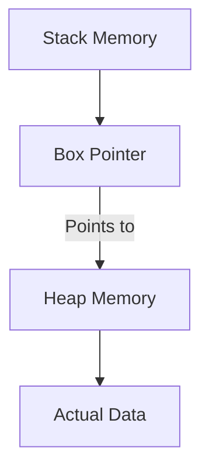

# Rust Box Type

## Introduction

In Rust, memory management is a critical concept that sets it apart from many other programming languages. Rather than relying on garbage collection or manual memory management, Rust uses a system of ownership with compile-time checks. One of the key tools in Rust's memory management arsenal is the `Box<T>` type, often simply called "Box".

A `Box<T>` is a smart pointer that allows you to store data on the heap rather than the stack. This simple concept opens up a world of possibilities and helps solve several common programming challenges.

## What is a Box?

At its core, a `Box<T>` is a pointer type that points to data stored on the heap. Let's break down what this means:

- **Stack vs Heap**: In Rust, data is stored either on the stack (fast, limited size, automatically managed) or the heap (slower, virtually unlimited size, manually managed).
- **Smart Pointer**: A Box is a smart pointer, meaning it's a data structure that acts like a pointer but also has additional metadata and capabilities.
- **Single Ownership**: Like most things in Rust, a Box follows ownership rules, with exactly one owner at a time.

Think of a Box like a physical box: it's a container that holds something for you, and when the box is discarded, its contents are also discarded.



## When to Use Box

Boxes are particularly useful in several scenarios:

1. **When you have data with an unknown size at compile time but need a known size**
2. **When you want to transfer ownership of a large amount of data without copying it**
3. **When you need to implement recursive data structures**
4. **When you want to implement trait objects**

Let's explore each of these use cases with examples.

## Basic Usage of Box

First, let's look at the basic syntax for creating and using a Box:

```rust
fn main() {
    // Creating a Box containing an integer
    let b = Box::new(5);
    
    // We can dereference the Box to use the value it points to
    println!("Value inside the box: {}", *b);
    
    // When b goes out of scope, both the Box and the data it
    // points to are freed
}
```

Output:
```
Value inside the box: 5
```

When we create a Box with `Box::new()`, we're allocating memory on the heap and storing our value there. The Box itself is a small structure on the stack that contains a pointer to our data on the heap.

## Heap Allocation for Large Data

One common use case for Box is when you want to ensure a large piece of data is stored on the heap:

```rust
struct LargeStruct {
    // Imagine this has many fields
    field1: [u8; 1000],
    field2: [u8; 1000],
    field3: [u8; 1000],
}

fn process_data(data: Box<LargeStruct>) {
    // Do something with data
    println!("Processing large data...");
    // data is automatically freed when this function ends
}

fn main() {
    // Create the large struct on the heap
    let large_data = Box::new(LargeStruct {
        field1: [0; 1000],
        field2: [0; 1000],
        field3: [0; 1000],
    });
    
    // Pass ownership of the Box (and data) without copying the large data
    process_data(large_data);
    
    // large_data is moved and can't be used here anymore
}
```

Output:
```
Processing large data...
```

In this example, we're able to pass a large structure to another function without having to copy its contents. Instead, we're just moving the Box, which is a small pointer.

## Recursive Data Structures

Boxes shine when implementing recursive data structures like linked lists or trees:

```rust
enum List {
    Nil,
    Cons(i32, Box<List>)
}

fn main() {
    // Creating a linked list: 1 -> 2 -> 3 -> Nil
    let list = List::Cons(1, Box::new(
        List::Cons(2, Box::new(
            List::Cons(3, Box::new(
                List::Nil
            ))
        ))
    ));
    
    // Let's print our list
    print_list(&list);
}

fn print_list(list: &List) {
    match list {
        List::Nil => println!("Nil"),
        List::Cons(value, next) => {
            print!("{} -> ", value);
            print_list(next);
        }
    }
}
```

Output:
```
1 -> 2 -> 3 -> Nil
```

Without using Box, this recursive structure wouldn't work because Rust wouldn't be able to determine the size of the List type at compile time. By using Box, we solve this problem because Box has a known size (it's just a pointer).


## Trait Objects

Boxes are commonly used with trait objects to enable polymorphism:

```rust
trait Animal {
    fn make_sound(&self);
}

struct Dog;
impl Animal for Dog {
    fn make_sound(&self) {
        println!("Woof!");
    }
}

struct Cat;
impl Animal for Cat {
    fn make_sound(&self) {
        println!("Meow!");
    }
}

fn main() {
    // Create a vector of boxed trait objects
    let animals: Vec<Box<dyn Animal>> = vec![
        Box::new(Dog),
        Box::new(Cat),
    ];
    
    // Call methods on the trait objects
    for animal in animals {
        animal.make_sound();
    }
}
```

Output:
```
Woof!
Meow!
```

Here, we're using Box with the `dyn Animal` trait object to create a collection of different types that implement the Animal trait. This allows for runtime polymorphism, where different types can be treated uniformly through a common interface.

## Box vs. Other Pointer Types

Rust offers several smart pointer types, each with its own use case:

- **`Box<T>`**: Single owner, move semantics
- **`Rc<T>`**: Multiple owners, reference counting, no mutability
- **`Arc<T>`**: Like Rc, but thread-safe
- **`RefCell<T>`**: Interior mutability pattern
- **`Cow<T>`**: Clone-on-write semantics

Box is the simplest of these, offering just heap allocation with single ownership.

## Memory Management with Box

When a Box goes out of scope, its destructor is called, which deallocates both the Box itself (from the stack) and the data it points to (from the heap). This is done automatically thanks to Rust's ownership system:

```rust
fn box_example() {
    let x = Box::new(String::from("Hello"));
    println!("Box contains: {}", x);
    // x goes out of scope here, and both the Box and the String are freed
}

fn main() {
    box_example();
    // After box_example returns, all its resources have been freed
    println!("After function call");
}
```

Output:
```
Box contains: Hello
After function call
```

## Practical Example: Custom Memory Allocation

You can use Box with a custom allocator, which can be useful for specialized memory management needs:

```rust
use std::alloc::{GlobalAlloc, Layout, System};

struct MyAllocator;

unsafe impl GlobalAlloc for MyAllocator {
    unsafe fn alloc(&self, layout: Layout) -> *mut u8 {
        println!("Allocating {} bytes", layout.size());
        System.alloc(layout)
    }

    unsafe fn dealloc(&self, ptr: *mut u8, layout: Layout) {
        println!("Deallocating {} bytes", layout.size());
        System.dealloc(ptr, layout);
    }
}

#[global_allocator]
static ALLOCATOR: MyAllocator = MyAllocator;

fn main() {
    let boxed_value = Box::new(1000);
    println!("Value: {}", *boxed_value);
    // boxed_value is deallocated when it goes out of scope
}
```

Output (approximate):
```
Allocating 4 bytes
Value: 1000
Deallocating 4 bytes
```

This example demonstrates how you can monitor memory allocations and deallocations using a custom allocator.

## Comparing Stack and Heap Performance

Let's compare the performance of stack allocation versus heap allocation using Box:

```rust
use std::time::Instant;

fn main() {
    // Stack allocation
    let start = Instant::now();
    for _ in 0..1_000_000 {
        let _x = 42;
    }
    let stack_duration = start.elapsed();
    
    // Heap allocation
    let start = Instant::now();
    for _ in 0..1_000_000 {
        let _x = Box::new(42);
    }
    let heap_duration = start.elapsed();
    
    println!("Stack time: {:?}", stack_duration);
    println!("Heap time: {:?}", heap_duration);
    println!("Heap is approximately {}x slower", 
             heap_duration.as_nanos() as f64 / stack_duration.as_nanos() as f64);
}
```

Example Output:
```
Stack time: 1.2348ms
Heap time: 25.6789ms
Heap is approximately 20.79x slower
```

Note: The actual results will vary depending on your system, but heap allocation is typically significantly slower than stack allocation.

## Summary

The Box type in Rust is a fundamental building block for memory management that provides:

- Heap allocation with automatic cleanup
- A way to handle data with unknown size at compile time
- Efficient ownership transfer of large data
- Support for recursive data structures
- Implementation of trait objects for polymorphism

By using Box appropriately, you can write memory-efficient code that avoids unnecessary copying while still benefiting from Rust's memory safety guarantees.

## Exercises

1. Implement a binary tree data structure using Box.
2. Create a function that takes a large array on the stack and returns a boxed version of it.
3. Implement a simple command pattern using trait objects and Box.
4. Compare the performance of passing a large struct by value versus passing it by Box.
5. Create a recursive function that calculates the factorial of a number and stores intermediate results in a boxed linked list.

## Additional Resources

- [Rust Book: Using Box to Store Data on the Heap](https://doc.rust-lang.org/book/ch15-01-box.html)
- [Rust by Example: Box, stacking and nesting](https://doc.rust-lang.org/rust-by-example/std/box.html)
- [Rust API Documentation: std::boxed::Box](https://doc.rust-lang.org/std/boxed/struct.Box.html)
- [Rust Reference: Smart Pointers](https://doc.rust-lang.org/reference/types/smart-pointers.html)