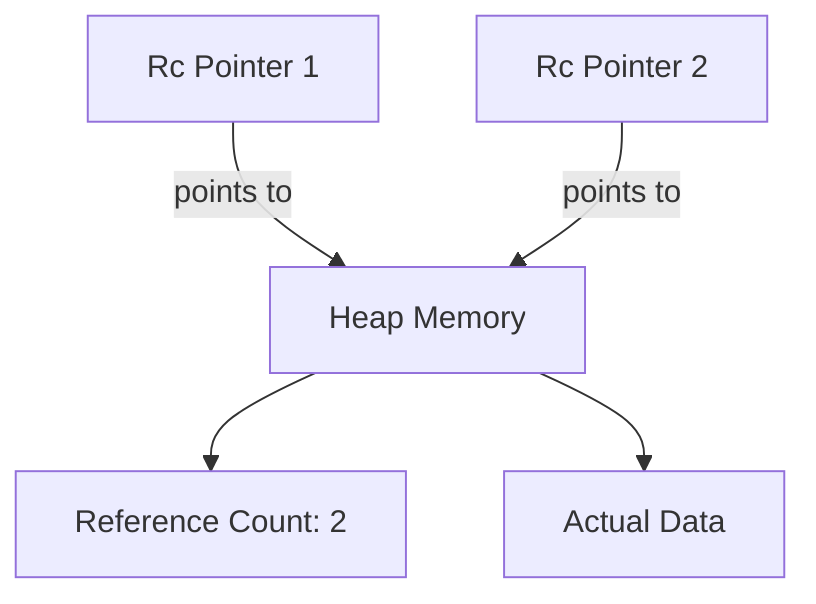

# Rust Rc Type

## Introduction

In Rust's ownership system, each value typically has exactly one owner. However, there are scenarios where you need multiple parts of your code to share ownership of the same data. This is where Rust's `Rc<T>` type (short for "Reference Counting") comes into play.

`Rc<T>` is a smart pointer that keeps track of the number of references to a value, allowing for shared ownership without violating Rust's borrowing rules. When the last reference to a value is dropped, the value itself is cleaned up automatically.

In this tutorial, we'll explore how the `Rc<T>` type works, when to use it, and how it compares to other memory management approaches in Rust.

## When to Use Rc

The `Rc<T>` type is useful when:

- You need to share data between multiple parts of your program
- You cannot determine at compile time which part will finish using the data last
- You're working with non-concurrent, single-threaded code (for multi-threaded scenarios, you'd use `Arc<T>`)

Common use cases include:
- Implementing graph data structures where multiple edges might point to the same node
- Caching data that needs to be accessed from multiple places
- Creating parent-child relationships where children need to reference their parent

## Basic Usage of Rc

Let's start with a simple example to understand how `Rc<T>` works:

```rust
use std::rc::Rc;

fn main() {
    // Create a new Rc holding a String
    let text = Rc::new(String::from("Hello, Rust!"));
    
    println!("Reference count after creation: {}", Rc::strong_count(&text)); // Output: 1
    
    // Create a clone of the Rc (not the value inside)
    let text2 = Rc::clone(&text);
    println!("Reference count after first clone: {}", Rc::strong_count(&text)); // Output: 2
    
    // Create another clone
    let text3 = Rc::clone(&text);
    println!("Reference count after second clone: {}", Rc::strong_count(&text)); // Output: 3
    
    // We can still read the data through any of the Rc pointers
    println!("Text from original: {}", text);
    println!("Text from clone 1: {}", text2);
    println!("Text from clone 2: {}", text3);
    
    // When text3 goes out of scope, count decreases
    drop(text3);
    println!("Reference count after dropping text3: {}", Rc::strong_count(&text)); // Output: 2
    
    // When all Rc instances are dropped, the String will be deallocated
}
```

In this example:
1. We create an `Rc<String>` with an initial reference count of 1
2. We create two clones, increasing the reference count to 3
3. We drop one of the clones, decreasing the reference count to 2
4. When the function ends, all remaining `Rc` instances go out of scope, the count reaches 0, and the `String` is automatically cleaned up

## How Rc Works Internally

Under the hood, `Rc<T>` maintains a count of how many references exist to the data it manages. Here's a simplified visualization of its structure:



Each time you call `Rc::clone()`, it:
1. Increments the reference count by 1
2. Returns a new `Rc<T>` that points to the same heap allocation

When an `Rc<T>` instance goes out of scope:
1. The reference count is decremented by 1
2. If the count reaches 0, both the data and the count itself are deallocated

Important note: `Rc::clone()` creates a new pointer to the same data, not a deep copy of the data itself. This makes cloning very efficient, as it only involves incrementing a counter.

## Immutability and Interior Mutability

By default, data wrapped in an `Rc<T>` is immutable. This is a safety feature to prevent data races in shared contexts. If you need to modify data inside an `Rc<T>`, you can combine it with `RefCell<T>` for interior mutability:

```rust
use std::rc::Rc;
use std::cell::RefCell;

fn main() {
    // Create a new Rc holding a RefCell, which provides interior mutability
    let counter = Rc::new(RefCell::new(0));
    
    // Create two clones of the Rc
    let counter2 = Rc::clone(&counter);
    let counter3 = Rc::clone(&counter);
    
    // Modify the value through one of the Rc instances
    *counter.borrow_mut() += 5;
    
    // Modify through another instance
    *counter2.borrow_mut() += 10;
    
    // Read the value through the third instance
    println!("Counter value: {}", *counter3.borrow()); // Output: 15
    
    println!("Reference count: {}", Rc::strong_count(&counter)); // Output: 3
}
```

In this example:
1. We wrap a value in `RefCell` for interior mutability
2. We then wrap that `RefCell` in `Rc` for shared ownership
3. We can now modify the value through any of the `Rc` instances using `borrow_mut()`
4. We can read the value through any instance using `borrow()`

## Practical Example: Tree Data Structure

Let's implement a simple tree structure where each node can have multiple children, and children can reference their parent:

```rust
use std::rc::{Rc, Weak};
use std::cell::RefCell;

// Node in a tree structure
struct Node {
    value: i32,
    parent: Weak<RefCell<Node>>,           // Weak reference to parent
    children: Vec<Rc<RefCell<Node>>>,      // Strong references to children
}

impl Node {
    // Create a new node with no parent
    fn new(value: i32) -> Rc<RefCell<Node>> {
        Rc::new(RefCell::new(Node {
            value,
            parent: Weak::new(),
            children: vec![],
        }))
    }
    
    // Add a child to this node
    fn add_child(self_node: &Rc<RefCell<Node>>, value: i32) -> Rc<RefCell<Node>> {
        // Create a new node
        let child = Rc::new(RefCell::new(Node {
            value,
            parent: Rc::downgrade(self_node),  // Weak reference to parent
            children: vec![],
        }));
        
        // Add the child to the parent's children list
        self_node.borrow_mut().children.push(Rc::clone(&child));
        
        child
    }
}

fn main() {
    // Create the root node
    let root = Node::new(1);
    println!("Root value: {}", root.borrow().value);
    println!("Root has {} children", root.borrow().children.len());
    
    // Add some children
    let child1 = Node::add_child(&root, 2);
    let child2 = Node::add_child(&root, 3);
    
    // Add a grandchild
    let grandchild = Node::add_child(&child1, 4);
    
    println!("Root now has {} children", root.borrow().children.len());
    println!("Child1 has {} children", child1.borrow().children.len());
    
    // Access parent from child (requires upgrading the Weak reference)
    let parent = grandchild.borrow().parent.upgrade().unwrap();
    println!("Grandchild's parent value: {}", parent.borrow().value);
    
    // Check reference counts
    println!("Reference count for root: {}", Rc::strong_count(&root));
    println!("Reference count for child1: {}", Rc::strong_count(&child1));
}
```

This example demonstrates:
1. Using `Rc<RefCell<T>>` to allow shared ownership with mutable contents
2. Using `Weak<T>` to create non-owning references (parent references) that don't prevent cleanup
3. How to build a tree structure with parent-child relationships

The output of this program would be:
```
Root value: 1
Root has 0 children
Root now has 2 children
Child1 has 1 children
Grandchild's parent value: 2
Reference count for root: 1
Reference count for child1: 2
```

## Weak References with `Weak<T>`

One limitation of `Rc<T>` is that it can create reference cycles (memory leaks) if nodes reference each other cyclically. To prevent this, Rust provides `Weak<T>`, a version of `Rc<T>` that doesn't contribute to ownership:

```rust
use std::rc::{Rc, Weak};

fn main() {
    // Create a new Rc
    let strong = Rc::new(String::from("Hello"));
    println!("Strong count: {}, weak count: {}", 
             Rc::strong_count(&strong), Rc::weak_count(&strong));
    
    // Create a weak reference
    let weak = Rc::downgrade(&strong);
    println!("Strong count: {}, weak count: {}", 
             Rc::strong_count(&strong), Rc::weak_count(&strong));
    
    // Using a weak reference requires upgrading it to a strong reference
    match weak.upgrade() {
        Some(string) => println!("Weak reference is valid: {}", string),
        None => println!("Weak reference is no longer valid"),
    }
    
    // When all strong references are dropped, weak references can no longer be upgraded
    drop(strong);
    
    match weak.upgrade() {
        Some(string) => println!("Weak reference is valid: {}", string),
        None => println!("Weak reference is no longer valid"),
    }
}
```

In this example:
1. We create a strong reference (`Rc<String>`)
2. We create a weak reference (`Weak<String>`) that doesn't prevent the string from being deallocated
3. We can temporarily upgrade the weak reference to access the data
4. When all strong references are dropped, the data is deallocated even if weak references still exist
5. Attempting to upgrade the weak reference after this returns `None`

The output would be:
```
Strong count: 1, weak count: 0
Strong count: 1, weak count: 1
Weak reference is valid: Hello
Weak reference is no longer valid
```

## Comparison with Other Ownership Models

Let's compare `Rc<T>` with other ownership approaches in Rust:

| Feature | `Box<T>` | `Rc<T>` | `Arc<T>` | `&T` (Reference) |
|---------|----------|---------|----------|------------------|
| Ownership | Single owner | Multiple owners | Multiple owners | Borrowing, not ownership |
| Thread safety | No | No | Yes | Yes (with lifetime) |
| Heap allocation | Yes | Yes | Yes | No |
| Overhead | Minimal | Reference counting | Reference counting + atomic operations | None |
| Use case | Single ownership of heap data | Shared ownership in single-threaded contexts | Shared ownership across threads | Temporary borrowing |

## Common Pitfalls and Best Practices

### Memory Leaks with Circular References

One of the biggest pitfalls with `Rc<T>` is the potential for memory leaks due to circular references:

```rust
use std::rc::Rc;
use std::cell::RefCell;

struct Node {
    value: i32,
    next: Option<Rc<RefCell<Node>>>,
    prev: Option<Rc<RefCell<Node>>>,
}

fn main() {
    let node1 = Rc::new(RefCell::new(Node {
        value: 1,
        next: None,
        prev: None,
    }));
    
    let node2 = Rc::new(RefCell::new(Node {
        value: 2,
        next: None,
        prev: None,
    }));
    
    // Create a reference cycle:
    // node1 -> node2 -> node1
    node1.borrow_mut().next = Some(Rc::clone(&node2));
    node2.borrow_mut().prev = Some(Rc::clone(&node1));
    
    // Even when these variables go out of scope, the Nodes won't be deallocated
    // because they still have references to each other
}
```

Best practices to avoid this:
1. Use `Weak<T>` for back-references (like child-to-parent)
2. Consider if your design really needs shared ownership
3. Break cycles manually when no longer needed

### Performance Considerations

`Rc<T>` adds overhead due to reference counting:
1. Memory overhead for storing the count
2. CPU overhead for incrementing/decrementing the count

For performance-critical code:
- Use `Rc::clone()` rather than `.clone()` to make it clear you're cloning the pointer, not the data
- Consider if you can use lifetimes and references instead
- If you need many small objects with shared ownership, consider an arena-based approach

## Summary

Rust's `Rc<T>` type provides a powerful way to share ownership of data in single-threaded contexts. It uses reference counting to automatically clean up data when it's no longer needed, while still adhering to Rust's ownership rules.

Key takeaways:
- `Rc<T>` enables shared ownership through reference counting
- It's for single-threaded use only (use `Arc<T>` for multi-threaded code)
- Combine with `RefCell<T>` for interior mutability
- Use `Weak<T>` to prevent reference cycles
- Be mindful of the performance overhead of reference counting

By understanding when and how to use `Rc<T>`, you can create more flexible data structures in Rust while maintaining memory safety and avoiding memory leaks.

## Exercises

1. Create a simple cache that holds `Rc<String>` values and allows multiple parts of your code to access the same string without duplicating it
2. Implement a graph data structure where multiple edges can point to the same node
3. Modify the tree example to print the entire tree structure starting from the root
4. Create an example that demonstrates a reference cycle, then fix it using `Weak<T>`
5. Compare the performance of using `Rc<T>` versus regular ownership for a simple data structure

## Additional Resources

- [Rust Standard Library Documentation for Rc](https://doc.rust-lang.org/std/rc/struct.Rc.html)
- [The Rust Programming Language Book - Chapter on Smart Pointers](https://doc.rust-lang.org/book/ch15-00-smart-pointers.html)
- [Rust by Example - Rc](https://doc.rust-lang.org/rust-by-example/std/rc.html)
- [Visualizing Memory Layout of Rust's Data Types](https://rustwasm.github.io/book/reference/debugging.html)