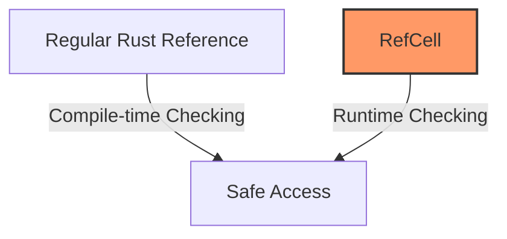
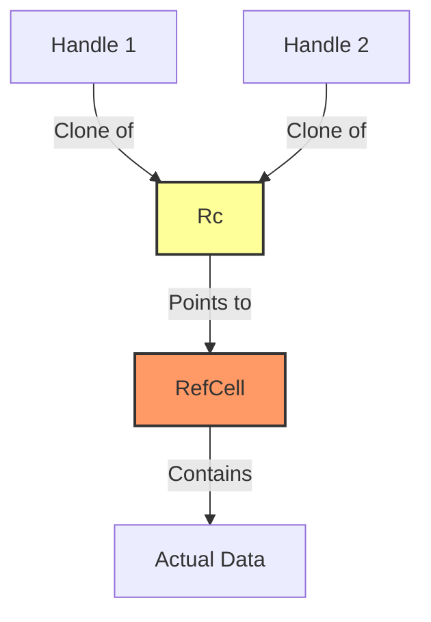

# Rust RefCell Type

## Introduction

In Rust, managing memory and references safely is central to the language's design. While Rust's ownership system normally enforces strict borrowing rules at compile time, sometimes you need more flexibility. This is where `RefCell<T>` comes in—it's part of Rust's "interior mutability" pattern that allows you to modify data even when there are immutable references to that data.

Think of `RefCell<T>` as a special container that lets you bend Rust's strict borrowing rules, but in a safe way by performing checks at runtime instead of compile time.

## What is RefCell?

`RefCell<T>` is a type in Rust's standard library that provides "interior mutability"—the ability to mutate data even when the data is considered immutable from the outside.

Key characteristics of `RefCell<T>`:

- It enforces Rust's borrowing rules **at runtime** instead of compile time
- It allows multiple readers OR one writer (just like regular references)
- It will panic if borrowing rules are violated at runtime
- It is only for use in single-threaded scenarios (not thread-safe)

Let's visualize the core concept:



## When to Use RefCell

You should consider using `RefCell<T>` when:

1. You have immutable data that you need to modify
2. You're certain that borrowing rules will be followed at runtime
3. You're working in a single-threaded context
4. The borrow checker is too restrictive for your specific use case

Common scenarios include:

- Implementing self-referential data structures
- Modifying values inside immutable structs
- Implementing caching or memoization
- Working with Rust design patterns like Observer pattern

## Basic Usage of RefCell

Let's look at a simple example of how to use `RefCell`:

```rust
use std::cell::RefCell;

fn main() {
    // Create a new RefCell containing a mutable value
    let data = RefCell::new(5);
    
    // Borrow the value immutably (multiple immutable borrows are allowed)
    let immutable_borrow = data.borrow();
    println!("Immutable borrow: {}", *immutable_borrow);
    
    // Drop the immutable borrow so we can borrow mutably
    drop(immutable_borrow);
    
    // Borrow the value mutably (only one mutable borrow allowed)
    let mut mutable_borrow = data.borrow_mut();
    *mutable_borrow += 10;
    
    // We can't create another borrow while mutable borrow is active
    // Uncommenting this would cause a runtime panic:
    // let another_borrow = data.borrow();
    
    println!("After modification: {}", *mutable_borrow);
    
    // Once we're done with the mutable borrow, other borrows are allowed again
    drop(mutable_borrow);
    
    // Now we can borrow immutably again
    println!("Final value: {}", *data.borrow());
}
```

**Output:**
```
Immutable borrow: 5
After modification: 15
Final value: 15
```

## How RefCell Works

Let's explore how `RefCell<T>` works under the hood:

### The Borrow Counter

`RefCell<T>` maintains an internal counter to track borrows:

- The counter starts at 0
- Each immutable borrow (`borrow()`) increments by 1
- A mutable borrow (`borrow_mut()`) sets it to -1
- When borrows go out of scope, the counter is updated
- The counter must be either 0, positive, or -1, otherwise a panic occurs

### Key Methods

`RefCell<T>` provides several important methods:

- `borrow()`: Returns an immutable reference `Ref<T>`
- `borrow_mut()`: Returns a mutable reference `RefMut<T>`
- `try_borrow()`: Like `borrow()` but returns a `Result` instead of panicking on failure
- `try_borrow_mut()`: Like `borrow_mut()` but returns a `Result` instead of panicking
- `into_inner()`: Consumes the `RefCell<T>` and returns the wrapped value

## Real-World Example: A Mock Object

Let's look at a practical example where `RefCell<T>` shines: implementing a mock object for testing.

```rust
use std::cell::RefCell;

// Define a trait for a message service
trait MessageService {
    fn send_message(&self, msg: &str, recipient: &str) -> bool;
    fn get_sent_count(&self) -> u32;
}

// Mock implementation of the message service for testing
struct MockMessageService {
    // We need to track how many messages were sent,
    // but the trait method is immutable (&self)
    sent_count: RefCell<u32>,
    should_succeed: bool,
}

impl MockMessageService {
    fn new(should_succeed: bool) -> Self {
        MockMessageService {
            sent_count: RefCell::new(0),
            should_succeed,
        }
    }
}

impl MessageService for MockMessageService {
    fn send_message(&self, msg: &str, recipient: &str) -> bool {
        println!("Mock: Sending '{}' to {}", msg, recipient);
        
        // Here we modify the sent_count through RefCell
        // even though this is an immutable method (&self)
        let mut count = self.sent_count.borrow_mut();
        *count += 1;
        
        self.should_succeed
    }
    
    fn get_sent_count(&self) -> u32 {
        *self.sent_count.borrow()
    }
}

// Function that uses a message service
fn send_notifications<T: MessageService>(service: &T, message: &str, users: &[&str]) -> usize {
    let mut success_count = 0;
    
    for user in users {
        if service.send_message(message, user) {
            success_count += 1;
        }
    }
    
    success_count
}

fn main() {
    // Create a mock service that will succeed
    let mock_service = MockMessageService::new(true);
    
    // Define test data
    let test_users = ["user1@example.com", "user2@example.com", "user3@example.com"];
    let test_message = "Hello from Rust!";
    
    // Use the function with our mock service
    let succeeded = send_notifications(&mock_service, test_message, &test_users);
    
    println!("Successfully sent {} messages", succeeded);
    println!("Total send attempts: {}", mock_service.get_sent_count());
}
```

**Output:**
```
Mock: Sending 'Hello from Rust!' to user1@example.com
Mock: Sending 'Hello from Rust!' to user2@example.com
Mock: Sending 'Hello from Rust!' to user3@example.com
Successfully sent 3 messages
Total send attempts: 3
```

In this example, we use `RefCell<T>` to allow our mock service implementation to modify its internal state (the sent count) even when the `send_message` method is called on an immutable reference.

## RefCell Combined with Rc: A Powerful Pattern

A common pattern in Rust is to combine `RefCell<T>` with `Rc<T>` to get shared ownership with interior mutability. This is useful for creating more complex data structures.

```rust
use std::cell::RefCell;
use std::rc::Rc;

fn main() {
    // Create a shared, mutable value
    let shared_data = Rc::new(RefCell::new(vec![1, 2, 3]));
    
    // Create two handles to the same data
    let data_handle1 = Rc::clone(&shared_data);
    let data_handle2 = Rc::clone(&shared_data);
    
    // Modify the vector through the first handle
    data_handle1.borrow_mut().push(4);
    
    // Modify the vector through the second handle
    data_handle2.borrow_mut().push(5);
    
    // The changes from both handles are visible
    println!("Shared data: {:?}", *shared_data.borrow());
}
```

**Output:**
```
Shared data: [1, 2, 3, 4, 5]
```

This pattern is visualized below:



## Pitfalls and Best Practices

### Potential Issues

1. **Runtime Panics**: Unlike compile-time errors, `RefCell<T>` borrowing violations cause panics at runtime
2. **Performance Overhead**: Runtime borrowing checks add a small performance cost
3. **Thread Safety**: `RefCell<T>` is not thread-safe; use `Mutex<T>` or `RwLock<T>` for that

### Best Practices

1. **Use sparingly**: Only use `RefCell<T>` when you truly need interior mutability
2. **Consider alternatives first**: Can you redesign your code to avoid needing interior mutability?
3. **Use `try_borrow` methods**: For more graceful error handling, use the methods that return `Result`
4. **Keep borrow scope small**: Drop borrows as soon as possible with smaller scopes

```rust
use std::cell::RefCell;

fn main() {
    let data = RefCell::new(5);
    
    // Bad: Long-lived borrow
    let borrow = data.borrow();
    // ... lots of code where borrow isn't used ...
    println!("{}", *borrow);
    
    // Good: Short-lived borrow
    {
        let borrow = data.borrow();
        println!("{}", *borrow);
    } // borrow is dropped here
}
```

## Summary

`RefCell<T>` is a powerful tool in Rust's memory management toolkit that enables interior mutability by:

- Moving borrowing checks from compile time to runtime
- Maintaining Rust's borrowing rules (multiple readers or one writer)
- Providing flexibility when the compiler's static analysis is too restrictive

It's especially useful for:
- Mock objects in testing
- Implementing certain design patterns
- Building complex data structures
- Working with immutable interfaces that need internal state modifications

Remember: `RefCell<T>` is a single-threaded tool. For multi-threaded code, consider `Mutex<T>` or `RwLock<T>` instead, which provide similar functionality with thread safety.

## Exercises

1. Create a simple cache using `RefCell<T>` that stores the results of expensive computations
2. Implement a simple observer pattern using `Rc<RefCell<T>>`
3. Write a function that takes an immutable reference to a data structure but needs to update internal counts or metrics
4. Experiment with runtime panics by deliberately violating borrowing rules with `RefCell<T>`

## Additional Resources

- [Rust Official Documentation on RefCell](https://doc.rust-lang.org/book/ch15-05-interior-mutability.html)
- [Rust API Documentation](https://doc.rust-lang.org/std/cell/struct.RefCell.html)
- [The Rust Programming Language Book, Chapter 15](https://doc.rust-lang.org/book/ch15-00-smart-pointers.html)
- [Rust By Example: Smart Pointers](https://doc.rust-lang.org/rust-by-example/std/rc.html)
- [The "Too Many Lists" Rust book](https://rust-unofficial.github.io/too-many-lists/)