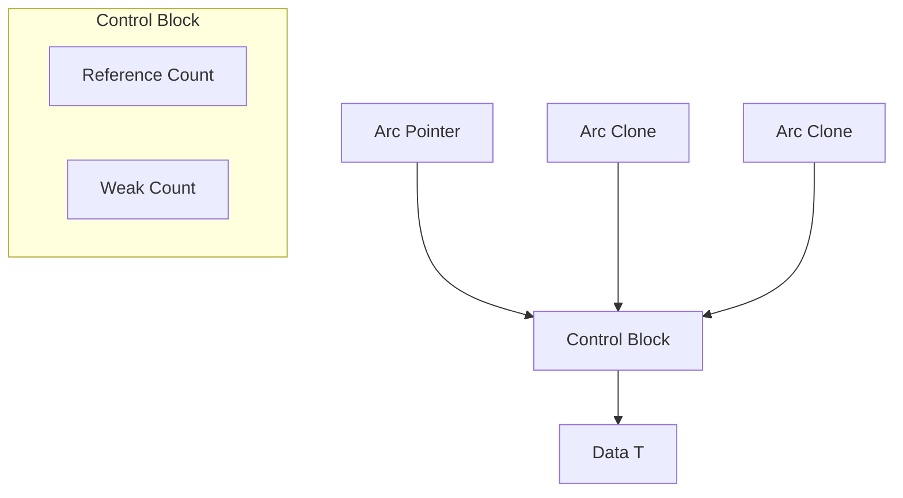

# Rust Arc Type

## Introduction

When programming in Rust, managing memory efficiently and safely is a fundamental concern. Rust's ownership system ensures memory safety without a garbage collector, but sometimes you need to share data between multiple parts of your program. This is where smart pointers like `Arc` come into play.

**Arc** stands for **A**tomic **R**eference **C**ounting. It's a type that enables multiple parts of your program to share ownership of a value, even across different threads. This guide will walk you through what `Arc` is, how it works, and when you should use it in your Rust programs.

## What is Arc?

`Arc<T>` is a smart pointer that provides shared ownership of a value of type `T` that is allocated in the heap. The "Atomic" in its name refers to the fact that it uses atomic operations for its reference counting, making it safe to share between threads.

Key characteristics of `Arc`:

- It allows multiple parts of your code to have shared ownership of data
- It's thread-safe, unlike its cousin `Rc`
- It keeps track of how many references to the data exist
- When the last reference is dropped, the data is automatically cleaned up

## Arc vs Rc

Before diving deeper into `Arc`, it's important to understand how it differs from `Rc` (Reference Counting), another shared ownership type in Rust:

| Feature | `Arc<T>` | `Rc<T>` |
|---------|----------|---------|
| Thread safety | ✅ Safe to share across threads | ❌ Not safe for cross-thread usage |
| Performance | Slightly slower due to atomic operations | Slightly faster |
| Use case | Shared ownership across threads | Shared ownership within a single thread |

## How to Use Arc

Let's start with a basic example of using `Arc`:

```rust
use std::sync::Arc;

fn main() {
    // Create a new Arc pointing to a String
    let data = Arc::new(String::from("Hello, Arc!"));
    
    // Create a clone of the Arc
    // This increases the reference count but points to the same data
    let data_clone = Arc::clone(&data);
    
    // Now we have two Arcs pointing to the same String
    println!("Original: {}", data);
    println!("Clone: {}", data_clone);
    
    // We can check the strong reference count
    println!("Reference count: {}", Arc::strong_count(&data));
    
    // Output:
    // Original: Hello, Arc!
    // Clone: Hello, Arc!
    // Reference count: 2
}
```

In this example, we create an `Arc` wrapping a `String`, then create a clone of the `Arc` (not the `String` itself). Both `data` and `data_clone` point to the same `String` in memory, and the reference count is increased to 2.

## How Arc Works Under the Hood

Let's understand how `Arc` works internally:



1. When you create an `Arc<T>`, Rust allocates a control block on the heap
2. The control block contains the value `T` and two counters:
   - Strong reference count: Tracks how many `Arc`s point to this data
   - Weak reference count: Used for `Weak` references (more on this later)
3. Each time you clone the `Arc`, the strong reference count increases
4. When an `Arc` is dropped, the count decreases
5. When the count reaches zero, the data is deallocated

## Sharing Data Between Threads with Arc

One of the main uses of `Arc` is sharing data between threads. Here's an example:

```rust
use std::sync::Arc;
use std::thread;

fn main() {
    // Create data inside an Arc
    let data = Arc::new(vec![1, 2, 3, 4, 5]);
    
    // Create a vector to hold our thread handles
    let mut handles = vec![];
    
    // Create 5 threads that each use the data
    for i in 0..5 {
        // Clone the Arc for each thread
        let data_clone = Arc::clone(&data);
        
        // Spawn a thread that uses the cloned Arc
        let handle = thread::spawn(move || {
            println!("Thread {}: Processing value at index {}: {}", 
                     i, i, data_clone[i]);
        });
        
        handles.push(handle);
    }
    
    // Wait for all threads to finish
    for handle in handles {
        handle.join().unwrap();
    }
    
    // The Arc and the data will be dropped when we exit the scope
    println!("Final reference count: {}", Arc::strong_count(&data));
    
    // Output (order may vary):
    // Thread 0: Processing value at index 0: 1
    // Thread 1: Processing value at index 1: 2
    // Thread 2: Processing value at index 2: 3
    // Thread 3: Processing value at index 3: 4
    // Thread 4: Processing value at index 4: 5
    // Final reference count: 1
}
```

In this example:
1. We create a vector wrapped in an `Arc`
2. For each of 5 threads, we clone the `Arc` and move the clone into the thread
3. Each thread can read from the shared vector
4. When all threads complete, only the original `Arc` remains

## Combining Arc with Mutex for Mutable Shared State

While `Arc` allows sharing data across threads, it doesn't allow mutation by default. For that, we typically combine it with `Mutex` or `RwLock`:

```rust
use std::sync::{Arc, Mutex};
use std::thread;

fn main() {
    // Create a mutable shared counter
    let counter = Arc::new(Mutex::new(0));
    let mut handles = vec![];
    
    for _ in 0..10 {
        let counter_clone = Arc::clone(&counter);
        let handle = thread::spawn(move || {
            // Lock the mutex to access and modify the value
            let mut num = counter_clone.lock().unwrap();
            *num += 1;
            println!("Count is now: {}", *num);
        });
        handles.push(handle);
    }
    
    for handle in handles {
        handle.join().unwrap();
    }
    
    // Print the final count
    println!("Final count: {}", *counter.lock().unwrap());
    
    // Output will include 10 incremental counts and:
    // Final count: 10
}
```

In this example:
1. We create a counter as a `Mutex<i32>` wrapped in an `Arc`
2. Each thread gets a clone of the `Arc`
3. To modify the counter, threads must lock the `Mutex`
4. This ensures only one thread can modify the counter at a time

## Weak References

Sometimes, you need to break reference cycles that could cause memory leaks. `Arc` provides `Weak` references for this purpose:

```rust
use std::sync::{Arc, Weak};
use std::cell::RefCell;

// Define a node type for a tree structure
struct Node {
    value: i32,
    parent: Option<Weak<RefCell<Node>>>,
    children: Vec<Arc<RefCell<Node>>>,
}

fn main() {
    // Create a root node
    let root = Arc::new(RefCell::new(Node {
        value: 1,
        parent: None,
        children: vec![],
    }));
    
    // Create a child node
    let child = Arc::new(RefCell::new(Node {
        value: 2,
        // Use a Weak reference to the parent to avoid reference cycles
        parent: Some(Arc::downgrade(&root)),
        children: vec![],
    }));
    
    // Add the child to the root's children
    root.borrow_mut().children.push(Arc::clone(&child));
    
    // Access the child's parent (which is a Weak reference)
    let parent = child.borrow().parent.as_ref().unwrap().upgrade();
    
    if let Some(parent) = parent {
        println!("Child's parent value: {}", parent.borrow().value);
    }
    
    // Output:
    // Child's parent value: 1
}
```

In this example:
1. We create a tree structure with parent-child relationships
2. Children have strong references to parents, which would create a cycle
3. To break this cycle, we use `Weak` references from children to parents
4. We must `upgrade()` a `Weak` reference to use it, which returns an `Option<Arc<T>>`

## Performance Considerations

While `Arc` is crucial for certain scenarios, it comes with some overhead:

1. **Memory**: `Arc` uses extra memory for the reference counts
2. **CPU**: Atomic operations are more expensive than non-atomic ones
3. **Indirection**: Accessing data through `Arc` requires an extra pointer dereference

When performance is critical, consider these alternatives:
- Use `Rc` if you don't need thread safety
- Consider if you can restructure your code to use references with lifetimes instead
- In some cases, using message-passing (channels) can be more efficient than shared state

## Common Mistakes and Pitfalls

### Mistake 1: Using Rc Instead of Arc for Thread Safety

```rust
use std::rc::Rc; // Wrong choice for threads!
use std::thread;

fn main() {
    let data = Rc::new(vec![1, 2, 3]);
    
    // This will cause a compile error
    thread::spawn(move || {
        println!("{:?}", data);
    });
}
```

This will fail with a compile error because `Rc` is not thread-safe. Always use `Arc` for cross-thread data sharing.

### Mistake 2: Forgetting to Clone

```rust
use std::sync::Arc;
use std::thread;

fn main() {
    let data = Arc::new(vec![1, 2, 3]);
    
    // This moves the Arc into the thread, not a clone
    thread::spawn(move || {
        println!("{:?}", data);
    });
    
    // This will cause a compile error as data has been moved
    println!("{:?}", data); 
}
```

Remember to `clone()` your `Arc` when you want to keep using it after passing it to a thread.

### Mistake 3: Using Arc When Not Needed

```rust
use std::sync::Arc;

fn process_data(data: Arc<Vec<i32>>) {
    println!("{:?}", data);
}

fn main() {
    // This Arc is unnecessary if you're not sharing ownership
    let data = Arc::new(vec![1, 2, 3]);
    process_data(data);
}
```

For simple function arguments where shared ownership isn't needed, prefer passing by reference (`&Vec<i32>`) rather than wrapping in `Arc`.

## Real-World Application: A Thread Pool with Shared Work Queue

Here's a more complex example showing a thread pool with a shared work queue:

```rust
use std::sync::{Arc, Mutex};
use std::thread;
use std::time::Duration;

// A simple task type - just a function to execute
type Task = Box<dyn FnOnce() + Send + 'static>;

struct ThreadPool {
    workers: Vec<thread::JoinHandle<()>>,
    task_queue: Arc<Mutex<Vec<Task>>>,
}

impl ThreadPool {
    fn new(size: usize) -> Self {
        let task_queue = Arc::new(Mutex::new(Vec::new()));
        let mut workers = Vec::with_capacity(size);
        
        // Create the worker threads
        for id in 0..size {
            let queue = Arc::clone(&task_queue);
            
            let handle = thread::spawn(move || {
                println!("Worker {} starting", id);
                
                loop {
                    // Try to get a task from the queue
                    let task = {
                        let mut queue = queue.lock().unwrap();
                        queue.pop()
                    };
                    
                    match task {
                        Some(task) => {
                            println!("Worker {} got a task", id);
                            task();
                        }
                        None => {
                            // No tasks available, sleep a bit
                            thread::sleep(Duration::from_millis(100));
                        }
                    }
                }
            });
            
            workers.push(handle);
        }
        
        ThreadPool { workers, task_queue }
    }
    
    fn execute<F>(&self, f: F)
    where
        F: FnOnce() + Send + 'static,
    {
        let task = Box::new(f);
        self.task_queue.lock().unwrap().push(task);
    }
}

fn main() {
    // Create a thread pool with 4 workers
    let pool = ThreadPool::new(4);
    
    // Add tasks to the pool
    for i in 0..10 {
        pool.execute(move || {
            println!("Executing task {}", i);
            thread::sleep(Duration::from_millis(500));
        });
    }
    
    // Wait to see the results
    thread::sleep(Duration::from_secs(3));
    
    // Output will show workers picking up and executing tasks
}
```

This example demonstrates:
1. Using `Arc<Mutex<Vec<Task>>>` to share a task queue between threads
2. Each worker thread having its own clone of the `Arc`
3. Threads safely accessing and modifying the shared queue using the `Mutex`

## Summary

`Arc` is a powerful tool in Rust's memory management arsenal that enables safe sharing of data across multiple threads. Here's what we've covered:

- `Arc` provides thread-safe shared ownership through atomic reference counting
- It's ideal for situations where data must be accessed from multiple threads
- For mutable shared state, combine `Arc` with synchronization primitives like `Mutex`
- `Weak` references help avoid reference cycles and memory leaks
- While powerful, `Arc` comes with performance overhead and should be used judiciously

By understanding when and how to use `Arc`, you can write concurrent Rust programs that are both safe and efficient.

## Exercises

1. Create a program that shares a large vector of numbers between threads and has each thread compute a partial sum.
2. Implement a simple cache where multiple threads can access cached values using `Arc`.
3. Design a graph data structure where nodes can reference each other without creating reference cycles.
4. Experiment with combining `Arc` and `Mutex` to create a thread-safe counter that multiple threads increment.
5. Compare the performance of a program using `Arc` versus a similar program using message-passing with channels.

## Additional Resources

- [Rust Documentation for Arc](https://doc.rust-lang.org/std/sync/struct.Arc.html)
- [Rust Book: Smart Pointers](https://doc.rust-lang.org/book/ch15-00-smart-pointers.html)
- [Rust Atomics and Locks](https://marabos.nl/atomics/) by Mara Bos
- [Learning Rust With Entirely Too Many Linked Lists](https://rust-unofficial.github.io/too-many-lists/) (covers `Arc` in detail)
- [Rust Design Patterns: Smart Pointers](https://rust-unofficial.github.io/patterns/patterns/behavioural/RAII.html)