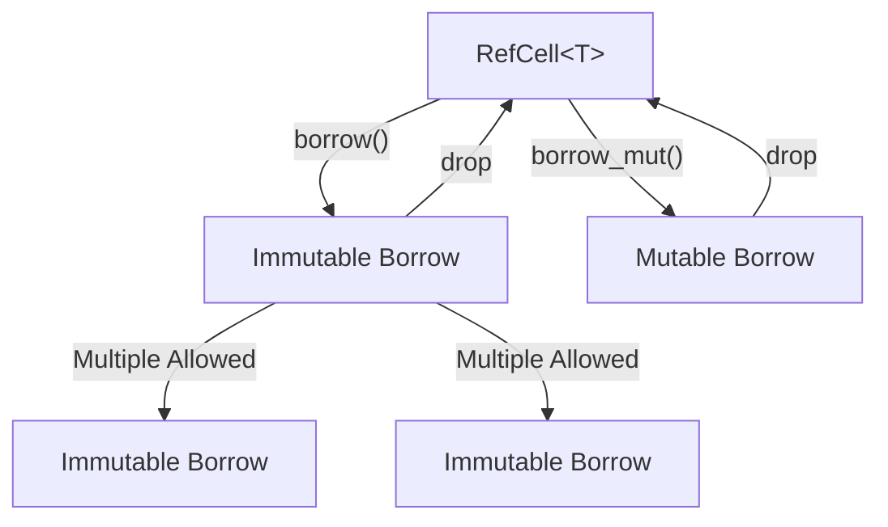

# Rust Interior Mutability

## Introduction

In Rust, the borrowing rules enforce that you can either have one mutable reference (`&mut T`) or multiple immutable references (`&T`) to data at any given time. This helps prevent data races and ensures memory safety. However, sometimes you need to change data even when you only have immutable references to it. This is where **interior mutability** comes in.

Interior mutability is a design pattern in Rust that allows you to mutate data even when there are immutable references to that data. It sounds like it might break Rust's safety guarantees, but it uses safe abstractions to move the borrowing rules from compile-time to runtime.

## Understanding Interior Mutability

### The Problem Interior Mutability Solves

Let's consider a common scenario:

```rust
fn main() {
    let x = 5;
    let y = &x;
    
    // This would fail to compile:
    // x = 6;
    
    println!("y = {}", y);
}
```

Once we create an immutable reference `y` to `x`, we can no longer modify `x` until `y` goes out of scope. This is the standard borrowing rule.

But what if we want to modify `x` while still having immutable references to it? This is where interior mutability comes in.

### The Core Concept

Interior mutability works by:

1. Wrapping your data in a container that provides controlled mutability
2. Using runtime checks to ensure safety
3. Potentially panicking if the safety rules are violated

Rust provides several types in the standard library that implement interior mutability:

- `Cell<T>`
- `RefCell<T>`
- `Mutex<T>`
- `RwLock<T>`
- `AtomicT` (like `AtomicBool`, `AtomicUsize`, etc.)

Let's explore the most commonly used ones.

## The Cell Type

`Cell<T>` is the simplest form of interior mutability. It works by:
- Allowing you to replace the value inside it
- Not allowing you to borrow the value, only to get a copy or set a new value

`Cell<T>` is useful for simple types that implement `Copy` (like integers, floats, booleans).

### Example: Using Cell

```rust
use std::cell::Cell;

fn main() {
    let counter = Cell::new(0);
    
    // Read the value
    println!("Initial value: {}", counter.get());
    
    // Modify the value
    counter.set(counter.get() + 1);
    
    println!("After increment: {}", counter.get());
    
    // We can have multiple immutable references to counter
    let counter_ref1 = &counter;
    let counter_ref2 = &counter;
    
    // And still modify the value through any of them!
    counter_ref1.set(counter_ref1.get() + 10);
    counter_ref2.set(counter_ref2.get() * 2);
    
    println!("Final value: {}", counter.get());
}
```

Output:
```
Initial value: 0
After increment: 1
Final value: 22
```

`Cell` is great when you need interior mutability for simple types that implement `Copy`. However, for more complex types, we need `RefCell`.

## The RefCell Type

`RefCell<T>` is more flexible than `Cell` as it allows you to:
- Borrow the value (either mutably or immutably)
- Track borrows at runtime
- Panic if the borrowing rules are violated

### Example: Using RefCell

```rust
use std::cell::RefCell;

fn main() {
    let data = RefCell::new(vec![1, 2, 3]);
    
    // Immutably borrow the value
    {
        let borrowed = data.borrow();
        println!("Current data: {:?}", borrowed);
        
        // This would panic at runtime:
        // let mut mutable_borrow = data.borrow_mut();
    }
    
    // Mutably borrow the value
    {
        let mut mutable_borrow = data.borrow_mut();
        mutable_borrow.push(4);
        mutable_borrow.push(5);
    }
    
    println!("Modified data: {:?}", data.borrow());
}
```

Output:
```
Current data: [1, 2, 3]
Modified data: [1, 2, 3, 4, 5]
```

### The Borrow Rules at Runtime

`RefCell` enforces the same borrowing rules as Rust's compile-time checks, but at runtime:
- You can have multiple immutable borrows (`borrow()`)
- You can have a single mutable borrow (`borrow_mut()`)
- You cannot have both at the same time

If these rules are violated, `RefCell` will panic.

```rust
use std::cell::RefCell;

fn main() {
    let data = RefCell::new(vec![1, 2, 3]);
    
    let borrowed = data.borrow();
    
    // This would panic! We already have an immutable borrow.
    // let mut mutable_borrow = data.borrow_mut();
    
    println!("Safely borrowed: {:?}", borrowed);
}
```

## Visualizing Interior Mutability

Let's visualize how interior mutability works with `RefCell`:



## Common Use Cases for Interior Mutability

### 1. Implementing Caches

```rust
use std::cell::RefCell;
use std::collections::HashMap;

struct Cache {
    data: RefCell<HashMap<String, String>>,
}

impl Cache {
    fn new() -> Self {
        Cache {
            data: RefCell::new(HashMap::new()),
        }
    }
    
    fn get(&self, key: &str) -> Option<String> {
        let cache = self.data.borrow();
        cache.get(key).cloned()
    }
    
    fn set(&self, key: &str, value: String) {
        let mut cache = self.data.borrow_mut();
        cache.insert(key.to_string(), value);
    }
}

fn main() {
    let cache = Cache::new();
    
    // We can modify the cache even with just an immutable reference
    cache.set("name", "Rust".to_string());
    cache.set("type", "Language".to_string());
    
    println!("Name: {:?}", cache.get("name"));
    println!("Type: {:?}", cache.get("type"));
}
```

Output:
```
Name: Some("Rust")
Type: Some("Language")
```

### 2. Implementing Observable Values

```rust
use std::cell::RefCell;

struct Observable<T> {
    value: RefCell<T>,
    observers: Vec<fn(&T)>,
}

impl<T: Clone> Observable<T> {
    fn new(initial: T) -> Self {
        Observable {
            value: RefCell::new(initial),
            observers: Vec::new(),
        }
    }
    
    fn add_observer(&mut self, observer: fn(&T)) {
        self.observers.push(observer);
    }
    
    fn set(&self, new_value: T) {
        *self.value.borrow_mut() = new_value;
        let value = self.value.borrow();
        for observer in &self.observers {
            observer(&value);
        }
    }
    
    fn get(&self) -> T {
        self.value.borrow().clone()
    }
}

fn main() {
    let mut counter = Observable::new(0);
    
    counter.add_observer(|value| println!("Observer 1: Value changed to {}", value));
    counter.add_observer(|value| println!("Observer 2: Value is now {}", value));
    
    println!("Initial value: {}", counter.get());
    counter.set(42);
    counter.set(100);
}
```

Output:
```
Initial value: 0
Observer 1: Value changed to 42
Observer 2: Value is now 42
Observer 1: Value changed to 100
Observer 2: Value is now 100
```

## Other Interior Mutability Types

### Mutex for Thread Safety

`RefCell` is not thread-safe. For interior mutability across threads, use `Mutex`:

```rust
use std::sync::Mutex;
use std::thread;

fn main() {
    let counter = Mutex::new(0);
    let mut handles = vec![];
    
    for _ in 0..10 {
        let counter_ref = &counter;
        let handle = thread::spawn(move || {
            let mut num = counter_ref.lock().unwrap();
            *num += 1;
        });
        handles.push(handle);
    }
    
    for handle in handles {
        handle.join().unwrap();
    }
    
    println!("Final count: {}", *counter.lock().unwrap());
}
```

Output:
```
Final count: 10
```

### Atomic Types for Simple Thread-Safe Operations

For simpler cases, atomic types can be more efficient:

```rust
use std::sync::atomic::{AtomicUsize, Ordering};
use std::thread;

fn main() {
    let counter = AtomicUsize::new(0);
    let mut handles = vec![];
    
    for _ in 0..10 {
        let counter_ref = &counter;
        let handle = thread::spawn(move || {
            counter_ref.fetch_add(1, Ordering::SeqCst);
        });
        handles.push(handle);
    }
    
    for handle in handles {
        handle.join().unwrap();
    }
    
    println!("Final count: {}", counter.load(Ordering::SeqCst));
}
```

Output:
```
Final count: 10
```

## When to Use Interior Mutability

Interior mutability should not be your default approach. Use it when:

1. You need to modify data behind an immutable reference
2. You're implementing certain design patterns (observers, caches, etc.)
3. You need to modify values in callback functions
4. You're working with FFI or APIs that require shared mutable state

Remember that interior mutability shifts some of Rust's safety checks from compile-time to runtime, which can lead to panics.

## Best Practices

1. **Use the least powerful tool**: Prefer `Cell` over `RefCell` when possible
2. **Keep the scope small**: Limit the area where interior mutability is used
3. **Release borrows promptly**: Don't hold onto borrowed references longer than needed
4. **Handle potential panics**: Be aware that runtime borrowing checks can panic
5. **Document your usage**: Make it clear when interior mutability is being used

## Summary

Interior mutability is a powerful pattern in Rust that lets you modify data even when you only have immutable references to it. It works by:

- Moving borrow checking from compile-time to runtime
- Using container types like `Cell`, `RefCell`, `Mutex`, etc.
- Enforcing Rust's borrowing rules dynamically

While powerful, interior mutability should be used judiciously as it comes with runtime costs and the potential for panics.

## Exercises

1. Create a function counter that increments an internal value each time it's called, even when passed as an immutable reference.
2. Implement a simple memoization function for calculating Fibonacci numbers using `RefCell`.
3. Create a logger struct that logs messages and keeps track of how many messages have been logged, using interior mutability.

## Additional Resources

- [Rust Book: Interior Mutability](https://doc.rust-lang.org/book/ch15-05-interior-mutability.html)
- [Rust API Documentation: std::cell](https://doc.rust-lang.org/std/cell/index.html)
- [Rust API Documentation: std::sync](https://doc.rust-lang.org/std/sync/index.html)
- [Rust by Example: Cell](https://doc.rust-lang.org/rust-by-example/std/cell.html)