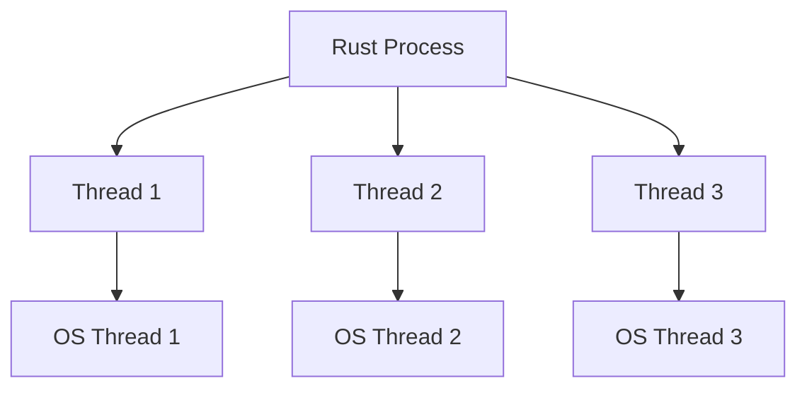

# Rust Threads

## Introduction

Concurrency is a crucial concept in modern programming, allowing applications to perform multiple operations simultaneously. Rust provides powerful tools for concurrent programming, with threads being one of the fundamental building blocks. In this tutorial, we'll explore how Rust implements threads, how to create and manage them, and how to build practical concurrent applications.

Threads in Rust allow your program to run multiple pieces of code at the same time. Think of them as separate workers that can perform tasks independently, potentially speeding up your program or allowing it to handle multiple operations simultaneously.

## Understanding Threads in Rust

### What are Threads?

A thread is the smallest unit of code execution that can be scheduled by an operating system. Multiple threads can run concurrently within a single process, sharing the same memory space but executing independently.

Rust's threading model is based on the concept of **native threads**, which means each Rust thread corresponds to an actual operating system thread. This provides several advantages:

- Full utilization of multiple CPU cores
- Independent execution of code
- System-level scheduling and prioritization

### The Thread Model in Rust

Rust threads are implemented in the standard library's `std::thread` module. They follow the 1:1 threading model, where each Rust thread maps directly to one OS thread.



## Creating Threads in Rust

Let's start by creating a simple thread:

```rust
use std::thread;
use std::time::Duration;

fn main() {
    println!("Main thread: Hello!");

    // Spawn a new thread
    let handle = thread::spawn(|| {
        println!("New thread: I'm running!");
        
        // Simulate work with a sleep
        thread::sleep(Duration::from_millis(1000));
        
        println!("New thread: I'm done!");
    });

    println!("Main thread: Spawned a new thread!");
    
    // Wait for the spawned thread to finish
    handle.join().unwrap();
    
    println!("Main thread: All done!");
}
```

**Output:**
```
Main thread: Hello!
Main thread: Spawned a new thread!
New thread: I'm running!
New thread: I'm done!
Main thread: All done!
```

### Key Components:

1. **`thread::spawn`**: This function creates a new thread and starts executing the code in the provided closure.
2. **Thread Handle**: The `spawn` function returns a `JoinHandle`, which we can use to interact with the thread.
3. **`join`**: The `join` method waits for the thread to finish execution before continuing.

## Thread Lifecycle

Understanding a thread's lifecycle is important for managing resources and ensuring your program behaves as expected:

1. **Creation**: A thread is created with `thread::spawn`
2. **Running**: The thread executes the code in the provided closure
3. **Termination**: The thread terminates when:
   - The closure's code completes execution
   - The thread panics
   - The process terminates

### Waiting for Threads with `join`

The `join` method on a thread handle is crucial for coordinating between threads:

```rust
use std::thread;
use std::time::Duration;

fn main() {
    let handle1 = thread::spawn(|| {
        println!("Thread 1: Starting");
        thread::sleep(Duration::from_millis(500));
        println!("Thread 1: Finished");
    });
    
    let handle2 = thread::spawn(|| {
        println!("Thread 2: Starting");
        thread::sleep(Duration::from_millis(200));
        println!("Thread 2: Finished");
    });
    
    println!("Main: Waiting for threads to finish");
    
    // Wait for both threads to complete
    handle1.join().unwrap();
    handle2.join().unwrap();
    
    println!("Main: All threads completed");
}
```

**Output:**
```
Main: Waiting for threads to finish
Thread 1: Starting
Thread 2: Starting
Thread 2: Finished
Thread 1: Finished
Main: All threads completed
```

### Thread Panic Handling

If a thread panics, the `join` method will return an `Err`:

```rust
use std::thread;

fn main() {
    let handle = thread::spawn(|| {
        panic!("Thread panicked!");
    });
    
    match handle.join() {
        Ok(_) => println!("Thread completed successfully"),
        Err(_) => println!("Thread panicked during execution"),
    }
}
```

**Output:**
```
Thread panicked during execution
```

## Sharing Data Between Threads

One of the challenges with concurrent programming is safely sharing data between threads. Rust's ownership system helps prevent common concurrency bugs.

### Using `move` Closures

To use data from the main thread in a spawned thread, you'll need to use the `move` keyword:

```rust
use std::thread;

fn main() {
    let message = String::from("Hello from the main thread");
    
    let handle = thread::spawn(move || {
        // Using the message from the main thread
        println!("In spawned thread: {}", message);
    });
    
    // Error! message has been moved into the thread
    // println!("In main thread: {}", message);
    
    handle.join().unwrap();
}
```

**Output:**
```
In spawned thread: Hello from the main thread
```

The `move` keyword transfers ownership of the captured variables to the thread. This means the main thread no longer has access to these variables.

## Thread Configuration

Rust allows you to configure certain aspects of threads through the `Builder` API:

```rust
use std::thread;

fn main() {
    let builder = thread::Builder::new()
        .name("custom-thread".to_string())
        .stack_size(32 * 1024); // 32KB stack
    
    let handle = builder.spawn(|| {
        let thread_name = thread::current().name().unwrap_or("unnamed");
        println!("Running in thread named: {}", thread_name);
    }).unwrap();
    
    handle.join().unwrap();
}
```

**Output:**
```
Running in thread named: custom-thread
```

## Practical Example: Parallel Data Processing

Let's look at a more practical example where we use threads to process data in parallel:

```rust
use std::thread;
use std::time::Instant;

fn process_chunk(chunk: Vec<i32>) -> i32 {
    // Simulate some CPU-intensive work
    chunk.iter().map(|&x| {
        let mut result = x;
        for _ in 0..1000000 {
            result = ((result % 1000) * (result % 1000)) % 1000;
        }
        result
    }).sum()
}

fn main() {
    // Create a large data set
    let data: Vec<i32> = (0..10000).collect();
    
    // Process sequentially
    let start = Instant::now();
    let sequential_result: i32 = process_chunk(data.clone());
    let sequential_duration = start.elapsed();
    println!("Sequential processing took: {:?}", sequential_duration);
    
    // Process in parallel using 4 threads
    let start = Instant::now();
    
    // Split data into chunks
    let chunk_size = data.len() / 4;
    let chunks: Vec<Vec<i32>> = data
        .chunks(chunk_size)
        .map(|chunk| chunk.to_vec())
        .collect();
    
    // Process each chunk in a separate thread
    let handles: Vec<_> = chunks
        .into_iter()
        .map(|chunk| {
            thread::spawn(move || process_chunk(chunk))
        })
        .collect();
    
    // Collect the results
    let parallel_result: i32 = handles
        .into_iter()
        .map(|handle| handle.join().unwrap())
        .sum();
    
    let parallel_duration = start.elapsed();
    println!("Parallel processing took: {:?}", parallel_duration);
    
    // Verify the results match
    println!("Results match: {}", sequential_result == parallel_result);
    println!("Speedup factor: {:.2}x", sequential_duration.as_secs_f64() / parallel_duration.as_secs_f64());
}
```

This example demonstrates how you can split a large task into smaller chunks and process them in parallel to achieve better performance on multi-core systems.

## Real-World Use Cases for Threads

Threads are particularly useful in several scenarios:

1. **CPU-bound tasks**: Calculations that can be parallelized across multiple cores
2. **I/O operations**: Handling multiple network connections or file operations simultaneously
3. **Background processing**: Running tasks that shouldn't block the main application
4. **Responsive UIs**: Keeping a user interface responsive while processing data

## Common Pitfalls and Best Practices

### Pitfalls

1. **Too many threads**: Creating too many threads can lead to high overhead and decreased performance
2. **Data races**: Incorrectly shared mutable data can cause unpredictable behavior
3. **Deadlocks**: Threads waiting for each other in a circular manner, causing the program to freeze

### Best Practices

1. **Use thread pools**: Instead of creating new threads for each task, reuse threads from a pool
2. **Keep critical sections small**: Minimize the time spent in synchronized sections
3. **Consider higher-level abstractions**: For many use cases, channels, mutexes, or async/await might be more appropriate than raw threads

## Thread Pooling with `rayon`

For many parallel computing tasks, the `rayon` crate provides a higher-level abstraction than raw threads:

```rust
use rayon::prelude::*;

fn main() {
    let numbers: Vec<i32> = (1..1000000).collect();
    
    // Sequential sum
    let seq_sum: i32 = numbers.iter().sum();
    
    // Parallel sum using rayon
    let par_sum: i32 = numbers.par_iter().sum();
    
    println!("Sequential sum: {}", seq_sum);
    println!("Parallel sum: {}", par_sum);
    println!("Equal: {}", seq_sum == par_sum);
}
```

The `rayon` crate handles the details of splitting the work and managing threads, allowing you to focus on your algorithm.

## Summary

Threads in Rust provide a powerful way to execute code concurrently. Key points from this tutorial:

- Threads allow concurrent execution of code
- Rust uses an OS-level 1:1 threading model
- `thread::spawn` creates new threads
- The `join` method waits for threads to complete
- The `move` keyword transfers ownership of variables to threads
- Thread safety is enforced by Rust's ownership and borrowing rules
- For many parallel computing tasks, consider using higher-level libraries like `rayon`

By understanding and properly using threads, you can write Rust programs that effectively utilize multiple CPU cores and handle concurrent tasks with safety and performance.

## Exercises

1. Create a program that spawns 5 threads, each printing numbers from 1 to 10 with its thread identifier.
2. Implement a parallel file processing program that counts the number of words in multiple files simultaneously.
3. Create a simple thread pool that can accept tasks and execute them on a fixed number of worker threads.
4. Modify the parallel data processing example to handle cases where the chunks might not be evenly sized.

## Additional Resources

- [Rust Book Chapter on Concurrency](https://doc.rust-lang.org/book/ch16-00-concurrency.html)
- [std::thread Documentation](https://doc.rust-lang.org/std/thread/)
- [Rayon Crate Documentation](https://docs.rs/rayon/)
- [Crossbeam Crate](https://docs.rs/crossbeam/) - Additional concurrency tools for Rust