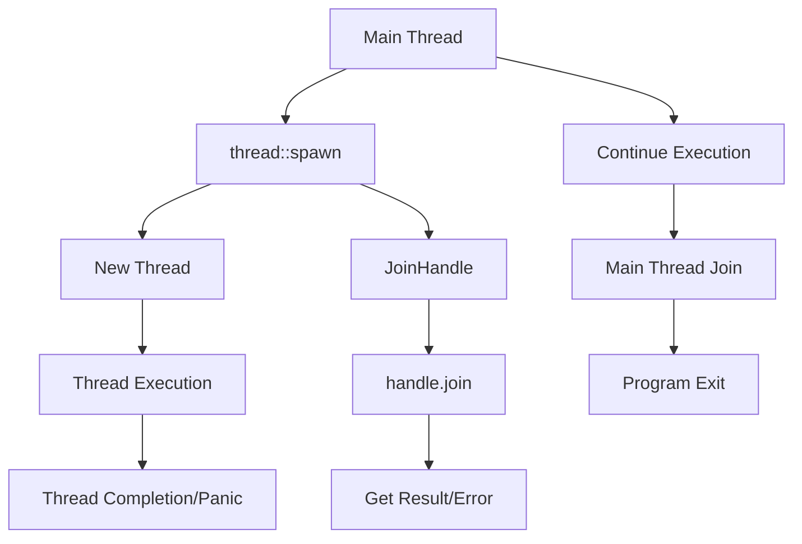

# Rust Thread Spawning

## Introduction

Concurrency is a powerful programming paradigm that allows multiple tasks to run simultaneously, improving performance and responsiveness in applications. In Rust, one of the primary ways to achieve concurrency is through **threads**.

Threads are independent sequences of execution that can run in parallel, allowing your program to perform multiple operations at the same time. Rust provides a safe and efficient threading model through its standard library, with powerful abstractions that help prevent common concurrency bugs like data races.

In this tutorial, we'll explore how to create and manage threads in Rust, focusing on the `spawn` function from the standard library. By the end, you'll be able to write programs that leverage multiple threads to perform concurrent operations safely.

## Basic Thread Creation

Let's start with the most fundamental operation: creating a new thread. Rust's standard library provides the `std::thread` module for thread management.

Here's a simple example of spawning a thread:

```rust
use std::thread;
use std::time::Duration;

fn main() {
    // The main thread
    println!("Main thread: Hello from the main thread!");

    // Spawn a new thread
    thread::spawn(|| {
        println!("New thread: Hello from a new thread!");
        
        // Simulate some work
        thread::sleep(Duration::from_millis(100));
        
        println!("New thread: Work completed!");
    });

    // The main thread continues execution
    println!("Main thread: Continuing execution...");
    
    // Sleep to give the spawned thread time to finish
    thread::sleep(Duration::from_millis(200));
    
    println!("Main thread: Exiting program");
}
```

**Output:**
```
Main thread: Hello from the main thread!
New thread: Hello from a new thread!
Main thread: Continuing execution...
New thread: Work completed!
Main thread: Exiting program
```

### What's Happening Here?

1. We import the `thread` module from the standard library.
2. In the `main` function, we print a message from the main thread.
3. We call `thread::spawn` with a closure (an anonymous function) that contains the code to run in the new thread.
4. The main thread continues executing concurrently with the new thread.
5. We add a sleep to the main thread to ensure the program doesn't exit before the spawned thread completes its work.

> **Important:** When the main thread ends, the program exits, even if other threads are still running. That's why we added a sleep to the main thread in this example.

## Waiting for Threads to Complete

The previous example used a sleep as a crude way to wait for the spawned thread. However, Rust provides a more elegant solution with the `JoinHandle`.

When you spawn a thread, `thread::spawn` returns a `JoinHandle`, which you can use to wait for the thread to finish:

```rust
use std::thread;

fn main() {
    println!("Main thread: Starting program");

    // Spawn a thread and store its handle
    let handle = thread::spawn(|| {
        println!("Worker thread: I'm doing some work...");
        
        // Simulate work
        let result = expensive_calculation();
        
        println!("Worker thread: Work completed!");
        
        // Return a value from the thread
        result
    });

    println!("Main thread: Doing other work while the spawned thread is running");
    
    // Wait for the spawned thread to finish and get its return value
    let result = handle.join().unwrap();
    
    println!("Main thread: The spawned thread completed with result: {}", result);
    println!("Main thread: Exiting program");
}

fn expensive_calculation() -> u64 {
    println!("Worker thread: Performing expensive calculation...");
    
    // Simulate an expensive operation
    let mut sum = 0;
    for i in 1..1000000 {
        sum += i;
    }
    
    sum
}
```

**Output:**
```
Main thread: Starting program
Main thread: Doing other work while the spawned thread is running
Worker thread: I'm doing some work...
Worker thread: Performing expensive calculation...
Worker thread: Work completed!
Main thread: The spawned thread completed with result: 499999500000
Main thread: Exiting program
```

### Key Points About JoinHandle

1. The `join()` method blocks the current thread until the thread associated with the handle terminates.
2. It returns a `Result` containing the value returned by the thread's closure (on success) or an error (if the thread panicked).
3. Using `unwrap()` extracts the success value (but will panic if the thread panicked).

## Sharing Data Between Threads

One of the challenges with concurrent programming is safely sharing data between threads. Rust's ownership system helps prevent data races, but it also means you need to be explicit about how data is shared.

### Using Move Closures

To use values from the outer scope in a thread, you need to use the `move` keyword to transfer ownership of those values to the thread:

```rust
use std::thread;

fn main() {
    let message = String::from("Hello from the main thread!");
    
    // Use the 'move' keyword to transfer ownership of 'message' to the thread
    let handle = thread::spawn(move || {
        println!("New thread says: {}", message);
    });
    
    // The following line would cause a compile error because 'message' has been moved
    // println!("Main thread: {}", message);
    
    handle.join().unwrap();
}
```

**Output:**
```
New thread says: Hello from the main thread!
```

### Why This Matters

Without the `move` keyword, the thread could potentially outlive the data it's referencing, which would be unsafe. Rust's compiler ensures that this can't happen.

## Creating Multiple Threads

Often, you'll want to create multiple threads to perform parallel operations. Here's an example that creates a vector of threads and processes data in parallel:

```rust
use std::thread;

fn main() {
    let data = vec![1, 2, 3, 4, 5, 6, 7, 8, 9, 10];
    let chunk_size = 2;
    
    // Divide the data into chunks and process each chunk in a separate thread
    let mut handles = Vec::new();
    
    for chunk in data.chunks(chunk_size) {
        // Clone the chunk to own it in the new thread
        let chunk = chunk.to_vec();
        
        // Spawn a thread to process this chunk
        let handle = thread::spawn(move || {
            println!("Thread processing chunk: {:?}", chunk);
            
            // Process the data (in this case, just summing the values)
            let sum: i32 = chunk.iter().sum();
            
            println!("Thread result for chunk {:?}: {}", chunk, sum);
            sum
        });
        
        handles.push(handle);
    }
    
    // Collect the results from all threads
    let mut results = Vec::new();
    for handle in handles {
        let thread_result = handle.join().unwrap();
        results.push(thread_result);
    }
    
    println!("All thread results: {:?}", results);
    println!("Total sum: {}", results.iter().sum::<i32>());
}
```

**Output:**
```
Thread processing chunk: [1, 2]
Thread result for chunk [1, 2]: 3
Thread processing chunk: [3, 4]
Thread result for chunk [3, 4]: 7
Thread processing chunk: [5, 6]
Thread result for chunk [5, 6]: 11
Thread processing chunk: [7, 8]
Thread result for chunk [7, 8]: 15
Thread processing chunk: [9, 10]
Thread result for chunk [9, 10]: 19
All thread results: [3, 7, 11, 15, 19]
Total sum: 55
```

### What's Happening Here?

1. We divide our data into chunks.
2. For each chunk, we spawn a thread that processes the data.
3. We store the handles for all threads.
4. We then wait for each thread to complete and collect their results.
5. Finally, we compute the final result from all the thread results.

This pattern of dividing work and processing it in parallel is common in concurrent programming and is often called "divide and conquer."

## Thread Builder

For more control over thread creation, Rust provides a `Builder` API. This allows you to configure thread properties before spawning:

```rust
use std::thread;

fn main() {
    // Create a thread with a name and larger stack size
    let handle = thread::Builder::new()
        .name("worker-thread".to_string())
        .stack_size(4 * 1024 * 1024) // 4 MB stack
        .spawn(|| {
            println!("Hello from a named thread with a custom stack size!");
            println!("Current thread name: {:?}", thread::current().name());
        })
        .unwrap();
    
    handle.join().unwrap();
}
```

**Output:**
```
Hello from a named thread with a custom stack size!
Current thread name: Some("worker-thread")
```

### Builder Options

- `.name()`: Sets a descriptive name for the thread
- `.stack_size()`: Sets the stack size (in bytes) for the thread
- `.spawn()`: Creates and executes the thread with the specified configurations

## Real-World Example: Parallel Image Processing

Let's look at a more practical example that processes multiple images in parallel using threads:

```rust
use std::thread;
use std::time::{Duration, Instant};

// Simulated image processing function
fn process_image(image_id: usize) -> String {
    println!("Processing image {}...", image_id);
    
    // Simulate processing time (larger images take longer)
    let processing_time = Duration::from_millis((image_id % 5 + 1) * 100);
    thread::sleep(processing_time);
    
    format!("Processed image {} (took {:?})", image_id, processing_time)
}

fn main() {
    let image_count = 10;
    let start_time = Instant::now();
    
    println!("Starting parallel image processing for {} images", image_count);
    
    // Process images in parallel using threads
    let mut handles = Vec::new();
    
    for image_id in 0..image_count {
        let handle = thread::spawn(move || {
            process_image(image_id)
        });
        
        handles.push(handle);
    }
    
    // Collect results
    let mut results = Vec::new();
    for handle in handles {
        let result = handle.join().unwrap();
        results.push(result);
    }
    
    // Print results
    println!("
Results:");
    for result in &results {
        println!("  {}", result);
    }
    
    println!("
All images processed in {:?}", start_time.elapsed());
    
    // Compare with sequential processing
    let start_time = Instant::now();
    let mut sequential_results = Vec::new();
    
    for image_id in 0..image_count {
        sequential_results.push(process_image(image_id));
    }
    
    println!("
Sequential processing took {:?}", start_time.elapsed());
}
```

This example simulates processing multiple images in parallel, showing how threads can significantly improve performance for IO-bound or CPU-bound tasks.

## Thread Lifecycle Visualization

Here's a visual representation of the thread lifecycle in Rust:



## Common Pitfalls and Best Practices

### 1. Not Joining Threads

If you don't call `join()` on thread handles, the main thread might exit before the spawned threads finish their work. Always join threads if you want to ensure they complete their tasks.

### 2. Thread Panics

When a thread panics, the `join()` method will return an `Err`. You should handle this possibility:

```rust
use std::thread;

fn main() {
    let handle = thread::spawn(|| {
        panic!("Thread panic!");
    });
    
    // Handle the potential panic
    match handle.join() {
        Ok(_) => println!("Thread completed successfully"),
        Err(e) => println!("Thread panicked: {:?}", e),
    }
}
```

### 3. Too Many Threads

Creating too many threads can degrade performance due to context switching overhead. Consider using a thread pool (e.g., via the `rayon` crate) for work that requires many small tasks.

### 4. Sharing Mutable State

Sharing mutable state between threads requires synchronization mechanisms like mutexes. We'll cover these in a separate tutorial on thread synchronization.

## Summary

In this tutorial, we've covered:

- How to spawn threads in Rust using `thread::spawn`
- Using `JoinHandle` to wait for threads to complete
- Transferring ownership of data to threads with `move` closures
- Processing data in parallel with multiple threads
- Configuring threads with the `Builder` API
- A real-world example of parallel processing

Threads are a fundamental building block for concurrent programming in Rust. Combined with Rust's ownership system, they provide a powerful and safe way to write concurrent code.

## Exercises

1. Create a program that spawns 5 threads, each printing its thread ID and a counter from 1 to 5.
2. Modify the parallel image processing example to limit the number of concurrent threads to a maximum of 4.
3. Write a program that calculates the sum of all numbers from 1 to 1,000,000 by dividing the work among multiple threads.
4. Create a thread that spawns child threads, and ensure all threads are properly joined.

## Additional Resources

- [Rust Standard Library Documentation for std::thread](https://doc.rust-lang.org/std/thread/)
- [The Rust Programming Language Book, Chapter on Concurrency](https://doc.rust-lang.org/book/ch16-00-concurrency.html)
- [Rayon Crate](https://crates.io/crates/rayon) - For easy parallel iterators
- [Crossbeam Crate](https://crates.io/crates/crossbeam) - For advanced concurrent programming utilities