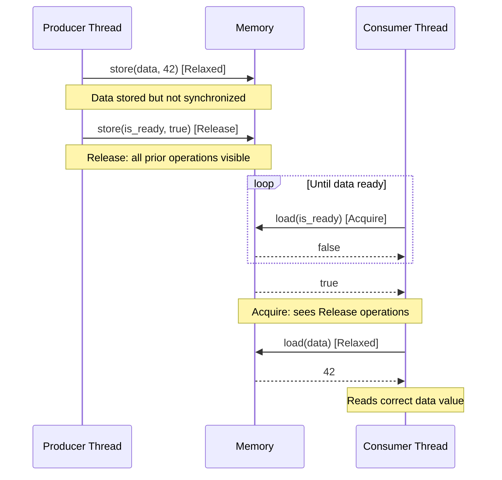

# Rust Atomics

## Introduction

When writing concurrent programs in Rust, you'll inevitably encounter situations where multiple threads need to access and modify the same data. Rust's ownership system helps prevent data races at compile time, but sometimes you need to share mutable state across threads. This is where **atomic operations** come into play.

Atomic operations are indivisible operations that appear to happen instantaneously to the rest of the system. In Rust, atomics provide a way to safely share and modify state across multiple threads without the overhead of locks. They are fundamental building blocks for implementing lock-free data structures and synchronization primitives.

In this guide, we'll explore:
- What atomic operations are and why they matter
- The atomic types available in Rust
- Common atomic operations and their use cases
- Building practical concurrent programs with atomics

## Atomic Types in Rust

Rust provides atomic versions of integer types and boolean values in the `std::sync::atomic` module:

| Atomic Type | Non-atomic Equivalent |
|-------------|------------------------|
| `AtomicBool` | `bool` |
| `AtomicI8` | `i8` |
| `AtomicU8` | `u8` |
| `AtomicI16` | `i16` |
| `AtomicU16` | `u16` |
| `AtomicI32` | `i32` |
| `AtomicU32` | `u32` |
| `AtomicI64` | `i64` |
| `AtomicU64` | `u64` |
| `AtomicIsize` | `isize` |
| `AtomicUsize` | `usize` |
| `AtomicPtr<T>` | `*mut T` |

Let's start with a simple example using `AtomicBool`:

```rust
use std::sync::atomic::{AtomicBool, Ordering};

fn main() {
    // Create a new atomic boolean initialized to false
    let ready = AtomicBool::new(false);
    
    // Read the current value
    let is_ready = ready.load(Ordering::Relaxed);
    println!("Is ready? {}", is_ready);  // Outputs: Is ready? false
    
    // Store a new value
    ready.store(true, Ordering::Relaxed);
    println!("Is ready now? {}", ready.load(Ordering::Relaxed));  // Outputs: Is ready now? true
}
```

## Memory Ordering

You might have noticed the `Ordering` parameter in the atomic operations above. This is a crucial concept in understanding atomics. Memory ordering defines the guarantees about how memory operations (both atomic and non-atomic) are observed by other threads.

Rust provides five ordering levels, from weakest to strongest:

1. **Relaxed** (`Ordering::Relaxed`): Provides no synchronization guarantees beyond the atomicity of the operation itself.
2. **Release** (`Ordering::Release`): When applied to a store operation, all previous memory operations become visible to other threads that perform an acquire operation on the same variable.
3. **Acquire** (`Ordering::Acquire`): When applied to a load operation, all subsequent memory operations will observe values that were made visible by a release operation on the same variable.
4. **AcqRel** (`Ordering::AcqRel`): Combines the effects of Acquire and Release. Used for operations that both load and store.
5. **SeqCst** (`Ordering::SeqCst`): The strongest ordering, providing a total order over all SeqCst operations.

For beginners, a good rule of thumb is:
- Use `Relaxed` when you only need atomic operations without synchronizing other memory accesses.
- Use `Acquire` for loads and `Release` for stores when you need to synchronize memory accesses.
- Use `SeqCst` when in doubt, though it might have a performance impact.

## Basic Atomic Operations

### Load and Store

The most basic operations are `load` and `store`:

```rust
use std::sync::atomic::{AtomicUsize, Ordering};

fn main() {
    let counter = AtomicUsize::new(0);
    
    // Load the current value
    let value = counter.load(Ordering::Relaxed);
    println!("Current value: {}", value);  // Outputs: Current value: 0
    
    // Store a new value
    counter.store(42, Ordering::Relaxed);
    println!("New value: {}", counter.load(Ordering::Relaxed));  // Outputs: New value: 42
}
```

### Fetch and Modify Operations

Atomics also provide operations that modify a value and return the previous value atomically:

```rust
use std::sync::atomic::{AtomicUsize, Ordering};

fn main() {
    let counter = AtomicUsize::new(0);
    
    // Increment and get the previous value
    let old_value = counter.fetch_add(1, Ordering::Relaxed);
    println!("Old value: {}, New value: {}", old_value, counter.load(Ordering::Relaxed));
    // Outputs: Old value: 0, New value: 1
    
    // Decrement and get the previous value
    let old_value = counter.fetch_sub(1, Ordering::Relaxed);
    println!("Old value: {}, New value: {}", old_value, counter.load(Ordering::Relaxed));
    // Outputs: Old value: 1, New value: 0
    
    // Bitwise operations
    counter.store(0b1010, Ordering::Relaxed);
    let old_value = counter.fetch_and(0b1100, Ordering::Relaxed);
    println!("After AND: old={:04b}, new={:04b}", old_value, counter.load(Ordering::Relaxed));
    // Outputs: After AND: old=1010, new=1000
    
    counter.store(0b1010, Ordering::Relaxed);
    let old_value = counter.fetch_or(0b0101, Ordering::Relaxed);
    println!("After OR: old={:04b}, new={:04b}", old_value, counter.load(Ordering::Relaxed));
    // Outputs: After OR: old=1010, new=1111
    
    counter.store(0b1010, Ordering::Relaxed);
    let old_value = counter.fetch_xor(0b1111, Ordering::Relaxed);
    println!("After XOR: old={:04b}, new={:04b}", old_value, counter.load(Ordering::Relaxed));
    // Outputs: After XOR: old=1010, new=0101
}
```

### Compare and Swap

The `compare_and_swap` and `compare_exchange` functions allow you to update a value only if it matches an expected value:

```rust
use std::sync::atomic::{AtomicUsize, Ordering};

fn main() {
    let value = AtomicUsize::new(5);
    
    // Try to change from 5 to 10
    let result = value.compare_and_swap(5, 10, Ordering::Relaxed);
    println!("CAS result: expected={}, got={}, now={}", 
             5, result, value.load(Ordering::Relaxed));
    // Outputs: CAS result: expected=5, got=5, now=10
    
    // Try to change from 5 to 20 (will fail because value is now 10)
    let result = value.compare_and_swap(5, 20, Ordering::Relaxed);
    println!("CAS result: expected={}, got={}, now={}", 
             5, result, value.load(Ordering::Relaxed));
    // Outputs: CAS result: expected=5, got=10, now=10
    
    // The newer compare_exchange returns a Result
    let result = value.compare_exchange(10, 15, Ordering::Acquire, Ordering::Relaxed);
    match result {
        Ok(prev) => println!("Success! Previous value: {}", prev),
        Err(prev) => println!("Failed! Current value: {}", prev),
    }
    // Outputs: Success! Previous value: 10
}
```

## Practical Example: Thread-Safe Counter

Let's implement a simple thread-safe counter that can be incremented from multiple threads:

```rust
use std::sync::atomic::{AtomicUsize, Ordering};
use std::sync::Arc;
use std::thread;

struct AtomicCounter {
    count: AtomicUsize,
}

impl AtomicCounter {
    fn new() -> Self {
        AtomicCounter {
            count: AtomicUsize::new(0),
        }
    }
    
    fn increment(&self) -> usize {
        self.count.fetch_add(1, Ordering::Relaxed) + 1
    }
    
    fn value(&self) -> usize {
        self.count.load(Ordering::Relaxed)
    }
}

fn main() {
    // Create a counter and wrap it in an Arc to share across threads
    let counter = Arc::new(AtomicCounter::new());
    let mut handles = vec![];
    
    // Spawn 10 threads that each increment the counter 1000 times
    for _ in 0..10 {
        let counter_clone = Arc::clone(&counter);
        let handle = thread::spawn(move || {
            for _ in 0..1000 {
                counter_clone.increment();
            }
        });
        handles.push(handle);
    }
    
    // Wait for all threads to finish
    for handle in handles {
        handle.join().unwrap();
    }
    
    println!("Final count: {}", counter.value());
    // Outputs: Final count: 10000
}
```

## Understanding Memory Ordering with a Producer-Consumer Example

To better understand memory ordering, let's build a simple producer-consumer scenario:

```rust
use std::sync::atomic::{AtomicBool, AtomicUsize, Ordering};
use std::sync::Arc;
use std::thread;
use std::time::Duration;

struct SharedData {
    data: AtomicUsize,
    is_ready: AtomicBool,
}

fn main() {
    let shared = Arc::new(SharedData {
        data: AtomicUsize::new(0),
        is_ready: AtomicBool::new(false),
    });
    
    // Producer thread
    let producer_shared = Arc::clone(&shared);
    let producer = thread::spawn(move || {
        // Prepare data (not visible to consumer yet)
        producer_shared.data.store(42, Ordering::Relaxed);
        println!("Producer: data prepared");
        
        // Signal that data is ready - use Release to make the data store visible
        producer_shared.is_ready.store(true, Ordering::Release);
        println!("Producer: signaled data is ready");
    });
    
    // Consumer thread
    let consumer_shared = Arc::clone(&shared);
    let consumer = thread::spawn(move || {
        // Wait for data to be ready
        while !consumer_shared.is_ready.load(Ordering::Acquire) {
            thread::sleep(Duration::from_millis(1));
        }
        
        // At this point, we're guaranteed to see the updated data value
        // due to the Acquire/Release synchronization
        let value = consumer_shared.data.load(Ordering::Relaxed);
        println!("Consumer: received data: {}", value);
    });
    
    producer.join().unwrap();
    consumer.join().unwrap();
}
```

In this example:
1. The producer prepares data and then sets a flag using `Ordering::Release`.
2. The consumer waits for the flag using `Ordering::Acquire`.
3. The Release-Acquire pairing ensures that when the consumer sees the flag set to true, it also sees all memory operations that happened before the flag was set.

This diagram illustrates the synchronization:



## Real-World Application: A Simple Lock-Free Queue

For a more advanced example, let's implement a simple single-producer, single-consumer queue using atomics:

```rust
use std::sync::atomic::{AtomicUsize, Ordering};
use std::sync::Arc;
use std::thread;

struct SpscQueue<T> {
    buffer: Vec<T>,
    capacity: usize,
    head: AtomicUsize,  // Where to dequeue (consumer)
    tail: AtomicUsize,  // Where to enqueue (producer)
}

impl<T: Default + Clone> SpscQueue<T> {
    fn new(capacity: usize) -> Self {
        let mut buffer = Vec::with_capacity(capacity);
        // Initialize buffer with default values
        for _ in 0..capacity {
            buffer.push(T::default());
        }
        
        SpscQueue {
            buffer,
            capacity,
            head: AtomicUsize::new(0),
            tail: AtomicUsize::new(0),
        }
    }
    
    // Producer method: try to enqueue an item
    fn enqueue(&self, item: T) -> Result<(), T> {
        let current_tail = self.tail.load(Ordering::Relaxed);
        let next_tail = (current_tail + 1) % self.capacity;
        
        // If the queue is full, return error
        if next_tail == self.head.load(Ordering::Acquire) {
            return Err(item);
        }
        
        // Store the item
        self.buffer[current_tail] = item;
        
        // Update tail (make the item visible to consumer)
        self.tail.store(next_tail, Ordering::Release);
        Ok(())
    }
    
    // Consumer method: try to dequeue an item
    fn dequeue(&self) -> Option<T> {
        let current_head = self.head.load(Ordering::Relaxed);
        
        // If the queue is empty, return None
        if current_head == self.tail.load(Ordering::Acquire) {
            return None;
        }
        
        // Get the item
        let item = self.buffer[current_head].clone();
        
        // Update head (mark the slot as consumable by producer)
        let next_head = (current_head + 1) % self.capacity;
        self.head.store(next_head, Ordering::Release);
        
        Some(item)
    }
}

fn main() {
    let queue = Arc::new(SpscQueue::<String>::new(10));
    
    // Producer thread
    let producer_queue = Arc::clone(&queue);
    let producer = thread::spawn(move || {
        for i in 0..5 {
            let item = format!("Item {}", i);
            match producer_queue.enqueue(item.clone()) {
                Ok(_) => println!("Produced: {}", item),
                Err(_) => println!("Queue full, couldn't produce: {}", item),
            }
        }
    });
    
    // Small delay to let producer get ahead
    thread::sleep(std::time::Duration::from_millis(10));
    
    // Consumer thread
    let consumer_queue = Arc::clone(&queue);
    let consumer = thread::spawn(move || {
        for _ in 0..7 {
            match consumer_queue.dequeue() {
                Some(item) => println!("Consumed: {}", item),
                None => println!("Queue empty, nothing to consume"),
            }
            // Add a small delay to demonstrate emptying the queue
            thread::sleep(std::time::Duration::from_millis(5));
        }
    });
    
    producer.join().unwrap();
    consumer.join().unwrap();
}
```

This queue implementation:
1. Uses atomics for the head and tail indices
2. Employs proper memory ordering to ensure visibility across threads
3. Provides lock-free concurrent access for one producer and one consumer

## When to Use Atomics vs. Mutexes

While atomics provide powerful primitives for concurrent programming, they're not always the best choice:

| Atomics | Mutexes |
|---------|---------|
| Best for simple operations on primitive types | Best for complex data structures |
| Lower overhead, no blocking | Higher overhead, can block threads |
| More difficult to use correctly | Easier to reason about |
| Risk of subtle bugs with incorrect memory ordering | Safer due to explicit locking |

Use atomics when:
- You need high-performance concurrent access to a single primitive value
- You're building lock-free data structures
- You need fine-grained control over synchronization

Use mutexes when:
- You need to protect complex data structures
- You need to perform multiple operations atomically
- Simplicity and correctness are more important than absolute performance

## Common Pitfalls and Best Practices

### 1. Avoid Using Atomics for Complex Operations

Atomics are great for simple operations, but they become tricky for complex ones. Consider this incorrect attempt to atomically increment a value only if it's even:

```rust
use std::sync::atomic::{AtomicUsize, Ordering};

fn main() {
    let value = AtomicUsize::new(0);
    
    // INCORRECT: Not atomic as a whole
    if value.load(Ordering::Relaxed) % 2 == 0 {
        value.fetch_add(1, Ordering::Relaxed);
    }
    
    // CORRECT: Using compare_exchange in a loop
    let mut current = value.load(Ordering::Relaxed);
    loop {
        if current % 2 != 0 {
            break; // Not even, don't increment
        }
        
        match value.compare_exchange(
            current, current + 1,
            Ordering::Relaxed, Ordering::Relaxed
        ) {
            Ok(_) => break, // Success!
            Err(new_current) => current = new_current, // Try again
        }
    }
}
```

### 2. Choose the Right Memory Ordering

Using stronger memory ordering than necessary can hurt performance, while using weaker ordering than necessary can lead to subtle bugs. When in doubt, it's safer to use stronger ordering.

### 3. Test Thoroughly

Concurrent code with atomics can have subtle race conditions that only manifest under specific timings. Use tools like `loom` for systematic testing of concurrent Rust code.

## Summary

Rust atomics provide powerful primitives for building safe concurrent programs without the overhead of locks. They allow for fine-grained control over synchronization but require careful attention to memory ordering to ensure correctness.

In this guide, we've covered:
- The atomic types available in Rust
- Basic atomic operations (load, store, fetch_add, etc.)
- Memory ordering and its importance in concurrent programming
- Practical examples of using atomics for thread-safe data structures
- When to use atomics vs. other synchronization mechanisms

Mastering atomics will give you the tools to build efficient concurrent Rust programs and understand the foundations of synchronization primitives in the standard library.

## Exercises

1. Implement a thread-safe version of a boolean flag that can be toggled atomically.
2. Extend the atomic counter example to track the maximum value seen across all threads.
3. Implement a simple spin lock using `AtomicBool`.
4. Modify the producer-consumer example to handle multiple producers or multiple consumers.
5. Use atomics to implement a simple barrier that waits for a fixed number of threads to arrive before letting any proceed.

## Additional Resources

- [Rust Documentation on Atomics](https://doc.rust-lang.org/std/sync/atomic/index.html)
- "Rust Atomics and Locks" by Mara Bos
- [The Rustonomicon: Atomics](https://doc.rust-lang.org/nomicon/atomics.html)
- [Rust Cookbook: Concurrency](https://rust-lang-nursery.github.io/rust-cookbook/concurrency.html)
- [Understanding the Rust Memory Model](https://github.com/nikomatsakis/rust-memory-model)