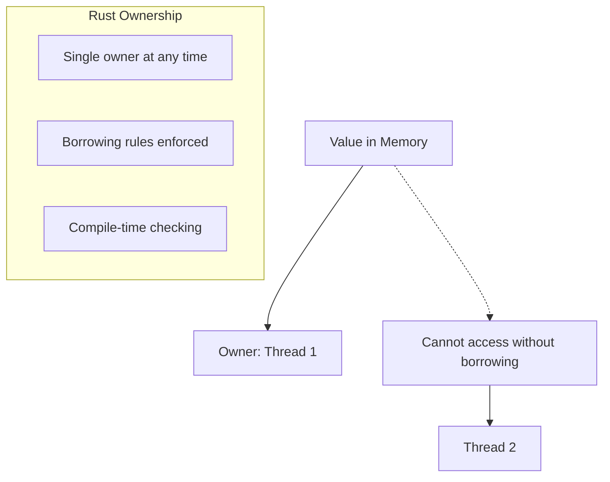
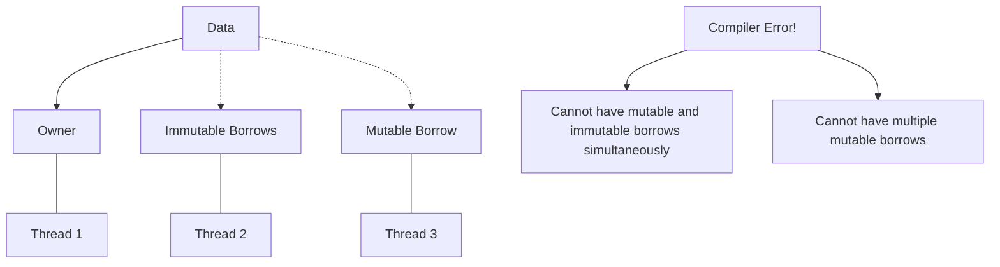

# Rust Fearless Concurrency

## Introduction

Concurrency is one of the most challenging aspects of programming. Writing code that can do multiple things at once introduces complexity that can lead to subtle bugs that are difficult to reproduce and fix. These issues include:

- **Race conditions**: when the behavior of code depends on the timing or sequence of events that can't be controlled
- **Deadlocks**: when two threads wait for each other to finish, causing both to get stuck
- **Data corruption**: when multiple threads access and modify the same data without proper synchronization

Rust addresses these challenges with its "fearless concurrency" approach. The ownership system, which is central to Rust's design, helps prevent memory-related bugs and extends naturally to prevent concurrency issues. This means Rust can catch many concurrency errors at compile time rather than at runtime.

In this guide, we'll explore how Rust's ownership rules enable safe concurrent programming and look at practical examples of concurrent code.

## The Foundation: Ownership and Concurrency

Rust's ownership system provides three key rules:

1. Each value has a single owner
2. There can only be one owner at a time
3. When the owner goes out of scope, the value is dropped

These rules prevent problems like use-after-free and double-free bugs. They also prevent data races in concurrent code by ensuring that multiple threads can't modify the same data simultaneously without explicit synchronization.

Let's visualize how Rust's ownership model applies to concurrency:



## Basic Concurrency with Threads

Let's start with a simple example of creating threads in Rust:

```rust
use std::thread;
use std::time::Duration;

fn main() {
    // Spawn a new thread
    let handle = thread::spawn(|| {
        for i in 1..10 {
            println!("Count from spawned thread: {}", i);
            thread::sleep(Duration::from_millis(1));
        }
    });

    // Code in the main thread
    for i in 1..5 {
        println!("Count from main thread: {}", i);
        thread::sleep(Duration::from_millis(1));
    }

    // Wait for the spawned thread to finish
    handle.join().unwrap();
}
```

Output (may vary due to thread scheduling):
```
Count from main thread: 1
Count from spawned thread: 1
Count from main thread: 2
Count from spawned thread: 2
Count from main thread: 3
Count from spawned thread: 3
Count from main thread: 4
Count from spawned thread: 4
Count from spawned thread: 5
Count from spawned thread: 6
Count from spawned thread: 7
Count from spawned thread: 8
Count from spawned thread: 9
```

In this example, we:
1. Create a new thread using `thread::spawn`
2. Pass a closure with the code we want to run in the new thread
3. Store the thread handle returned by `spawn`
4. Call `join` on the handle to wait for the thread to finish

Both the main thread and the spawned thread run their code concurrently. The exact interleaving of the output depends on how the operating system schedules the threads.

## Sharing Data Between Threads

Attempting to share data between threads can expose the challenges of concurrent programming. Let's see how Rust's ownership system helps prevent data races:

```rust
use std::thread;

fn main() {
    let v = vec![1, 2, 3];
    
    let handle = thread::spawn(|| {
        println!("Vector in thread: {:?}", v); // Error! 'v' is accessed here but may be dropped by the main thread
    });
    
    handle.join().unwrap();
}
```

This code won't compile because the closure might capture `v` by reference, but Rust can't guarantee that `v` will live as long as the thread. The main thread might drop `v` before the spawned thread uses it.

To fix this, we need to use the `move` keyword:

```rust
use std::thread;

fn main() {
    let v = vec![1, 2, 3];
    
    let handle = thread::spawn(move || {
        println!("Vector in thread: {:?}", v); // This works now!
    });
    
    // We can no longer use 'v' here because ownership was transferred to the spawned thread
    
    handle.join().unwrap();
}
```

Output:
```
Vector in thread: [1, 2, 3]
```

The `move` keyword tells Rust to transfer ownership of `v` to the closure, ensuring that `v` will be valid for the entire lifetime of the thread.

## Thread-Safe Smart Pointers

Sometimes we need multiple threads to access the same data. Rust provides thread-safe smart pointers to enable this safely:

### Using Arc (Atomic Reference Counting)

`Arc<T>` is a thread-safe version of `Rc<T>` that allows multiple threads to share ownership of a value:

```rust
use std::sync::Arc;
use std::thread;

fn main() {
    // Create data wrapped in an Arc
    let data = Arc::new(vec![1, 2, 3, 4, 5]);
    
    // Create multiple threads
    let mut handles = vec![];
    
    for i in 0..3 {
        // Clone the Arc - this increases the reference count, not copies the data
        let data_clone = Arc::clone(&data);
        
        // Spawn a thread that uses the data
        let handle = thread::spawn(move || {
            println!("Thread {}: {:?}", i, data_clone);
        });
        
        handles.push(handle);
    }
    
    // Wait for all threads to finish
    for handle in handles {
        handle.join().unwrap();
    }
}
```

Output:
```
Thread 0: [1, 2, 3, 4, 5]
Thread 1: [1, 2, 3, 4, 5]
Thread 2: [1, 2, 3, 4, 5]
```

In this example, multiple threads can access the same data safely because `Arc` provides shared, immutable access. But what if we need to modify the data?

## Mutexes for Safe Mutable Access

When multiple threads need to modify shared data, we need a mutex (mutual exclusion):

```rust
use std::sync::{Arc, Mutex};
use std::thread;

fn main() {
    // Create a mutex-protected counter inside an Arc
    let counter = Arc::new(Mutex::new(0));
    let mut handles = vec![];
    
    for _ in 0..10 {
        let counter_clone = Arc::clone(&counter);
        
        let handle = thread::spawn(move || {
            // Lock the mutex to get exclusive access
            let mut num = counter_clone.lock().unwrap();
            
            // Modify the data
            *num += 1;
            
            // Mutex is automatically unlocked when `num` goes out of scope
        });
        
        handles.push(handle);
    }
    
    for handle in handles {
        handle.join().unwrap();
    }
    
    // Print the final value
    println!("Final counter value: {}", *counter.lock().unwrap());
}
```

Output:
```
Final counter value: 10
```

Here's how it works:
1. We create a counter protected by both an `Arc` (for sharing across threads) and a `Mutex` (for safe mutation)
2. Each thread locks the mutex, increments the counter, and then releases the lock
3. The mutex ensures that only one thread can modify the counter at a time

This prevents data races while allowing shared mutable state.

## Message Passing Between Threads

Another approach to concurrent programming is to avoid shared state and use message passing instead. Rust's standard library provides channels for this purpose:

```rust
use std::sync::mpsc; // multi-producer, single-consumer
use std::thread;
use std::time::Duration;

fn main() {
    // Create a channel
    let (tx, rx) = mpsc::channel();
    
    // Spawn a thread to send messages
    thread::spawn(move || {
        let messages = vec![
            "Hello",
            "from",
            "the",
            "other",
            "thread",
        ];
        
        for msg in messages {
            tx.send(msg).unwrap();
            thread::sleep(Duration::from_millis(100));
        }
    });
    
    // Receive messages in the main thread
    for received in rx {
        println!("Received: {}", received);
    }
}
```

Output:
```
Received: Hello
Received: from
Received: the
Received: other
Received: thread
```

In this example:
1. We create a channel with a transmitter (`tx`) and receiver (`rx`)
2. The spawned thread sends messages through the transmitter
3. The main thread receives messages through the receiver
4. The channel ensures that messages are safely transferred between threads

Multiple producers can be created by cloning the transmitter:

```rust
use std::sync::mpsc;
use std::thread;
use std::time::Duration;

fn main() {
    let (tx, rx) = mpsc::channel();
    
    // Clone the transmitter for a second producer
    let tx1 = tx.clone();
    
    // First producer thread
    thread::spawn(move || {
        let messages = vec!["Hello", "from", "thread", "1"];
        
        for msg in messages {
            tx.send(msg).unwrap();
            thread::sleep(Duration::from_millis(100));
        }
    });
    
    // Second producer thread
    thread::spawn(move || {
        let messages = vec!["Message", "from", "thread", "2"];
        
        for msg in messages {
            tx1.send(msg).unwrap();
            thread::sleep(Duration::from_millis(150));
        }
    });
    
    // Receive all messages in the main thread
    for received in rx {
        println!("Received: {}", received);
    }
}
```

The output will show messages from both threads interleaved based on timing, demonstrating how multiple producers can send messages to a single consumer.

## Real-World Example: Parallel Image Processing

Let's implement a more practical example: processing multiple images in parallel using threads.

```rust
use std::sync::{Arc, Mutex};
use std::thread;
use std::time::Duration;

// Simulating an image with dimensions and pixel data
struct Image {
    id: usize,
    width: usize,
    height: usize,
    // In a real application, this would be the actual pixel data
}

impl Image {
    fn new(id: usize, width: usize, height: usize) -> Self {
        Image { id, width, height }
    }
    
    // Simulate image processing
    fn process(&self) -> ProcessedImage {
        // Simulate processing time based on image size
        let processing_time = (self.width * self.height) as u64 / 100000;
        thread::sleep(Duration::from_millis(processing_time));
        
        ProcessedImage {
            id: self.id,
            width: self.width,
            height: self.height,
            is_processed: true,
        }
    }
}

// The result of processing an image
struct ProcessedImage {
    id: usize,
    width: usize,
    height: usize,
    is_processed: bool,
}

fn main() {
    // Create some test images
    let images = vec![
        Image::new(1, 800, 600),
        Image::new(2, 1024, 768),
        Image::new(3, 1920, 1080),
        Image::new(4, 2560, 1440),
        Image::new(5, 3840, 2160),
    ];
    
    println!("Processing {} images...", images.len());
    
    // Store results in a thread-safe collection
    let results = Arc::new(Mutex::new(Vec::new()));
    let mut handles = Vec::new();
    
    let start_time = std::time::Instant::now();
    
    // Process each image in its own thread
    for image in images {
        let results_clone = Arc::clone(&results);
        
        let handle = thread::spawn(move || {
            println!("Processing image {} ({} x {})...", image.id, image.width, image.height);
            let processed = image.process();
            
            // Store the result
            let mut results = results_clone.lock().unwrap();
            results.push(processed);
        });
        
        handles.push(handle);
    }
    
    // Wait for all threads to complete
    for handle in handles {
        handle.join().unwrap();
    }
    
    let elapsed = start_time.elapsed();
    
    // Access the results
    let results = results.lock().unwrap();
    println!("All images processed in {:.2?}!", elapsed);
    println!("Processed {} images:", results.len());
    
    for processed in results.iter() {
        println!("Image {}: {} x {}, processed: {}", 
                 processed.id, processed.width, processed.height, processed.is_processed);
    }
}
```

Sample output:
```
Processing 5 images...
Processing image 1 (800 x 600)...
Processing image 2 (1024 x 768)...
Processing image 3 (1920 x 1080)...
Processing image 4 (2560 x 1440)...
Processing image 5 (3840 x 2160)...
All images processed in 0.83s!
Processed 5 images:
Image 1: 800 x 600, processed: true
Image 2: 1024 x 768, processed: true
Image 3: 1920 x 1080, processed: true
Image 4: 2560 x 1440, processed: true
Image 5: 3840 x 2160, processed: true
```

This example:
1. Creates a list of images to process
2. Spawns a thread for each image
3. Processes the images in parallel
4. Collects the results in a thread-safe vector
5. Reports on the overall processing time and results

Processing the images in parallel makes better use of multi-core CPUs and completes the task faster than processing them sequentially would.

## The Power of the Borrow Checker

The key to Rust's fearless concurrency is the borrow checker, which enforces the ownership rules at compile time. Let's visualize how the borrow checker prevents data races:



The borrow checker ensures:
1. Either multiple threads can have immutable (read-only) access to data
2. Or exactly one thread can have mutable (read-write) access
3. But never both at the same time

This prevents data races at compile time without runtime overhead.

## Advanced Concurrency Patterns

Beyond the basics, Rust offers several advanced concurrency patterns:

### Read-Write Locks (RwLock)

When you need multiple readers or a single writer:

```rust
use std::sync::{Arc, RwLock};
use std::thread;

fn main() {
    let data = Arc::new(RwLock::new(vec![1, 2, 3]));
    let mut handles = vec![];
    
    // Spawn 3 reader threads
    for i in 0..3 {
        let data_clone = Arc::clone(&data);
        handles.push(thread::spawn(move || {
            // Acquire a read lock - multiple readers can have access simultaneously
            let values = data_clone.read().unwrap();
            println!("Reader {}: {:?}", i, *values);
        }));
    }
    
    // Spawn a writer thread
    let data_clone = Arc::clone(&data);
    handles.push(thread::spawn(move || {
        // Acquire a write lock - exclusive access
        let mut values = data_clone.write().unwrap();
        values.push(4);
        println!("Writer: {:?}", *values);
    }));
    
    for handle in handles {
        handle.join().unwrap();
    }
}
```

### Atomic Types

For simple operations without the overhead of locks:

```rust
use std::sync::atomic::{AtomicUsize, Ordering};
use std::sync::Arc;
use std::thread;

fn main() {
    let counter = Arc::new(AtomicUsize::new(0));
    let mut handles = vec![];
    
    for _ in 0..10 {
        let counter_clone = Arc::clone(&counter);
        handles.push(thread::spawn(move || {
            // Atomic increment without locks
            counter_clone.fetch_add(1, Ordering::SeqCst);
        }));
    }
    
    for handle in handles {
        handle.join().unwrap();
    }
    
    println!("Final counter value: {}", counter.load(Ordering::SeqCst));
}
```

### Thread Pools and Rayon

For more efficient thread management, Rust has libraries like Rayon:

```rust
use rayon::prelude::*;

fn main() {
    let numbers: Vec<i32> = (1..1000).collect();
    
    // Sequential sum
    let sum_sequential: i32 = numbers.iter().sum();
    
    // Parallel sum using Rayon
    let sum_parallel: i32 = numbers.par_iter().sum();
    
    println!("Sequential sum: {}", sum_sequential);
    println!("Parallel sum: {}", sum_parallel);
}
```

## Common Concurrency Patterns and Pitfalls

### The Producer-Consumer Pattern

One of the most common concurrency patterns is the producer-consumer pattern, where one or more threads produce data and one or more threads consume it:

```rust
use std::sync::{Arc, Mutex};
use std::sync::mpsc;
use std::thread;
use std::time::Duration;

// Simulate work
fn process_data(id: u32, data: u32) -> u32 {
    println!("Worker {}: processing data {}", id, data);
    thread::sleep(Duration::from_millis(500));
    data * 2
}

fn main() {
    // Create a channel
    let (tx, rx) = mpsc::channel();
    let rx = Arc::new(Mutex::new(rx));
    
    // Spawn consumer threads
    let mut handles = vec![];
    for i in 0..4 {
        let rx_clone = Arc::clone(&rx);
        
        handles.push(thread::spawn(move || {
            // Loop until channel is closed
            loop {
                // Try to get data
                let data = {
                    let rx = rx_clone.lock().unwrap();
                    match rx.try_recv() {
                        Ok(data) => data,
                        Err(_) => break, // Channel empty or closed
                    }
                };
                
                // Process data
                let result = process_data(i, data);
                println!("Worker {}: finished processing, result = {}", i, result);
            }
        }));
    }
    
    // Produce data
    for i in 1..=10 {
        tx.send(i).unwrap();
        thread::sleep(Duration::from_millis(100));
    }
    
    // Close channel by dropping the transmitter
    drop(tx);
    
    // Wait for all workers to finish
    for handle in handles {
        handle.join().unwrap();
    }
    
    println!("All work completed!");
}
```

### Avoiding Deadlocks

Deadlocks occur when two threads wait for each other to release resources. Here's a simple example of a deadlock:

```rust
use std::sync::{Mutex, Arc};
use std::thread;
use std::time::Duration;

fn main() {
    let resource_a = Arc::new(Mutex::new(1));
    let resource_b = Arc::new(Mutex::new(2));
    
    let resource_a_clone = Arc::clone(&resource_a);
    let resource_b_clone = Arc::clone(&resource_b);
    
    let thread_a = thread::spawn(move || {
        // Thread A locks resource A
        let _a = resource_a_clone.lock().unwrap();
        println!("Thread A acquired resource A");
        
        // Simulate some work
        thread::sleep(Duration::from_millis(100));
        
        // Thread A tries to lock resource B
        println!("Thread A waiting for resource B");
        let _b = resource_b_clone.lock().unwrap();
        println!("Thread A acquired resource B");
    });
    
    let thread_b = thread::spawn(move || {
        // Thread B locks resource B
        let _b = resource_b.lock().unwrap();
        println!("Thread B acquired resource B");
        
        // Simulate some work
        thread::sleep(Duration::from_millis(100));
        
        // Thread B tries to lock resource A
        println!("Thread B waiting for resource A");
        let _a = resource_a.lock().unwrap();
        println!("Thread B acquired resource A");
    });
    
    thread_a.join().unwrap();
    thread_b.join().unwrap();
    
    println!("No deadlock occurred!");
}
```

To avoid deadlocks:
1. Always acquire locks in the same order
2. Use timeouts when acquiring locks
3. Use higher-level abstractions like channels when possible

## Summary

Rust's approach to concurrency is truly revolutionary. By leveraging the ownership system, Rust allows you to write concurrent code with confidence:

- **Safety**: The ownership system prevents data races at compile time
- **Expressiveness**: Rust provides high-level abstractions for concurrency patterns
- **Control**: You can choose the concurrency model that best suits your problem

Rust's fearless concurrency doesn't mean your code will be free of all concurrency bugs—logical errors like deadlocks are still possible. However, it eliminates entire categories of bugs like data races at compile time, making concurrent programming much more approachable.

By understanding and applying the patterns we've covered in this guide, you can write concurrent Rust code that is both safe and efficient.

## Additional Resources

- [The Rust Book - Chapter on Fearless Concurrency](https://doc.rust-lang.org/book/ch16-00-concurrency.html)
- [Rustonomicon - Concurrency Chapter](https://doc.rust-lang.org/nomicon/concurrency.html)
- [Rayon Documentation](https://docs.rs/rayon/latest/rayon/) - For data parallelism
- [Crossbeam Documentation](https://docs.rs/crossbeam/latest/crossbeam/) - For advanced concurrency primitives
- [Tokio Documentation](https://tokio.rs/) - For asynchronous programming

## Exercises

1. **Basic Threads**: Create a program that spawns 5 threads, each printing its thread ID and sleeping for a random duration between 1 and 5 seconds.

2. **Shared Counter**: Implement a thread-safe counter that can be incremented by multiple threads. Compare implementations using `Mutex<T>` and `AtomicUsize`.

3. **Producer-Consumer**: Implement a producer-consumer pattern where one thread generates random numbers and multiple consumer threads process them (e.g., check if they're prime).

4. **Parallel File Processing**: Write a program that reads multiple text files in parallel and counts the total number of words across all files.

5. **Advanced: Web Crawler**: Implement a simple parallel web crawler that fetches multiple web pages concurrently and extracts links from them.