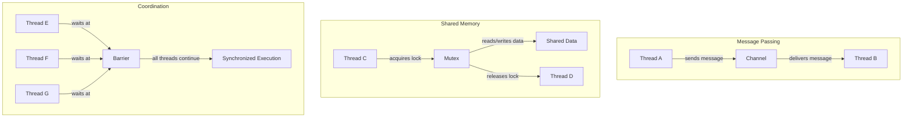

# Rust Thread Communication

## Introduction

When working with multiple threads in Rust, one of the most important aspects is how these threads communicate with each other. Thread communication is essential for coordinating work, sharing data, and ensuring that concurrent operations happen in the correct order.

In this guide, we'll explore different ways threads can communicate in Rust, focusing on:

1. Channels (message passing)
2. Shared memory with synchronization primitives
3. Barriers and other coordination mechanisms

By the end of this guide, you'll understand how to implement safe and efficient thread communication in your Rust applications.

## Message Passing with Channels

Channels are one of the most common ways for threads to communicate in Rust. They follow the principle of "Do not communicate by sharing memory; instead, share memory by communicating," which is a core philosophy in Rust's concurrency model.

### What are Channels?

A channel is like a pipe connecting two threads, allowing them to send and receive messages. In Rust, channels have two ends:

- A **transmitter (tx)** - used to send messages
- A **receiver (rx)** - used to receive messages

Rust's standard library provides several types of channels through the `std::sync::mpsc` module (where mpsc stands for Multiple Producer, Single Consumer).

### Basic Channel Example

Let's start with a simple example where we create a channel and use it to send a message from one thread to another:

```rust
use std::sync::mpsc;
use std::thread;

fn main() {
    // Create a new channel
    let (tx, rx) = mpsc::channel();
    
    // Spawn a new thread
    thread::spawn(move || {
        // Send a message through the channel
        tx.send("Hello from another thread!").unwrap();
    });
    
    // Receive the message in the main thread
    let received = rx.recv().unwrap();
    println!("Got: {}", received);
}
```

**Output:**
```
Got: Hello from another thread!
```

In this example:
1. We create a channel using `mpsc::channel()`
2. We spawn a new thread and move the transmitter (`tx`) into it
3. The spawned thread sends a message through the channel
4. The main thread receives the message using the receiver (`rx`)

### Sending Multiple Messages

Channels can be used to send multiple messages. Let's see an example:

```rust
use std::sync::mpsc;
use std::thread;
use std::time::Duration;

fn main() {
    let (tx, rx) = mpsc::channel();
    
    thread::spawn(move || {
        let messages = vec![
            "Message 1",
            "Message 2",
            "Message 3",
            "Message 4",
        ];
        
        for msg in messages {
            tx.send(msg).unwrap();
            thread::sleep(Duration::from_millis(200));
        }
    });
    
    // Receive all messages
    for received in rx {
        println!("Got: {}", received);
    }
}
```

**Output:**
```
Got: Message 1
Got: Message 2
Got: Message 3
Got: Message 4
```

### Multiple Producers

The "mp" in "mpsc" stands for multiple producers. This means we can clone the transmitter and send messages from multiple threads:

```rust
use std::sync::mpsc;
use std::thread;

fn main() {
    let (tx, rx) = mpsc::channel();
    
    // Clone the transmitter for the second thread
    let tx1 = tx.clone();
    
    // Spawn first thread
    thread::spawn(move || {
        tx.send("Message from thread 1").unwrap();
    });
    
    // Spawn second thread
    thread::spawn(move || {
        tx1.send("Message from thread 2").unwrap();
    });
    
    // Receive two messages
    for _ in 0..2 {
        let received = rx.recv().unwrap();
        println!("Got: {}", received);
    }
}
```

**Output (order may vary):**
```
Got: Message from thread 1
Got: Message from thread 2
```

### Synchronous Channels

By default, `mpsc::channel()` creates an asynchronous channel with unlimited buffer capacity. If you want to limit the buffer size or create a synchronous channel (where the sender blocks until the message is received), you can use `mpsc::sync_channel()`:

```rust
use std::sync::mpsc;
use std::thread;
use std::time::Duration;

fn main() {
    // Create a synchronous channel with a buffer size of 0
    let (tx, rx) = mpsc::sync_channel(0);
    
    thread::spawn(move || {
        println!("Sending message...");
        tx.send("Synchronous message").unwrap();
        println!("Message sent!");
    });
    
    // Sleep to demonstrate the blocking behavior
    println!("Main thread sleeping...");
    thread::sleep(Duration::from_secs(2));
    
    // Now receive the message
    println!("Receiving message...");
    let received = rx.recv().unwrap();
    println!("Got: {}", received);
}
```

**Output:**
```
Main thread sleeping...
Sending message...
(2 second pause)
Receiving message...
Message sent!
Got: Synchronous message
```

Notice how the "Message sent!" output appears after the main thread receives the message, demonstrating the blocking behavior of synchronous channels.

## Thread Communication Using Shared Memory

While message passing is the preferred way to communicate between threads in Rust, sometimes shared memory is more appropriate, especially for performance-critical code.

Rust uses synchronization primitives to ensure that shared memory access is safe. Let's explore some of these primitives.

### Mutex (Mutual Exclusion)

A Mutex ensures that only one thread can access the data at a time. Here's how to use a Mutex to share data between threads:

```rust
use std::sync::{Arc, Mutex};
use std::thread;

fn main() {
    // Create a mutex containing a vector
    let counter = Arc::new(Mutex::new(0));
    let mut handles = vec![];
    
    for _ in 0..10 {
        // Clone the Arc to share the Mutex between threads
        let counter = Arc::clone(&counter);
        
        // Spawn a thread that increments the counter
        let handle = thread::spawn(move || {
            let mut num = counter.lock().unwrap();
            *num += 1;
            // The lock is automatically released when num goes out of scope
        });
        
        handles.push(handle);
    }
    
    // Wait for all threads to finish
    for handle in handles {
        handle.join().unwrap();
    }
    
    // Print the final value
    println!("Final counter value: {}", *counter.lock().unwrap());
}
```

**Output:**
```
Final counter value: 10
```

In this example:
1. We create a `Mutex` containing a counter (initialized to 0)
2. We wrap it in an `Arc` (Atomic Reference Counting) to allow sharing between threads
3. We spawn 10 threads, each incrementing the counter by 1
4. We wait for all threads to finish and then print the final value

### RwLock (Reader-Writer Lock)

A `RwLock` allows multiple readers or a single writer to access the data at any time. This is useful when you have data that is read more often than it is written:

```rust
use std::sync::{Arc, RwLock};
use std::thread;

fn main() {
    // Create a RwLock containing a vector
    let data = Arc::new(RwLock::new(vec![1, 2, 3]));
    let mut handles = vec![];
    
    // Spawn 3 reader threads
    for i in 0..3 {
        let data = Arc::clone(&data);
        let handle = thread::spawn(move || {
            // Acquire a read lock
            let values = data.read().unwrap();
            println!("Reader {}: {:?}", i, *values);
            // Read lock is released when values goes out of scope
        });
        handles.push(handle);
    }
    
    // Spawn a writer thread
    let data = Arc::clone(&data);
    let handle = thread::spawn(move || {
        // Acquire a write lock
        let mut values = data.write().unwrap();
        values.push(4);
        println!("Writer: {:?}", *values);
        // Write lock is released when values goes out of scope
    });
    handles.push(handle);
    
    // Wait for all threads to finish
    for handle in handles {
        handle.join().unwrap();
    }
    
    // Print the final data
    println!("Final data: {:?}", *data.read().unwrap());
}
```

**Output (order may vary):**
```
Reader 0: [1, 2, 3]
Reader 1: [1, 2, 3]
Reader 2: [1, 2, 3]
Writer: [1, 2, 3, 4]
Final data: [1, 2, 3, 4]
```

### Atomic Types

For simple types like integers, Rust provides atomic types that allow for lock-free concurrent access:

```rust
use std::sync::atomic::{AtomicUsize, Ordering};
use std::sync::Arc;
use std::thread;

fn main() {
    // Create an atomic counter
    let counter = Arc::new(AtomicUsize::new(0));
    let mut handles = vec![];
    
    for _ in 0..10 {
        let counter = Arc::clone(&counter);
        let handle = thread::spawn(move || {
            // Increment the counter atomically
            counter.fetch_add(1, Ordering::SeqCst);
        });
        
        handles.push(handle);
    }
    
    // Wait for all threads to finish
    for handle in handles {
        handle.join().unwrap();
    }
    
    // Print the final value
    println!("Final counter value: {}", counter.load(Ordering::SeqCst));
}
```

**Output:**
```
Final counter value: 10
```

Atomic operations are faster than Mutex for simple operations because they don't involve acquiring and releasing locks.

## Thread Coordination Mechanisms

Sometimes threads need to wait for each other or coordinate their execution. Rust provides several primitives for this purpose.

### Barrier

A `Barrier` is a synchronization primitive that blocks a set of threads until they all reach a certain point:

```rust
use std::sync::{Arc, Barrier};
use std::thread;
use std::time::Duration;

fn main() {
    let barrier = Arc::new(Barrier::new(3));
    let mut handles = vec![];
    
    for i in 0..3 {
        let barrier = Arc::clone(&barrier);
        let handle = thread::spawn(move || {
            println!("Thread {} started", i);
            
            // Simulate some work
            let sleep_time = Duration::from_secs(i + 1);
            thread::sleep(sleep_time);
            
            println!("Thread {} waiting at barrier", i);
            barrier.wait();
            println!("Thread {} passed barrier", i);
        });
        
        handles.push(handle);
    }
    
    // Wait for all threads to finish
    for handle in handles {
        handle.join().unwrap();
    }
}
```

**Output:**
```
Thread 0 started
Thread 1 started
Thread 2 started
Thread 0 waiting at barrier
Thread 1 waiting at barrier
Thread 2 waiting at barrier
Thread 0 passed barrier
Thread 1 passed barrier
Thread 2 passed barrier
```

Notice how all threads wait at the barrier and then proceed together once all three threads have reached it.

### Condition Variables

A `Condvar` (condition variable) allows threads to wait until a condition is met:

```rust
use std::sync::{Arc, Mutex, Condvar};
use std::thread;
use std::time::Duration;

fn main() {
    // Create a pair of Mutex and Condvar
    let pair = Arc::new((Mutex::new(false), Condvar::new()));
    let pair_clone = Arc::clone(&pair);
    
    // Spawn a thread that will set the condition to true after 2 seconds
    thread::spawn(move || {
        thread::sleep(Duration::from_secs(2));
        
        let (lock, cvar) = &*pair_clone;
        let mut ready = lock.lock().unwrap();
        *ready = true;
        
        println!("Thread: Condition set to true, notifying");
        cvar.notify_one();
    });
    
    // In the main thread, wait for the condition to be true
    let (lock, cvar) = &*pair;
    let mut ready = lock.lock().unwrap();
    
    println!("Main: Waiting for condition to be true");
    while !*ready {
        ready = cvar.wait(ready).unwrap();
    }
    
    println!("Main: Condition is now true");
}
```

**Output:**
```
Main: Waiting for condition to be true
Thread: Condition set to true, notifying
Main: Condition is now true
```

## Visualizing Thread Communication

Let's visualize the different thread communication mechanisms:



## Real-World Example: Worker Pool

Let's implement a simple worker pool using channels for task distribution:

```rust
use std::sync::mpsc;
use std::thread;
use std::time::Duration;

// A simple task that takes an ID and returns a result
struct Task {
    id: usize,
    difficulty: u64,
}

// The result of processing a task
struct TaskResult {
    task_id: usize,
    result: u64,
}

fn main() {
    // Create channels for task distribution and result collection
    let (task_tx, task_rx) = mpsc::channel();
    let (result_tx, result_rx) = mpsc::channel();
    let task_rx = Arc::new(Mutex::new(task_rx));
    
    // Spawn worker threads
    let num_workers = 4;
    let mut worker_handles = vec![];
    
    for worker_id in 0..num_workers {
        let task_rx = Arc::clone(&task_rx);
        let result_tx = result_tx.clone();
        
        let handle = thread::spawn(move || {
            println!("Worker {} started", worker_id);
            
            loop {
                // Try to get a task
                let task = {
                    let rx = task_rx.lock().unwrap();
                    match rx.try_recv() {
                        Ok(task) => task,
                        Err(mpsc::TryRecvError::Empty) => continue,
                        Err(mpsc::TryRecvError::Disconnected) => break,
                    }
                };
                
                println!("Worker {} processing task {}", worker_id, task.id);
                
                // Simulate processing time
                thread::sleep(Duration::from_millis(task.difficulty * 100));
                
                // Send the result back
                let result = TaskResult {
                    task_id: task.id,
                    result: task.id as u64 * 2,
                };
                
                println!("Worker {} completed task {}", worker_id, task.id);
                result_tx.send(result).unwrap();
            }
            
            println!("Worker {} shutting down", worker_id);
        });
        
        worker_handles.push(handle);
    }
    
    // Create some tasks
    for i in 0..10 {
        let task = Task {
            id: i,
            difficulty: (i % 3) as u64 + 1, // Tasks have varying difficulty
        };
        
        task_tx.send(task).unwrap();
    }
    
    // Drop the task sender to signal workers that no more tasks will be sent
    drop(task_tx);
    
    // Collect and print results
    let mut results = vec![];
    for _ in 0..10 {
        let result = result_rx.recv().unwrap();
        println!("Main: Received result for task {}: {}", result.task_id, result.result);
        results.push(result);
    }
    
    // Wait for all workers to finish
    for handle in worker_handles {
        handle.join().unwrap();
    }
    
    println!("All tasks completed!");
}
```

This example demonstrates:
1. How to distribute tasks to worker threads using channels
2. How to collect results from worker threads
3. How to coordinate thread shutdown when all tasks are complete

## Summary

In this guide, we've explored various ways threads can communicate in Rust:

1. **Message Passing with Channels**
   - Basic channels for one-way communication
   - Multiple producers sending to a single consumer
   - Synchronous channels for controlled communication

2. **Shared Memory with Synchronization**
   - Mutex for exclusive access to shared data
   - RwLock for reader-writer scenarios
   - Atomic types for simple, lock-free operations

3. **Coordination Mechanisms**
   - Barriers for synchronizing thread execution
   - Condition variables for signaling between threads

4. **Real-World Application**
   - A worker pool implementation showing how these concepts work together

Thread communication is a fundamental aspect of concurrent programming in Rust. By using these mechanisms correctly, you can create efficient, safe, and responsive concurrent applications.

## Additional Resources

- [Rust Book: Fearless Concurrency](https://doc.rust-lang.org/book/ch16-00-concurrency.html)
- [Rust By Example: Concurrency](https://doc.rust-lang.org/rust-by-example/std_misc/threads.html)
- [Rust Standard Library: std::sync Documentation](https://doc.rust-lang.org/std/sync/index.html)
- [Rust Cookbook: Concurrency](https://rust-lang-nursery.github.io/rust-cookbook/concurrency.html)

## Exercises

1. Modify the worker pool example to allow dynamically adding tasks while the pool is running.
2. Implement a pipeline where data flows through multiple processing stages using channels.
3. Create a thread-safe cache using a RwLock that allows concurrent reads but exclusive writes.
4. Build a simple concurrent web server that handles each request in a separate thread.
5. Implement a barrier-based parallel algorithm, such as parallel merge sort or parallel matrix multiplication.