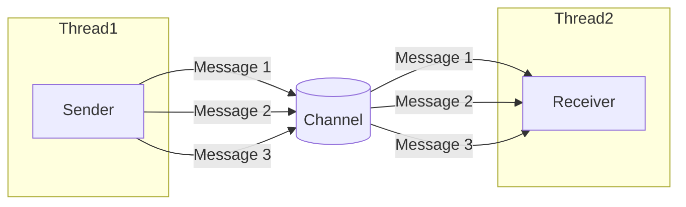

# Rust Message Passing

## Introduction

Message passing is a concurrency model in Rust that allows threads to communicate with each other by sending messages rather than sharing memory. This approach aligns perfectly with Rust's philosophy: "Do not communicate by sharing memory; instead, share memory by communicating."

In this tutorial, we'll explore how Rust implements message passing through channels, which are like pipes that connect different threads. One thread can send messages down a channel, and another thread can receive these messages. This approach to concurrency helps avoid many common threading issues like race conditions and data races.

## Understanding Channels in Rust

Rust's standard library provides a channel implementation in the `std::sync::mpsc` module. MPSC stands for "Multiple Producer, Single Consumer," meaning that:

- Multiple threads can send (produce) messages
- Only one thread can receive (consume) these messages

Let's start with a simple example to understand the basic concept.

## Your First Message Passing Example

```rust
use std::sync::mpsc;
use std::thread;
use std::time::Duration;

fn main() {
    // Create a new channel
    let (tx, rx) = mpsc::channel();
    
    // Spawn a new thread that will send a message
    thread::spawn(move || {
        // Simulate some work
        thread::sleep(Duration::from_secs(1));
        
        // Send a message
        tx.send("Hello from another thread!").unwrap();
    });
    
    // Main thread waits to receive the message
    let received = rx.recv().unwrap();
    println!("Got: {}", received);
}
```

**Output:**
```
Got: Hello from another thread!
```

Let's break down what's happening:

1. We create a channel using `mpsc::channel()`, which returns a tuple of sender (`tx`) and receiver (`rx`).
2. We spawn a new thread and move the sender (`tx`) into it.
3. The spawned thread sleeps for 1 second (simulating work) and then sends a message.
4. The main thread waits for the message using `rx.recv()`, which blocks until a message is received.
5. Once received, the message is printed.

## Sending Multiple Messages

Channels aren't limited to a single message. Let's modify our example to send multiple messages:

```rust
use std::sync::mpsc;
use std::thread;
use std::time::Duration;

fn main() {
    let (tx, rx) = mpsc::channel();
    
    thread::spawn(move || {
        let messages = vec![
            "Hello",
            "from",
            "the",
            "thread!"
        ];
        
        for message in messages {
            tx.send(message).unwrap();
            thread::sleep(Duration::from_millis(200));
        }
    });
    
    // Receive all messages
    for received in rx {
        println!("Got: {}", received);
    }
}
```

**Output:**
```
Got: Hello
Got: from
Got: the
Got: thread!
```

In this example:
1. We're sending multiple messages with a small delay between them.
2. We're using a `for` loop to iterate over the receiver, which continues until the channel is closed.

## Channel Ownership and Closing

When all senders are dropped (go out of scope), the channel is automatically closed. Once a channel is closed, no more messages can be sent, and the receiver's iterator will end.

```rust
use std::sync::mpsc;
use std::thread;

fn main() {
    let (tx, rx) = mpsc::channel();
    
    thread::spawn(move || {
        // Send a message
        tx.send("Hello").unwrap();
        // tx is dropped when this thread ends
    });
    
    // Wait for the message
    let message = rx.recv().unwrap();
    println!("Received: {}", message);
    
    // This would fail with an error because the channel is closed
    match rx.recv() {
        Ok(msg) => println!("Got another message: {}", msg),
        Err(e) => println!("Channel is closed: {}", e),
    }
}
```

**Output:**
```
Received: Hello
Channel is closed: receiving on an empty and disconnected channel
```

## Multiple Producers (Senders)

The "MP" in MPSC stands for Multiple Producers. You can clone the sender and use it from multiple threads:

```rust
use std::sync::mpsc;
use std::thread;
use std::time::Duration;

fn main() {
    let (tx, rx) = mpsc::channel();
    
    // Clone the sender for the second thread
    let tx1 = tx.clone();
    
    // First sending thread
    thread::spawn(move || {
        let messages = vec!["Hello", "from", "thread", "one"];
        for message in messages {
            tx.send(message).unwrap();
            thread::sleep(Duration::from_millis(200));
        }
    });
    
    // Second sending thread
    thread::spawn(move || {
        let messages = vec!["Hi", "from", "thread", "two"];
        for message in messages {
            tx1.send(message).unwrap();
            thread::sleep(Duration::from_millis(200));
        }
    });
    
    // Receive messages from both threads
    for received in rx {
        println!("Got: {}", received);
    }
}
```

**Output (might vary due to thread scheduling):**
```
Got: Hello
Got: Hi
Got: from
Got: from
Got: thread
Got: thread
Got: one
Got: two
```

The exact order of messages might vary because both threads are sending messages concurrently.

## Synchronous vs. Asynchronous Channels

Rust provides two types of channels:

1. **Synchronous channels** (`sync_channel`): These have a limited capacity. When the capacity is full, senders will block until space becomes available.
2. **Asynchronous channels** (`channel`): These have unlimited capacity (bounded only by available memory).

Here's an example of a synchronous channel:

```rust
use std::sync::mpsc;
use std::thread;
use std::time::Duration;

fn main() {
    // Create a synchronous channel with capacity of 2
    let (tx, rx) = mpsc::sync_channel(2);
    
    thread::spawn(move || {
        println!("Sending 1");
        tx.send(1).unwrap();
        
        println!("Sending 2");
        tx.send(2).unwrap();
        
        println!("Sending 3"); // This will block until the receiver takes at least one message
        tx.send(3).unwrap();
        
        println!("Sent 3");
    });
    
    thread::sleep(Duration::from_secs(2)); // Wait to demonstrate blocking
    println!("Receiving...");
    
    for received in rx {
        println!("Got: {}", received);
        thread::sleep(Duration::from_millis(500)); // Slow receiver
    }
}
```

**Output:**
```
Sending 1
Sending 2
Sending 3
Receiving...
Got: 1
Sent 3
Got: 2
Got: 3
```

Notice how "Sending 3" appears before "Sent 3" with a delay, because the sender blocks until the receiver takes a message.

## Visual Representation of Message Passing

Here's a diagram showing how message passing works in Rust:



## Real-world Application: Worker Pool

Let's build a simple worker pool using message passing, which is a common real-world application:

```rust
use std::sync::mpsc;
use std::thread;
use std::time::Duration;

// Represent a task as a function
type Task = Box<dyn FnOnce() + Send + 'static>;

fn main() {
    // Create channels for tasks and results
    let (task_sender, task_receiver) = mpsc::channel::<Task>();
    let (result_sender, result_receiver) = mpsc::channel::<String>();
    
    // Share the task receiver among worker threads
    let task_receiver = std::sync::Arc::new(std::sync::Mutex::new(task_receiver));
    
    // Spawn worker threads
    let num_workers = 4;
    for id in 0..num_workers {
        let task_receiver = task_receiver.clone();
        let result_sender = result_sender.clone();
        
        thread::spawn(move || {
            println!("Worker {} started", id);
            
            loop {
                // Try to get a task
                let task = {
                    let receiver = task_receiver.lock().unwrap();
                    match receiver.try_recv() {
                        Ok(task) => task,
                        Err(_) => break, // Exit if no more tasks or channel closed
                    }
                };
                
                // Execute the task
                task();
                
                // Report completion
                result_sender.send(format!("Task completed by worker {}", id)).unwrap();
            }
            
            println!("Worker {} finished", id);
        });
    }
    
    // Send tasks to the worker pool
    for i in 0..10 {
        let task_sender = task_sender.clone();
        let task_id = i;
        
        // Create a task that simulates work
        let task = Box::new(move || {
            println!("Executing task {}", task_id);
            let work_time = task_id % 3 + 1;
            thread::sleep(Duration::from_secs(work_time));
        });
        
        task_sender.send(task).unwrap();
    }
    
    // Drop the original sender to close the channel when all tasks are sent
    drop(task_sender);
    
    // Wait for and print all results
    for _ in 0..10 {
        match result_receiver.recv_timeout(Duration::from_secs(10)) {
            Ok(result) => println!("Result: {}", result),
            Err(_) => break,
        }
    }
    
    println!("All tasks completed!");
}
```

This example demonstrates:
1. Creating a pool of worker threads
2. Distributing tasks among the workers using a channel
3. Collecting results from the workers using another channel
4. Proper cleanup when all tasks are done

## Non-blocking Operations with `try_recv`

Sometimes you don't want to block waiting for a message. The `try_recv` method attempts to receive a message without blocking:

```rust
use std::sync::mpsc;
use std::thread;
use std::time::Duration;

fn main() {
    let (tx, rx) = mpsc::channel();
    
    thread::spawn(move || {
        thread::sleep(Duration::from_secs(2));
        tx.send("Message after delay").unwrap();
    });
    
    println!("Waiting for a message...");
    
    // Non-blocking polling
    let mut received = false;
    while !received {
        match rx.try_recv() {
            Ok(msg) => {
                println!("Got message: {}", msg);
                received = true;
            }
            Err(mpsc::TryRecvError::Empty) => {
                println!("No messages yet, doing other work...");
                thread::sleep(Duration::from_millis(500));
            }
            Err(mpsc::TryRecvError::Disconnected) => {
                println!("Channel is disconnected");
                break;
            }
        }
    }
}
```

**Output:**
```
Waiting for a message...
No messages yet, doing other work...
No messages yet, doing other work...
No messages yet, doing other work...
No messages yet, doing other work...
Got message: Message after delay
```

This approach allows the main thread to continue doing other work while occasionally checking for messages.

## Timeout-based Receiving with `recv_timeout`

If you want to wait for a message but only up to a certain time, you can use `recv_timeout`:

```rust
use std::sync::mpsc;
use std::thread;
use std::time::Duration;

fn main() {
    let (tx, rx) = mpsc::channel();
    
    thread::spawn(move || {
        thread::sleep(Duration::from_secs(3));
        tx.send("Late message").unwrap();
    });
    
    println!("Waiting with a 2-second timeout...");
    
    match rx.recv_timeout(Duration::from_secs(2)) {
        Ok(msg) => println!("Got message: {}", msg),
        Err(mpsc::RecvTimeoutError::Timeout) => println!("Timed out waiting for message"),
        Err(mpsc::RecvTimeoutError::Disconnected) => println!("Channel is disconnected"),
    }
    
    // We can still receive the message later
    match rx.recv() {
        Ok(msg) => println!("Eventually got: {}", msg),
        Err(_) => println!("Channel is closed"),
    }
}
```

**Output:**
```
Waiting with a 2-second timeout...
Timed out waiting for message
Eventually got: Late message
```

## Sending Complex Data

You can send any data that implements the `Send` trait through channels. For example, you can send structs, enums, or even closures:

```rust
use std::sync::mpsc;
use std::thread;

// Define a struct to represent a command
#[derive(Debug)]
enum Command {
    Print(String),
    Sum(Vec<i32>),
    Exit,
}

fn main() {
    let (tx, rx) = mpsc::channel();
    
    // Spawn a worker thread
    thread::spawn(move || {
        loop {
            match rx.recv() {
                Ok(Command::Print(s)) => println!("Printing: {}", s),
                Ok(Command::Sum(nums)) => {
                    let sum: i32 = nums.iter().sum();
                    println!("Sum of {:?} is {}", nums, sum);
                }
                Ok(Command::Exit) => {
                    println!("Exiting worker thread");
                    break;
                }
                Err(_) => {
                    println!("Channel closed");
                    break;
                }
            }
        }
    });
    
    // Send different types of commands
    tx.send(Command::Print("Hello, worker!".to_string())).unwrap();
    tx.send(Command::Sum(vec![1, 2, 3, 4, 5])).unwrap();
    tx.send(Command::Print("About to exit".to_string())).unwrap();
    tx.send(Command::Exit).unwrap();
}
```

**Output:**
```
Printing: Hello, worker!
Sum of [1, 2, 3, 4, 5] is 15
Printing: About to exit
Exiting worker thread
```

## Summary

Message passing in Rust provides a safe and efficient way to communicate between threads. Through channels, Rust ensures that concurrent code remains free from data races while still being powerful and expressive.

Key points to remember:
1. Use channels to pass messages between threads
2. Rust provides both synchronous (bounded) and asynchronous (unbounded) channels
3. Multiple senders can send to a single receiver (MPSC)
4. Channels automatically close when all senders are dropped
5. The receiver can iterate over incoming messages using a `for` loop
6. Non-blocking operations are available with `try_recv` and `recv_timeout`

Message passing promotes a programming model that is easier to reason about in concurrent situations, helping you avoid many of the pitfalls typically associated with shared memory concurrency.

## Exercises

1. Create a program that spawns 5 worker threads, each generating random numbers and sending them to a main thread that calculates statistics (min, max, average).
2. Implement a simple chat system where multiple threads can send messages, and one thread logs all the messages with timestamps.
3. Build a pipeline processing system where data flows through multiple stages, each handled by a different thread.
4. Create a worker pool that processes jobs in parallel and collects the results in order of job submission.
5. Implement a bounded buffer using a synchronous channel.

## Additional Resources

- [Rust Book: Message Passing](https://doc.rust-lang.org/book/ch16-02-message-passing.html)
- [Rust Documentation: std::sync::mpsc](https://doc.rust-lang.org/std/sync/mpsc/index.html)
- [Rust by Example: Channels](https://doc.rust-lang.org/rust-by-example/std_misc/channels.html)
- [Crossbeam Channels](https://docs.rs/crossbeam/0.8.1/crossbeam/channel/index.html) - An alternative channel implementation with more features