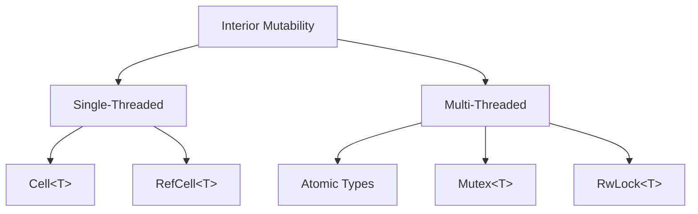

# Rust Shared State

## Introduction

When writing concurrent programs in Rust, you'll often need to share data between multiple threads. This concept is known as **shared state concurrency**. Unlike message-passing concurrency where threads communicate by sending data to each other, shared state concurrency involves multiple threads accessing and modifying the same data.

However, sharing state between threads comes with challenges:

1. **Data Races**: When multiple threads access the same data with at least one thread writing to it, without proper synchronization
2. **Deadlocks**: When threads wait for each other, causing the program to hang
3. **Thread Safety**: Ensuring operations on shared data maintain program correctness

Rust's ownership system prevents many concurrency issues at compile time, but we still need special tools to share data between threads. In this tutorial, we'll explore various methods to safely share state in Rust concurrent programs.

## Sharing State with `Arc` and `Mutex`

### Understanding the Need for `Arc`

To share data between threads in Rust, we first need a way to give multiple threads ownership of the same data. The standard `Rc<T>` (Reference Counted) type isn't thread-safe, so Rust provides `Arc<T>` (Atomic Reference Counted) for safe sharing across threads.

### Adding Thread Safety with `Mutex`

While `Arc` allows sharing references across threads, we still need a way to prevent data races when modifying the data. A `Mutex<T>` (mutual exclusion) ensures that only one thread can access the data at a time.

Let's look at a basic example:

```rust
use std::sync::{Arc, Mutex};
use std::thread;

fn main() {
    // Create a shared counter wrapped in a Mutex and Arc
    let counter = Arc::new(Mutex::new(0));
    let mut handles = vec![];

    // Spawn 10 threads
    for _ in 0..10 {
        // Clone the Arc to increase the reference count
        let counter_clone = Arc::clone(&counter);
        
        // Spawn a thread that increments the counter 1000 times
        let handle = thread::spawn(move || {
            for _ in 0..1000 {
                // Lock the mutex to get exclusive access to the data
                let mut num = counter_clone.lock().unwrap();
                // Modify the data
                *num += 1;
                // Mutex is automatically unlocked when `num` goes out of scope
            }
        });
        
        handles.push(handle);
    }

    // Wait for all threads to complete
    for handle in handles {
        handle.join().unwrap();
    }

    // Print the final value
    println!("Final counter value: {}", *counter.lock().unwrap());
}
```

**Output:**
```
Final counter value: 10000
```

### Understanding the Pattern

Let's break down what's happening:

1. We create a shared integer wrapped in `Mutex<T>` and `Arc<T>`:
   ```rust
   let counter = Arc::new(Mutex::new(0));
   ```

2. Before passing the counter to a thread, we clone the `Arc`:
   ```rust
   let counter_clone = Arc::clone(&counter);
   ```

3. Inside each thread, we lock the mutex to get exclusive access:
   ```rust
   let mut num = counter_clone.lock().unwrap();
   ```

4. We modify the data and the mutex is automatically unlocked when `num` goes out of scope.

## Using `RwLock` for Read-Heavy Workloads

A `Mutex` is great for general protection, but if you have many readers and few writers, a `RwLock` (Read-Write Lock) can be more efficient. It allows multiple readers to access data simultaneously, but ensures exclusive access for writers.

```rust
use std::sync::{Arc, RwLock};
use std::thread;

fn main() {
    // Create shared data with RwLock
    let data = Arc::new(RwLock::new(vec![1, 2, 3, 4, 5]));
    let mut handles = vec![];

    // Create reader threads
    for i in 0..3 {
        let data_clone = Arc::clone(&data);
        let handle = thread::spawn(move || {
            // Acquire a read lock - multiple readers can access simultaneously
            let values = data_clone.read().unwrap();
            println!("Reader {}: Current values: {:?}", i, *values);
        });
        handles.push(handle);
    }

    // Create a writer thread
    let data_clone = Arc::clone(&data);
    let handle = thread::spawn(move || {
        // Acquire a write lock - exclusive access
        let mut values = data_clone.write().unwrap();
        values.push(6);
        println!("Writer: Added a value");
    });
    handles.push(handle);

    // Wait for all threads
    for handle in handles {
        handle.join().unwrap();
    }

    // Print final state
    println!("Final values: {:?}", *data.read().unwrap());
}
```

**Output (order may vary):**
```
Reader 0: Current values: [1, 2, 3, 4, 5]
Reader 1: Current values: [1, 2, 3, 4, 5]
Reader 2: Current values: [1, 2, 3, 4, 5]
Writer: Added a value
Final values: [1, 2, 3, 4, 5, 6]
```

## Atomic Operations for Simple Counters

For simple operations like counters, Rust provides atomic types in `std::sync::atomic`. These offer lock-free operations that are often more efficient than mutex-based solutions.

```rust
use std::sync::atomic::{AtomicU64, Ordering};
use std::sync::Arc;
use std::thread;

fn main() {
    // Create an atomic counter
    let counter = Arc::new(AtomicU64::new(0));
    let mut handles = vec![];

    // Spawn 10 threads
    for _ in 0..10 {
        let counter_clone = Arc::clone(&counter);
        
        let handle = thread::spawn(move || {
            for _ in 0..1000 {
                // No need for locks - atomic operation
                counter_clone.fetch_add(1, Ordering::SeqCst);
            }
        });
        
        handles.push(handle);
    }

    // Wait for all threads
    for handle in handles {
        handle.join().unwrap();
    }

    println!("Final counter value: {}", counter.load(Ordering::SeqCst));
}
```

**Output:**
```
Final counter value: 10000
```

The `Ordering` parameter specifies the memory ordering constraints. `SeqCst` (Sequential Consistency) is the strongest ordering that ensures all operations appear to execute in a single, total order consistent with the program order.

## Advanced Pattern: Interior Mutability with Cell Types

For single-threaded contexts, Rust provides `Cell` and `RefCell` types. For multi-threaded contexts, their thread-safe equivalents are atomic types and `Mutex`/`RwLock`.

Let's visualize the relationship between these types:



## Real-World Example: A Thread-Safe Cache

Let's build a simple thread-safe cache that computes expensive results and remembers them:

```rust
use std::collections::HashMap;
use std::sync::{Arc, Mutex};
use std::thread;
use std::time::Duration;

// A simple cache that computes and stores fibonacci numbers
struct FibCache {
    cache: Mutex<HashMap<u64, u64>>,
}

impl FibCache {
    fn new() -> Self {
        FibCache {
            cache: Mutex::new(HashMap::new()),
        }
    }

    fn fibonacci(&self, n: u64) -> u64 {
        // First, check if we've already computed this value
        {
            let cache = self.cache.lock().unwrap();
            if let Some(&result) = cache.get(&n) {
                println!("Cache hit for fib({})!", n);
                return result;
            }
        } // Lock is released here

        // If not in cache, compute it (expensive operation)
        println!("Computing fib({})...", n);
        thread::sleep(Duration::from_millis(100)); // Simulate expensive computation
        
        let result = if n <= 1 {
            n
        } else {
            let v1 = self.fibonacci(n - 1);
            let v2 = self.fibonacci(n - 2);
            v1 + v2
        };

        // Store result in cache
        let mut cache = self.cache.lock().unwrap();
        cache.insert(n, result);
        
        result
    }
}

fn main() {
    let cache = Arc::new(FibCache::new());
    let mut handles = vec![];

    // Create multiple threads that compute fibonacci numbers
    for n in [10, 15, 10, 20, 15] {
        let cache_clone = Arc::clone(&cache);
        let handle = thread::spawn(move || {
            let result = cache_clone.fibonacci(n);
            println!("fib({}) = {}", n, result);
        });
        handles.push(handle);
    }

    for handle in handles {
        handle.join().unwrap();
    }
}
```

**Output (order may vary):**
```
Computing fib(10)...
Computing fib(15)...
Computing fib(9)...
Computing fib(8)...
Cache hit for fib(10)!
...
fib(10) = 55
fib(15) = 610
fib(10) = 55
fib(20) = 6765
fib(15) = 610
```

This example demonstrates:
1. Using `Mutex` to protect a shared data structure (`HashMap`)
2. Minimizing the lock duration by using scoped blocks
3. Combining `Arc` and `Mutex` for thread-safe access to shared state

## Common Pitfalls and How to Avoid Them

### Deadlocks

Deadlocks occur when threads are waiting for each other to release resources.

**Cause:**
```rust
// DON'T DO THIS
let mutex1 = Arc::new(Mutex::new(0));
let mutex2 = Arc::new(Mutex::new(0));

// Thread 1 locks mutex1, then tries to lock mutex2
let mutex1_clone = Arc::clone(&mutex1);
let mutex2_clone = Arc::clone(&mutex2);
let handle1 = thread::spawn(move || {
    let _lock1 = mutex1_clone.lock().unwrap();
    thread::sleep(Duration::from_millis(10)); // Increase chance of deadlock
    let _lock2 = mutex2_clone.lock().unwrap();
});

// Thread 2 locks mutex2, then tries to lock mutex1
let mutex1_clone = Arc::clone(&mutex1);
let mutex2_clone = Arc::clone(&mutex2);
let handle2 = thread::spawn(move || {
    let _lock2 = mutex2_clone.lock().unwrap();
    thread::sleep(Duration::from_millis(10));
    let _lock1 = mutex1_clone.lock().unwrap();
});
```

**Solution:** Always acquire locks in the same order in all threads.

### Poisoned Mutex

If a thread panics while holding a mutex lock, the mutex becomes "poisoned":

```rust
let mutex = Arc::new(Mutex::new(0));
let mutex_clone = Arc::clone(&mutex);

let handle = thread::spawn(move || {
    let mut value = mutex_clone.lock().unwrap();
    *value += 1;
    panic!("Oops, something went wrong!"); // This will poison the mutex
});

// Should handle the error case for poisoned mutex
let result = mutex.lock();
match result {
    Ok(value) => println!("Value: {}", value),
    Err(poisoned) => {
        // We can still recover the data
        let value = poisoned.into_inner();
        println!("Mutex was poisoned, but value is: {}", value);
    }
}
```

### Over-synchronization

Too much synchronization can hurt performance:

```rust
// Inefficient - locks for each operation
for i in 0..1000 {
    let mut data = mutex.lock().unwrap();
    data.push(i);
}

// More efficient - single lock
let mut data = mutex.lock().unwrap();
for i in 0..1000 {
    data.push(i);
}
```

## Choosing the Right Concurrency Primitive

Here's a guide to help you choose the right tool:

| Primitive | When to Use |
|-----------|-------------|
| `Arc<Mutex<T>>` | General-purpose shared mutable state |
| `Arc<RwLock<T>>` | Shared state with many readers, few writers |
| Atomic types | Simple counters and flags |
| `Arc<T>` alone | Immutable shared state |

## Summary

In this tutorial, we've covered:

1. How to share data between threads using `Arc<T>`
2. How to protect shared data from data races using `Mutex<T>`
3. Using `RwLock<T>` for read-heavy workloads
4. Atomic operations for simple counter scenarios
5. A real-world example of a thread-safe cache
6. Common pitfalls and how to avoid them

Rust's type system and ownership rules make concurrent programming safer by catching many issues at compile time. The shared state concurrency primitives we've explored provide the tools needed to write correct, efficient concurrent code.

## Exercises

1. Extend the thread-safe cache example to include a timeout for cached values
2. Implement a concurrent counter using both Mutex and atomic types, then benchmark their performance
3. Create a thread-safe logging system that multiple components can write to
4. Implement a simple producer-consumer pattern using shared state

## Additional Resources

- [Rust Book: Shared-State Concurrency](https://doc.rust-lang.org/book/ch16-03-shared-state.html)
- [Rust Standard Library Documentation: std::sync](https://doc.rust-lang.org/std/sync/index.html)
- [The Rustonomicon: Concurrency](https://doc.rust-lang.org/nomicon/concurrency.html)
- [Rust Atomics and Locks](https://marabos.nl/atomics/) by Mara Bos