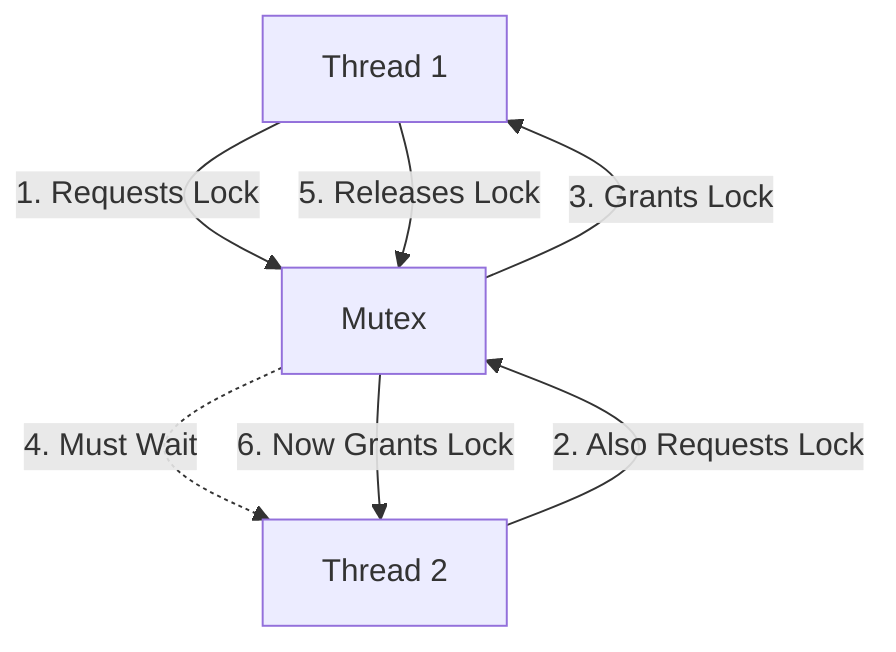

# Rust Mutex

## Introduction

When writing concurrent programs in Rust, a common challenge is safely sharing data between multiple threads. Rust's ownership system prevents data races at compile time, but sometimes we need multiple threads to access and modify the same data. This is where the `Mutex` (short for "mutual exclusion") comes in.

A `Mutex` is a synchronization primitive that ensures only one thread can access the data at any given time. Think of it as a protective box around your data with a single key - only the thread that has the key can access or modify the contents.

In this tutorial, we'll explore:
- What a Mutex is and why it's needed
- How to use Mutex in Rust
- Common patterns and best practices
- Potential pitfalls and how to avoid them

## Understanding Mutex Basics

### What is a Mutex?

A Mutex provides exclusive access to data. When a thread wants to access the data protected by a Mutex, it must first acquire the lock. If another thread already holds the lock, the requesting thread will wait until the lock becomes available.

Here's a visual representation of how Mutex works:



### Why Use Mutex in Rust?

Rust's ownership system already prevents data races at compile time, so why do we need Mutex?

The ownership system works by ensuring only one owner can have mutable access to data at any time. However, when we want multiple threads to share and modify the same data, we need a way to safely share ownership. The Mutex allows us to share ownership while ensuring only one thread can access the data at a time.

## Creating and Using a Mutex in Rust

Let's look at how to use a `Mutex` in Rust. First, you'll need to include the standard library's sync module:

```rust
use std::sync::Mutex;
```

### Basic Usage

Here's a simple example of creating and using a Mutex:

```rust
use std::sync::Mutex;

fn main() {
    // Create a mutex containing the value 0
    let counter = Mutex::new(0);
    
    // Lock the mutex and modify its value
    {
        // lock() returns a MutexGuard
        let mut num = counter.lock().unwrap();
        // Now we can modify the value
        *num += 1;
    } // MutexGuard is dropped here, releasing the lock
    
    // We can verify the change was made
    println!("Counter: {}", *counter.lock().unwrap());
}
```

**Output:**
```
Counter: 1
```

Let's break down what's happening:

1. We create a `Mutex` containing the value `0` using `Mutex::new(0)`.
2. We call `counter.lock()` to acquire the lock, which returns a `Result<MutexGuard<T>, E>`.
3. We use `unwrap()` to handle the case where locking might fail (if another thread holding the lock panicked).
4. Once we have the `MutexGuard`, we can modify the value inside the Mutex using dereferencing.
5. When the `MutexGuard` goes out of scope, the lock is automatically released.

### Sharing a Mutex Between Threads

The real power of Mutex comes when sharing data between threads. Let's see how to use a Mutex with multiple threads:

```rust
use std::sync::{Arc, Mutex};
use std::thread;

fn main() {
    // We need Arc (Atomic Reference Counting) to share ownership between threads
    let counter = Arc::new(Mutex::new(0));
    let mut handles = vec![];
    
    for _ in 0..10 {
        // Clone the Arc to create a new reference to the same Mutex
        let counter_clone = Arc::clone(&counter);
        
        // Spawn a new thread
        let handle = thread::spawn(move || {
            let mut num = counter_clone.lock().unwrap();
            *num += 1;
        });
        
        handles.push(handle);
    }
    
    // Wait for all threads to complete
    for handle in handles {
        handle.join().unwrap();
    }
    
    println!("Final count: {}", *counter.lock().unwrap());
}
```

**Output:**
```
Final count: 10
```

In this example:

1. We wrap our `Mutex` in an `Arc` (Atomic Reference Count), which allows us to safely share ownership across threads.
2. We create 10 threads, each incrementing the counter by 1.
3. We wait for all threads to complete using `join()`.
4. Finally, we print the result, which should be 10.

## The Role of MutexGuard

When you call `lock()` on a Mutex, you get a `MutexGuard` which has two important properties:

1. It provides access to the inner data through dereferencing.
2. When it's dropped (goes out of scope), it automatically releases the lock.

The `MutexGuard` implements the `Deref` and `DerefMut` traits, which is why we can use `*` to access the inner value:

```rust
let counter = Mutex::new(42);
let value = counter.lock().unwrap();
println!("The answer is: {}", *value); // Dereferencing to get the inner value
```

It's important to keep the scope of the `MutexGuard` as small as possible to avoid holding the lock longer than necessary:

```rust
// Good practice: Keep lock scope small
{
    let mut value = mutex.lock().unwrap();
    *value += 1;
} // Lock is released here

// Do other work that doesn't need the lock...

// Bad practice: Holding lock for too long
let mut value = mutex.lock().unwrap();
*value += 1;

// Doing other work while still holding the lock...
// This could cause other threads to wait unnecessarily
```

## Handling Errors with Mutex

The `lock()` method returns a `Result` because it can fail if the thread that currently holds the lock has panicked. In most cases, using `unwrap()` is fine, but for robust error handling, you might want to properly handle this case:

```rust
use std::sync::Mutex;

fn main() {
    let mutex = Mutex::new(0);
    
    match mutex.lock() {
        Ok(mut value) => {
            // Successfully acquired the lock
            *value += 1;
            println!("Value incremented to: {}", *value);
        },
        Err(poisoned) => {
            // The mutex is poisoned, but we can still recover the data
            println!("Mutex was poisoned, but we'll recover");
            let mut value = poisoned.into_inner();
            *value += 1;
            println!("Value incremented to: {}", *value);
        }
    }
}
```

## Real-World Application: A Thread-Safe Counter

Let's create a more practical example: a thread-safe counter that can be incremented and read from multiple threads:

```rust
use std::sync::{Arc, Mutex};
use std::thread;
use std::time::Duration;

struct ThreadSafeCounter {
    count: Mutex<usize>,
}

impl ThreadSafeCounter {
    fn new() -> Self {
        ThreadSafeCounter {
            count: Mutex::new(0),
        }
    }
    
    fn increment(&self) {
        let mut count = self.count.lock().unwrap();
        *count += 1;
    }
    
    fn value(&self) -> usize {
        let count = self.count.lock().unwrap();
        *count
    }
}

fn main() {
    let counter = Arc::new(ThreadSafeCounter::new());
    let mut handles = vec![];
    
    // Create a thread that increments the counter every 10ms
    {
        let counter = Arc::clone(&counter);
        let handle = thread::spawn(move || {
            for _ in 0..50 {
                counter.increment();
                thread::sleep(Duration::from_millis(10));
            }
        });
        handles.push(handle);
    }
    
    // Create another thread that reads and prints the counter value
    {
        let counter = Arc::clone(&counter);
        let handle = thread::spawn(move || {
            for _ in 0..10 {
                println!("Current count: {}", counter.value());
                thread::sleep(Duration::from_millis(50));
            }
        });
        handles.push(handle);
    }
    
    // Wait for all threads to complete
    for handle in handles {
        handle.join().unwrap();
    }
    
    println!("Final count: {}", counter.value());
}
```

This example demonstrates:
1. Encapsulating the Mutex in a custom type
2. Providing methods that handle locking internally
3. Using the counter from multiple threads simultaneously

## Common Pitfalls and Best Practices

### Deadlocks

Deadlocks occur when two or more threads are waiting for locks held by each other. For example:

```rust
use std::sync::{Arc, Mutex};
use std::thread;

fn main() {
    let mutex_a = Arc::new(Mutex::new(0));
    let mutex_b = Arc::new(Mutex::new(0));
    
    let mutex_a_clone = Arc::clone(&mutex_a);
    let mutex_b_clone = Arc::clone(&mutex_b);
    
    // Thread 1: Locks A, then tries to lock B
    let thread1 = thread::spawn(move || {
        let _a = mutex_a_clone.lock().unwrap();
        println!("Thread 1: Locked A");
        
        // Small delay to ensure thread 2 has time to lock B
        thread::sleep(std::time::Duration::from_millis(10));
        
        let _b = mutex_b_clone.lock().unwrap();
        println!("Thread 1: Locked B");
    });
    
    // Thread 2: Locks B, then tries to lock A
    let thread2 = thread::spawn(move || {
        let _b = mutex_b.lock().unwrap();
        println!("Thread 2: Locked B");
        
        // Small delay
        thread::sleep(std::time::Duration::from_millis(10));
        
        let _a = mutex_a.lock().unwrap();
        println!("Thread 2: Locked A");
    });
    
    thread1.join().unwrap();
    thread2.join().unwrap();
}
```

This program will deadlock because:
1. Thread 1 locks A and waits for B
2. Thread 2 locks B and waits for A
3. Neither thread can proceed, resulting in a deadlock

To avoid deadlocks:
- Always acquire locks in the same order
- Keep lock scopes as small as possible
- Consider using `try_lock()` with a timeout

### Poisoned Mutexes

If a thread panics while holding a lock, the Mutex becomes "poisoned." This is Rust's way of indicating that the shared state might be corrupt:

```rust
use std::sync::{Arc, Mutex};
use std::thread;

fn main() {
    let mutex = Arc::new(Mutex::new(0));
    let mutex_clone = Arc::clone(&mutex);
    
    // This thread will panic while holding the lock
    let handle = thread::spawn(move || {
        let mut value = mutex_clone.lock().unwrap();
        *value += 1;
        panic!("Oh no!"); // This will poison the mutex
    });
    
    // Wait for the thread to panic
    let _ = handle.join();
    
    // Now when we try to lock, we get a poisoned error
    match mutex.lock() {
        Ok(_) => println!("This won't happen"),
        Err(poisoned) => {
            // We can still recover the data
            let value = poisoned.into_inner();
            println!("Recovered value: {}", *value);
        }
    }
}
```

### Performance Considerations

Mutexes have overhead. For high-performance concurrent code:

1. Keep critical sections small
2. Consider using read-write locks (`RwLock`) if you have many readers and few writers
3. For simple atomic operations, consider using `std::sync::atomic` types

## When to Use Mutex vs. Other Synchronization Primitives

Rust offers several synchronization primitives:

- `Mutex`: Use when multiple threads need read-write access to shared data
- `RwLock`: Use when you have many reads and few writes
- `Atomic` types: Use for simple operations like counters
- `Barrier`: Use when threads need to wait for each other at a synchronization point
- `Condvar`: Use for signaling between threads

Choose the right tool for your specific concurrency pattern.

## Summary

In this tutorial, we've explored Rust's `Mutex` type, which allows us to safely share mutable data between threads. Key points to remember:

1. A `Mutex` ensures exclusive access to data by allowing only one thread to access it at a time
2. The `lock()` method returns a `MutexGuard` that provides access to the data and automatically releases the lock when dropped
3. Use `Arc<Mutex<T>>` to share a Mutex between multiple threads
4. Be aware of potential issues like deadlocks and poisoned mutexes
5. Keep lock scopes as small as possible for best performance

## Exercises

1. Create a thread-safe stack that can be pushed to and popped from by multiple threads
2. Implement a producer-consumer pattern using a shared queue protected by a Mutex
3. Modify the counter example to use `std::sync::atomic::AtomicUsize` instead of a Mutex and compare the performance

## Additional Resources

- [Rust Standard Library Documentation on Mutex](https://doc.rust-lang.org/std/sync/struct.Mutex.html)
- [The Rust Programming Language Book Chapter on Concurrency](https://doc.rust-lang.org/book/ch16-00-concurrency.html)
- [Rust Atomics and Locks Book by Jon Gjengset](https://marabos.nl/atomics/)
- [Rust Cookbook: Concurrency Section](https://rust-lang-nursery.github.io/rust-cookbook/concurrency.html)

Remember that concurrency is a complex topic, and understanding Mutex is just one step in writing effective concurrent Rust code. Practice and experimentation are key to mastering these concepts.