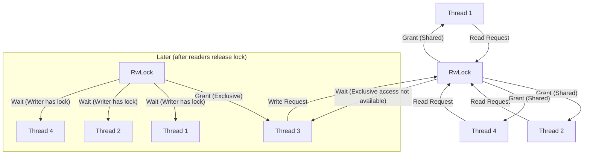

# Rust RwLock

## Introduction

When writing concurrent Rust programs, you'll often need to share data between multiple threads. However, concurrent access to shared data can lead to race conditions and data corruption. Rust's type system and ownership rules help prevent many concurrency bugs, but sometimes you need to share mutable data across threads.

This is where `RwLock` (Read-Write Lock) comes in. A read-write lock allows multiple readers or a single writer to access shared data at any given time. This approach offers better performance than a standard mutex when read operations far outnumber write operations.

In this tutorial, we'll explore:
- What `RwLock` is and how it differs from `Mutex`
- How to use `RwLock` safely in Rust programs
- Common patterns and pitfalls
- Real-world examples of `RwLock` in action

## Understanding RwLock: The Basics

### What is an RwLock?

`RwLock<T>` (Read-Write Lock) is a synchronization primitive that allows multiple readers or one writer to access shared data. It follows these rules:

1. **Multiple readers**: Many threads can read the data simultaneously
2. **Exclusive writer**: Only one thread can write to the data, and no reading can happen during writing
3. **Priority rules**: The lock implementation determines whether readers or writers get priority when both are waiting

This is different from a `Mutex<T>`, which only allows a single thread to access the data at any time, regardless of whether it's reading or writing.

Here's a visualization of how RwLock works:



### When to Use RwLock vs. Mutex

- Use `RwLock` when:
  - You have data that is read frequently but written to infrequently
  - Multiple threads need to read the data simultaneously
  - The performance benefit of concurrent reads outweighs the additional complexity

- Use `Mutex` when:
  - You need simpler semantics
  - The data is written to as often as it's read
  - Each operation is very brief

## Using RwLock in Rust

### Importing RwLock

First, you need to import `RwLock` from the standard library:

```rust
use std::sync::RwLock;
```

### Creating an RwLock

To create a new `RwLock`, you wrap your data in it:

```rust
// Create an RwLock containing an integer
let data = RwLock::new(5);
```

### Reading from an RwLock

To read the data, you acquire a read lock using the `.read()` method:

```rust
// Acquire a read lock
let r1 = data.read().unwrap();

// Now we can read the data
println!("Data: {}", *r1);

// The lock is automatically released when r1 goes out of scope
```

The `.read()` method returns a `RwLockReadGuard<T>`, which implements `Deref` to allow access to the underlying data. Multiple threads can acquire read locks simultaneously.

### Writing to an RwLock

To modify the data, you acquire a write lock using the `.write()` method:

```rust
// Acquire a write lock
let mut w = data.write().unwrap();

// Now we can modify the data
*w += 1;
println!("Updated data: {}", *w);

// The lock is automatically released when w goes out of scope
```

The `.write()` method returns a `RwLockWriteGuard<T>`, which implements `DerefMut` to allow mutable access to the underlying data. Only one thread can acquire a write lock at a time, and no read locks can be acquired while a write lock is held.

## Complete Example: Counter with RwLock

Let's create a complete example of a counter that can be incremented by multiple threads while being read by others:

```rust
use std::sync::{Arc, RwLock};
use std::thread;

fn main() {
    // Create a new RwLock containing a counter
    let counter = Arc::new(RwLock::new(0));
    let mut handles = vec![];
    
    // Create 5 reader threads
    for i in 0..5 {
        let counter_clone = Arc::clone(&counter);
        let handle = thread::spawn(move || {
            // Read the counter
            let value = counter_clone.read().unwrap();
            println!("Reader {} sees value: {}", i, *value);
            // Lock is released here when value goes out of scope
        });
        handles.push(handle);
    }
    
    // Create 2 writer threads
    for i in 0..2 {
        let counter_clone = Arc::clone(&counter);
        let handle = thread::spawn(move || {
            // Write to the counter
            let mut value = counter_clone.write().unwrap();
            *value += 1;
            println!("Writer {} incremented value to: {}", i, *value);
            // Write lock is released here when value goes out of scope
        });
        handles.push(handle);
    }
    
    // Wait for all threads to complete
    for handle in handles {
        handle.join().unwrap();
    }
    
    // Final value
    println!("Final counter value: {}", *counter.read().unwrap());
}
```

Output (may vary due to thread scheduling):

```
Reader 2 sees value: 0
Reader 0 sees value: 0
Reader 1 sees value: 0
Reader 3 sees value: 0
Reader 4 sees value: 0
Writer 0 incremented value to: 1
Writer 1 incremented value to: 2
Final counter value: 2
```

## Advanced Usage Patterns

### RwLock with Arc for Shared Ownership

In the previous example, we used `Arc<RwLock<T>>` to share the lock between threads. `Arc` (Atomic Reference Count) provides thread-safe reference counting, allowing multiple threads to own a reference to the same data.

This pattern is very common:

```rust
use std::sync::{Arc, RwLock};

// Create shared data
let shared_data = Arc::new(RwLock::new(vec![1, 2, 3]));

// Clone the Arc to share ownership with another thread
let data_clone = Arc::clone(&shared_data);
```

### Using try_read() and try_write()

Sometimes you might want to attempt to acquire a lock without blocking. `RwLock` provides non-blocking variants:

```rust
// Try to acquire a read lock without blocking
match data.try_read() {
    Ok(guard) => println!("Got a read lock: {}", *guard),
    Err(_) => println!("Someone else has a write lock"),
}

// Try to acquire a write lock without blocking
match data.try_write() {
    Ok(mut guard) => {
        *guard += 10;
        println!("Updated value: {}", *guard);
    },
    Err(_) => println!("Could not acquire write lock"),
}
```

### Handling Errors

The `.read()` and `.write()` methods return a `Result` that can contain a `PoisonError` if a thread panicked while holding the lock:

```rust
// Safely handle potential poison errors
let read_result = data.read();
match read_result {
    Ok(guard) => println!("Data: {}", *guard),
    Err(poison_error) => {
        // We can still recover the guard and access potentially inconsistent data
        let guard = poison_error.into_inner();
        println!("Accessing poisoned data (use with caution): {}", *guard);
    }
}
```

## Real-World Example: A Thread-Safe Cache

Let's implement a simple thread-safe cache using `RwLock`:

```rust
use std::collections::HashMap;
use std::sync::{Arc, RwLock};
use std::thread;
use std::time::Duration;

struct Cache<K, V> {
    map: RwLock<HashMap<K, V>>,
}

impl<K, V> Cache<K, V> 
where 
    K: Clone + Eq + std::hash::Hash,
    V: Clone,
{
    fn new() -> Self {
        Cache {
            map: RwLock::new(HashMap::new()),
        }
    }
    
    fn get(&self, key: &K) -> Option<V> {
        // Acquire read lock to check if key exists
        let map = self.map.read().unwrap();
        map.get(key).cloned()
    }
    
    fn insert(&self, key: K, value: V) {
        // Acquire write lock to insert new value
        let mut map = self.map.write().unwrap();
        map.insert(key, value);
    }
    
    fn remove(&self, key: &K) -> Option<V> {
        // Acquire write lock to remove key
        let mut map = self.map.write().unwrap();
        map.remove(key)
    }
}

fn main() {
    // Create a shared cache
    let cache = Arc::new(Cache::<String, u64>::new());
    
    // Clone for writer thread
    let cache_writer = Arc::clone(&cache);
    let writer = thread::spawn(move || {
        // Insert values
        for i in 0..5 {
            cache_writer.insert(format!("key{}", i), i * 10);
            println!("Inserted key{} = {}", i, i * 10);
            thread::sleep(Duration::from_millis(100));
        }
    });
    
    // Clone for reader threads
    let mut readers = vec![];
    for id in 0..3 {
        let cache_reader = Arc::clone(&cache);
        let reader = thread::spawn(move || {
            for _ in 0..4 {
                // Try to read all possible keys
                for i in 0..6 {
                    let key = format!("key{}", i);
                    match cache_reader.get(&key) {
                        Some(value) => println!("Reader {} found {}: {}", id, key, value),
                        None => println!("Reader {} couldn't find {}", id, key),
                    }
                }
                thread::sleep(Duration::from_millis(150));
            }
        });
        readers.push(reader);
    }
    
    // Wait for all threads
    writer.join().unwrap();
    for reader in readers {
        reader.join().unwrap();
    }
}
```

This example demonstrates a real-world use case where:
1. Multiple readers can access cache entries simultaneously
2. A writer can update the cache without blocking readers from accessing other entries
3. The `RwLock` ensures data consistency while maximizing concurrency

## Common Pitfalls and How to Avoid Them

### Deadlocks

Deadlocks can occur if you try to acquire multiple locks in different orders:

```rust
// DON'T DO THIS - potential deadlock
let lock1 = Arc::new(RwLock::new(0));
let lock2 = Arc::new(RwLock::new(0));

// Thread 1
let guard1 = lock1.write().unwrap();
let guard2 = lock2.write().unwrap(); // Might deadlock if Thread 2 has lock2

// Thread 2
let guard2 = lock2.write().unwrap();
let guard1 = lock1.write().unwrap(); // Deadlock! Thread 1 has lock1
```

To avoid deadlocks:
1. Always acquire locks in a consistent order
2. Minimize the time locks are held
3. Consider using `try_read()` and `try_write()` with timeouts

### Reader Starvation

If readers are constantly acquiring the lock, writers might be starved and never get a chance:

```rust
// Reader threads constantly acquiring and releasing locks
loop {
    let _ = data.read().unwrap(); // Constant read locks can starve writers
}
```

Some implementations of `RwLock` favor writers to prevent starvation, but it's best to design your code to avoid excessive lock contention.

### Holding Guards Too Long

Never hold a lock guard longer than necessary:

```rust
// BAD: Holding the lock during expensive operation
let guard = data.write().unwrap();
*guard = expensive_calculation(); // Lock is held during this entire operation

// BETTER: Minimize lock duration
let new_value = expensive_calculation();
let mut guard = data.write().unwrap();
*guard = new_value; // Lock is only held for the assignment
```

## Performance Considerations

When used correctly, `RwLock` can provide better performance than `Mutex` in read-heavy workloads. However, there are some considerations:

1. **Lock Contention**: If there's high contention (many threads trying to acquire the lock), performance can degrade
2. **Reader vs. Writer Priority**: Some `RwLock` implementations prioritize writers to prevent starvation, which can block readers
3. **Overhead**: `RwLock` has more overhead than `Mutex`, so for simple cases or write-heavy workloads, `Mutex` might be faster

For performance-critical code, consider:
- Using `parking_lot::RwLock` (a third-party implementation with better performance)
- Fine-grained locking (multiple locks for different parts of your data)
- Lock-free data structures where appropriate

## RwLock vs. Other Concurrency Primitives

| Primitive | Multiple Readers | Multiple Writers | Use Case |
|-----------|------------------|------------------|----------|
| `RwLock<T>` | Yes | No (one at a time) | Read-heavy workloads |
| `Mutex<T>` | No (one at a time) | No (one at a time) | Simple shared mutable state |
| `AtomicT` | Yes (for atomic operations) | Yes (for atomic operations) | Simple counters and flags |
| `Channel` | N/A | N/A | Communication between threads |

## Summary

`RwLock` is a powerful synchronization primitive in Rust that allows multiple readers or a single writer to access shared data. It's particularly useful for read-heavy workloads where concurrent read access can improve performance.

Key points to remember:
- Use `RwLock` when you need concurrent read access to shared data
- Always pair `RwLock` with `Arc` for sharing between threads
- Acquire read locks with `.read()` and write locks with `.write()`
- Keep lock duration as short as possible to avoid contention
- Be aware of potential deadlocks and reader/writer starvation

By understanding and applying these concepts, you can write concurrent Rust programs that are both safe and efficient.

## Further Resources

- [Rust Documentation for RwLock](https://doc.rust-lang.org/std/sync/struct.RwLock.html)
- [The Rust Programming Language Book - Chapter on Concurrency](https://doc.rust-lang.org/book/ch16-00-concurrency.html)
- [Rust Atomics and Locks](https://marabos.nl/atomics/) by Mara Bos
- [parking_lot](https://docs.rs/parking_lot/latest/parking_lot/) - A third-party crate with more efficient concurrency primitives

## Exercises

1. Implement a read-heavy counter that tracks statistics (min, max, average) for a series of values
2. Create a thread-safe configuration manager that can be updated occasionally but read frequently
3. Extend the cache example to include a timeout feature for entries
4. Implement a simple web server that uses an `RwLock` to protect a shared resource
5. Compare the performance of `RwLock` vs. `Mutex` in a read-heavy workload