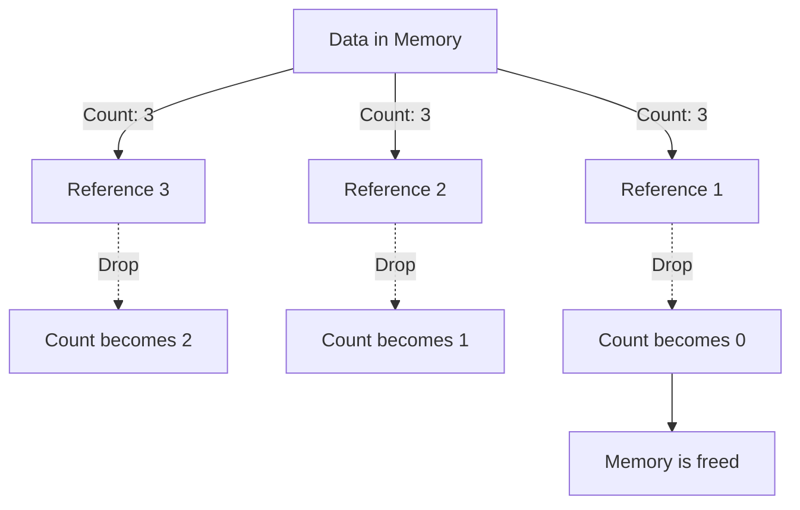

# Rust Arc Type

## Introduction

When writing concurrent programs in Rust, you'll often need to share data between multiple threads. However, Rust's ownership system typically allows only one owner for each piece of data. So how do we safely share data across thread boundaries? This is where `Arc<T>` comes in.

`Arc<T>` stands for **Atomic Reference Counting** and is one of Rust's smart pointers. It allows multiple parts of your code to have read-only access to the same data, even across different threads. The "atomic" part means it's safe to use in concurrent programming because it uses atomic operations for its internal reference counting.

In this tutorial, we'll explore:
- What `Arc<T>` is and why it exists
- How reference counting works
- When to use `Arc<T>` vs. other smart pointers
- Practical examples of `Arc<T>` in concurrent code

## Basic Concept: Reference Counting

Before diving into `Arc<T>`, let's understand reference counting:

Reference counting is a memory management technique where:
1. The data keeps track of how many references to it exist
2. When a new reference is created, the count increases
3. When a reference is dropped, the count decreases
4. When the count reaches zero, the data is cleaned up

Rust has two reference-counting smart pointers:
- `Rc<T>`: For single-threaded contexts
- `Arc<T>`: For multi-threaded contexts (the focus of this tutorial)

The following diagram illustrates how reference counting works:



## Arc vs. Rc: What's the Difference?

You might be wondering: "If `Rc<T>` also handles reference counting, why do we need `Arc<T>`?"

The key difference is thread safety:

- `Rc<T>` uses non-atomic operations which are faster but not thread-safe
- `Arc<T>` uses atomic operations which are thread-safe but slightly slower

Here's a comparison:

| Feature         | `Rc<T>`              | `Arc<T>`                                 |
|-----------------|----------------------|------------------------------------------|
| Thread Safety   | ❌ Not thread-safe    | ✅ Thread-safe                            |
| Performance     | Faster               | Slightly slower due to atomic operations |
| Memory Overhead | Lower                | Slightly higher                          |
| Use Case        | Single-threaded code | Multi-threaded code                      |

## Using `Arc<T>` in Rust

Let's see how to use `Arc<T>` in practice:

### Step 1: Import the Type

First, we need to import `Arc<T>` from the standard library:

```rust
use std::sync::Arc;
```

### Step 2: Create a New Arc

We create a new `Arc<T>` by wrapping a value:

```rust
let data = Arc::new(vec![1, 2, 3, 4, 5]);
```

### Step 3: Clone the Arc for Sharing

When we want to share the data with another part of our code, we clone the `Arc`:

```rust
let data_clone = data.clone();
```

This increases the reference count but doesn't clone the actual data inside - it just creates another pointer to the same data.

### Basic Example

Here's a complete example showing `Arc<T>` in action:

```rust
use std::sync::Arc;

fn main() {
    // Create a new Arc pointing to a vector
    let numbers = Arc::new(vec![1, 2, 3, 4, 5]);
    
    // Create a clone of the Arc for the first function
    let numbers_clone_1 = numbers.clone();
    
    // Create another clone for the second function
    let numbers_clone_2 = numbers.clone();
    
    // Print original reference
    println!("Original: {:?}", numbers);
    
    // Print first clone
    println!("Clone 1: {:?}", numbers_clone_1);
    
    // Print second clone
    println!("Clone 2: {:?}", numbers_clone_2);
    
    // All three references point to the same data!
    println!("Are they the same data? {}", 
        std::ptr::eq(numbers.as_ptr(), numbers_clone_1.as_ptr()));
}
```

**Output:**
```
Original: [1, 2, 3, 4, 5]
Clone 1: [1, 2, 3, 4, 5]
Clone 2: [1, 2, 3, 4, 5]
Are they the same data? true
```

## `Arc<T>` with Threads

The real power of `Arc<T>` shows when we use it with threads. Here's how to share data between threads:

```rust
use std::sync::Arc;
use std::thread;

fn main() {
    // Create data we want to share
    let data = Arc::new(vec![10, 20, 30, 40, 50]);
    
    // Create a vector to hold our thread handles
    let mut handles = vec![];
    
    // Create 5 threads
    for i in 0..5 {
        // Clone the Arc for each thread
        let data_clone = data.clone();
        
        // Spawn a new thread
        let handle = thread::spawn(move || {
            // Access the shared data
            println!("Thread {}: data[{}] = {}", i, i, data_clone[i]);
        });
        
        handles.push(handle);
    }
    
    // Wait for all threads to complete
    for handle in handles {
        handle.join().unwrap();
    }
    
    // The original data still exists here, and is dropped when main() ends
    println!("Main thread: data = {:?}", data);
}
```

**Output (order may vary):**
```
Thread 0: data[0] = 10
Thread 2: data[2] = 30
Thread 1: data[1] = 20
Thread 3: data[3] = 40
Thread 4: data[4] = 50
Main thread: data = [10, 20, 30, 40, 50]
```

## `Arc<T>` with Mutability

`Arc<T>` provides shared access to data, but this access is read-only. What if we need to modify the shared data?

For that, we need to combine `Arc<T>` with a synchronization primitive like `Mutex<T>` or `RwLock<T>`:

```rust
use std::sync::{Arc, Mutex};
use std::thread;

fn main() {
    // Create a shared, mutable counter using Arc<Mutex<T>>
    let counter = Arc::new(Mutex::new(0));
    let mut handles = vec![];
    
    // Create 10 threads, each incrementing the counter 1000 times
    for _ in 0..10 {
        let counter_clone = counter.clone();
        
        let handle = thread::spawn(move || {
            for _ in 0..1000 {
                // Lock the mutex to get mutable access
                let mut num = counter_clone.lock().unwrap();
                
                // Modify the value
                *num += 1;
                
                // Mutex is automatically unlocked here when `num` goes out of scope
            }
        });
        
        handles.push(handle);
    }
    
    // Wait for all threads to complete
    for handle in handles {
        handle.join().unwrap();
    }
    
    // Print the final count
    println!("Final count: {}", *counter.lock().unwrap());
}
```

**Output:**
```
Final count: 10000
```

## Common Patterns with `Arc<T>`

### Pattern 1: Sharing Configuration

A common use case is sharing read-only configuration across threads:

```rust
use std::sync::Arc;
use std::thread;

// A configuration structure
struct Config {
    timeout_ms: u64,
    max_retries: u32,
    server_url: String,
}

fn main() {
    // Create a configuration
    let config = Arc::new(Config {
        timeout_ms: 1000,
        max_retries: 5,
        server_url: "https://example.com".to_string(),
    });
    
    let mut handles = vec![];
    
    // Create worker threads that need the configuration
    for i in 0..3 {
        let config_clone = config.clone();
        
        let handle = thread::spawn(move || {
            // Use the configuration
            println!("Worker {}: Connecting to {} with timeout {}ms",
                i, config_clone.server_url, config_clone.timeout_ms);
            
            // Worker logic would go here
        });
        
        handles.push(handle);
    }
    
    // Wait for all workers to finish
    for handle in handles {
        handle.join().unwrap();
    }
}
```

### Pattern 2: Shared Cache

Another common pattern is creating a shared cache:

```rust
use std::sync::{Arc, Mutex};
use std::collections::HashMap;
use std::thread;
use std::time::Duration;

fn main() {
    // Create a shared cache
    let cache = Arc::new(Mutex::new(HashMap::new()));
    
    let mut handles = vec![];
    
    // Create a writer thread
    let cache_clone = cache.clone();
    let writer = thread::spawn(move || {
        // Simulate adding data to the cache
        for i in 0..5 {
            thread::sleep(Duration::from_millis(100));
            
            // Lock the cache to write
            let mut cache_guard = cache_clone.lock().unwrap();
            cache_guard.insert(format!("key{}", i), format!("value{}", i));
            
            println!("Writer: Added key{} to cache", i);
        }
    });
    handles.push(writer);
    
    // Create reader threads
    for id in 0..3 {
        let cache_clone = cache.clone();
        
        let reader = thread::spawn(move || {
            for _ in 0..3 {
                thread::sleep(Duration::from_millis(200));
                
                // Lock the cache to read
                let cache_guard = cache_clone.lock().unwrap();
                
                println!("Reader {}: Cache contents: {:?}", id, *cache_guard);
            }
        });
        
        handles.push(reader);
    }
    
    // Wait for all threads to complete
    for handle in handles {
        handle.join().unwrap();
    }
}
```

## Performance Considerations

While `Arc<T>` is essential for sharing data between threads, it comes with some overhead:

1. **Memory overhead**: `Arc<T>` needs extra space to store the reference count
2. **Performance overhead**: Atomic operations are more expensive than non-atomic ones
3. **Contention**: If you're frequently cloning and dropping `Arc<T>` in tight loops, the atomic reference count can become a point of contention

When working with `Arc<T>`, consider these best practices:

- Only use `Arc<T>` when you actually need to share ownership across thread boundaries
- Clone `Arc<T>` outside of tight loops when possible
- For single-threaded contexts, use `Rc<T>` instead
- Consider using thread-local storage for thread-specific data

## Debugging `Arc<T>`

When debugging with `Arc<T>`, these techniques can be helpful:

1. Use `Arc::strong_count()` to check the current reference count:

```rust
let data = Arc::new(42);
let clone = data.clone();

println!("Reference count: {}", Arc::strong_count(&data)); // Prints: Reference count: 2
```

2. Use `std::ptr::eq()` to check if two `Arc<T>` point to the same data:

```rust
let first = Arc::new(vec![1, 2, 3]);
let second = first.clone();
let third = Arc::new(vec![1, 2, 3]);

println!("first and second are same: {}", std::ptr::eq(first.as_ptr(), second.as_ptr())); // true
println!("first and third are same: {}", std::ptr::eq(first.as_ptr(), third.as_ptr())); // false
```

## Common Pitfalls and How to Avoid Them

### Pitfall 1: Creating Reference Cycles

If you create a cycle of `Arc<T>` references, memory will never be freed. This is called a memory leak:

```rust
use std::sync::Arc;
use std::cell::RefCell;

struct Node {
    next: Option<Arc<RefCell<Node>>>,
}

fn create_cycle() {
    let node1 = Arc::new(RefCell::new(Node { next: None }));
    let node2 = Arc::new(RefCell::new(Node { next: Some(node1.clone()) }));
    
    // Creating a cycle - this will cause a memory leak!
    node1.borrow_mut().next = Some(node2.clone());
}
```

**Solution**: Use `Weak<T>` for one of the references in the cycle. `Weak<T>` doesn't prevent memory from being freed.

### Pitfall 2: Mutex Poisoning with `Arc<Mutex<T>>`

If a thread panics while holding a mutex lock, the mutex becomes "poisoned":

```rust
use std::sync::{Arc, Mutex};
use std::thread;

fn main() {
    let data = Arc::new(Mutex::new(0));
    let data_clone = data.clone();
    
    let handle = thread::spawn(move || {
        let mut locked_data = data_clone.lock().unwrap();
        *locked_data += 1;
        
        // This will cause the mutex to become poisoned
        panic!("Oops, something went wrong!");
    });
    
    // This will return Err because the mutex is poisoned
    let result = handle.join();
    println!("Thread result: {:?}", result);
    
    // This will return Err(PoisonError)
    let locked_data = data.lock();
    println!("Lock result: {:?}", locked_data);
}
```

**Solution**: Use `lock()` with error handling (or `into_inner()` on `PoisonError` to recover the data).

## Summary

In this tutorial, we've explored Rust's `Arc<T>` type, which enables safe shared ownership in concurrent programs. Here's what we've learned:

- `Arc<T>` provides thread-safe reference counting for sharing immutable data
- It allows multiple parts of your program to access the same data concurrently
- For mutable shared state, combine `Arc<T>` with synchronization primitives like `Mutex<T>`
- `Arc<T>` has a small performance cost compared to `Rc<T>` due to atomic operations
- Common patterns include sharing configuration, caches, and other read-heavy data

By understanding when and how to use `Arc<T>`, you'll be able to write safe, concurrent Rust code that efficiently shares data between threads.

## Exercises

To solidify your understanding of `Arc<T>`, try these exercises:

1. **Exercise 1**: Create a program that spawns 10 threads, each adding a unique number to a shared vector. Use `Arc<Mutex<Vec<i32>>>` to manage the shared vector.

2. **Exercise 2**: Implement a simple thread pool that shares a configuration using `Arc<T>`.

3. **Exercise 3**: Create a program that simulates multiple readers and writers accessing a shared resource. Use `Arc<RwLock<T>>` to allow multiple simultaneous readers.

4. **Advanced Exercise**: Implement a simple cache with expiring entries, where multiple threads can access and update the cache safely.

## Additional Resources

To learn more about `Arc<T>` and concurrency in Rust, check out these resources:

- [Rust Book: Shared-State Concurrency](https://doc.rust-lang.org/book/ch16-03-shared-state.html)
- [Rust API Documentation for Arc](https://doc.rust-lang.org/std/sync/struct.Arc.html)
- [Rust By Example: Arc and Mutex](https://doc.rust-lang.org/rust-by-example/std/arc.html)
- [Rust Atomics and Locks](https://marabos.nl/atomics/) by Mara Bos - A deep dive into Rust's concurrency primitives
- [Educational Repository: Too Many Lists](https://rust-unofficial.github.io/too-many-lists/) - Includes examples with Arc

Happy coding with Rust's concurrency tools!