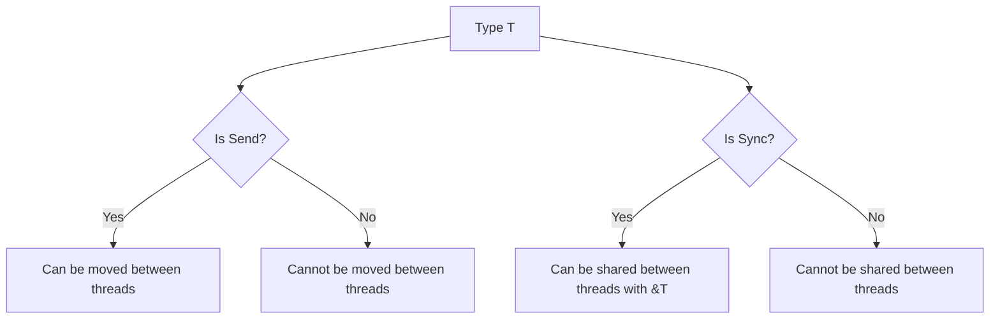

# Rust Send and Sync Traits

## Introduction

When writing concurrent code in Rust, you'll encounter two special traits: `Send` and `Sync`. These traits are fundamental to Rust's concurrency model and are a key part of how Rust guarantees thread safety. Unlike most traits in Rust, you rarely implement these traits directly—they're automatically derived for most types, but understanding them is crucial for writing correct concurrent code.

In this guide, we'll explore:
- What the `Send` and `Sync` traits are
- How they relate to Rust's ownership system
- Common patterns for working with these traits
- Real-world examples showing how they're used

## What Are Send and Sync?

### The Send Trait

A type is `Send` if it can be safely transferred between threads. In other words, a type `T` is `Send` if it's safe to move a value of type `T` from one thread to another.

```rust
// This is how Send is defined in the standard library
pub unsafe trait Send {
    // Empty trait
}
```

The `Send` trait is a marker trait, which means it doesn't have any methods to implement. It simply marks types that can be safely sent between threads.

### The Sync Trait

A type is `Sync` if it can be safely shared between threads. More precisely, a type `T` is `Sync` if and only if a shared reference to that type (`&T`) is `Send`.

```rust
// This is how Sync is defined in the standard library
pub unsafe trait Sync {
    // Empty trait
}
```

Like `Send`, `Sync` is also a marker trait with no methods.

## How Rust Uses Send and Sync

These traits are integral to Rust's concurrency guarantees:

1. **The compiler enforces thread safety**: If you try to send a non-`Send` type across threads, or share a non-`Sync` type between threads, your code won't compile.

2. **Most types are automatically Send and Sync**: The Rust compiler automatically implements these traits for types that meet the safety criteria.

3. **Some types are intentionally not Send or Sync**: For example, `Rc<T>` (a reference-counted pointer) is neither `Send` nor `Sync` because its reference counting isn't atomic.

Let's visualize the relationship:



## Common Examples

Let's look at some common Rust types and their `Send` and `Sync` status:

| Type | Send | Sync | Explanation |
|------|------|------|-------------|
| `i32`, `String`, most standard types | ✅ | ✅ | Basic types with no interior mutability are both Send and Sync |
| `Rc<T>` | ❌ | ❌ | Reference counting is not thread-safe |
| `Arc<T>` where T: Send + Sync | ✅ | ✅ | Atomic reference counting is thread-safe |
| `Cell<T>`, `RefCell<T>` | ✅ | ❌ | Interior mutability without synchronization |
| `Mutex<T>` where T: Send | ✅ | ✅ | Provides synchronized access to data |
| `RwLock<T>` where T: Send + Sync | ✅ | ✅ | Provides synchronized read/write access |
| Raw pointers (`*const T`, `*mut T`) | ✅ | ❌ | No safety guarantees for sharing |

## Practical Examples

### Example 1: Thread-Safe Counter

Let's create a simple counter that can be safely shared between threads:

```rust
use std::sync::{Arc, Mutex};
use std::thread;

fn main() {
    // Create a counter wrapped in Arc (for sharing) and Mutex (for thread safety)
    let counter = Arc::new(Mutex::new(0));
    let mut handles = vec![];

    // Spawn 10 threads
    for _ in 0..10 {
        let counter_clone = Arc::clone(&counter);
        let handle = thread::spawn(move || {
            // Lock the mutex and increment the counter
            let mut num = counter_clone.lock().unwrap();
            *num += 1;
        });
        handles.push(handle);
    }

    // Wait for all threads to complete
    for handle in handles {
        handle.join().unwrap();
    }

    // Print the final value
    println!("Final count: {}", *counter.lock().unwrap());
}
```

**Output:**
```
Final count: 10
```

In this example:
- `Arc` lets us share the counter between threads (it's both `Send` and `Sync`)
- `Mutex` provides synchronized access to the counter

### Example 2: Understanding Non-Send Types

Let's see what happens when we try to send a non-`Send` type across threads:

```rust
use std::rc::Rc;
use std::thread;

fn main() {
    let data = Rc::new(42);
    
    thread::spawn(move || {
        // Try to use data in another thread
        println!("The answer is: {}", *data);
    });
}
```

This code won't compile, and you'll get an error like:

```
error[E0277]: `Rc<i32>` cannot be sent between threads safely
   --> src/main.rs:6:5
    |
6   |     thread::spawn(move || {
    |     ^^^^^^^^^^^^^ `Rc<i32>` cannot be sent between threads safely
    |
    = help: the trait `Send` is not implemented for `Rc<i32>`
```

The compiler prevents us from sending an `Rc<T>` across threads because its reference counting isn't thread-safe.

### Example 3: Thread-Safe Version Using Arc

Here's the correct way to share data between threads:

```rust
use std::sync::Arc;
use std::thread;

fn main() {
    // Arc is the thread-safe alternative to Rc
    let data = Arc::new(42);
    let data_clone = Arc::clone(&data);
    
    let handle = thread::spawn(move || {
        // Now we can use data_clone in another thread
        println!("The answer is: {}", *data_clone);
    });
    
    handle.join().unwrap();
}
```

**Output:**
```
The answer is: 42
```

This works because `Arc<T>` is both `Send` and `Sync` (as long as `T` is `Send` and `Sync`).

## Implementing Send and Sync

Generally, you don't need to implement these traits manually. They're automatically derived for types composed of `Send` and `Sync` types.

However, sometimes you might need to:

1. **Opt out of automatic implementation**:

```rust
use std::marker::PhantomData;
use std::cell::Cell;

// This makes MyType not Send and not Sync
struct MyType<T> {
    data: T,
    // PhantomData<*const ()> is neither Send nor Sync
    _marker: PhantomData<*const ()>,
}
```

2. **Manually implement Send/Sync** (use with caution!):

```rust
use std::marker::{Send, Sync};

struct MyType {
    // Contains raw pointers or other non-Send/Sync types
    // but you guarantee thread safety through other means
    data: *mut i32,
}

// SAFETY: MyType is used in a way that ensures thread safety
unsafe impl Send for MyType {}
unsafe impl Sync for MyType {}
```

**Warning**: Manually implementing `Send` and `Sync` is unsafe and requires you to guarantee that your implementation is thread-safe.

## Send + Sync and Trait Bounds

When writing generic code that works with threads, you'll often need to specify trait bounds:

```rust
use std::thread;

fn process_in_thread<T: Send + 'static>(data: T) {
    thread::spawn(move || {
        // Do something with data
        println!("Processing data in thread");
    });
}
```

The `Send + 'static` bound ensures that `data` can be safely moved to the new thread and lives for the entire program.

Similarly, for sharing references between threads:

```rust
use std::thread;
use std::sync::Arc;

fn share_between_threads<T: Send + Sync + 'static>(data: &T) {
    let data_ref = Arc::new(data);
    let data_clone = Arc::clone(&data_ref);
    
    thread::spawn(move || {
        // Use data_clone
    });
}
```

## Common Pitfalls and Solutions

### 1. Using `Rc` instead of `Arc`

**Problem**: 
```rust
use std::rc::Rc;
use std::thread;

fn main() {
    let data = Rc::new(vec![1, 2, 3]);
    
    // Doesn't compile - Rc is not Send
    thread::spawn(move || {
        println!("{:?}", data);
    });
}
```

**Solution**: Use `Arc` instead of `Rc` for thread-safe reference counting.

### 2. Sharing mutable data without synchronization

**Problem**:
```rust
use std::sync::Arc;
use std::thread;

fn main() {
    let data = Arc::new(vec![1, 2, 3]);
    let data_clone = Arc::clone(&data);
    
    thread::spawn(move || {
        // Cannot mutate through Arc - doesn't compile
        data_clone.push(4); 
    });
}
```

**Solution**: Use `Mutex` or `RwLock` for synchronized mutable access.

```rust
use std::sync::{Arc, Mutex};
use std::thread;

fn main() {
    let data = Arc::new(Mutex::new(vec![1, 2, 3]));
    let data_clone = Arc::clone(&data);
    
    thread::spawn(move || {
        // Lock the mutex and then modify
        data_clone.lock().unwrap().push(4);
    });
}
```

### 3. Unexpected non-Send types in a struct

**Problem**:
```rust
use std::thread;
use std::cell::RefCell;

struct MyData {
    counter: RefCell<i32>, // RefCell is not Sync!
}

fn main() {
    let data = MyData { counter: RefCell::new(0) };
    
    // Doesn't compile - MyData is not Sync because RefCell isn't
    thread::spawn(move || {
        *data.counter.borrow_mut() += 1;
    });
}
```

**Solution**: Use thread-safe alternatives.

```rust
use std::sync::{Arc, Mutex};
use std::thread;

struct MyData {
    counter: Mutex<i32>, // Mutex is Sync!
}

fn main() {
    let data = Arc::new(MyData { counter: Mutex::new(0) });
    let data_clone = Arc::clone(&data);
    
    thread::spawn(move || {
        *data_clone.counter.lock().unwrap() += 1;
    });
}
```

## Summary

Rust's `Send` and `Sync` traits are foundational to its concurrency story:

- `Send`: Types that can be safely transferred between threads
- `Sync`: Types that can be safely shared between threads (via references)

Most Rust types automatically implement these traits, but understanding when they don't (and why) helps you write correct concurrent code. The compiler uses these traits to prevent data races at compile time, making Rust's concurrency both powerful and safe.

When writing concurrent Rust code, remember:
1. Use `Arc` instead of `Rc` for shared ownership between threads
2. Use synchronization primitives like `Mutex` and `RwLock` for shared mutable state
3. Pay attention to compiler errors about `Send` and `Sync` — they're helping you avoid bugs!

## Additional Resources

- [Rust Book: Fearless Concurrency](https://doc.rust-lang.org/book/ch16-00-concurrency.html)
- [Rustonomicon: Send and Sync](https://doc.rust-lang.org/nomicon/send-and-sync.html)
- [Rust by Example: Concurrency](https://doc.rust-lang.org/rust-by-example/std_misc/threads.html)

## Exercises

1. Create a thread-safe counter that can be incremented from multiple threads.
2. Write a function that takes a closure and executes it in a new thread, ensuring proper type constraints.
3. Implement a simple thread pool that can process tasks in parallel.
4. Create a type that intentionally doesn't implement `Send` or `Sync`, and then wrap it in synchronization primitives to make it thread-safe.
5. Experiment with `Arc<Mutex<T>>` vs. `Mutex<Arc<T>>` — how do they differ and when would you use each?