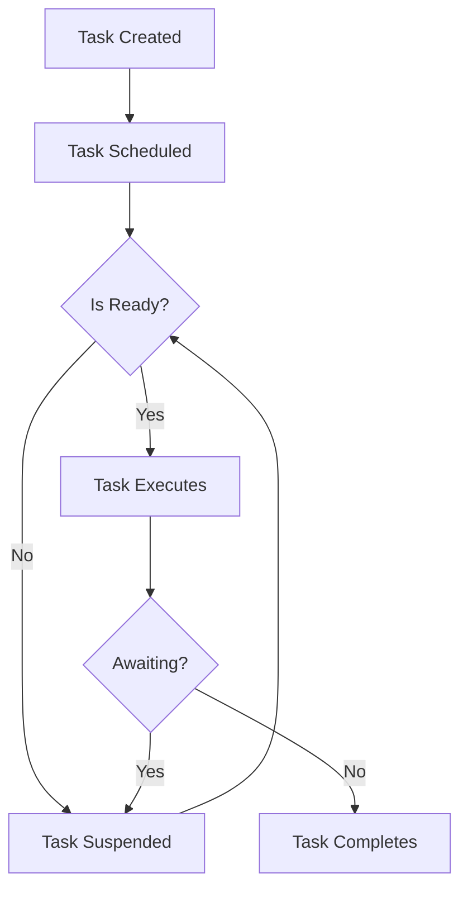

# Rust Async Basics

## Introduction

Asynchronous programming allows your code to perform multiple operations concurrently without using multiple threads. This is especially useful for I/O-bound operations like network requests, file operations, and database queries, where your program might spend a lot of time waiting for external resources.

In this tutorial, we'll explore the foundations of asynchronous programming in Rust, understand the core concepts, and build some practical examples to demonstrate how async code works.

## Why Async Programming?

Before diving into the code, let's understand why async programming is valuable:

- **Efficiency**: Async code can handle many concurrent operations with minimal resources
- **Scalability**: Your applications can handle more connections/requests with the same hardware
- **Responsiveness**: Your application remains responsive while performing long-running operations

In Rust, async programming is based on the concept of **Futures**, which represent values that might not be available yet.

## Core Concepts

### Futures

A Future in Rust is a trait that represents a value that might not be available yet. The simplified definition looks like this:

```rust
trait Future {
    type Output;
    fn poll(self: Pin<&mut Self>, cx: &mut Context<'_>) -> Poll<Self::Output>;
}
```

Don't worry if this looks complex! Most of the time, you won't interact with this directly. Instead, you'll use the `async/await` syntax, which makes working with Futures much more intuitive.

### The async/await Syntax

Rust provides the `async` and `await` keywords to work with Futures:

- `async` transforms a block of code or function into a Future
- `await` suspends execution until a Future completes

Here's a simple example:

```rust
async fn fetch_data() -> String {
    // Simulating a network request
    tokio::time::sleep(tokio::time::Duration::from_secs(1)).await;
    "Data from server".to_string()
}

async fn process() {
    let data = fetch_data().await;
    println!("Received: {}", data);
}
```

### Async Runtimes

To execute async code in Rust, you need an async runtime. The two most popular options are:

1. **Tokio**: A complete async runtime with scheduler, I/O, and more
2. **async-std**: A library that provides async versions of standard library components

In this tutorial, we'll use Tokio as it's the most widely adopted.

## Getting Started with Async Rust

Let's create a simple project to demonstrate async programming:

### Step 1: Set Up a New Project

First, create a new Rust project:

```bash
cargo new async_basics
cd async_basics
```

### Step 2: Add Dependencies

Update your `Cargo.toml` to include Tokio:

```toml
[dependencies]
tokio = { version = "1.28", features = ["full"] }
```

### Step 3: Write Your First Async Program

Replace the contents of `src/main.rs` with:

```rust
use tokio::time::{sleep, Duration};

async fn say_hello(name: &str, delay: u64) {
    sleep(Duration::from_secs(delay)).await;
    println!("Hello, {}!", name);
}

#[tokio::main]
async fn main() {
    // These will run concurrently
    let task1 = tokio::spawn(say_hello("Alice", 1));
    let task2 = tokio::spawn(say_hello("Bob", 2));
    let task3 = tokio::spawn(say_hello("Charlie", 3));
    
    // Wait for all tasks to complete
    let _ = tokio::join!(task1, task2, task3);
    
    println!("All greetings complete!");
}
```

### Step 4: Run the Program

Execute your program with:

```bash
cargo run
```

**Output:**
```
Hello, Alice!
Hello, Bob!
Hello, Charlie!
All greetings complete!
```

Notice that despite the different delays, our program waits for all tasks to complete before printing the final message.

## How Async Works in Rust

Let's visualize how async execution works in Rust:



When you call an async function, it returns a Future that doesn't execute immediately. The runtime schedules the Future for execution, and when it encounters an `await`, it may suspend the task if the awaited operation isn't ready yet.

## Practical Examples

### Example 1: Concurrent Downloads

Let's build a simple program that fetches multiple URLs concurrently:

```rust
use tokio::time::{sleep, Duration};
use std::error::Error;

async fn fetch_url(url: &str) -> Result<String, Box<dyn Error>> {
    // In a real application, you would use reqwest or similar
    // Here we're simulating network delays
    println!("Fetching: {}", url);
    
    // Simulate different download times
    let delay = match url {
        "https://example.com" => 2,
        "https://rust-lang.org" => 3,
        _ => 1,
    };
    
    sleep(Duration::from_secs(delay)).await;
    
    Ok(format!("Content from {}: [... data ...]", url))
}

#[tokio::main]
async fn main() -> Result<(), Box<dyn Error>> {
    let urls = vec![
        "https://example.com",
        "https://rust-lang.org",
        "https://docs.rs",
    ];
    
    let mut handles = vec![];
    
    // Start all downloads concurrently
    for url in urls {
        let handle = tokio::spawn(async move {
            match fetch_url(url).await {
                Ok(content) => println!("Downloaded: {}", content),
                Err(e) => eprintln!("Error downloading {}: {}", url, e),
            }
        });
        
        handles.push(handle);
    }
    
    // Wait for all downloads to complete
    for handle in handles {
        handle.await?;
    }
    
    println!("All downloads complete!");
    
    Ok(())
}
```

**Output:**
```
Fetching: https://example.com
Fetching: https://rust-lang.org
Fetching: https://docs.rs
Downloaded: Content from https://docs.rs: [... data ...]
Downloaded: Content from https://example.com: [... data ...]
Downloaded: Content from https://rust-lang.org: [... data ...]
All downloads complete!
```

Notice how the downloads start immediately but complete at different times based on their simulated delays.

### Example 2: Async File Operations

Now let's see how to perform asynchronous file operations:

```rust
use tokio::fs::File;
use tokio::io::{self, AsyncReadExt, AsyncWriteExt};

#[tokio::main]
async fn main() -> io::Result<()> {
    // Create a file
    let mut file = File::create("async_test.txt").await?;
    
    // Write data asynchronously
    file.write_all(b"Hello, async Rust!
").await?;
    file.write_all(b"This file was written asynchronously.").await?;
    
    // Make sure data is flushed to disk
    file.flush().await?;
    
    println!("File written successfully");
    
    // Open and read the file
    let mut file = File::open("async_test.txt").await?;
    
    // Read the content into a string
    let mut contents = String::new();
    file.read_to_string(&mut contents).await?;
    
    println!("File contents: {}", contents);
    
    // Clean up
    tokio::fs::remove_file("async_test.txt").await?;
    println!("File removed");
    
    Ok(())
}
```

**Output:**
```
File written successfully
File contents: Hello, async Rust!
This file was written asynchronously.
File removed
```

## Common Patterns in Async Rust

### Pattern 1: Select (Racing Futures)

Sometimes you want to wait for the first of several futures to complete. You can use `tokio::select!` for this:

```rust
use tokio::time::{sleep, Duration};

#[tokio::main]
async fn main() {
    tokio::select! {
        _ = sleep(Duration::from_secs(1)) => {
            println!("Task 1 completed first");
        }
        _ = sleep(Duration::from_millis(500)) => {
            println!("Task 2 completed first");
        }
        _ = sleep(Duration::from_secs(2)) => {
            println!("Task 3 completed first");
        }
    }
}
```

**Output:**
```
Task 2 completed first
```

### Pattern 2: Timeouts

You can add timeouts to async operations:

```rust
use tokio::time::{timeout, sleep, Duration};

async fn long_running_task() {
    sleep(Duration::from_secs(5)).await;
    println!("Long task completed");
}

#[tokio::main]
async fn main() {
    match timeout(Duration::from_secs(2), long_running_task()).await {
        Ok(_) => println!("Task completed within the timeout"),
        Err(_) => println!("Task timed out!"),
    }
}
```

**Output:**
```
Task timed out!
```

## Common Pitfalls and Solutions

### Pitfall 1: Blocking the Async Runtime

A common mistake is to perform blocking operations in an async context:

```rust
use tokio::time::Duration;

#[tokio::main]
async fn main() {
    // BAD: This blocks the async runtime thread!
    std::thread::sleep(Duration::from_secs(2));
    println!("Done sleeping");
}
```

**Solution:** Use the async version or spawn a blocking task:

```rust
use tokio::time::{sleep, Duration};

#[tokio::main]
async fn main() {
    // GOOD: This uses async sleep
    sleep(Duration::from_secs(2)).await;
    println!("Done sleeping with async");
    
    // ALSO GOOD: This moves blocking work to a dedicated thread
    tokio::task::spawn_blocking(|| {
        std::thread::sleep(Duration::from_secs(2));
        println!("Done sleeping with spawn_blocking");
    }).await.unwrap();
}
```

### Pitfall 2: Not Awaiting Futures

Another common mistake is creating Futures without awaiting them:

```rust
async fn print_message(msg: &str) {
    println!("{}", msg);
}

#[tokio::main]
async fn main() {
    // BAD: This creates a Future but never executes it!
    print_message("This won't be printed");
    
    // GOOD: This awaits the Future, causing it to execute
    print_message("This will be printed").await;
}
```

## Summary

In this tutorial, we've covered the fundamentals of asynchronous programming in Rust:

- **Futures** are the foundation of async Rust, representing values that might not be available yet
- **async/await** syntax makes working with Futures more intuitive
- **Async runtimes** like Tokio provide the execution environment for async code
- Async code allows for **concurrent execution** without multiple threads
- Common patterns like **joins**, **select**, and **timeouts** help manage async workflows

Asynchronous programming in Rust gives you the tools to write highly concurrent, efficient applications without sacrificing safety. With the async/await syntax, what used to be complex code involving callbacks or state machines becomes readable, maintainable code.

## Further Resources

To deepen your understanding of async Rust, check out these resources:

1. [Tokio Documentation](https://tokio.rs/tokio/tutorial) - Comprehensive guide to Tokio
2. [Rust Async Book](https://rust-lang.github.io/async-book/) - Official documentation on async Rust
3. [reqwest](https://docs.rs/reqwest/) - Popular async HTTP client for Rust
4. [async-std](https://docs.rs/async-std/) - Alternative async runtime

## Exercises

To practice what you've learned, try these exercises:

1. **Parallel Web Scraper**: Create a program that downloads multiple web pages concurrently and extracts data from them
2. **Async File Processor**: Build a tool that processes multiple files concurrently
3. **Chat Server**: Implement a simple chat server that can handle multiple client connections asynchronously
4. **Rate Limiter**: Create an async function that enforces rate limits on API calls

By working through these exercises, you'll gain practical experience with async Rust and be well on your way to building efficient, concurrent applications!