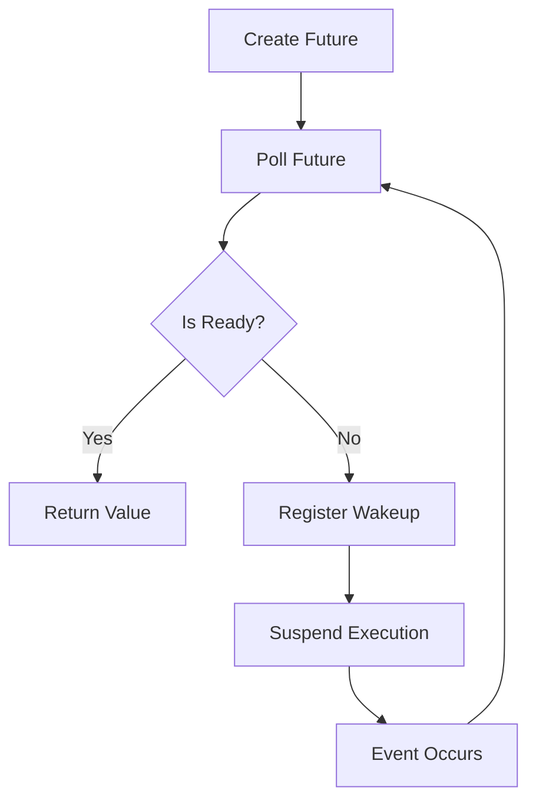

# Rust Future Trait

When working with asynchronous programming in Rust, the `Future` trait is one of the most fundamental concepts you'll encounter. This trait is the cornerstone of Rust's async ecosystem, enabling efficient non-blocking operations. In this guide, we'll explore what futures are, how they work, and how to use them effectively in your Rust programs.

## What is a Future?

A `Future` represents a computation that will complete at some point in the future. Unlike synchronous code that executes sequentially, futures allow your program to make progress on other tasks while waiting for operations like network requests or file I/O to complete.

In Rust, a `Future` is defined as a trait in the standard library:

```rust
pub trait Future {
    type Output;
    
    fn poll(self: Pin<&mut Self>, cx: &mut Context<'_>) -> Poll<Self::Output>;
}
```

Let's break down this trait definition:

- `type Output`: The type that the future will produce when it completes
- `poll`: A method that checks if the future is ready to produce a value
- `Pin<&mut Self>`: A way to ensure the future doesn't move in memory
- `Context<'_>`: Provides a way for the future to register a wakeup when it's ready
- `Poll<Self::Output>`: An enum that can be either `Ready(value)` or `Pending`

## The Life Cycle of a Future

To understand how futures work in Rust, let's visualize their lifecycle:



1. A future is created (e.g., by calling an async function)
2. The runtime polls the future to check if it's ready
3. If the future is ready, it returns `Poll::Ready(value)`
4. If not ready, it returns `Poll::Pending` and registers a wakeup
5. When the future becomes ready, it wakes up the runtime
6. The runtime polls the future again
7. This cycle continues until the future completes

## Creating Futures in Rust

There are several ways to create futures in Rust:

### 1. Using async/await

The most common way to create futures is by using the `async` keyword:

```rust
async fn fetch_data(url: &str) -> Result<String, Error> {
    // Asynchronous code here
    let response = reqwest::get(url).await?;
    let body = response.text().await?;
    Ok(body)
}
```

When you define an `async` function, Rust automatically converts it into a function that returns a future. The `await` keyword is used to wait for a future to complete without blocking the thread.

### 2. Implementing the Future Trait Manually

Although less common, you can implement the `Future` trait directly:

```rust
use std::future::Future;
use std::pin::Pin;
use std::task::{Context, Poll};
use std::time::{Duration, Instant};

struct Delay {
    when: Instant,
}

impl Future for Delay {
    type Output = ();
    
    fn poll(self: Pin<&mut Self>, cx: &mut Context<'_>) -> Poll<Self::Output> {
        if Instant::now() >= self.when {
            println!("Future completed!");
            Poll::Ready(())
        } else {
            // Set a wakeup for when the timer elapses
            let waker = cx.waker().clone();
            let when = self.when;
            
            std::thread::spawn(move || {
                let now = Instant::now();
                if now < when {
                    std::thread::sleep(when - now);
                }
                waker.wake();
            });
            
            Poll::Pending
        }
    }
}

// Creating and using our custom future
fn main() {
    let future = Delay {
        when: Instant::now() + Duration::from_secs(2),
    };
    
    // In a real application, you would use a runtime to poll this future
    // This is just an example of the implementation
}
```

This example shows a simple future that completes after a specified delay. Manually implementing futures can be complex due to the details of pinning and waking, which is why most Rust developers prefer using `async/await`.

## Combining and Manipulating Futures

Futures can be combined and manipulated in various ways:

### Running Futures Concurrently

The `join!` macro allows you to run multiple futures concurrently and wait for all of them to complete:

```rust
use futures::join;

async fn concurrent_example() {
    let future1 = fetch_data("https://example.com/api/1");
    let future2 = fetch_data("https://example.com/api/2");
    
    let (result1, result2) = join!(future1, future2);
    
    println!("Result 1: {:?}", result1);
    println!("Result 2: {:?}", result2);
}
```

### Selecting Between Futures

The `select!` macro allows you to wait for the first future to complete:

```rust
use futures::select;

async fn select_example() {
    let future1 = fetch_data("https://example.com/api/1");
    let future2 = fetch_data("https://example.com/api/2");
    
    select! {
        result = future1.fuse() => {
            println!("Future 1 completed first: {:?}", result);
        }
        result = future2.fuse() => {
            println!("Future 2 completed first: {:?}", result);
        }
    }
}
```

### Chaining Futures

Futures can be chained using methods like `then`, `and_then`, or `map`:

```rust
use futures::FutureExt;

async fn chain_example() {
    let result = fetch_data("https://example.com/api")
        .map(|result| {
            match result {
                Ok(data) => process_data(data),
                Err(e) => handle_error(e),
            }
        })
        .await;
}
```

## Real-World Example: Building a Web Scraper

Let's build a simple web scraper that demonstrates the power of futures and async programming:

```rust
use futures::stream::{self, StreamExt};
use reqwest::Client;
use scraper::{Html, Selector};
use std::error::Error;
use std::time::Instant;

async fn scrape_url(client: &Client, url: &str) -> Result<Vec<String>, Box<dyn Error>> {
    println!("Fetching: {}", url);
    let response = client.get(url).send().await?;
    let body = response.text().await?;
    
    let document = Html::parse_document(&body);
    let selector = Selector::parse("h2.title").unwrap();
    
    let titles = document
        .select(&selector)
        .map(|element| element.text().collect::<String>())
        .collect();
    
    Ok(titles)
}

async fn scrape_websites(urls: Vec<&str>) -> Result<(), Box<dyn Error>> {
    let client = Client::new();
    let start = Instant::now();
    
    // Sequential approach
    println!("Sequential scraping:");
    for url in &urls {
        let titles = scrape_url(&client, url).await?;
        println!("Found {} titles on {}", titles.len(), url);
    }
    println!("Sequential scraping took: {:?}", start.elapsed());
    
    // Concurrent approach
    let start = Instant::now();
    println!("
Concurrent scraping:");
    let results = stream::iter(urls.clone())
        .map(|url| scrape_url(&client, url))
        .buffer_unordered(10) // Process up to 10 requests concurrently
        .collect::<Vec<_>>()
        .await;
    
    for (i, result) in results.iter().enumerate() {
        match result {
            Ok(titles) => println!("Found {} titles on {}", titles.len(), urls[i]),
            Err(e) => println!("Error scraping {}: {}", urls[i], e),
        }
    }
    println!("Concurrent scraping took: {:?}", start.elapsed());
    
    Ok(())
}

#[tokio::main]
async fn main() -> Result<(), Box<dyn Error>> {
    let urls = vec![
        "https://news.ycombinator.com",
        "https://reddit.com/r/rust",
        "https://reddit.com/r/programming",
        "https://lobste.rs",
    ];
    
    scrape_websites(urls).await?;
    
    Ok(())
}
```

When you run this example, you'll see a significant performance improvement with the concurrent approach compared to the sequential approach, especially as the number of URLs increases.

## Common Pitfalls and Best Practices

### 1. Blocking in Async Code

One common mistake is performing blocking operations inside async functions:

```rust
async fn bad_practice() {
    // This blocks the thread, defeating the purpose of async
    std::thread::sleep(std::time::Duration::from_secs(1));
    
    // Do some work...
}

async fn good_practice() {
    // This doesn't block the thread
    tokio::time::sleep(std::time::Duration::from_secs(1)).await;
    
    // Do some work...
}
```

### 2. Forgetting to Await

Another common mistake is forgetting to await a future:

```rust
async fn process_data() {
    // This creates a future but doesn't await it
    let future = fetch_data("https://example.com/api");
    
    // The future hasn't executed yet, so this will be incorrect
    println!("Data processed!");
}

async fn process_data_correctly() {
    // This awaits the future, ensuring it completes
    let data = fetch_data("https://example.com/api").await;
    
    println!("Data processed!");
}
```

### 3. Recursive Async Functions

Be careful with recursive async functions, as they can lead to stack overflows if not implemented carefully:

```rust
// This could cause problems with deep recursion
async fn recursive_process(data: &[u8], depth: usize) -> Result<(), Error> {
    if depth > MAX_DEPTH {
        return Ok(());
    }
    
    // Process data...
    
    recursive_process(&data[1..], depth + 1).await
}
```

## Understanding Executor and Runtime

Futures in Rust are lazy - they don't do anything until they're polled. This is where executors and runtimes come in:

- An **executor** is responsible for polling futures until they complete
- A **runtime** combines an executor with other components like an I/O driver and timer system

Popular async runtimes in Rust include:

- **Tokio**: Full-featured runtime with support for I/O, timers, and more
- **async-std**: Alternative runtime with an API similar to the standard library
- **smol**: Lightweight runtime focused on simplicity

Here's how you typically use Tokio:

```rust
// Using Tokio's runtime
#[tokio::main]
async fn main() {
    let result = fetch_data("https://example.com/api").await;
    println!("Result: {:?}", result);
}
```

## Summary

The `Future` trait is at the heart of Rust's async programming model, allowing you to write efficient non-blocking code. Key points to remember:

- Futures represent computations that will complete in the future
- The `poll` method is called by an executor to check if a future is ready
- Futures are lazy and do nothing until polled
- The `async/await` syntax makes working with futures much easier
- Runtimes like Tokio provide the infrastructure to execute futures efficiently
- Futures can be combined using tools like `join!` and `select!` for concurrent operations

## Exercises

1. Create a simple program that fetches data from multiple URLs concurrently and measures the performance compared to sequential fetching.
2. Implement a basic timeout mechanism for futures using `select!` and `tokio::time::sleep`.
3. Write a function that retries a future a specified number of times if it fails.
4. Create a simple rate limiter that limits the number of concurrent operations.
5. Extend the web scraper example to crawl links found on each page (limited to a certain depth).

## Additional Resources

- [Rust Async Book](https://rust-lang.github.io/async-book/)
- [Tokio Documentation](https://tokio.rs/tokio/tutorial)
- [Asynchronous Programming in Rust](https://www.oreilly.com/library/view/asynchronous-programming-in/9781492077299/)
- [Rust Futures Explained](https://cfsamson.github.io/books-futures-explained/)
- [Rust Standard Library Documentation on Future](https://doc.rust-lang.org/std/future/trait.Future.html)