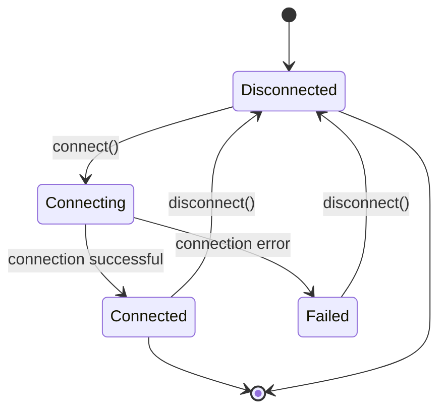

# Rust Async Patterns

## Introduction

Asynchronous programming in Rust allows you to write non-blocking code that can efficiently handle many concurrent operations. Unlike traditional synchronous code that executes operations sequentially, async code can pause execution while waiting for operations to complete, allowing other tasks to run in the meantime.

In this tutorial, we'll explore common async patterns in Rust that will help you write cleaner, more efficient concurrent code. We'll cover essential concepts like futures, async/await syntax, and practical patterns for error handling, resource management, and coordination between tasks.

## Prerequisites

Before diving into these patterns, you should have:
- Basic understanding of Rust programming
- Familiarity with Rust's ownership and borrowing system
- Some exposure to the concept of asynchronous programming

## Async Fundamentals Review

Before we explore advanced patterns, let's briefly review the fundamentals of async programming in Rust.

### What is a Future?

In Rust, a `Future` is a trait that represents a value that might not be available yet. When you create a future, you're not immediately computing a value—you're creating a description of a computation that will produce a value at some point.

```rust
pub trait Future {
    type Output;
    fn poll(self: Pin<&mut Self>, cx: &mut Context<'_>) -> Poll<Self::Output>;
}
```

The `poll` method is called by the executor to check if the value is ready. If it is, it returns `Poll::Ready(value)`. If not, it returns `Poll::Pending` and arranges for `poll` to be called again when progress can be made.

### The async/await Syntax

The `async` and `await` keywords simplify working with futures:

```rust
// Function that returns a Future
async fn fetch_data() -> Result<String, Error> {
    // Asynchronous operations here
    Ok("data".to_string())
}

// Using the function with await
async fn process() {
    match fetch_data().await {
        Ok(data) => println!("Received: {}", data),
        Err(e) => eprintln!("Error: {}", e),
    }
}
```

## Pattern 1: Error Handling in Async Code

Handling errors properly in async code is essential. Here are some common patterns:

### Using the `?` Operator with Futures

The `?` operator works seamlessly with async functions:

```rust
async fn fetch_and_process() -> Result<ProcessedData, Error> {
    let raw_data = fetch_data().await?;
    let cleaned_data = clean_data(raw_data).await?;
    let processed_data = process_data(cleaned_data).await?;
    Ok(processed_data)
}
```

**Input:** A series of async operations that might fail
**Output:** A single result representing success or failure of the entire operation

### Custom Error Types

Creating custom error types helps manage different error cases:

```rust
#[derive(Debug)]
enum AppError {
    NetworkError(reqwest::Error),
    DatabaseError(sqlx::Error),
    ValidationError(String),
}

impl From<reqwest::Error> for AppError {
    fn from(err: reqwest::Error) -> Self {
        AppError::NetworkError(err)
    }
}

impl From<sqlx::Error> for AppError {
    fn from(err: sqlx::Error) -> Self {
        AppError::DatabaseError(err)
    }
}

async fn fetch_user_data(user_id: i64) -> Result<UserData, AppError> {
    let raw_data = fetch_from_network(user_id).await?; // Returns Result<Data, reqwest::Error>
    let user = validate_user_data(&raw_data)?; // Returns Result<UserData, ValidationError>
    let user_with_details = fetch_details_from_db(&user).await?; // Returns Result<UserData, sqlx::Error>
    Ok(user_with_details)
}
```

## Pattern 2: Resource Management

Managing resources properly in async code can be tricky. Here are some patterns:

### Using RAII with Async

The RAII (Resource Acquisition Is Initialization) pattern works well with async code:

```rust
struct DatabaseConnection {
    conn: sqlx::Pool<sqlx::Postgres>,
}

impl DatabaseConnection {
    async fn new(connection_string: &str) -> Result<Self, sqlx::Error> {
        let conn = sqlx::PgPool::connect(connection_string).await?;
        Ok(Self { conn })
    }
    
    async fn query(&self, query: &str) -> Result<Vec<User>, sqlx::Error> {
        // Use self.conn to query the database
        sqlx::query_as::<_, User>(query)
            .fetch_all(&self.conn)
            .await
    }
}

// When DatabaseConnection goes out of scope, resources are cleaned up
```

### The Async Drop Problem

One limitation in Rust is that `Drop` cannot be async. When you need to perform async cleanup, consider these approaches:

1. **Use sync alternatives** when possible
2. **Defer cleanup to a background task**
3. **Use explicit cleanup methods**

```rust
struct AsyncResource {
    // Resource data
    cleanup_sender: Option<tokio::sync::oneshot::Sender<()>>,
}

impl AsyncResource {
    async fn new() -> Self {
        // Setup resource
        let (tx, rx) = tokio::sync::oneshot::channel();
        let resource = AsyncResource {
            cleanup_sender: Some(tx),
        };
        
        // Spawn a task to handle the async cleanup
        tokio::spawn(async move {
            // Wait for the signal to clean up
            let _ = rx.await;
            // Perform async cleanup
        });
        
        resource
    }
    
    async fn cleanup(mut self) {
        // Send the cleanup signal
        if let Some(sender) = self.cleanup_sender.take() {
            let _ = sender.send(());
        }
    }
}

// Usage
async fn use_resource() {
    let resource = AsyncResource::new().await;
    // Use the resource
    resource.cleanup().await;
}
```

## Pattern 3: Concurrency Control

Managing concurrent tasks efficiently is a key benefit of async programming.

### Executing Tasks in Parallel

Use `join!` or `try_join!` to run futures concurrently and wait for all to complete:

```rust
use futures::future::{join, try_join};

async fn parallel_operations() -> Result<(), Error> {
    // Both operations run concurrently
    let (result1, result2) = try_join!(
        async_operation1(),
        async_operation2()
    )?;
    
    println!("Results: {} and {}", result1, result2);
    Ok(())
}
```

**Input:** Multiple independent futures
**Output:** Tuple of results, available when all futures complete

### Limiting Concurrency

To avoid overloading resources, limit concurrent tasks:

```rust
use futures::stream::{self, StreamExt};

async fn process_items(items: Vec<Item>) -> Result<Vec<ProcessedItem>, Error> {
    // Process up to 5 items concurrently
    stream::iter(items)
        .map(|item| async move {
            process_single_item(item).await
        })
        .buffer_unordered(5) // Maximum of 5 concurrent tasks
        .collect::<Vec<Result<ProcessedItem, Error>>>()
        .await
        .into_iter()
        .collect() // Consolidate errors
}
```

This pattern is especially useful when processing large collections while respecting resource constraints.

## Pattern 4: Timeouts and Cancellation

Properly handling timeouts and cancellation is crucial for robust async code.

### Adding Timeouts to Async Operations

Use `tokio::time::timeout` to add timeouts to async operations:

```rust
use tokio::time::{timeout, Duration};

async fn fetch_with_timeout() -> Result<Data, Error> {
    // Will error if fetch_data takes longer than 5 seconds
    match timeout(Duration::from_secs(5), fetch_data()).await {
        Ok(result) => result,
        Err(_) => Err(Error::Timeout("Operation timed out".into())),
    }
}
```

**Input:** A future and a timeout duration
**Output:** Either the future's result or a timeout error

### Graceful Cancellation

Implement cancellation points in long-running operations:

```rust
use tokio::select;
use tokio::sync::oneshot;

async fn cancellable_operation(
    cancel_rx: oneshot::Receiver<()>
) -> Result<(), Error> {
    select! {
        res = async {
            // Long operation broken into smaller chunks
            for chunk in data.chunks(1000) {
                process_chunk(chunk).await?;
                // Check for cancellation after each chunk
                tokio::task::yield_now().await;
            }
            Ok::<(), Error>(())
        } => res,
        
        _ = cancel_rx => {
            println!("Operation cancelled");
            Ok(())
        }
    }
}

async fn main_logic() {
    let (cancel_tx, cancel_rx) = oneshot::channel();
    
    // Spawn the operation
    let handle = tokio::spawn(cancellable_operation(cancel_rx));
    
    // Cancel after 10 seconds
    tokio::time::sleep(Duration::from_secs(10)).await;
    let _ = cancel_tx.send(());
    
    // Wait for the operation to clean up
    let _ = handle.await;
}
```

This pattern ensures long operations can be cancelled gracefully.

## Pattern 5: State Machines with Async

Complex async workflows can be modeled as state machines:

```rust
enum ConnectionState {
    Disconnected,
    Connecting,
    Connected(Connection),
    Failed(Error),
}

struct ConnectionManager {
    state: ConnectionState,
}

impl ConnectionManager {
    fn new() -> Self {
        Self { state: ConnectionState::Disconnected }
    }
    
    async fn connect(&mut self) -> Result<(), Error> {
        match self.state {
            ConnectionState::Disconnected => {
                self.state = ConnectionState::Connecting;
                match Connection::new().await {
                    Ok(conn) => {
                        self.state = ConnectionState::Connected(conn);
                        Ok(())
                    }
                    Err(e) => {
                        self.state = ConnectionState::Failed(e.clone());
                        Err(e)
                    }
                }
            }
            ConnectionState::Connected(_) => {
                // Already connected
                Ok(())
            }
            ConnectionState::Connecting => {
                // Connection in progress
                Err(Error::ConnectionInProgress)
            }
            ConnectionState::Failed(ref e) => {
                // Previous connection failed
                Err(e.clone())
            }
        }
    }
    
    async fn disconnect(&mut self) {
        if let ConnectionState::Connected(conn) = std::mem::replace(&mut self.state, ConnectionState::Disconnected) {
            conn.close().await;
        }
    }
}
```

This diagram illustrates the state machine:



## Pattern 6: Backpressure and Throttling

Handling backpressure (when a system produces data faster than it can be consumed) is important in async systems.

### Using Channels for Backpressure

```rust
use tokio::sync::mpsc;

async fn producer_consumer() {
    // Create a bounded channel with capacity 100
    let (tx, mut rx) = mpsc::channel(100);
    
    // Producer task
    let producer = tokio::spawn(async move {
        for i in 0..1000 {
            // If channel is full, this will wait until there's space
            if tx.send(i).await.is_err() {
                break;
            }
        }
    });
    
    // Consumer task
    let consumer = tokio::spawn(async move {
        while let Some(item) = rx.recv().await {
            process_item(item).await;
        }
    });
    
    // Wait for both tasks
    let _ = tokio::join!(producer, consumer);
}
```

When the channel is full, the producer will naturally pause until the consumer catches up.

### Rate Limiting

For APIs or other systems with rate limits:

```rust
use tokio::time::{sleep, Duration};
use std::sync::Arc;
use tokio::sync::Semaphore;

struct RateLimiter {
    semaphore: Arc<Semaphore>,
}

impl RateLimiter {
    fn new(requests_per_second: usize) -> Self {
        let semaphore = Arc::new(Semaphore::new(requests_per_second));
        
        // Replenish permits once per second
        let sem_clone = semaphore.clone();
        tokio::spawn(async move {
            loop {
                sleep(Duration::from_secs(1)).await;
                sem_clone.add_permits(requests_per_second);
            }
        });
        
        Self { semaphore }
    }
    
    async fn acquire(&self) {
        let _permit = self.semaphore.acquire().await.unwrap();
        // Permit is automatically released when _permit goes out of scope
    }
}

async fn rate_limited_api_call(limiter: &RateLimiter, id: u32) -> Result<(), Error> {
    // Wait until we're allowed to make another request
    limiter.acquire().await;
    
    // Now make the API call
    api_call(id).await
}
```

## Pattern 7: The Select Pattern

The `select!` macro allows waiting on multiple async operations and proceeding with the first one to complete:

```rust
use tokio::select;
use tokio::sync::mpsc;
use tokio::time::{sleep, Duration};

async fn select_example() {
    let (tx, mut rx) = mpsc::channel(10);
    
    // Send a message after 2 seconds
    tokio::spawn(async move {
        sleep(Duration::from_secs(2)).await;
        let _ = tx.send("Message received").await;
    });
    
    select! {
        // Branch 1: Wait for message
        Some(msg) = rx.recv() => {
            println!("Got message: {}", msg);
        }
        
        // Branch 2: Timeout after 3 seconds
        _ = sleep(Duration::from_secs(3)) => {
            println!("Timed out waiting for message");
        }
        
        // Branch 3: User interrupt
        _ = user_interrupt() => {
            println!("Interrupted by user");
        }
    }
}

async fn user_interrupt() {
    // Some logic to detect user interrupt
    // For example, waiting for a signal
    tokio::signal::ctrl_c().await.unwrap();
}
```

This pattern is especially useful for implementing timeouts, handling cancellation, or processing the first available result from multiple sources.

## Real-World Example: Building a Web Scraper

Let's build a simple web scraper that demonstrates many of these patterns:

```rust
use futures::stream::{self, StreamExt};
use reqwest::Client;
use std::time::Duration;
use tokio::sync::Semaphore;
use tokio::time::timeout;
use std::sync::Arc;

#[derive(Debug)]
enum ScraperError {
    RequestError(reqwest::Error),
    Timeout,
    ParseError(String),
}

impl From<reqwest::Error> for ScraperError {
    fn from(err: reqwest::Error) -> Self {
        ScraperError::RequestError(err)
    }
}

struct Scraper {
    client: Client,
    rate_limiter: Arc<Semaphore>,
}

impl Scraper {
    fn new(requests_per_second: usize) -> Self {
        let client = Client::builder()
            .timeout(Duration::from_secs(10))
            .build()
            .unwrap();
            
        let rate_limiter = Arc::new(Semaphore::new(requests_per_second));
        
        // Replenish rate limit tokens
        let limiter_clone = rate_limiter.clone();
        tokio::spawn(async move {
            loop {
                tokio::time::sleep(Duration::from_secs(1)).await;
                limiter_clone.add_permits(requests_per_second);
            }
        });
        
        Self { client, rate_limiter }
    }
    
    async fn fetch_url(&self, url: &str) -> Result<String, ScraperError> {
        // Acquire rate limit permit
        let _permit = self.rate_limiter.acquire().await.unwrap();
        
        // Fetch with timeout
        let response = timeout(
            Duration::from_secs(5),
            self.client.get(url).send()
        ).await.map_err(|_| ScraperError::Timeout)??;
        
        // Get response text
        let text = response.text().await?;
        Ok(text)
    }
    
    async fn extract_links(&self, html: &str) -> Vec<String> {
        // Very simple link extraction (would use a proper HTML parser in real code)
        html.lines()
            .filter_map(|line| {
                if line.contains("href=\"http") {
                    let start = line.find("href=\"http")? + 6;
                    let end = line[start..].find("\"")? + start;
                    Some(line[start..end].to_string())
                } else {
                    None
                }
            })
            .collect()
    }
    
    async fn crawl(&self, start_url: &str, max_depth: usize) -> Vec<String> {
        let mut visited = std::collections::HashSet::new();
        let mut to_visit = vec![(start_url.to_string(), 0)];
        let mut all_links = Vec::new();
        
        while let Some((url, depth)) = to_visit.pop() {
            if depth > max_depth || visited.contains(&url) {
                continue;
            }
            
            visited.insert(url.clone());
            println!("Crawling {} (depth: {})", url, depth);
            
            match self.fetch_url(&url).await {
                Ok(html) => {
                    let links = self.extract_links(&html).await;
                    all_links.extend(links.clone());
                    
                    // Add new links to visit
                    for link in links {
                        if !visited.contains(&link) {
                            to_visit.push((link, depth + 1));
                        }
                    }
                }
                Err(e) => {
                    eprintln!("Error fetching {}: {:?}", url, e);
                }
            }
            
            // Be nice to the server
            tokio::time::sleep(Duration::from_millis(100)).await;
        }
        
        all_links
    }
    
    async fn parallel_crawl(
        &self, 
        start_urls: Vec<String>, 
        max_depth: usize,
        max_concurrent: usize
    ) -> Vec<String> {
        // Process multiple start URLs in parallel with concurrency limit
        stream::iter(start_urls)
            .map(|url| {
                let scraper = &self;
                async move {
                    scraper.crawl(&url, max_depth).await
                }
            })
            .buffer_unordered(max_concurrent)
            .flat_map(|links| stream::iter(links))
            .collect()
            .await
    }
}

// Example usage
async fn run_scraper() {
    let scraper = Scraper::new(5); // 5 requests per second
    
    let start_urls = vec![
        "https://example.com".to_string(),
        "https://another-site.com".to_string(),
    ];
    
    let links = scraper.parallel_crawl(start_urls, 2, 3).await;
    println!("Found {} links", links.len());
}
```

This example demonstrates:
1. Error handling with custom error types
2. Rate limiting and backpressure
3. Timeouts
4. Parallel processing with concurrency limits
5. Resource management

## Summary

In this tutorial, we've explored several important async patterns in Rust:

1. **Error Handling** - Using `?` operator and custom error types
2. **Resource Management** - Proper initialization and cleanup
3. **Concurrency Control** - Running tasks in parallel with limits
4. **Timeouts and Cancellation** - Making operations interruptible
5. **State Machines** - Modeling complex workflows
6. **Backpressure and Throttling** - Managing flow control
7. **Select Pattern** - Handling multiple async events

These patterns will help you write more robust, efficient, and maintainable async code in Rust.

## Additional Resources

Here are some resources to deepen your understanding:

- [Asynchronous Programming in Rust](https://rust-lang.github.io/async-book/) - The official Async Book
- [Tokio Documentation](https://tokio.rs/tokio/tutorial) - Tutorials for the Tokio runtime
- [Futures Crate Documentation](https://docs.rs/futures/latest/futures/) - Reference for the futures library

## Exercises

1. **Basic**: Modify the web scraper to save results to a file asynchronously.
2. **Intermediate**: Implement a retry mechanism with exponential backoff for failed requests.
3. **Advanced**: Create an async worker pool that processes items from a queue with customizable concurrency and prioritization.
4. **Challenge**: Implement a distributed web crawler using async Rust and a message queue for coordination between multiple instances.