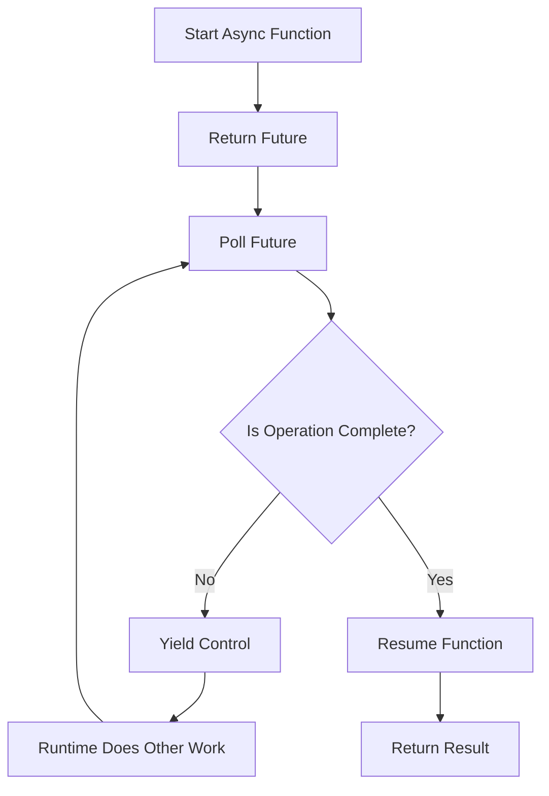

# Rust Async Functions

## Introduction

Asynchronous programming is a powerful paradigm that allows your code to perform multiple operations concurrently without blocking the execution thread. In Rust, the `async/await` syntax provides an elegant way to write asynchronous code that looks and behaves similarly to synchronous code, making it easier to reason about.

Async functions in Rust enable you to write efficient, non-blocking code for I/O-bound operations like network requests, file operations, and database queries. This guide will walk you through the fundamentals of async functions in Rust, how they work under the hood, and practical examples to get you started.

## Understanding Async Functions

### What is an Async Function?

An async function in Rust is a function that can be paused and resumed. When you mark a function with the `async` keyword, you're telling Rust that this function can yield control back to the runtime while waiting for some operation to complete.

```rust
async fn say_hello() {
    println!("Hello, async world!");
}
```

When you call an async function, it doesn't execute immediately. Instead, it returns a `Future` - a value that represents a computation that will complete at some point in the future. To actually execute the function, you need to await the future or pass it to an async runtime like Tokio or async-std.

### The Await Operator

The `await` keyword is used to pause execution until a `Future` completes. When you await a future, the current function yields control, allowing the runtime to do other work while waiting for the future to complete.

```rust
async fn fetch_data() -> String {
    // Simulating a network request
    tokio::time::sleep(tokio::time::Duration::from_secs(1)).await;
    String::from("Data fetched!")
}

async fn process() {
    let data = fetch_data().await; // Execution pauses here until fetch_data completes
    println!("Received: {}", data);
}
```

## How Rust Async Functions Work

Behind the scenes, async functions in Rust are transformed into state machines that implement the `Future` trait. Each `await` point represents a possible suspension point where the function can yield control back to the caller.

Here's a simplified view of how async functions work in Rust:



When an async function is called:
1. It returns a `Future` immediately
2. When that `Future` is polled (typically by awaiting it):
   - If the operation is complete, it returns the result
   - If not, it arranges for the function to be resumed later and yields control
3. The runtime continues executing other tasks
4. Once the awaited operation completes, the function is resumed from where it left off

## Setting Up for Async Rust

To use async functions in Rust, you'll need an async runtime. The most popular options are:

1. **Tokio**: A comprehensive async runtime with a rich feature set
2. **async-std**: A runtime designed to mirror the Rust standard library
3. **smol**: A small and fast runtime for simple use cases

Let's set up a project with Tokio:

```rust
// Cargo.toml
[dependencies]
tokio = { version = "1.28", features = ["full"] }
```

```rust
// src/main.rs
use tokio::time::{sleep, Duration};

async fn delay_print(message: &str, delay_ms: u64) {
    sleep(Duration::from_millis(delay_ms)).await;
    println!("{}", message);
}

#[tokio::main]
async fn main() {
    println!("Starting...");
    
    delay_print("This message appears after 1 second", 1000).await;
    
    println!("Program finished!");
}
```

Output:
```
Starting...
This message appears after 1 second
Program finished!
```

## Basic Async Function Patterns

### Returning Values from Async Functions

Async functions can return values, which become the result of the future when it completes:

```rust
async fn get_user_id() -> u64 {
    // Simulate fetching a user ID from a database
    sleep(Duration::from_millis(100)).await;
    42
}

async fn get_user_name(id: u64) -> String {
    // Simulate fetching a username from a database
    sleep(Duration::from_millis(100)).await;
    format!("User_{}", id)
}

#[tokio::main]
async fn main() {
    let user_id = get_user_id().await;
    let username = get_user_name(user_id).await;
    
    println!("Found user: {} (ID: {})", username, user_id);
}
```

Output:
```
Found user: User_42 (ID: 42)
```

### Error Handling in Async Functions

Async functions can use the Result type for error handling, just like regular functions:

```rust
async fn might_fail(succeed: bool) -> Result<String, String> {
    sleep(Duration::from_millis(100)).await;
    
    if succeed {
        Ok(String::from("Operation successful!"))
    } else {
        Err(String::from("Operation failed!"))
    }
}

#[tokio::main]
async fn main() {
    match might_fail(true).await {
        Ok(message) => println!("Success: {}", message),
        Err(error) => println!("Error: {}", error),
    }
    
    match might_fail(false).await {
        Ok(message) => println!("Success: {}", message),
        Err(error) => println!("Error: {}", error),
    }
}
```

Output:
```
Success: Operation successful!
Error: Operation failed!
```

## Concurrent Execution

One of the main advantages of async programming is the ability to run multiple tasks concurrently. Here are some ways to achieve concurrency with async functions:

### Sequential vs. Concurrent Execution

```rust
use std::time::Instant;

async fn task(id: u32) -> u32 {
    sleep(Duration::from_secs(1)).await;
    id
}

#[tokio::main]
async fn main() {
    // Sequential execution
    let start = Instant::now();
    
    let result1 = task(1).await;
    let result2 = task(2).await;
    let result3 = task(3).await;
    
    println!("Sequential results: {}, {}, {}", result1, result2, result3);
    println!("Sequential execution took: {:?}", start.elapsed());
    
    // Concurrent execution
    let start = Instant::now();
    
    let future1 = task(1);
    let future2 = task(2);
    let future3 = task(3);
    
    // This will run all tasks concurrently and wait for all to complete
    let (result1, result2, result3) = tokio::join!(future1, future2, future3);
    
    println!("Concurrent results: {}, {}, {}", result1, result2, result3);
    println!("Concurrent execution took: {:?}", start.elapsed());
}
```

Output:
```
Sequential results: 1, 2, 3
Sequential execution took: 3.003s
Concurrent results: 1, 2, 3
Concurrent execution took: 1.001s
```

### Using `join!` and `select!`

Tokio provides macros for common concurrent patterns:

- `join!`: Runs multiple futures concurrently and waits for all to complete
- `select!`: Waits for the first of multiple futures to complete

```rust
use tokio::select;

#[tokio::main]
async fn main() {
    // Example of select! to race two tasks
    let fast = async {
        sleep(Duration::from_millis(100)).await;
        "Fast task completed"
    };
    
    let slow = async {
        sleep(Duration::from_secs(1)).await;
        "Slow task completed"
    };
    
    let result = select! {
        f = fast => f,
        s = slow => s,
    };
    
    println!("First to complete: {}", result);
}
```

Output:
```
First to complete: Fast task completed
```

## Practical Example: Building a Simple Web Scraper

Let's build a simple concurrent web scraper to demonstrate async functions in a real-world scenario:

```rust
// Cargo.toml additional dependencies
// reqwest = { version = "0.11", features = ["json"] }
// futures = "0.3"

use futures::stream::{self, StreamExt};
use reqwest::Client;
use std::time::Instant;

async fn fetch_url(client: &Client, url: &str) -> Result<String, reqwest::Error> {
    println!("Fetching: {}", url);
    let response = client.get(url).send().await?;
    let body = response.text().await?;
    Ok(format!("{} - {} bytes", url, body.len()))
}

#[tokio::main]
async fn main() -> Result<(), Box<dyn std::error::Error>> {
    let client = Client::new();
    
    let urls = vec![
        "https://www.rust-lang.org",
        "https://docs.rs",
        "https://crates.io",
        "https://blog.rust-lang.org",
    ];
    
    // Sequential fetching
    println!("Sequential fetching:");
    let start = Instant::now();
    
    for url in &urls {
        match fetch_url(&client, url).await {
            Ok(result) => println!("Success: {}", result),
            Err(e) => println!("Error fetching {}: {}", url, e),
        }
    }
    
    println!("Sequential fetching took: {:?}", start.elapsed());
    
    // Concurrent fetching
    println!("
Concurrent fetching:");
    let start = Instant::now();
    
    let fetches = stream::iter(urls)
        .map(|url| {
            let client = &client;
            async move {
                match fetch_url(client, url).await {
                    Ok(result) => println!("Success: {}", result),
                    Err(e) => println!("Error fetching {}: {}", e),
                }
            }
        })
        .buffer_unordered(10) // Process up to 10 requests concurrently
        .collect::<Vec<()>>();
    
    fetches.await;
    
    println!("Concurrent fetching took: {:?}", start.elapsed());
    
    Ok(())
}
```

This example demonstrates how async functions allow us to perform multiple HTTP requests concurrently, significantly reducing the total time needed compared to sequential execution.

## Common Pitfalls and Best Practices

### The "Async Colored Function" Problem

One challenge in Rust async programming is that async functions can only call other async functions with `.await`. This is sometimes called the "function coloring problem."

```rust
// This won't work:
fn regular_function() {
    let result = async_function().await; // Error: await only allowed in async functions
}

// This works:
async fn async_function_wrapper() {
    let result = async_function().await;
}
```

### Blocking the Async Runtime

Avoid running CPU-intensive or blocking operations directly in async functions, as they will prevent the runtime from making progress on other tasks:

```rust
// Bad practice:
async fn blocking_operation() {
    // This blocks the thread, preventing other tasks from running
    std::thread::sleep(std::time::Duration::from_secs(5));
    println!("Done!");
}

// Good practice:
async fn non_blocking_operation() {
    // This yields to the runtime, allowing other tasks to run
    tokio::spawn(async {
        // For CPU-intensive work, use spawn_blocking
        tokio::task::spawn_blocking(|| {
            std::thread::sleep(std::time::Duration::from_secs(5));
        }).await.unwrap();
        println!("Done!");
    });
}
```

### Structured Concurrency

It's important to manage the lifetime of your async tasks. Dropping a future without awaiting it may cancel the operation. Tokio's `spawn` function can be used to run a future in the background:

```rust
#[tokio::main]
async fn main() {
    let handle = tokio::spawn(async {
        sleep(Duration::from_secs(1)).await;
        "Task completed"
    });
    
    // Do other work here...
    
    // Wait for the spawned task to complete
    match handle.await {
        Ok(result) => println!("{}", result),
        Err(e) => println!("Task failed: {}", e),
    }
}
```

## Summary

Async functions in Rust provide a powerful way to write efficient, concurrent code that can handle many simultaneous operations without creating threads for each one. Key points to remember:

- Async functions return `Future`s that need to be awaited or executed by a runtime
- The `await` keyword pauses execution until a future completes
- Async Rust requires a runtime like Tokio, async-std, or smol
- You can run multiple async tasks concurrently using `join!`, `select!`, or other concurrency primitives
- Be careful not to block the async runtime with CPU-intensive or synchronous I/O operations

By mastering async functions in Rust, you'll be able to write applications that efficiently handle concurrent operations, leading to better performance and resource utilization.

## Exercises

1. Create a simple program that downloads multiple files concurrently using async functions
2. Implement a function that times out after a specified duration using `tokio::time::timeout`
3. Build a concurrent task queue that processes items with a maximum level of parallelism
4. Modify the web scraper example to extract and count specific HTML elements from each page

## Additional Resources

- [Asynchronous Programming in Rust](https://rust-lang.github.io/async-book/)
- [Tokio Documentation](https://tokio.rs/tokio/tutorial)
- [Rust Futures Explained](https://cfsamson.github.io/books-futures-explained/)
- [Async Rust: The Good, The Bad, The Ugly](https://carllerche.com/2021/06/17/six-ways-to-make-async-rust-easier/)