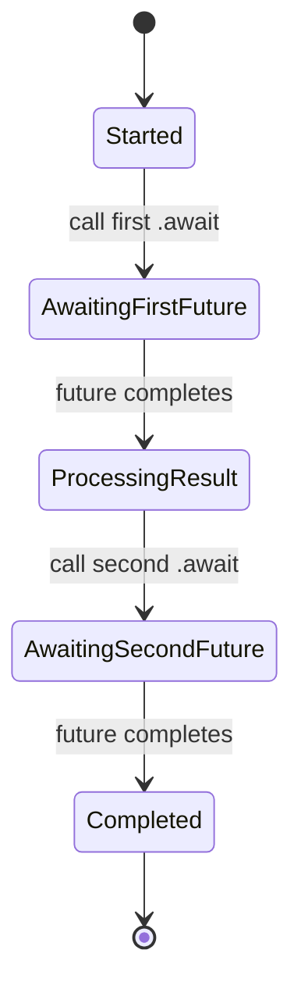

# Rust Await Syntax

## Introduction

Asynchronous programming is essential for building efficient, scalable applications that can handle numerous concurrent operations without blocking the execution thread. In Rust, the `async`/`await` syntax provides an elegant way to write asynchronous code that looks and behaves much like synchronous code, making it easier to reason about.

The `.await` syntax is a crucial component of Rust's asynchronous programming model that allows you to pause execution until a `Future` completes, all without blocking the thread. This enables your program to perform other tasks while waiting for slow operations (like network requests or file I/O) to complete.

In this guide, we'll explore how the `await` syntax works in Rust, how to use it effectively, and common patterns for working with asynchronous code.

## Prerequisites

Before diving into the `await` syntax, you should have:
- Basic familiarity with Rust
- Understanding of what asynchronous programming is
- Knowledge of Rust's `async` functions and `Future` trait (at a high level)

## Understanding the .await Syntax

### What is `.await`?

In Rust, `.await` is a postfix operator that can only be used inside `async` functions or blocks. When you call `.await` on a `Future`, it:

1. Pauses the current async function's execution
2. Yields control back to the runtime
3. Resumes execution when the `Future` completes
4. Returns the result of the `Future`

Let's look at a simple example:

```rust
async fn fetch_data() -> Result<String, Error> {
    // Simulating a network request
    // This returns a Future that we can await
    let response = client.get("https://example.com/data").await?;
    
    // This line won't execute until the network request completes
    Ok(response.text().await?)
}
```

### How `.await` Differs from Blocking

To understand why `.await` is powerful, let's compare it with blocking code:

```rust
// Blocking approach
fn fetch_data_blocking() -> Result<String, Error> {
    // This blocks the thread until the request completes
    let response = client.get("https://example.com/data").send()?;
    
    // This blocks again
    Ok(response.text()?)
}

// Async approach
async fn fetch_data_async() -> Result<String, Error> {
    // This returns control to the runtime while waiting
    let response = client.get("https://example.com/data").await?;
    
    // This also returns control while waiting
    Ok(response.text().await?)
}
```

With the async version, your program can handle other tasks while waiting for network operations to complete, making much better use of system resources.

## How `.await` Works Under the Hood

When you use `.await`, Rust transforms your async function into a state machine where each `.await` point represents a state transition:



The runtime can efficiently poll these state machines to check if futures are ready, allowing it to manage thousands of asynchronous tasks without creating thousands of operating system threads.

## Basic Usage Patterns

### Simple Awaiting

The most straightforward use of `.await` is to wait for a single future:

```rust
async fn simple_example() -> u32 {
    let future_value = async_function().await;
    future_value + 10
}
```

### Awaiting with Error Handling

You'll often use `.await` with the `?` operator to propagate errors:

```rust
async fn example_with_errors() -> Result<String, Error> {
    let result = risky_async_operation().await?;
    Ok(format!("Got result: {}", result))
}
```

### Awaiting in Async Blocks

You can also use `.await` inside async blocks:

```rust
fn main() {
    let future = async {
        let result = async_function().await;
        println!("Result: {}", result);
    };
    
    // We need to run this future with a runtime
    tokio::runtime::Runtime::new()
        .unwrap()
        .block_on(future);
}
```

## Common Patterns and Best Practices

### Sequential Awaits

To perform operations one after another:

```rust
async fn sequential_operations() -> Result<(), Error> {
    let first_result = first_operation().await?;
    let second_result = second_operation(first_result).await?;
    let final_result = third_operation(second_result).await?;
    
    println!("All operations completed with: {}", final_result);
    Ok(())
}
```

### Parallel Awaits with `join!`

For concurrent operations, use the `join!` macro:

```rust
use futures::join;

async fn parallel_operations() -> Result<(), Error> {
    let future1 = first_operation();
    let future2 = second_operation();
    
    // Both operations run concurrently
    let (result1, result2) = join!(future1, future2);
    
    println!("Results: {} and {}", result1?, result2?);
    Ok(())
}
```

### Awaiting Conditionally

You can combine `.await` with control flow structures:

```rust
async fn conditional_await(should_fetch: bool) -> Result<Option<String>, Error> {
    if should_fetch {
        let data = fetch_data().await?;
        Ok(Some(data))
    } else {
        Ok(None)
    }
}
```

## Real-World Examples

### Example 1: HTTP Client

Here's how you might use `.await` with the popular `reqwest` crate:

```rust
use reqwest::Error;

async fn fetch_website_title(url: &str) -> Result<String, Error> {
    let response = reqwest::get(url).await?;
    let body = response.text().await?;
    
    // Extract title using a simple approach
    let title = if let Some(start) = body.find("<title>") {
        if let Some(end) = body.find("</title>") {
            &body[start + 7..end]
        } else {
            "No title found"
        }
    } else {
        "No title found"
    };
    
    Ok(title.to_string())
}

// Usage:
// let title = fetch_website_title("https://www.rust-lang.org").await?;
```

### Example 2: Database Interaction

Working with a database asynchronously using `sqlx`:

```rust
use sqlx::{Pool, Postgres, Error};

async fn get_user_by_id(pool: &Pool<Postgres>, user_id: i32) -> Result<User, Error> {
    // SQL query execution is asynchronous
    let user = sqlx::query_as!(
        User,
        "SELECT id, name, email FROM users WHERE id = $1",
        user_id
    )
    .fetch_one(pool)
    .await?;
    
    Ok(user)
}

// Usage:
// let user = get_user_by_id(&pool, 42).await?;
```

### Example 3: File Operations

Using the `tokio` filesystem module:

```rust
use tokio::fs::File;
use tokio::io::{self, AsyncReadExt, AsyncWriteExt};

async fn copy_file(src: &str, dst: &str) -> io::Result<u64> {
    // Open files asynchronously
    let mut src_file = File::open(src).await?;
    let mut dst_file = File::create(dst).await?;
    
    let mut buffer = Vec::new();
    
    // Read and write asynchronously
    src_file.read_to_end(&mut buffer).await?;
    let bytes_written = dst_file.write(&buffer).await?;
    
    // Ensure data is written to disk
    dst_file.flush().await?;
    
    Ok(bytes_written)
}

// Usage:
// let bytes = copy_file("source.txt", "destination.txt").await?;
```

## Common Pitfalls and How to Avoid Them

### Forgetting to `.await`

One common mistake is forgetting to await a Future:

```rust
async fn wrong_example() {
    // This doesn't execute the future, it just creates it!
    let result = async_operation();
    
    // This will not use the result of async_operation
    println!("Done!");
}

async fn correct_example() {
    // This executes the future and waits for its completion
    let result = async_operation().await;
    
    // Now we can use the result
    println!("Result: {}", result);
}
```

### Blocking the Async Runtime

Avoid performing CPU-intensive operations directly in async functions:

```rust
async fn bad_practice() {
    // This blocks the async runtime thread!
    let result = perform_heavy_computation();
    
    // Do something with result
}

async fn good_practice() {
    // Offload CPU-intensive work to a separate thread pool
    let result = tokio::task::spawn_blocking(|| {
        perform_heavy_computation()
    }).await.unwrap();
    
    // Do something with result
}
```

### `.await` Outside of Async Contexts

You can only use `.await` inside an `async` function or block:

```rust
// This won't compile
fn wrong_function() {
    let result = async_operation().await; // Error!
}

// These are correct
async fn right_function() {
    let result = async_operation().await;
}

fn right_function_with_block() {
    let future = async {
        let result = async_operation().await;
    };
    
    // Run the future with an async runtime
    tokio::runtime::Runtime::new()
        .unwrap()
        .block_on(future);
}
```

## Advanced `.await` Patterns

### Timeouts with `.await`

Using `tokio::time::timeout` to add timeouts to awaited futures:

```rust
use tokio::time::{timeout, Duration};

async fn operation_with_timeout() -> Result<String, Box<dyn std::error::Error>> {
    // Will timeout if the operation takes longer than 5 seconds
    let result = timeout(
        Duration::from_secs(5),
        fetch_data()
    ).await??; // Note the double ?? to handle both timeout and operation errors
    
    Ok(result)
}
```

### Cancellation

When you drop a future before awaiting its completion, it's effectively cancelled:

```rust
async fn cancellation_example() {
    let future = async_operation();
    
    // We can create conditional logic to decide whether to await
    if should_proceed() {
        let result = future.await;
        println!("Got result: {}", result);
    } else {
        // By not awaiting, the operation is effectively cancelled
        println!("Operation cancelled");
    }
    
    // future is dropped here if not awaited
}
```

## Running Async Code

Remember that async functions return futures that need to be run by an async runtime. Common options include:

```rust
// Using tokio
fn main() {
    tokio::runtime::Runtime::new()
        .unwrap()
        .block_on(async {
            let result = my_async_function().await;
            println!("Result: {}", result);
        });
}

// Alternatively with #[tokio::main]
#[tokio::main]
async fn main() {
    let result = my_async_function().await;
    println!("Result: {}", result);
}
```

## Summary

The `.await` syntax is the cornerstone of Rust's asynchronous programming model, allowing you to write asynchronous code that's readable and maintainable. When you use `.await`, you're instructing your program to pause execution of the current async function until a future completes, without blocking the thread.

Key points to remember:
- `.await` can only be used inside `async` functions or blocks
- It pauses execution of the current async function while awaiting a result
- It allows the runtime to handle other tasks while waiting
- It returns the result of the awaited future once complete
- Rust transforms your async functions into state machines at compile time
- Always pair `.await` with proper error handling using `?` when appropriate

By mastering the `.await` syntax, you'll be able to write efficient, concurrent Rust applications that make the most of system resources while maintaining code clarity.

## Additional Resources

- [Rust Async Book](https://rust-lang.github.io/async-book/)
- [Tokio Documentation](https://tokio.rs/tokio/tutorial)
- [Rust Futures Crate Documentation](https://docs.rs/futures/latest/futures/)

## Exercises

1. **Basic Awaiting**: Write an async function that fetches data from two different URLs sequentially and combines the results.

2. **Parallel Awaiting**: Modify your function to fetch from both URLs concurrently using `join!` and compare the performance difference.

3. **Error Handling**: Add proper error handling to your function using the `?` operator with `.await`.

4. **Timeout**: Add a timeout to your fetch operations so they fail gracefully if they take too long.

5. **Advanced**: Create a simple async web server using `tokio` and `hyper` that responds to requests by fetching data from another service.