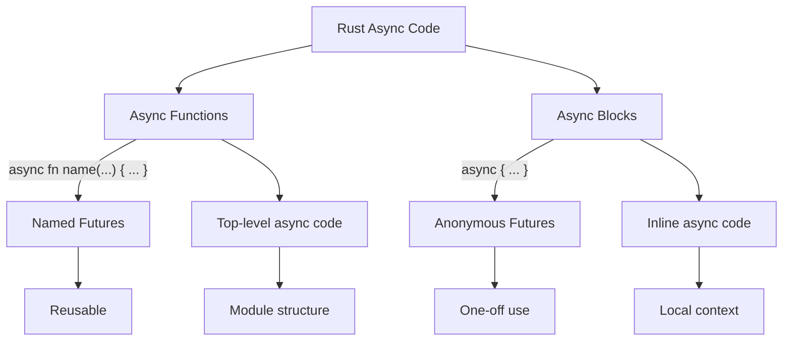

# Rust Async Blocks

## Introduction

In Rust's asynchronous programming model, an **async block** is a powerful feature that creates an anonymous `Future` directly in your code. While async functions transform an entire function into a future, async blocks let you create futures inline, giving you fine-grained control over which specific code sections execute asynchronously.

Async blocks are essential building blocks for effective asynchronous Rust programming, allowing you to:

- Create futures on-the-fly without defining separate functions
- Control the scope of async code within a larger function
- Organize and structure complex asynchronous operations

In this guide, we'll explore how async blocks work, when to use them, and how they fit into Rust's async ecosystem.

## Understanding Async Blocks

### Basic Syntax

An async block looks similar to a regular code block in Rust, but with the `async` keyword at the beginning:

```rust
let my_future = async {
    // Asynchronous code here
    42
};
```

This creates a future that, when executed, will run the code inside the block and eventually resolve to the value of the last expression (42 in this example).

### Key Characteristics

1. **Type**: An async block creates a value of type `impl Future<Output = T>`, where `T` is the type of the last expression in the block.

2. **Lazy Execution**: Like all futures in Rust, async blocks don't do anything until they're awaited or otherwise polled.

3. **Capture Environment**: Async blocks capture their environment, allowing them to use variables from the surrounding scope.

## Basic Usage Example

Let's start with a simple example to see async blocks in action:

```rust
use futures::executor::block_on;

fn main() {
    // Create a future using an async block
    let future = async {
        println!("Hello from an async block!");
        // Return a value from the async block
        42
    };
    
    // Execute the future
    let result = block_on(future);
    println!("Result: {}", result);
}
```

**Output:**
```
Hello from an async block!
Result: 42
```

In this example:
1. We create a future using an async block
2. The future is executed with `block_on`
3. The value 42 is returned from the async block

## Using Await Inside Async Blocks

One of the most powerful features of async blocks is that you can use the `.await` syntax inside them, just like in async functions:

```rust
use futures::executor::block_on;

async fn fetch_data() -> String {
    // Simulating async data fetch
    std::thread::sleep(std::time::Duration::from_millis(100));
    "Important data".to_string()
}

fn main() {
    let combined_future = async {
        // Await other futures inside this async block
        let data = fetch_data().await;
        
        println!("Received: {}", data);
        
        // Process the data
        format!("Processed: {}", data)
    };
    
    let result = block_on(combined_future);
    println!("Final result: {}", result);
}
```

**Output:**
```
Received: Important data
Final result: Processed: Important data
```

## When to Use Async Blocks

Async blocks are particularly useful in several scenarios:

### 1. Conditional Async Logic

```rust
use futures::executor::block_on;

async fn fetch_remote_data() -> String {
    // Simulating remote data fetch
    std::thread::sleep(std::time::Duration::from_millis(100));
    "Remote data".to_string()
}

fn get_data(use_cache: bool) -> impl std::future::Future<Output = String> {
    async move {
        if use_cache {
            // No need for async operations if using cache
            "Cached data".to_string()
        } else {
            // Only do the async operation if not using cache
            fetch_remote_data().await
        }
    }
}

fn main() {
    let cached_result = block_on(get_data(true));
    println!("With cache: {}", cached_result);
    
    let remote_result = block_on(get_data(false));
    println!("Without cache: {}", remote_result);
}
```

**Output:**
```
With cache: Cached data
Without cache: Remote data
```

### 2. Limited Scope Async Operations

Async blocks let you limit the scope of async operations within a synchronous function:

```rust
use futures::executor::block_on;

fn process_data() -> String {
    // Synchronous work
    let initial = "Initial data";
    
    // Only this part runs asynchronously
    let processed = block_on(async {
        // Simulating async processing
        std::thread::sleep(std::time::Duration::from_millis(100));
        format!("{} - processed asynchronously", initial)
    });
    
    // More synchronous work
    format!("Final result: {}", processed)
}

fn main() {
    let result = process_data();
    println!("{}", result);
}
```

**Output:**
```
Final result: Initial data - processed asynchronously
```

### 3. Creating Async Closures

Rust doesn't have built-in async closures, but you can simulate them with async blocks:

```rust
use futures::executor::block_on;

fn main() {
    // Create a vector of async operations
    let async_operations = vec![1, 2, 3].into_iter().map(|num| {
        async move {
            // Simulate async work
            std::thread::sleep(std::time::Duration::from_millis(50));
            num * 2
        }
    }).collect::<Vec<_>>();
    
    // Execute each operation
    for operation in async_operations {
        let result = block_on(operation);
        println!("Result: {}", result);
    }
}
```

**Output:**
```
Result: 2
Result: 4
Result: 6
```

## Capturing Variables in Async Blocks

Async blocks capture variables from their environment, similar to closures:

```rust
use futures::executor::block_on;

fn main() {
    let multiplier = 10;
    
    let future = async {
        // Capture 'multiplier' from the surrounding environment
        let result = 5 * multiplier;
        result
    };
    
    let result = block_on(future);
    println!("Result: {}", result);
}
```

**Output:**
```
Result: 50
```

If you need to move ownership of variables into the async block, use the `async move` syntax:

```rust
use futures::executor::block_on;

fn main() {
    let data = String::from("Hello");
    
    let future = async move {
        // Take ownership of 'data'
        println!("Inside async block: {}", data);
        format!("{} World", data)
    };
    
    // Uncommenting this line would cause a compiler error
    // since ownership of 'data' has moved into the async block
    // println!("Outside: {}", data);
    
    let result = block_on(future);
    println!("Result: {}", result);
}
```

**Output:**
```
Inside async block: Hello
Result: Hello World
```

## Async Blocks vs. Async Functions

To better understand where async blocks fit, let's compare them with async functions:



### When to Use Which:

- **Async Functions**: Better for reusable, named operations that you'll call from multiple places
- **Async Blocks**: Better for one-off async operations, conditional async logic, or creating async closures

## Real-World Example: Parallel Data Processing

Let's build a more complex example that demonstrates async blocks in a practical context:

```rust
use futures::executor::block_on;
use futures::future::join_all;
use std::time::Duration;
use std::thread::sleep;

// Simulate an external API call
async fn api_call(id: u32) -> String {
    // Simulate network delay
    sleep(Duration::from_millis(50));
    format!("Data-{}", id)
}

fn process_batch(ids: Vec<u32>) -> Vec<String> {
    block_on(async {
        // Create a vector of futures using async blocks
        let futures = ids.iter().map(|&id| {
            async move {
                let data = api_call(id).await;
                // Process the data
                format!("Processed-{}", data)
            }
        }).collect::<Vec<_>>();
        
        // Execute all futures concurrently
        join_all(futures).await
    })
}

fn main() {
    let ids = vec![1, 2, 3, 4, 5];
    let start = std::time::Instant::now();
    
    let results = process_batch(ids);
    
    let duration = start.elapsed();
    
    for result in &results {
        println!("{}", result);
    }
    
    println!("Completed in: {:?}", duration);
    println!("Processed {} items", results.len());
}
```

**Output:**
```
Processed-Data-1
Processed-Data-2
Processed-Data-3
Processed-Data-4
Processed-Data-5
Completed in: 55.2ms
Processed 5 items
```

In this example:
1. We create an async block that processes multiple items in parallel
2. Each item is processed in its own async block (inside the map)
3. We use `join_all` to run all the futures concurrently
4. The entire batch completes in roughly the same time as a single API call would take

## Advanced Concepts

### Returning Async Blocks from Functions

Functions can return async blocks as futures:

```rust
use futures::executor::block_on;

// Return an impl Future from a function
fn get_greeting(name: String) -> impl std::future::Future<Output = String> {
    async move {
        // Simulate some async work
        std::thread::sleep(std::time::Duration::from_millis(50));
        format!("Hello, {}!", name)
    }
}

fn main() {
    let greeting_future = get_greeting("Rust Developer".to_string());
    let greeting = block_on(greeting_future);
    println!("{}", greeting);
}
```

**Output:**
```
Hello, Rust Developer!
```

### Static vs. Non-Static Futures

An important aspect to understand about async blocks is whether they create static or non-static futures:

```rust
// This returns a static future (can be used with 'static lifetime bounds)
fn static_future() -> impl std::future::Future<Output = i32> + 'static {
    async {
        42
    }
}

// This returns a non-static future that borrows 'value'
fn borrowing_future<'a>(value: &'a str) -> impl std::future::Future<Output = usize> + 'a {
    async move {
        // Borrow 'value' from the environment
        value.len()
    }
}
```

This distinction becomes important when working with traits, `async-trait`, or when storing futures in data structures.

## Common Pitfalls and Solutions

### 1. Lifetime Issues

When async blocks capture references, they can cause lifetime issues:

```rust
// This won't compile
fn problematic() -> impl std::future::Future<Output = usize> {
    let value = String::from("Hello");
    
    // ERROR: 'value' doesn't live long enough
    async move {
        value.len()
    }
}

// Correct version
fn working() -> impl std::future::Future<Output = usize> {
    let value = String::from("Hello");
    
    // Move 'value' into the async block so it lives
    // as long as the future
    async move {
        value.len()
    }
}
```

### 2. Type Inference Challenges

Sometimes the Rust compiler has trouble inferring the return type of complex async blocks:

```rust
use futures::executor::block_on;

fn main() {
    let condition = true;
    
    // This might require type annotations
    let future = async {
        if condition {
            // Returns i32
            42
        } else {
            // Also returns i32
            24
        }
    };
    
    let result: i32 = block_on(future);
    println!("Result: {}", result);
}
```

## Summary

Async blocks in Rust are a fundamental building block for writing flexible asynchronous code. They allow you to:

- Create anonymous futures directly within your code
- Use the `.await` syntax inline without defining separate async functions
- Limit the scope of asynchronous operations
- Build more complex asynchronous patterns like conditional async logic

As you become more proficient with Rust's async programming model, you'll find that async blocks give you finer-grained control over your asynchronous code, making it more expressive and efficient.

## Further Learning

### Exercises

1. **Basic Async Block**: Create a simple async block that calculates the sum of the first 100 numbers and awaits it.

2. **Parallel Processing**: Use async blocks to process a vector of strings in parallel, calculating the length of each string.

3. **Conditional Async**: Write a function that takes a boolean parameter and uses an async block to conditionally perform an async operation only if the parameter is true.

### Additional Resources

- [Rust Async Book](https://rust-lang.github.io/async-book/)
- [Tokio Documentation](https://tokio.rs/tokio/tutorial)
- [Rust by Example - Async/Await](https://doc.rust-lang.org/rust-by-example/std_misc/threads/async.html)
- [Rust Standard Library - Future trait](https://doc.rust-lang.org/std/future/trait.Future.html)

By mastering async blocks, you'll gain a powerful tool in your Rust async programming toolkit that will help you write cleaner, more efficient asynchronous code.