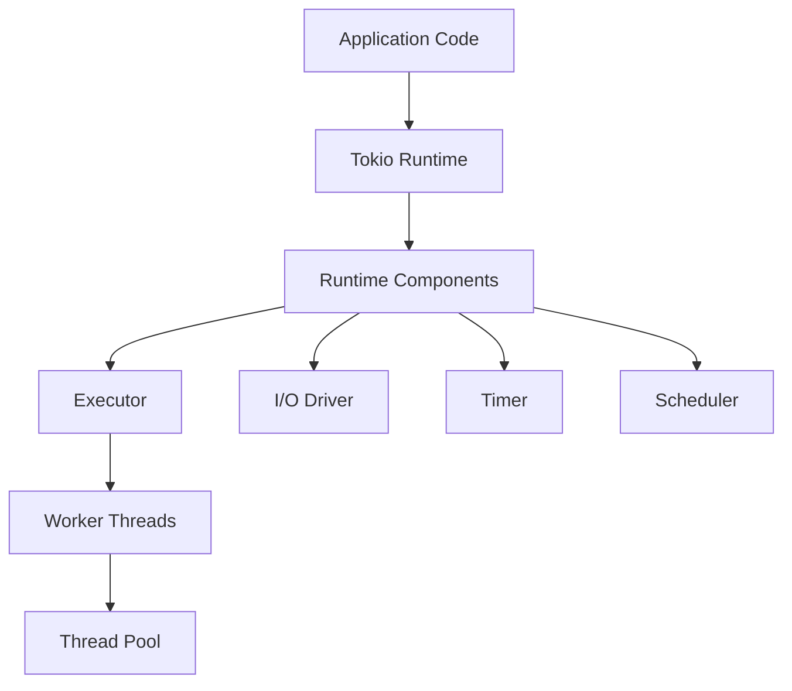

# Rust Tokio Runtime

## Introduction

When developing modern applications in Rust, you'll often need to handle many operations concurrently - whether you're building a web server handling thousands of connections, processing streams of data, or orchestrating complex workflows. This is where **Tokio** comes in as the most popular asynchronous runtime for Rust.

Tokio provides the foundation that powers Rust's async ecosystem, allowing you to write highly concurrent code that is both efficient and safe. In this article, we'll explore what the Tokio runtime is, how it works under the hood, and how to use it effectively in your applications.

## What is the Tokio Runtime?

Tokio is an asynchronous runtime for the Rust programming language. But what exactly does that mean?

In simple terms, the Tokio runtime is a library that manages the execution of asynchronous tasks in your Rust application. It provides:

1. **Task scheduling**: Efficiently manages thousands of concurrent tasks
2. **I/O operations**: Non-blocking network and file operations
3. **Timers**: Scheduling work to happen in the future
4. **Synchronization primitives**: Tools for coordinating between tasks

Think of Tokio as the engine that powers your async Rust code. When you write `async fn` functions and use `.await` expressions, Tokio is what actually executes those promises of future work.

## Getting Started with Tokio

Let's start by adding Tokio to a new Rust project:

```rust
// In your Cargo.toml
[dependencies]
tokio = { version = "1.28", features = ["full"] }
```

Now, let's create a simple example that demonstrates using the Tokio runtime:

```rust
use tokio::time::{sleep, Duration};

#[tokio::main]
async fn main() {
    println!("Hello from the main task!");
    
    // Spawn a new asynchronous task
    let handle = tokio::spawn(async {
        sleep(Duration::from_millis(100)).await;
        println!("Hello from a spawned task!");
        "Task completed"
    });
    
    // Wait for the spawned task to complete
    let result = handle.await.unwrap();
    println!("Task said: {}", result);
    
    println!("Main task ending");
}
```

Output:
```
Hello from the main task!
Hello from a spawned task!
Task said: Task completed
Main task ending
```

In this example:

1. We use the `#[tokio::main]` macro which sets up the Tokio runtime and makes our `main` function asynchronous
2. We spawn a new task with `tokio::spawn`
3. We wait for the task to complete with `.await`

## The Tokio Runtime Architecture

To understand how Tokio works, let's examine its architecture:



The Tokio runtime consists of several key components:

1. **Executor**: Responsible for running tasks to completion
2. **Scheduler**: Determines which tasks should run and when
3. **I/O Driver**: Manages non-blocking I/O operations
4. **Timer**: Tracks time-based operations
5. **Worker Threads**: Execute the actual work

## Configuring the Tokio Runtime

Tokio provides different ways to configure the runtime based on your application's needs:

### Multi-threaded Runtime (Default)

The multi-threaded runtime spreads work across multiple OS threads, taking full advantage of multi-core systems:

```rust
#[tokio::main]
async fn main() {
    // Code runs on multi-threaded runtime
}
```

Alternatively, you can configure it manually:

```rust
fn main() {
    let rt = tokio::runtime::Runtime::new().unwrap();
    rt.block_on(async {
        // Your async code here
    });
}
```

### Single-threaded Runtime

For applications with simpler requirements or when you need to avoid thread synchronization:

```rust
#[tokio::main(flavor = "current_thread")]
async fn main() {
    // Code runs on a single-threaded runtime
}
```

Or manually:

```rust
fn main() {
    let rt = tokio::runtime::Builder::new_current_thread()
        .enable_all()
        .build()
        .unwrap();
    
    rt.block_on(async {
        // Your async code here
    });
}
```

## Understanding Tasks in Tokio

Tasks are the basic unit of concurrency in Tokio. A task is similar to a lightweight thread - it represents a unit of work that can make progress independently of other tasks.

Here's what makes Tokio tasks special:

1. **Lightweight**: You can create thousands or even millions of tasks
2. **Cooperative**: Tasks yield control when they reach an `.await` point
3. **Independently scheduled**: The runtime decides when to resume tasks
4. **Cancellable**: Tasks can be dropped, stopping their execution

Let's see how to work with tasks:

```rust
use tokio::time::{sleep, Duration};

#[tokio::main]
async fn main() {
    // Spawn multiple tasks
    for i in 1..=5 {
        tokio::spawn(async move {
            let sleep_ms = i * 100;
            sleep(Duration::from_millis(sleep_ms)).await;
            println!("Task {} completed after {}ms", i, sleep_ms);
        });
    }
    
    // Wait to see all task outputs
    sleep(Duration::from_millis(600)).await;
    println!("Main task completed");
}
```

Output:
```
Task 1 completed after 100ms
Task 2 completed after 200ms
Task 3 completed after 300ms
Task 4 completed after 400ms
Task 5 completed after 500ms
Main task completed
```

Notice how the tasks complete in order of their sleep duration, regardless of the order they were spawned.

## Practical Example: A Concurrent Web Scraper

Let's build a practical example - a simple concurrent web scraper that fetches multiple web pages simultaneously:

```rust
use std::error::Error;
use tokio::time::Instant;

#[tokio::main]
async fn main() -> Result<(), Box<dyn Error>> {
    let urls = vec![
        "https://www.rust-lang.org",
        "https://tokio.rs",
        "https://github.com/tokio-rs/tokio",
        "https://crates.io",
        "https://docs.rs",
    ];
    
    let start = Instant::now();
    
    // Sequential approach
    println!("Sequential fetching:");
    for url in &urls {
        let body = fetch_url(url).await?;
        println!("{}: {} bytes", url, body.len());
    }
    println!("Sequential time: {:?}
", start.elapsed());
    
    // Concurrent approach
    let concurrent_start = Instant::now();
    println!("Concurrent fetching:");
    
    let mut handles = vec![];
    for url in &urls {
        let url = url.to_string(); // Clone to move into task
        let handle = tokio::spawn(async move {
            let body = fetch_url(&url).await.unwrap();
            (url, body.len())
        });
        handles.push(handle);
    }
    
    for handle in handles {
        let (url, size) = handle.await?;
        println!("{}: {} bytes", url, size);
    }
    println!("Concurrent time: {:?}", concurrent_start.elapsed());
    
    Ok(())
}

async fn fetch_url(url: &str) -> Result<String, Box<dyn Error>> {
    let response = reqwest::get(url).await?;
    let body = response.text().await?;
    Ok(body)
}
```

To run this example, you'll need to add the `reqwest` crate to your dependencies:

```rust
// In your Cargo.toml
[dependencies]
tokio = { version = "1.28", features = ["full"] }
reqwest = "0.11"
```

When you run this program, you'll notice a significant performance difference between the sequential and concurrent approaches. The concurrent version fetches all pages in roughly the time it takes to fetch the slowest page, while the sequential version takes the sum of all individual fetch times.

## Understanding the Tokio Scheduler

The scheduler is a core component of the Tokio runtime that decides which tasks to run and when. It employs a work-stealing algorithm to balance tasks across worker threads efficiently.

Here's how the scheduler works:

1. Each worker thread has its own task queue
2. When a thread runs out of tasks, it "steals" work from other threads
3. Tasks are prioritized based on readiness and other heuristics
4. The scheduler ensures all cores stay busy

This design allows Tokio to scale effectively from small applications to highly concurrent systems handling thousands of connections.

## Tokio vs. Standard Library Threads

You might wonder why you should use Tokio rather than Rust's standard library threads. Here's a comparison:

| Feature | Tokio Tasks | Std Library Threads |
|---------|------------|---------------------|
| Overhead | Very lightweight (~64 bytes each) | Heavier (~8 MB stack each) |
| Quantity | Can create millions | Limited by system resources |
| Model | Cooperative multitasking | Preemptive multitasking |
| Blocking | Should not block | Can block freely |
| Creation | Fast | Slower |

Tokio tasks are ideal for I/O-bound workloads with many concurrent operations, while standard threads are better for CPU-bound work that needs dedicated processing time.

## Best Practices for Using the Tokio Runtime

To get the most out of Tokio, follow these best practices:

1. **Avoid blocking operations**: Use `tokio::task::spawn_blocking` for CPU-intensive work
2. **Use `select!` for races**: When waiting for multiple operations, use `tokio::select!` to proceed as soon as one completes
3. **Prefer `spawn` over nested `block_on`**: Never use `block_on` inside tasks
4. **Use channels for communication**: `tokio::sync::mpsc`, `oneshot`, etc.
5. **Create appropriate task boundaries**: Don't make tasks too fine-grained or too coarse
6. **Handle task cancellation**: Implement cleanup for cancelled tasks

Let's look at a small example showing some of these practices:

```rust
use tokio::sync::{mpsc, oneshot};
use tokio::time::{sleep, Duration};

#[tokio::main]
async fn main() {
    // Set up a channel to communicate between tasks
    let (tx, mut rx) = mpsc::channel(100);
    
    // Spawn a worker task
    tokio::spawn(async move {
        for i in 1..=5 {
            // Simulate work
            sleep(Duration::from_millis(100)).await;
            
            // Create a oneshot channel for the response
            let (response_tx, response_rx) = oneshot::channel();
            
            // Send the message and response channel
            let message = format!("Message {}", i);
            tx.send((message, response_tx)).await.unwrap();
            
            // Wait for response acknowledgement
            match response_rx.await {
                Ok(ack) => println!("Got acknowledgement: {}", ack),
                Err(_) => println!("Failed to get acknowledgement"),
            }
        }
    });
    
    // Process incoming messages
    while let Some((msg, response_tx)) = rx.recv().await {
        println!("Received: {}", msg);
        
        // Use select! to race timeout against a blocking operation
        tokio::select! {
            _ = sleep(Duration::from_millis(50)) => {
                println!("Processing {} completed", msg);
                response_tx.send("Processed successfully").unwrap();
            }
            blocking_result = tokio::task::spawn_blocking(move || {
                // Simulate a CPU-heavy operation
                let mut counter = 0;
                for _ in 0..1_000_000 {
                    counter += 1;
                }
                counter
            }) => {
                match blocking_result {
                    Ok(count) => println!("Blocking operation counted to {}", count),
                    Err(_) => println!("Blocking operation failed"),
                }
            }
        }
    }
}
```

This example demonstrates:
- Using channels for task communication
- Using `select!` to race operations
- Using `spawn_blocking` for CPU-intensive work

## Debugging Tokio Applications

Debugging asynchronous applications can be challenging. Tokio provides several tools to help:

1. **Task tracing**: Enable the `tokio-console` feature to get detailed task metrics
2. **Runtime metrics**: Monitor runtime performance with the `rt-metrics` feature
3. **Tokio console**: Use the [Tokio Console](https://github.com/tokio-rs/console) tool to visualize tasks

Additionally, you can use the `tracing` crate to add structured logging to your application:

```rust
use tracing::{info, instrument};
use tracing_subscriber;

#[tokio::main]
async fn main() {
    // Initialize the tracing subscriber
    tracing_subscriber::fmt::init();
    
    info!("Application started");
    
    // Spawn a traced task
    tokio::spawn(traced_function("Task 1"));
    
    tokio::time::sleep(tokio::time::Duration::from_secs(1)).await;
    info!("Application finished");
}

#[instrument]
async fn traced_function(name: &str) {
    info!("Task started");
    tokio::time::sleep(tokio::time::Duration::from_millis(500)).await;
    info!("Task completed");
}
```

## Common Pitfalls and How to Avoid Them

When working with Tokio, be aware of these common issues:

1. **Task starvation**: Ensure long-running computations don't block the runtime
2. **Deadlocks**: Avoid circular waits between tasks
3. **Resource leaks**: Always handle task completion or cancellation
4. **Over-spawning**: Don't create too many tasks for small units of work
5. **Blocking in async functions**: Use `spawn_blocking` for CPU-bound work

For example, this will cause problems:

```rust
// BAD PRACTICE - Don't do this!
#[tokio::main]
async fn main() {
    tokio::spawn(async {
        // This will block the thread and prevent other tasks from running
        std::thread::sleep(std::time::Duration::from_secs(5));
        println!("Finished blocking operation");
    });
    
    // Other tasks might be delayed
    for i in 1..5 {
        tokio::spawn(async move {
            println!("Task {} running", i);
        });
    }
    
    tokio::time::sleep(tokio::time::Duration::from_secs(6)).await;
}
```

Instead, use `spawn_blocking`:

```rust
// GOOD PRACTICE
#[tokio::main]
async fn main() {
    tokio::task::spawn_blocking(|| {
        // This won't block the async thread pool
        std::thread::sleep(std::time::Duration::from_secs(5));
        println!("Finished blocking operation");
    });
    
    // Other tasks can run concurrently
    for i in 1..5 {
        tokio::spawn(async move {
            println!("Task {} running", i);
        });
    }
    
    tokio::time::sleep(tokio::time::Duration::from_secs(6)).await;
}
```

## Summary

The Tokio runtime is a powerful foundation for building asynchronous applications in Rust. We've explored:

- What the Tokio runtime is and how it works
- How to configure the runtime for different use cases
- Understanding tasks and how they're managed
- Building practical concurrent applications
- Best practices and common pitfalls

Tokio provides the performance and reliability needed for production applications while maintaining Rust's guarantees of safety and correctness. By understanding how the runtime works under the hood, you can write more efficient and robust asynchronous code.

## Additional Resources

Here are some resources to deepen your understanding of Tokio:

- [Official Tokio Documentation](https://tokio.rs/tokio/tutorial)
- [Tokio GitHub Repository](https://github.com/tokio-rs/tokio)
- [Asynchronous Programming in Rust Book](https://rust-lang.github.io/async-book/)
- [Tokio by Example](https://tokio.rs/tokio/topics)

## Exercises

1. **Basic Task Management**: Write a program that spawns 10 tasks, each printing its ID and sleeping for a random duration between 100ms and 1000ms.

2. **Channel Communication**: Implement a simple worker pool that processes messages from a channel, with multiple worker tasks and a single producer.

3. **I/O Multiplexing**: Create a program that concurrently reads from multiple files and merges their contents into a single output file.

4. **Error Handling**: Modify one of the examples to properly handle and propagate errors from tasks.

5. **Performance Comparison**: Compare the performance of sequential vs. concurrent processing for a CPU-bound task and an I/O-bound task.