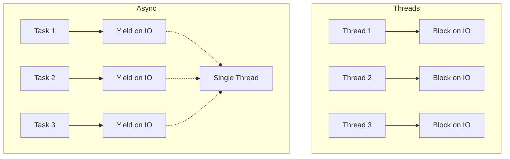

# Rust Async IO

## Introduction

Asynchronous Input/Output (Async IO) is a programming paradigm that allows your program to start an operation and continue executing other tasks without waiting for the first operation to complete. This is particularly useful for IO-bound operations like reading files, making network requests, or querying databases, which often involve waiting for external resources.

In this tutorial, we'll explore how Rust handles asynchronous IO operations. We'll learn about Rust's async/await syntax, how to work with `Future`s, and see practical examples of performing concurrent IO operations efficiently.

## Understanding Async IO in Rust

### Why Async IO?

Traditional synchronous code executes sequentially - when your program needs to read a file or fetch data from a server, it stops and waits for that operation to complete before moving on. This can waste valuable CPU time, especially when dealing with slow operations like network requests.

Asynchronous programming solves this problem by allowing your program to work on other tasks while waiting for IO operations to complete.


*Synchronous execution: Your program waits idle during IO operations*


*Asynchronous execution: Your program continues working during IO operations*

### Rust's Async Model

Rust implements asynchronous programming through:

1. **Futures**: Objects that represent values that might not be ready yet
2. **Async/await syntax**: A way to write asynchronous code that looks like synchronous code
3. **Async runtimes**: Libraries that execute futures (e.g., Tokio, async-std)

Unlike some languages, Rust doesn't include its own async runtime in the standard library. Instead, you choose a runtime like Tokio or async-std based on your project's needs.

## Getting Started with Async IO

### Setting Up Your Project

First, let's create a new Rust project and add the necessary dependencies:

```bash
cargo new rust_async_demo
cd rust_async_demo
```

Update your `Cargo.toml` file:

```toml
[dependencies]
tokio = { version = "1", features = ["full"] }
futures = "0.3"
```

### Your First Async Function

Let's create a simple async function:

```rust
async fn hello_world() -> String {
    "Hello, async world!".to_string()
}
```

This function returns a `Future` that will resolve to a `String`. To actually run this function, we need an async runtime:

```rust
use tokio::runtime::Runtime;

fn main() {
    // Create a new runtime
    let rt = Runtime::new().unwrap();
    
    // Execute the async function in the runtime
    let result = rt.block_on(hello_world());
    
    println!("{}", result); // Prints: Hello, async world!
}
```

### Using the `#[tokio::main]` Macro

Tokio provides a convenient macro that simplifies the boilerplate:

```rust
use tokio;

#[tokio::main]
async fn main() {
    let result = hello_world().await;
    println!("{}", result); // Prints: Hello, async world!
}

async fn hello_world() -> String {
    "Hello, async world!".to_string()
}
```

The `#[tokio::main]` macro transforms your `main` function into a regular function that sets up the runtime and calls the async main function. This is much cleaner!

## Async IO Operations

### Reading a File Asynchronously

Let's see how to read a file asynchronously using Tokio:

```rust
use tokio::fs::File;
use tokio::io::{self, AsyncReadExt};

#[tokio::main]
async fn main() -> io::Result<()> {
    // Create a file called example.txt with some content before running
    let mut file = File::open("example.txt").await?;
    
    let mut contents = String::new();
    file.read_to_string(&mut contents).await?;
    
    println!("File contents: {}", contents);
    
    Ok(())
}
```

**Input**: A file named `example.txt` containing "Hello, Async Rust!"  
**Output**: `File contents: Hello, Async Rust!`

Note the use of `.await` after the async operations. This is where your program will yield execution if the operation isn't ready yet, allowing other tasks to run.

### Making HTTP Requests

For HTTP requests, we can use the `reqwest` crate:

```rust
// Add to Cargo.toml:
// reqwest = { version = "0.11", features = ["json"] }

use reqwest;

#[tokio::main]
async fn main() -> Result<(), Box<dyn std::error::Error>> {
    let response = reqwest::get("https://httpbin.org/ip").await?;
    let body = response.text().await?;
    
    println!("Response: {}", body);
    
    Ok(())
}
```

**Output**: 
```
Response: {
  "origin": "your.ip.address.here"
}
```

## Working with Multiple Futures

### Executing Futures Concurrently

One of the main advantages of async IO is running multiple operations concurrently. There are several ways to do this:

#### Using `join!`

The `join!` macro runs multiple futures concurrently and waits for all of them to complete:

```rust
use tokio::time::{sleep, Duration};

#[tokio::main]
async fn main() {
    let task1 = async {
        sleep(Duration::from_millis(100)).await;
        println!("Task 1 complete");
        "Result from task 1"
    };
    
    let task2 = async {
        sleep(Duration::from_millis(50)).await;
        println!("Task 2 complete");
        "Result from task 2"
    };
    
    let (result1, result2) = tokio::join!(task1, task2);
    
    println!("Results: {} and {}", result1, result2);
}
```

**Output**:
```
Task 2 complete
Task 1 complete
Results: Result from task 1 and Result from task 2
```

Notice that Task 2 completes first, even though it was defined second, because it has a shorter sleep duration.

#### Using `select!`

The `select!` macro runs multiple futures concurrently and returns as soon as one completes:

```rust
use tokio::time::{sleep, Duration};
use tokio::select;

#[tokio::main]
async fn main() {
    let task1 = sleep(Duration::from_millis(100));
    let task2 = sleep(Duration::from_millis(50));
    
    select! {
        _ = task1 => {
            println!("Task 1 completed first");
        }
        _ = task2 => {
            println!("Task 2 completed first");
        }
    }
}
```

**Output**:
```
Task 2 completed first
```

### Spawning Tasks

For more complex scenarios, you can spawn tasks to run in the background:

```rust
use tokio::time::{sleep, Duration};

#[tokio::main]
async fn main() {
    // Spawn a background task
    let handle = tokio::spawn(async {
        sleep(Duration::from_secs(1)).await;
        println!("Background task complete");
        42
    });
    
    // Do other work while the background task runs
    for i in 1..=5 {
        println!("Main task working: step {}", i);
        sleep(Duration::from_millis(200)).await;
    }
    
    // Wait for the background task to complete and get its result
    let result = handle.await.unwrap();
    println!("Background task returned: {}", result);
}
```

**Output**:
```
Main task working: step 1
Main task working: step 2
Main task working: step 3
Main task working: step 4
Main task working: step 5
Background task complete
Background task returned: 42
```

## Real-World Example: Concurrent File Processing

Let's create a more practical example that reads multiple files concurrently and processes their contents:

```rust
use tokio::fs::File;
use tokio::io::{self, AsyncReadExt};
use futures::future::join_all;
use std::path::Path;

async fn read_file(path: impl AsRef<Path>) -> io::Result<String> {
    let mut file = File::open(path).await?;
    let mut contents = String::new();
    file.read_to_string(&mut contents).await?;
    Ok(contents)
}

#[tokio::main]
async fn main() -> io::Result<()> {
    // Create several text files before running
    let files = vec!["file1.txt", "file2.txt", "file3.txt"];
    
    // Create futures for each file read operation
    let mut tasks = Vec::new();
    for file in files {
        tasks.push(read_file(file));
    }
    
    // Execute all file reads concurrently
    let results = join_all(tasks).await;
    
    // Process the results
    for (i, result) in results.iter().enumerate() {
        match result {
            Ok(contents) => println!("File {} contents: {}", i+1, contents),
            Err(e) => println!("Error reading file {}: {}", i+1, e),
        }
    }
    
    Ok(())
}
```

Assuming you have three files with different content, this program will read all of them concurrently, which is much faster than reading them sequentially, especially for large files or slow disk operations.

## Understanding Async Performance

### When to Use Async IO

Async IO is most beneficial when:

1. You have many IO-bound operations that could run concurrently
2. These operations have significant wait times
3. Your program needs to remain responsive while waiting

It's less beneficial when:

1. Your operations are CPU-bound (use threads instead)
2. You have few IO operations
3. The operations are very quick

### Async vs Threads



Threads consume more resources but can utilize multiple CPU cores. Async tasks are lightweight but run on a single thread by default (though async runtimes like Tokio can use multiple threads).

## Error Handling in Async Code

Handling errors in async Rust is similar to synchronous code, but with some additional considerations:

```rust
use tokio::fs::File;
use tokio::io::{self, AsyncReadExt};

async fn read_file_contents(path: &str) -> Result<String, io::Error> {
    let mut file = match File::open(path).await {
        Ok(file) => file,
        Err(e) => return Err(e),
    };
    
    let mut contents = String::new();
    file.read_to_string(&mut contents).await?;
    
    Ok(contents)
}

#[tokio::main]
async fn main() {
    match read_file_contents("nonexistent-file.txt").await {
        Ok(contents) => println!("File contents: {}", contents),
        Err(e) => println!("Error reading file: {}", e),
    }
}
```

**Output**:
```
Error reading file: No such file or directory (os error 2)
```

The `?` operator works with async functions just like it does with synchronous ones, but remember that you need to `.await` the async function before using `?` on its result.

## Advanced Patterns

### Streams

Streams are like asynchronous iterators. They're useful for processing sequences of values asynchronously:

```rust
use tokio::time::{interval, Duration};
use tokio_stream::StreamExt;

#[tokio::main]
async fn main() {
    // Create a stream that produces a value every 200ms
    let mut interval_stream = interval(Duration::from_millis(200));
    
    // Process the first 5 values from the stream
    for i in 0..5 {
        interval_stream.next().await;
        println!("Tick {}", i);
    }
}
```

**Output**:
```
Tick 0
Tick 1
Tick 2
Tick 3
Tick 4
```

### Timeouts

It's often useful to add timeouts to async operations:

```rust
use tokio::time::{timeout, Duration};

#[tokio::main]
async fn main() {
    let slow_operation = tokio::time::sleep(Duration::from_secs(2));
    
    match timeout(Duration::from_secs(1), slow_operation).await {
        Ok(_) => println!("Operation completed within timeout"),
        Err(_) => println!("Operation timed out"),
    }
}
```

**Output**:
```
Operation timed out
```

## Summary

In this tutorial, we've explored Rust's async IO capabilities:

- **Basic concepts**: Futures, async/await syntax, and async runtimes
- **IO operations**: Reading files and making HTTP requests asynchronously
- **Concurrency**: Running multiple futures concurrently with `join!`, `select!`, and tasks
- **Real-world examples**: Processing multiple files concurrently
- **Error handling**: Propagating and handling errors in async code
- **Advanced patterns**: Streams and timeouts

Async IO in Rust offers powerful tools for writing efficient, concurrent programs. While it has a steeper learning curve than some other languages, it provides more control and better performance guarantees.

## Exercises

1. Create a program that downloads multiple web pages concurrently and counts the total number of HTML tags.
2. Implement a simple file copy utility that reads from one file and writes to another asynchronously.
3. Create an async function that simulates a database query with a random delay, then write a program that queries the "database" multiple times concurrently and aggregates the results.
4. Extend the file processing example to process directories recursively, reading all text files concurrently.

## Additional Resources

- [Tokio Documentation](https://tokio.rs/tokio/tutorial)
- [Rust Async Book](https://rust-lang.github.io/async-book/)
- [Asynchronous Programming in Rust](https://rust-lang.github.io/async-book/)
- [Futures Crate Documentation](https://docs.rs/futures/latest/futures/)
- [Reqwest HTTP Client](https://docs.rs/reqwest/latest/reqwest/)