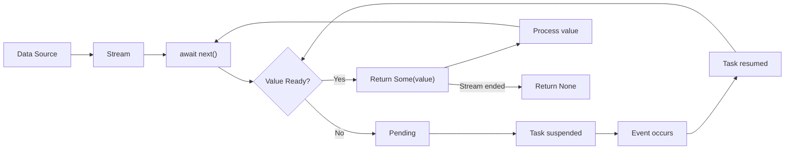

# Rust Async Streams

## Introduction

In the world of asynchronous programming, we often need to process sequences of values that become available over time, rather than all at once. While Rust's `Future` trait allows us to work with single asynchronous values, **async streams** provide a powerful abstraction for working with sequences of asynchronous values.

Think of async streams as the asynchronous equivalent of Rust's iterators. Where iterators let you process a sequence of values synchronously, async streams let you process a sequence of values that arrive asynchronously, such as:

- Messages from a WebSocket connection
- Events from a message queue
- Lines read from a file or network socket
- Results from a database query that arrive in batches

In this tutorial, we'll explore how to create, consume, and manipulate async streams in Rust, with practical examples to solidify your understanding.

## Prerequisites

Before diving into async streams, you should be familiar with:
- Basic Rust syntax and concepts
- Rust's async/await syntax
- Futures in Rust

## Understanding Async Streams

### What is an Async Stream?

An async stream is a sequence of values that become available over time. Unlike a regular iterator, which produces values synchronously (immediately when requested), an async stream might need to wait for values to become available.

The core trait for async streams in Rust is `Stream`, defined in the `futures` crate:

```rust
pub trait Stream {
    type Item;
    
    fn poll_next(
        self: Pin<&mut Self>, 
        cx: &mut Context<'_>
    ) -> Poll<Option<Self::Item>>;
}
```

This might look similar to Rust's `Iterator` trait:

```rust
pub trait Iterator {
    type Item;
    
    fn next(&mut self) -> Option<Self::Item>;
}
```

The key differences are:
1. `Stream::poll_next` returns a `Poll<Option<Item>>` instead of `Option<Item>`
2. `Stream::poll_next` takes a `Context` parameter, like `Future::poll`
3. `Stream` requires `self` to be pinned

These differences reflect the asynchronous nature of streams - they might need to wait for values to become available.

## Getting Started with Async Streams

### Setting Up Your Project

First, let's set up a new Rust project and add the necessary dependencies:

```bash
cargo new async_streams_example
cd async_streams_example
```

Add the following to your `Cargo.toml`:

```toml
[dependencies]
tokio = { version = "1.28", features = ["full"] }
futures = "0.3"
```

### Creating a Simple Async Stream

Let's create a simple async stream that emits numbers with a delay:

```rust
use futures::{Stream, StreamExt};
use std::pin::Pin;
use std::time::Duration;
use tokio::time::sleep;

// A stream that emits numbers from start to end with delays
fn number_stream(
    start: u32,
    end: u32,
    delay_ms: u64,
) -> impl Stream<Item = u32> {
    async_stream::stream! {
        for i in start..=end {
            sleep(Duration::from_millis(delay_ms)).await;
            yield i;
        }
    }
}

#[tokio::main]
async fn main() {
    let mut stream = number_stream(1, 5, 500);
    
    // Process the stream values as they arrive
    while let Some(number) = stream.next().await {
        println!("Got number: {}", number);
    }
}
```

**Output:**
```
Got number: 1  // After 500ms
Got number: 2  // After another 500ms
Got number: 3  // After another 500ms
Got number: 4  // After another 500ms
Got number: 5  // After another 500ms
```

In this example:
1. We create an async stream using the `async_stream::stream!` macro
2. The stream emits numbers from `start` to `end` with a delay in between
3. We use `StreamExt::next()` to consume the stream values as they arrive

## Core Stream Operations

Just like with iterators, there are many operations you can perform on streams. Here are some of the most common ones:

### Consuming a Stream

The most basic way to consume a stream is with the `next()` method provided by the `StreamExt` trait:

```rust
use futures::StreamExt;

async fn consume_stream() {
    let mut stream = number_stream(1, 3, 500);
    
    // Method 1: Using while let
    while let Some(value) = stream.next().await {
        println!("Got value: {}", value);
    }
    
    // Method 2: Manually calling next() (less common)
    let mut stream = number_stream(1, 3, 500);
    let value1 = stream.next().await;  // Some(1)
    let value2 = stream.next().await;  // Some(2)
    let value3 = stream.next().await;  // Some(3)
    let value4 = stream.next().await;  // None
}
```

### Collecting Stream Values

You can collect all values from a stream into a collection using `StreamExt::collect()`:

```rust
use futures::StreamExt;

async fn collect_stream() {
    let stream = number_stream(1, 5, 100);
    
    // Collect all stream values into a Vec
    let values: Vec<u32> = stream.collect().await;
    println!("Collected values: {:?}", values);
}
```

**Output:**
```
Collected values: [1, 2, 3, 4, 5]
```

> **Note:** Be careful when collecting streams! If the stream is infinite or very large, collecting it could use a lot of memory or even cause your program to run out of memory.

### Transforming Streams

Like iterators, streams can be transformed using various adapters:

```rust
use futures::StreamExt;

async fn transform_stream() {
    let stream = number_stream(1, 5, 100);
    
    // Map values to their squares
    let squared = stream.map(|x| x * x);
    
    // Filter out odd numbers
    let even_squares = squared.filter(|x| x % 2 == 0);
    
    // Collect the results
    let results: Vec<u32> = even_squares.collect().await;
    println!("Even squares: {:?}", results);
}
```

**Output:**
```
Even squares: [4, 16, 36]
```

### Chaining Operations

You can chain multiple stream operations together:

```rust
use futures::StreamExt;

async fn chain_operations() {
    let results: Vec<u32> = number_stream(1, 10, 100)
        .map(|x| x * 2)           // Double each number
        .filter(|x| x % 3 == 0)    // Keep only multiples of 3
        .take(3)                  // Take only the first 3 matching items
        .collect()
        .await;
    
    println!("Results: {:?}", results);
}
```

**Output:**
```
Results: [6, 12, 18]
```

## Creating Async Streams

There are several ways to create async streams in Rust:

### Using the async_stream Macro

The `async_stream` crate provides a convenient macro for creating streams:

```rust
use async_stream::stream;
use futures::StreamExt;

async fn demo_async_stream_macro() {
    let s = stream! {
        for i in 0..3 {
            tokio::time::sleep(tokio::time::Duration::from_millis(100)).await;
            yield i;
        }
    };
    
    let values: Vec<i32> = s.collect().await;
    println!("Values: {:?}", values);
}
```

**Output:**
```
Values: [0, 1, 2]
```

### Converting Iterators to Streams

You can convert a regular iterator into a stream using `futures::stream::iter`:

```rust
use futures::{stream, StreamExt};

async fn iter_to_stream() {
    let iterator = vec![1, 2, 3, 4, 5].into_iter();
    
    // Convert iterator to stream
    let stream = stream::iter(iterator);
    
    // Collect the stream values
    let values: Vec<i32> = stream.collect().await;
    println!("Values: {:?}", values);
}
```

**Output:**
```
Values: [1, 2, 3, 4, 5]
```

### Creating Streams from Channels

Tokio's channels can be used to create streams:

```rust
use futures::StreamExt;
use tokio::sync::mpsc;

async fn channel_to_stream() {
    let (tx, rx) = mpsc::channel(10);
    
    // Convert receiver to stream
    let mut stream = tokio_stream::wrappers::ReceiverStream::new(rx);
    
    // Spawn a task to send values
    tokio::spawn(async move {
        for i in 1..=5 {
            tx.send(i).await.unwrap();
            tokio::time::sleep(tokio::time::Duration::from_millis(100)).await;
        }
    });
    
    // Process values as they arrive
    while let Some(value) = stream.next().await {
        println!("Received: {}", value);
    }
}
```

**Output:**
```
Received: 1
Received: 2
Received: 3
Received: 4
Received: 5
```

## Real-World Examples

Let's explore some practical applications of async streams in Rust.

### Example 1: Reading Lines from a File

```rust
use futures::{Stream, StreamExt};
use std::io;
use tokio::{fs::File, io::AsyncBufReadExt};

// A stream that emits lines from a file
fn read_lines_stream(
    path: &str,
) -> impl Stream<Item = Result<String, io::Error>> {
    async_stream::stream! {
        let file = match File::open(path).await {
            Ok(file) => file,
            Err(e) => {
                yield Err(e);
                return;
            }
        };
        
        let reader = tokio::io::BufReader::new(file);
        let mut lines = reader.lines();
        
        while let Some(line) = lines.next_line().await.transpose() {
            yield line;
        }
    }
}

#[tokio::main]
async fn main() -> io::Result<()> {
    // Assume example.txt contains 3 lines
    let mut stream = read_lines_stream("example.txt");
    
    while let Some(line_result) = stream.next().await {
        match line_result {
            Ok(line) => println!("Line: {}", line),
            Err(e) => eprintln!("Error reading line: {}", e),
        }
    }
    
    Ok(())
}
```

### Example 2: WebSocket Message Stream

```rust
use futures::{Stream, StreamExt};
use tokio_tungstenite::{connect_async, tungstenite::Message};

// A stream of WebSocket messages
async fn websocket_stream(
    url: &str,
) -> impl Stream<Item = Result<Message, tokio_tungstenite::tungstenite::Error>> {
    let (ws_stream, _) = connect_async(url).await.expect("Failed to connect");
    ws_stream.map(|result| result)
}

#[tokio::main]
async fn main() {
    let mut stream = websocket_stream("wss://echo.websocket.org").await;
    
    // Send a message (in a real app, this would be in a separate task)
    // ...
    
    // Process incoming messages
    while let Some(message_result) = stream.next().await {
        match message_result {
            Ok(message) => {
                if let Message::Text(text) = message {
                    println!("Received text: {}", text);
                }
            }
            Err(e) => eprintln!("Error receiving message: {}", e),
        }
    }
}
```

## Advanced Stream Patterns

### Concurrent Stream Processing

You can process multiple items from a stream concurrently using `for_each_concurrent`:

```rust
use futures::StreamExt;
use std::time::Duration;
use tokio::time::sleep;

async fn process_item(item: u32) {
    println!("Start processing item: {}", item);
    sleep(Duration::from_secs(1)).await;  // Simulate work
    println!("Finished processing item: {}", item);
}

#[tokio::main]
async fn main() {
    let stream = number_stream(1, 5, 100);
    
    // Process up to 3 items concurrently
    stream.for_each_concurrent(3, |item| async move {
        process_item(item).await;
    }).await;
}
```

**Output:**
```
Start processing item: 1
Start processing item: 2
Start processing item: 3
Finished processing item: 1
Start processing item: 4
Finished processing item: 2
Start processing item: 5
Finished processing item: 3
Finished processing item: 4
Finished processing item: 5
```

### Combining Multiple Streams

You can combine multiple streams using `select` or `merge`:

```rust
use futures::{stream, StreamExt};

#[tokio::main]
async fn main() {
    let stream1 = number_stream(1, 3, 200);
    let stream2 = number_stream(10, 12, 300);
    
    // Merge streams (interleaves items as they become ready)
    let mut merged = stream::select(stream1, stream2);
    
    while let Some(value) = merged.next().await {
        println!("Got value: {}", value);
    }
}
```

**Output (approximate, as timing may vary):**
```
Got value: 1
Got value: 10
Got value: 2
Got value: 11
Got value: 3
Got value: 12
```

### Error Handling in Streams

When working with streams that can produce errors, you typically have two options:

1. Use a stream of `Result<T, E>` and handle errors inline:

```rust
use futures::StreamExt;
use std::io;

async fn handle_errors() {
    let mut stream = read_lines_stream("example.txt");
    
    while let Some(result) = stream.next().await {
        match result {
            Ok(line) => println!("Line: {}", line),
            Err(e) => eprintln!("Error: {}", e),
        }
    }
}
```

2. Use `try_filter` and other combinators from `futures::TryStreamExt`:

```rust
use futures::{StreamExt, TryStreamExt};
use std::io;

async fn try_stream_ext_demo() {
    let stream = read_lines_stream("example.txt");
    
    // Filter out errors and process only successful values
    let filtered = stream.try_filter(|line| {
        futures::future::ready(!line.is_empty())
    });
    
    let result: Result<Vec<String>, io::Error> = filtered.try_collect().await;
    match result {
        Ok(lines) => println!("Collected {} non-empty lines", lines.len()),
        Err(e) => eprintln!("Error: {}", e),
    }
}
```

## Stream Visualization

To better understand how async streams work, let's visualize the flow of data:



The key insight is that when a value isn't ready, the task is suspended (not blocking any threads) until an event occurs that might make a value available.

## Common Pitfalls and Best Practices

### Pitfalls to Avoid

1. **Collecting Infinite Streams**: Avoid calling `collect()` on potentially infinite streams.

2. **Forgetting to Poll**: If you implement a `Stream` manually, ensure you poll the underlying future.

3. **Using Blocking Operations**: Avoid blocking operations in async code; use the async versions instead.

### Best Practices

1. **Use Combinators**: Prefer using stream combinators (map, filter, etc.) for cleaner code.

2. **Handle Backpressure**: In real-world applications, consider how to handle backpressure (when a stream produces values faster than they can be consumed).

3. **Error Handling**: Design your streams to handle errors gracefully.

4. **Resource Management**: Ensure resources are properly cleaned up when a stream is dropped.

## Summary

In this tutorial, we've explored async streams in Rust, which provide a powerful abstraction for working with sequences of asynchronous values. We've covered:

- The basic concept and definition of async streams
- Creating streams using various methods
- Consuming and transforming streams
- Real-world examples and patterns
- Advanced topics like concurrent processing and error handling

Async streams, combined with Rust's other async features, provide a powerful toolkit for building efficient, concurrent applications that can handle complex data flows.

## Further Resources

- [Futures crate documentation](https://docs.rs/futures/latest/futures/stream/index.html)
- [Tokio documentation](https://docs.rs/tokio/latest/tokio/)
- [async-stream crate](https://docs.rs/async-stream/latest/async_stream/)
- [Stream Handbook (GitHub)](https://github.com/zkat/streams-handbook)

## Exercises

1. Create an async stream that emits events from a timer at regular intervals.
2. Implement a function that converts a stream of bytes into a stream of lines (strings ending with '
').
3. Build a simple chat server that uses streams to handle multiple client connections.
4. Create a stream combinator that buffers stream items and emits them in batches.
5. Implement an async version of the Unix "tail -f" command using async streams.