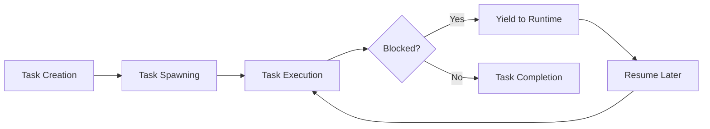

# Rust Async Tasks

## Introduction

Asynchronous programming in Rust allows you to write code that can perform multiple operations concurrently without creating multiple operating system threads. At the heart of Rust's async ecosystem are **async tasks** - lightweight units of work that can be executed concurrently.

In this tutorial, we'll explore how to create, spawn, and manage async tasks in Rust. You'll learn how these tasks enable efficient concurrent programming, especially for I/O-bound operations like network requests, file operations, and database queries.

## Prerequisites

Before diving into async tasks, you should:
- Have basic knowledge of Rust syntax and concepts
- Understand what asynchronous programming is (operations that can pause and resume)
- Have the Rust toolchain installed (`rustc`, `cargo`)

## Understanding Async Tasks

An async task in Rust is a unit of asynchronous work that can be scheduled for execution. Unlike OS threads, async tasks are:

- **Lightweight**: You can create thousands of tasks with minimal overhead
- **Non-blocking**: Tasks yield control when waiting for operations rather than blocking
- **Cooperative**: Tasks explicitly yield control, rather than being preemptively scheduled



## Getting Started with Async Tasks

To work with async tasks in Rust, you'll need an async runtime like Tokio or async-std. Let's use Tokio for our examples.

First, add Tokio to your `Cargo.toml`:

```toml
[dependencies]
tokio = { version = "1", features = ["full"] }
```

### Creating Your First Async Task

Here's a simple example of creating and spawning an async task:

```rust
use tokio::time::{sleep, Duration};

#[tokio::main]
async fn main() {
    // This is our main task
    println!("Main task started");
    
    // Spawn a new async task
    let handle = tokio::spawn(async {
        println!("Child task started");
        sleep(Duration::from_millis(500)).await;
        println!("Child task completed");
        
        // Return a value from the task
        "Task result"
    });
    
    // Main task continues execution
    println!("Main task continues while child task runs");
    
    // Wait for the spawned task to complete and get its result
    let result = handle.await.unwrap();
    println!("Got result from child task: {}", result);
}
```

**Output:**
```
Main task started
Child task started
Main task continues while child task runs
Child task completed
Got result from child task: Task result
```

In this example:
1. We create a main async function using `#[tokio::main]`
2. We spawn a new task using `tokio::spawn`
3. The main task and child task run concurrently
4. We use `.await` on the task handle to wait for its completion and get its result

## Key Concepts of Async Tasks

### Task Spawning

Spawning a task means scheduling it for execution on the async runtime. When you spawn a task, the runtime takes responsibility for executing it.

```rust
let handle = tokio::spawn(async {
    // Task code here
});
```

The `spawn` function returns a `JoinHandle`, which you can use to:
- Wait for the task to complete using `.await`
- Cancel the task using `.abort()`
- Check if the task has completed

### Task Communication

Tasks often need to communicate with each other. Rust provides several mechanisms for this:

#### Using Channels

Channels allow you to send values between tasks:

```rust
use tokio::sync::mpsc;

#[tokio::main]
async fn main() {
    // Create a channel with a capacity of 10
    let (tx, mut rx) = mpsc::channel(10);
    
    // Spawn a task that sends messages
    let sender_task = tokio::spawn(async move {
        for i in 1..=5 {
            tx.send(format!("Message {}", i)).await.unwrap();
            sleep(Duration::from_millis(100)).await;
        }
    });
    
    // Spawn a task that receives messages
    let receiver_task = tokio::spawn(async move {
        while let Some(message) = rx.recv().await {
            println!("Received: {}", message);
        }
    });
    
    // Wait for the sender to finish
    sender_task.await.unwrap();
}
```

**Output:**
```
Received: Message 1
Received: Message 2
Received: Message 3
Received: Message 4
Received: Message 5
```

#### Using Shared State

You can also share state between tasks using synchronization primitives like `Mutex`:

```rust
use std::sync::Arc;
use tokio::sync::Mutex;

#[tokio::main]
async fn main() {
    // Create shared state
    let counter = Arc::new(Mutex::new(0));
    
    // Create multiple tasks that increment the counter
    let mut handles = vec![];
    
    for i in 0..5 {
        let counter_clone = Arc::clone(&counter);
        
        let handle = tokio::spawn(async move {
            // Lock the mutex to modify the shared state
            let mut lock = counter_clone.lock().await;
            *lock += 1;
            println!("Task {} incremented counter to {}", i, *lock);
        });
        
        handles.push(handle);
    }
    
    // Wait for all tasks to complete
    for handle in handles {
        handle.await.unwrap();
    }
    
    // Check the final value
    let final_count = *counter.lock().await;
    println!("Final counter value: {}", final_count);
}
```

**Output:**
```
Task 0 incremented counter to 1
Task 1 incremented counter to 2
Task 2 incremented counter to 3
Task 3 incremented counter to 4
Task 4 incremented counter to 5
Final counter value: 5
```

### Error Handling in Tasks

When a task panics or returns an error, it's important to handle it properly:

```rust
#[tokio::main]
async fn main() {
    // Spawn a task that will succeed
    let success_handle = tokio::spawn(async {
        Ok::<_, String>("Task completed successfully")
    });
    
    // Spawn a task that will fail
    let error_handle = tokio::spawn(async {
        Err::<&str, _>("Task failed")
    });
    
    // Handle the results
    match success_handle.await {
        Ok(Ok(message)) => println!("Success: {}", message),
        Ok(Err(e)) => println!("Task returned an error: {}", e),
        Err(e) => println!("Task panicked: {}", e),
    }
    
    match error_handle.await {
        Ok(Ok(message)) => println!("Success: {}", message),
        Ok(Err(e)) => println!("Task returned an error: {}", e),
        Err(e) => println!("Task panicked: {}", e),
    }
}
```

**Output:**
```
Success: Task completed successfully
Task returned an error: Task failed
```

Note the double `Result` handling:
- The outer `Result` from `.await` indicates if the task completed or panicked
- The inner `Result` is the value returned by the task itself

## Practical Examples

### Web Scraping with Concurrent Requests

This example shows how you can use async tasks to fetch multiple web pages concurrently:

```rust
use reqwest;
use futures::future::join_all;

async fn fetch_url(url: &str) -> Result<String, reqwest::Error> {
    println!("Fetching: {}", url);
    let response = reqwest::get(url).await?;
    Ok(format!("{}: {} bytes", url, response.text().await?.len()))
}

#[tokio::main]
async fn main() -> Result<(), Box<dyn std::error::Error>> {
    let urls = vec![
        "https://www.rust-lang.org",
        "https://doc.rust-lang.org",
        "https://crates.io",
    ];
    
    // Spawn a task for each URL
    let tasks: Vec<_> = urls
        .iter()
        .map(|url| {
            let url = url.to_string();
            tokio::spawn(async move {
                match fetch_url(&url).await {
                    Ok(result) => println!("Success: {}", result),
                    Err(e) => println!("Error fetching {}: {}", url, e),
                }
            })
        })
        .collect();
    
    // Wait for all tasks to complete
    join_all(tasks).await;
    
    Ok(())
}
```

**Output:**
```
Fetching: https://www.rust-lang.org
Fetching: https://doc.rust-lang.org
Fetching: https://crates.io
Success: https://www.rust-lang.org: 32485 bytes
Success: https://crates.io: 41023 bytes
Success: https://doc.rust-lang.org: 29376 bytes
```

### Processing Files in Parallel

This example demonstrates how to read and process multiple files concurrently:

```rust
use tokio::fs;
use tokio::io::{self, AsyncReadExt};

async fn count_lines(filename: &str) -> io::Result<usize> {
    let content = fs::read_to_string(filename).await?;
    Ok(content.lines().count())
}

#[tokio::main]
async fn main() -> io::Result<()> {
    let files = vec!["file1.txt", "file2.txt", "file3.txt"];
    
    let mut tasks = Vec::new();
    
    for file in files {
        let file = file.to_string();
        let task = tokio::spawn(async move {
            match count_lines(&file).await {
                Ok(count) => println!("{} has {} lines", file, count),
                Err(e) => eprintln!("Error processing {}: {}", file, e),
            }
        });
        
        tasks.push(task);
    }
    
    for task in tasks {
        task.await.unwrap();
    }
    
    Ok(())
}
```

## Advanced Task Management

### Task Cancellation

You can cancel a task using the `abort` method on its handle:

```rust
#[tokio::main]
async fn main() {
    let handle = tokio::spawn(async {
        println!("Task started");
        
        // Simulate some work
        sleep(Duration::from_secs(5)).await;
        
        println!("Task completed");
        "This result will never be seen"
    });
    
    // Let the task run for a bit
    sleep(Duration::from_secs(1)).await;
    
    // Cancel the task
    println!("Cancelling task...");
    handle.abort();
    
    // Wait for the task to be cancelled
    match handle.await {
        Ok(_) => println!("Task completed successfully"),
        Err(e) => println!("Task was cancelled: {}", e),
    }
}
```

**Output:**
```
Task started
Cancelling task...
Task was cancelled: task cancelled
```

### Task Timeouts

You can set timeouts for tasks using `tokio::time::timeout`:

```rust
use tokio::time::timeout;

#[tokio::main]
async fn main() {
    // A task that takes too long
    let result = timeout(Duration::from_secs(1), async {
        println!("Starting long task...");
        sleep(Duration::from_secs(3)).await;
        println!("Long task completed");
        42
    }).await;
    
    match result {
        Ok(value) => println!("Task completed with value: {}", value),
        Err(_) => println!("Task timed out"),
    }
    
    // A task that completes in time
    let result = timeout(Duration::from_secs(2), async {
        println!("Starting quick task...");
        sleep(Duration::from_secs(1)).await;
        println!("Quick task completed");
        24
    }).await;
    
    match result {
        Ok(value) => println!("Task completed with value: {}", value),
        Err(_) => println!("Task timed out"),
    }
}
```

**Output:**
```
Starting long task...
Task timed out
Starting quick task...
Quick task completed
Task completed with value: 24
```

### Task Local Storage

Tokio provides task-local storage to store data specific to a task:

```rust
use tokio::task::LocalKey;

static TASK_ID: LocalKey<u32> = tokio::task_local! { static TASK_ID: u32 = 0 };

#[tokio::main]
async fn main() {
    // Spawn tasks with different task-local values
    for id in 1..=3 {
        tokio::spawn(async move {
            TASK_ID.scope(id, async {
                println!("Task {} started", TASK_ID.get());
                
                // Call another function that uses the task-local value
                process_task().await;
                
                println!("Task {} completed", TASK_ID.get());
            }).await;
        });
    }
    
    // Let the tasks run
    sleep(Duration::from_secs(1)).await;
}

async fn process_task() {
    println!("Processing in task {}", TASK_ID.get());
    sleep(Duration::from_millis(100)).await;
}
```

**Output:**
```
Task 1 started
Processing in task 1
Task 1 completed
Task 2 started
Processing in task 2
Task 2 completed
Task 3 started
Processing in task 3
Task 3 completed
```

## Best Practices for Working with Async Tasks

1. **Avoid Blocking Operations**: Don't perform CPU-intensive or blocking I/O operations directly in async tasks. Use `spawn_blocking` for CPU-bound work.

   ```rust
   let result = tokio::task::spawn_blocking(|| {
       // CPU-intensive operation
       let mut sum = 0;
       for i in 0..1_000_000 {
           sum += i;
       }
       sum
   }).await.unwrap();
   ```

2. **Handle Task Failures**: Always handle potential errors when awaiting tasks.

3. **Use Structured Concurrency**: Group related tasks together and ensure they all complete or are cancelled together.

4. **Limit Concurrency**: Use `buffer_unordered` or semaphores to limit the number of concurrent tasks.

   ```rust
   use futures::stream::{self, StreamExt};
   
   async fn process_items() {
       let items = vec![1, 2, 3, 4, 5, 6, 7, 8, 9, 10];
       
       // Process at most 3 items concurrently
       let results: Vec<_> = stream::iter(items)
           .map(|i| {
               tokio::spawn(async move {
                   println!("Processing item {}", i);
                   sleep(Duration::from_millis(100)).await;
                   i * 2
               })
           })
           .buffer_unordered(3)
           .collect()
           .await;
           
       println!("Results: {:?}", results);
   }
   ```

5. **Consider Task Priority**: Not all tasks are equally important. Use channels or multiple runtimes for different priority levels.

## Common Pitfalls and How to Avoid Them

### 1. Forgetting to `.await` Task Handles

If you spawn a task but don't await its handle, you won't know if it completed successfully:

```rust
// BAD - task might fail silently
tokio::spawn(async {
    // Some operation that might fail
    if do_something().await.is_err() {
        panic!("Operation failed!");  // This panic will be swallowed
    }
});

// GOOD - handle task completion and potential errors
let handle = tokio::spawn(async {
    // Some operation that might fail
    do_something().await?;
    Ok::<_, Error>(())
});

if let Err(e) = handle.await {
    eprintln!("Task failed: {}", e);
}
```

### 2. Holding Locks for Too Long

Don't hold locks across `.await` points:

```rust
// BAD - lock is held across await
async fn bad_locking() {
    let data = Arc::new(Mutex::new(Vec::new()));
    
    let mut lock = data.lock().await;  // Acquire lock
    
    // Other tasks cannot access data while we perform I/O
    perform_io().await;
    
    lock.push(42);  // Finally use the locked data
}

// GOOD - minimize lock holding time
async fn good_locking() {
    let data = Arc::new(Mutex::new(Vec::new()));
    
    // Perform I/O before acquiring the lock
    let value = perform_io().await;
    
    // Acquire lock, use it, and immediately release it
    data.lock().await.push(value);
}
```

### 3. Creating Too Many Tasks

Creating millions of tasks can lead to memory issues:

```rust
// BAD - potentially millions of tasks
for id in 0..1_000_000 {
    tokio::spawn(async move {
        process_item(id).await;
    });
}

// GOOD - limit concurrency with buffer_unordered
stream::iter(0..1_000_000)
    .map(|id| {
        async move {
            process_item(id).await
        }
    })
    .buffer_unordered(100)  // Process 100 at a time
    .for_each(|_| async {})
    .await;
```

## Summary

Async tasks in Rust provide a powerful way to perform concurrent operations efficiently. In this tutorial, we've covered:

- Creating and spawning tasks with async runtimes like Tokio
- Communication between tasks using channels and shared state
- Error handling in async tasks
- Practical examples of concurrent web requests and file processing
- Advanced task management including cancellation and timeouts
- Best practices and common pitfalls when working with async tasks

Rust's async tasks offer significant performance benefits for I/O-bound applications, enabling you to write highly concurrent code without the overhead of traditional threading. By understanding these concepts, you can write efficient, concurrent Rust applications that make the most of available resources.

## Additional Resources

- [Tokio Documentation](https://docs.rs/tokio/latest/tokio/)
- [Rust Async Book](https://rust-lang.github.io/async-book/)
- [Async Programming in Rust](https://fasterthanli.me/articles/getting-started-with-rust-async)

## Exercises

1. **Basic Task Spawning**: Modify the first example to spawn multiple tasks and observe how they run concurrently.

2. **Error Propagation**: Write a program that spawns tasks that might fail and properly propagate and handle those errors.

3. **Rate Limiting**: Create a web scraper that fetches multiple URLs but limits the rate of requests to 5 per second.

4. **Parallel File Processing**: Write a program that reads all text files in a directory concurrently, counts the words in each, and reports the total.

5. **Task Communication**: Implement a producer-consumer pattern where one task generates numbers and multiple consumer tasks process them.