# Rust Pin Type

When working with async programming in Rust, you'll eventually encounter a somewhat challenging concept called `Pin`. While it might seem intimidating at first, understanding `Pin` is crucial for writing correct and efficient async code.

## What is Pin and Why Do We Need It?

In Rust's async world, the `Pin` type solves a specific problem related to self-referential structures that can arise when working with futures. But before diving into `Pin`, let's understand the problem it aims to solve.

### The Problem: Self-Referential Structures

Consider this simplified example of what might happen inside a future:

```rust
struct SelfReferential {
    data: String,
    // This pointer points to a location within `data` above
    pointer: *const u8,
}
```

This structure contains a pointer that references memory owned by another field within the same struct. In normal Rust code, this pattern is extremely rare and generally discouraged. However, in the async/await ecosystem, the compiler transforms your code in ways that can create these self-referential structures behind the scenes.

The problem arises when these structures are moved in memory. When a struct is moved, all its fields are copied to a new memory location, but any self-references (pointers to its own fields) would still point to the old location - creating dangling pointers and undefined behavior!

### Enter Pin: Memory Location Stability

This is where `Pin` comes in. `Pin<P<T>>` (where P is a pointer type like `&mut` or `Box`) ensures that the value `T` will not be moved from its memory location once it's "pinned." This guarantee allows self-referential structures to work safely.

## How Pin Works

The `Pin` type works by wrapping a pointer (like `&mut T` or `Box<T>`) and restricting how that pointer can be used:

```rust
use std::pin::Pin;

// A pinned mutable reference
let mut data = String::from("Hello");
let pinned_reference: Pin<&mut String> = Pin::new(&mut data);

// A pinned box
let boxed_data = Box::new(String::from("World"));
let pinned_box: Pin<Box<String>> = Pin::new(boxed_data);
```

Once a value is pinned, you cannot get a regular `&mut T` to it (which would allow moving it) unless the type `T` implements a trait called `Unpin`.

## The Unpin Trait

`Unpin` is an auto-trait that most Rust types implement by default. It indicates that a type is safe to move even when pinned. Types that are not `Unpin` (like many future types) are the ones that need the guarantees that `Pin` provides.

```rust
use std::marker::Unpin;

// Most types implement Unpin by default
struct Regular(u32);
// This is true automatically
let _: bool = Regular(42) implements Unpin;

// Future types generally don't implement Unpin
async fn example() {
    // This future might contain self-references after being transformed
}
// The returned future type doesn't implement Unpin
```

## Using Pin in Practice

Let's look at practical examples of working with `Pin`:

### Example 1: Creating a Pinned Future

```rust
use std::pin::Pin;
use std::future::Future;
use std::task::{Context, Poll};

// A simple future that we'll pin
struct MyFuture {
    counter: u32,
}

impl Future for MyFuture {
    type Output = u32;

    fn poll(self: Pin<&mut Self>, _cx: &mut Context<'_>) -> Poll<u32> {
        let me = self.get_mut(); // Safe because MyFuture implements Unpin
        me.counter += 1;
        
        if me.counter >= 5 {
            Poll::Ready(me.counter)
        } else {
            Poll::Pending
        }
    }
}

// Using our future
async fn use_future() {
    let mut future = MyFuture { counter: 0 };
    
    // Pin the future to its current memory location
    let mut pinned = Pin::new(&mut future);
    
    // Now we can poll it
    let waker = /* create a waker somehow */;
    let mut context = Context::from_waker(&waker);
    
    loop {
        match pinned.as_mut().poll(&mut context) {
            Poll::Ready(result) => {
                println!("Future completed with result: {}", result);
                break;
            }
            Poll::Pending => {
                println!("Future not ready yet");
                // In real code, we'd yield here and try again later
            }
        }
    }
}

// Output when run:
// Future not ready yet
// Future not ready yet
// Future not ready yet
// Future not ready yet
// Future completed with result: 5
```

### Example 2: Working with !Unpin Types

For types that don't implement `Unpin`, we need to be more careful:

```rust
use std::pin::Pin;
use std::marker::PhantomPinned;

// A self-referential struct that should not be moved
struct SelfReferential {
    data: String,
    self_ptr: *const String,
    // This marker indicates this type shouldn't implement Unpin
    _marker: PhantomPinned,
}

impl SelfReferential {
    // Create a new pinned instance
    fn new(data: String) -> Pin<Box<Self>> {
        // Create the struct with a placeholder pointer
        let mut boxed = Box::new(SelfReferential {
            data,
            self_ptr: std::ptr::null(),
            _marker: PhantomPinned,
        });
        
        // Set up the self-reference - ONLY SAFE BECAUSE IT'S ALREADY BOXED
        // AND WILL NEVER MOVE AGAIN AFTER PINNING
        let self_ptr: *const String = &boxed.data;
        boxed.self_ptr = self_ptr;
        
        // Pin the box
        Pin::new(boxed)
    }
    
    // Safe method to get the data
    fn get_data(self: Pin<&Self>) -> &str {
        &self.data
    }
    
    // Safe method to demonstrate the self-reference
    fn get_self_ptr(self: Pin<&Self>) -> &str {
        unsafe {
            // Dereferencing raw pointers requires unsafe
            &(*self.self_ptr)
        }
    }
}

fn main() {
    let pinned = SelfReferential::new(String::from("Hello, self-reference!"));
    
    println!("Direct access: {}", pinned.as_ref().get_data());
    println!("Via self-ptr: {}", pinned.as_ref().get_self_ptr());
    
    // These values will be the same!
}

// Output:
// Direct access: Hello, self-reference!
// Via self-ptr: Hello, self-reference!
```

## Pin and Async/Await

In async/await code, the compiler uses `Pin` behind the scenes. When you write:

```rust
async fn process() {
    let s = String::from("Hello");
    // Do something with s
    delay_for(1).await;
    // Use s again
}
```

The compiler transforms this into a state machine that needs to store the value of `s` across `.await` points. This can create self-referential structures, which is why futures are typically not `Unpin`.

The good news is that you rarely need to work with `Pin` directly in most async Rust code because:

1. The `async/await` syntax handles it for you
2. Executor libraries like `tokio` take care of pinning futures

## Common Pin Patterns

Here are some patterns you'll see with `Pin`:

### 1. The `pin_mut!` Macro

The `futures` crate provides a convenient macro for pinning values on the stack:

```rust
use futures::pin_mut;

async fn example() {
    let future = async { /* ... */ };
    pin_mut!(future);  // Now `future` is pinned
    
    // Use pinned future
    future.await;
}
```

### 2. `Box::pin`

For heap allocation and pinning in one step:

```rust
use std::pin::Pin;

let future = Box::pin(async {
    // This future is now pinned and boxed
});
```

### 3. Pinning In Place with `pin-project` Crate

For complex structs containing futures, the `pin-project` crate is invaluable:

```rust
use pin_project::pin_project;

#[pin_project]
struct MyStruct {
    #[pin]
    future: SomeFuture,
    regular_field: String,
}

impl Future for MyStruct {
    type Output = ();
    
    fn poll(self: Pin<&mut Self>, cx: &mut Context<'_>) -> Poll<()> {
        let this = self.project();
        
        // `this.future` is now Pin<&mut SomeFuture>
        // `this.regular_field` is &mut String
        match this.future.poll(cx) {
            Poll::Ready(_) => Poll::Ready(()),
            Poll::Pending => Poll::Pending,
        }
    }
}
```

## Visualizing Pin

Let's understand Pin with a diagram:

```mermaid
graph TD
    A[Regular Value] -->|"Pin::new(&mut value)"| B[Pinned Value]
    C[Boxed Value] -->|"Pin::new(boxed)"| D[Pinned Box]
    
    B -->|"get_ref()"| E[Get &T reference]
    B -.-x|"Cannot in general"| F[Get &mut T to move]
    
    subgraph "Unpin Types"
        B -->|"get_mut() if T: Unpin"| F
    end
    
    D -->|"into_inner() if T: Unpin"| G[Unboxed Value]
```



## Summary

The `Pin` type in Rust serves a crucial role in async programming by preventing certain values from being moved in memory. This is essential for self-referential structures that can emerge in the compiler's transformation of async code.

Key takeaways:
- `Pin<P<T>>` ensures the value `T` won't be moved from its location
- Most types implement `Unpin` by default, meaning they can be safely moved even when pinned
- Futures typically don't implement `Unpin` because they might contain self-references
- You rarely need to work with `Pin` directly thanks to language features and libraries

## Exercises

1. Create a simple future type and implement the `Future` trait for it, using `Pin` correctly in the `poll` method.
2. Experiment with the `pin-project` crate by creating a struct with both pinned and unpinned fields.
3. Try to create a self-referential struct similar to the `SelfReferential` example above, but with different data types.
4. Implement a function that takes a `Pin<&mut T>` parameter and explore what you can and cannot do with it.

## Additional Resources

- [Rust Pin Documentation](https://doc.rust-lang.org/std/pin/index.html)
- [Pinning in the Rust Async Book](https://rust-lang.github.io/async-book/04_pinning/01_chapter.html)
- [Understanding Pin series on the Rust blog](https://blog.rust-lang.org/)
- [pin-project crate](https://docs.rs/pin-project)
- [Tokio documentation on pinning](https://tokio.rs/tokio/tutorial)