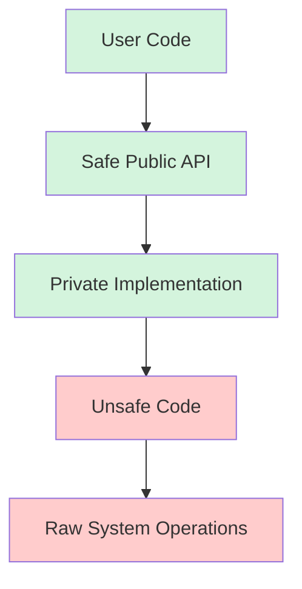

# Rust Unsafe Code

## Introduction

Rust is known for its strong safety guarantees, particularly around memory safety and concurrency. The compiler's ownership system, borrowing rules, and lifetime checking prevent common programming errors like null pointer dereferencing, use-after-free, data races, and buffer overflows.

However, there are situations where Rust's strict safety rules can be too limiting. For these cases, Rust provides an escape hatch: the `unsafe` keyword. Understanding unsafe code is an important step in mastering Rust, as it allows you to perform low-level operations when necessary while still maintaining safety in the rest of your codebase.

## What is Unsafe Code?

In Rust, code within an `unsafe` block or function can perform the following operations that are normally forbidden:

1. Dereferencing raw pointers
2. Calling unsafe functions or methods
3. Accessing or modifying mutable static variables
4. Implementing unsafe traits
5. Accessing fields of `union`s

The `unsafe` keyword doesn't disable the borrow checker or other compile-time checks. It only allows these specific operations that the compiler cannot verify for safety.

## When to Use Unsafe Code

Unsafe code should be used sparingly and only when necessary. Common scenarios include:

- Interfacing with C libraries
- Implementing low-level system operations
- Optimizing performance-critical code
- Implementing data structures that the borrow checker cannot verify

## Raw Pointers

Rust provides two types of raw pointers:
- `*const T`: an immutable raw pointer
- `*mut T`: a mutable raw pointer

Unlike references (`&T` and `&mut T`), raw pointers:
- Can be null
- Aren't guaranteed to point to valid memory
- Can have multiple mutable pointers to the same location
- Don't implement automatic clean-up
- Don't guarantee memory safety

### Creating Raw Pointers

Creating raw pointers is safe, but dereferencing them requires unsafe code:

```rust
fn main() {
    let mut num = 5;
    
    // Creating raw pointers is safe
    let r1 = &num as *const i32;
    let r2 = &mut num as *mut i32;
    
    println!("r1 is: {:?}", r1);
    println!("r2 is: {:?}", r2);
    
    // Output:
    // r1 is: 0x7ffeed0dbf64
    // r2 is: 0x7ffeed0dbf64
}
```

### Dereferencing Raw Pointers

Dereferencing raw pointers requires an unsafe block:

```rust
fn main() {
    let mut num = 5;
    
    let r1 = &num as *const i32;
    let r2 = &mut num as *mut i32;
    
    unsafe {
        println!("r1 points to: {}", *r1);
        *r2 = 10;
        println!("r1 now points to: {}", *r1);
    }
    
    // Output:
    // r1 points to: 5
    // r1 now points to: 10
}
```

## Unsafe Functions

Functions that contain operations requiring unsafe code should be marked with the `unsafe` keyword:

```rust
// This function is marked as unsafe because it dereferences a raw pointer
unsafe fn dangerous(ptr: *const i32) -> i32 {
    *ptr  // Dereferencing a raw pointer
}

fn main() {
    let num = 42;
    let ptr = &num as *const i32;
    
    // Calling an unsafe function requires an unsafe block
    let result = unsafe { dangerous(ptr) };
    
    println!("Result: {}", result);
    
    // Output:
    // Result: 42
}
```

## Practical Example: Implementing a Split-at-mut Function

One classic example where unsafe code is needed is implementing a function that splits a mutable slice into two non-overlapping mutable slices. Rust's borrow checker won't allow this normally since it would create two mutable references to the same memory.

```rust
fn split_at_mut(slice: &mut [i32], mid: usize) -> (&mut [i32], &mut [i32]) {
    let len = slice.len();
    
    // Check that mid is within bounds
    assert!(mid <= len);
    
    // This won't compile without unsafe:
    // (&mut slice[..mid], &mut slice[mid..])
    
    // Using unsafe to implement this functionality
    let ptr = slice.as_mut_ptr();
    
    unsafe {
        (
            std::slice::from_raw_parts_mut(ptr, mid),
            std::slice::from_raw_parts_mut(ptr.add(mid), len - mid),
        )
    }
}

fn main() {
    let mut v = vec![1, 2, 3, 4, 5, 6];
    
    let (left, right) = split_at_mut(&mut v, 3);
    
    // Modify both halves
    left[0] = 10;
    right[0] = 20;
    
    println!("Modified vector: {:?}", v);
    
    // Output:
    // Modified vector: [10, 2, 3, 20, 5, 6]
}
```

## Interfacing with External Code

One of the most common uses of unsafe code is interacting with code written in other languages, particularly C.

### Calling C Functions from Rust

```rust
// Declaration of an external C function
extern "C" {
    fn abs(input: i32) -> i32;
}

fn main() {
    let result = unsafe {
        // Calling a C function is unsafe
        abs(-42)
    };
    
    println!("Absolute value of -42 according to C: {}", result);
    
    // Output:
    // Absolute value of -42 according to C: 42
}
```

## Mutable Static Variables

Static variables in Rust can be problematic for thread safety, so mutating them is considered unsafe:

```rust
// A mutable static variable
static mut COUNTER: u32 = 0;

fn increment_counter() {
    unsafe {
        COUNTER += 1;
    }
}

fn main() {
    increment_counter();
    increment_counter();
    increment_counter();
    
    unsafe {
        println!("COUNTER: {}", COUNTER);
    }
    
    // Output:
    // COUNTER: 3
}
```

## Implementing Unsafe Traits

Some traits are marked as unsafe because they make certain guarantees that the compiler cannot verify:

```rust
// The Send trait guarantees that a type can be safely transferred between threads
unsafe trait MyUnsafeTrait {
    fn unsafe_method(&self);
}

struct MyType;

// Implementing an unsafe trait is unsafe
unsafe impl MyUnsafeTrait for MyType {
    fn unsafe_method(&self) {
        println!("This method makes guarantees that the compiler can't verify!");
    }
}

fn main() {
    let x = MyType;
    x.unsafe_method();
    
    // Output:
    // This method makes guarantees that the compiler can't verify!
}
```

## Unions

Rust supports unions similar to C, but accessing their fields is unsafe because the compiler can't guarantee type safety:

```rust
// Define a union with an integer and a floating-point field
union MyUnion {
    integer: u32,
    float: f32,
}

fn main() {
    let mut u = MyUnion { integer: 10 };
    
    unsafe {
        println!("Integer value: {}", u.integer);
        
        // Reinterpret the bits as a float
        u.float = 1.5;
        println!("Float value: {}", u.float);
    }
    
    // Output:
    // Integer value: 10
    // Float value: 1.5
}
```

## Building Safe Abstractions Over Unsafe Code

A key principle in Rust is to create safe abstractions that encapsulate unsafe code:

```rust
// A safe wrapper around a raw pointer
pub struct SafeWrapper {
    ptr: *mut i32,
}

impl SafeWrapper {
    // Safe constructor
    pub fn new(value: i32) -> Self {
        // Allocate memory on the heap
        let ptr = Box::into_raw(Box::new(value));
        SafeWrapper { ptr }
    }
    
    // Safe getter
    pub fn get(&self) -> i32 {
        unsafe { *self.ptr }
    }
    
    // Safe setter
    pub fn set(&mut self, value: i32) {
        unsafe { *self.ptr = value; }
    }
}

// Implement Drop to ensure memory is freed
impl Drop for SafeWrapper {
    fn drop(&mut self) {
        unsafe {
            // Convert back to Box and let it be dropped
            let _ = Box::from_raw(self.ptr);
        }
    }
}

fn main() {
    // Users can now interact with this type safely
    let mut safe = SafeWrapper::new(42);
    println!("Value: {}", safe.get());
    
    safe.set(100);
    println!("New value: {}", safe.get());
    
    // Memory is automatically freed when `safe` goes out of scope
    
    // Output:
    // Value: 42
    // New value: 100
}
```

## Best Practices for Unsafe Code

When writing unsafe code, follow these best practices:

1. **Minimize the scope**: Keep unsafe blocks as small as possible
2. **Document thoroughly**: Explain why the unsafe code is necessary and how it maintains safety
3. **Add safety checks**: Use assertions and validation to prevent unsafe operations from causing undefined behavior
4. **Create safe abstractions**: Wrap unsafe code in safe interfaces
5. **Write tests**: Thoroughly test unsafe code to catch potential issues

Here's a diagram showing the relationship between safe and unsafe code in a well-designed Rust program:



## Summary

Rust's `unsafe` keyword provides a necessary escape hatch from the language's strict safety guarantees. While powerful, unsafe code should be used sparingly and with caution. By following best practices and creating safe abstractions, you can use unsafe code responsibly to perform low-level operations while maintaining the overall safety of your program.

Remember these key points:
- Unsafe code allows specific operations that the compiler cannot verify as safe
- Creating raw pointers is safe, but dereferencing them requires unsafe code
- Unsafe functions must be called within unsafe blocks
- Using unsafe code comes with responsibility to ensure your code doesn't cause undefined behavior
- The goal is to create small, well-documented unsafe implementations wrapped in safe abstractions

## Exercises

1. Create a safe wrapper around a C function that computes the square root.
2. Implement a function that swaps two values in an array without copying them.
3. Create a data structure that uses unsafe code internally but provides a safe public API.
4. Modify the `split_at_mut` function to handle strings instead of integer slices.
5. Implement a safe abstraction over a mutable static variable that ensures thread safety.

## Additional Resources

- [The Rustonomicon](https://doc.rust-lang.org/nomicon/) - The dark arts of unsafe Rust
- [Rust Reference: Unsafe Code](https://doc.rust-lang.org/reference/unsafe-blocks.html)
- [The Rust Programming Language Book: Unsafe Rust](https://doc.rust-lang.org/book/ch19-01-unsafe-rust.html)
- [Rust API Guidelines](https://rust-lang.github.io/api-guidelines/)