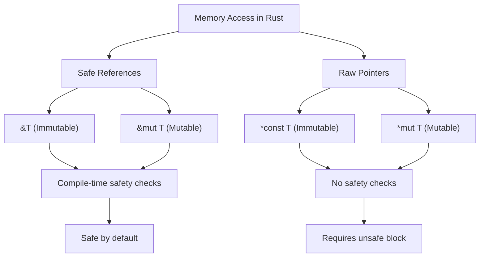

# Rust Raw Pointers

## Introduction

In Rust's memory safety journey, raw pointers represent a departure from the language's usual safety guarantees. While Rust typically prevents memory issues through ownership and borrowing rules, raw pointers provide an escape hatch when you need direct memory manipulation or compatibility with C code.

Raw pointers are similar to references but without Rust's safety guarantees. They come in two flavors:
- `*const T`: An immutable raw pointer
- `*mut T`: A mutable raw pointer

Unlike references, raw pointers:
- Can be null
- Won't guarantee that they point to valid memory
- Can have multiple mutable pointers to the same memory location
- Aren't automatically cleaned up
- Don't implement automatic borrowing

In this guide, we'll explore why Rust includes these "unsafe" features, when you might need them, and how to use them responsibly.

## Creating Raw Pointers

Creating raw pointers is safe in Rust. It's only when you dereference them that you enter unsafe territory. Here's how to create raw pointers:

```rust
fn main() {
    let value = 10;
    
    // Create an immutable raw pointer
    let ptr_immut: *const i32 = &value as *const i32;
    
    // Create a mutable raw pointer
    let mut mutable_value = 20;
    let ptr_mut: *mut i32 = &mut mutable_value as *mut i32;
    
    println!("Immutable raw pointer: {:?}", ptr_immut);
    println!("Mutable raw pointer: {:?}", ptr_mut);
}
```

**Output:**
```
Immutable raw pointer: 0x7ff7b96e31bc
Mutable raw pointer: 0x7ff7b96e31c0
```

Notice that we can print the raw pointers, which usually display as memory addresses. Creating these pointers is completely safe because we haven't tried to access the memory they point to yet.

## Dereferencing Raw Pointers

Dereferencing (accessing the value at the memory location) a raw pointer requires the `unsafe` keyword because Rust cannot guarantee memory safety:

```rust
fn main() {
    let value = 42;
    let ptr = &value as *const i32;
    
    // Dereferencing a raw pointer requires an unsafe block
    unsafe {
        println!("Value from raw pointer: {}", *ptr);
    }
    
    // Modifying through a mutable raw pointer
    let mut number = 100;
    let mut_ptr = &mut number as *mut i32;
    
    unsafe {
        *mut_ptr = 200;
    }
    
    println!("Number after modification: {}", number);
}
```

**Output:**
```
Value from raw pointer: 42
Number after modification: 200
```

## Null Pointers and Pointer Arithmetic

Unlike references, raw pointers can be null and you can perform pointer arithmetic with them:

```rust
fn main() {
    // Creating a null pointer (don't try to dereference this!)
    let null_ptr: *const i32 = std::ptr::null();
    println!("Null pointer: {:?}", null_ptr);
    
    // Pointer arithmetic
    let array = [1, 2, 3, 4, 5];
    let ptr = array.as_ptr();
    
    unsafe {
        // Print the first element
        println!("First element: {}", *ptr);
        
        // Move to the next element (pointer arithmetic)
        let ptr_next = ptr.add(1);
        println!("Second element: {}", *ptr_next);
        
        // Access the third element directly
        println!("Third element: {}", *ptr.add(2));
    }
}
```

**Output:**
```
Null pointer: 0x0
First element: 1
Second element: 2
Third element: 3
```

## When to Use Raw Pointers

Raw pointers are typically used in specific scenarios:

1. **FFI (Foreign Function Interface)**: When interfacing with C code that uses pointers
2. **Implementing low-level data structures**: When you need precise control over memory layout
3. **Performance optimizations**: In rare cases where Rust's safety checks are too restrictive
4. **Working with hardware**: When you need to access specific memory addresses for hardware interaction

Let's look at an example of using raw pointers for FFI with C code:

```rust
// Example: Calling a C function that expects pointers
use std::os::raw::c_int;

// External C function declaration
extern "C" {
    fn add_numbers(a: *const c_int, b: *const c_int, result: *mut c_int);
}

fn main() {
    let a = 5;
    let b = 7;
    let mut result = 0;
    
    // Call the C function with raw pointers
    unsafe {
        add_numbers(&a as *const c_int, &b as *const c_int, &mut result as *mut c_int);
    }
    
    println!("Result from C function: {}", result);
}
```

**Note**: The above example assumes you have a C library with the `add_numbers` function. The actual output would be `12` if the C function correctly adds the numbers.

## Common Patterns and Safety Guidelines

When working with raw pointers, follow these guidelines to minimize risks:

### 1. Minimize the scope of `unsafe` blocks

Keep your `unsafe` blocks as small as possible. Do all the safety checks outside the unsafe block:

```rust
fn main() {
    let array = [1, 2, 3, 4, 5];
    let index = 3;
    
    // Safety check outside the unsafe block
    if index < array.len() {
        let ptr = array.as_ptr();
        
        // Only the actual dereference is unsafe
        let value = unsafe { *ptr.add(index) };
        println!("Safe access: {}", value);
    }
}
```

### 2. Document your safety assumptions

Always add comments explaining why your unsafe code is actually safe:

```rust
fn get_value(ptr: *const i32, index: usize, length: usize) -> Option<i32> {
    if index >= length {
        return None;
    }
    
    // SAFETY: We've verified that index is within bounds of the
    // memory region that starts at ptr and has length 'length'
    unsafe {
        Some(*ptr.add(index))
    }
}
```

### 3. Wrap unsafe code in safe abstractions

Create safe interfaces around your unsafe code:

```rust
struct SafeArrayAccess {
    ptr: *const i32,
    length: usize,
}

impl SafeArrayAccess {
    fn new(array: &[i32]) -> Self {
        SafeArrayAccess {
            ptr: array.as_ptr(),
            length: array.len(),
        }
    }
    
    fn get(&self, index: usize) -> Option<i32> {
        if index < self.length {
            // SAFETY: Index is verified to be within bounds
            unsafe {
                Some(*self.ptr.add(index))
            }
        } else {
            None
        }
    }
}

fn main() {
    let array = [10, 20, 30, 40, 50];
    let safe_access = SafeArrayAccess::new(&array);
    
    println!("Element at index 2: {:?}", safe_access.get(2));
    println!("Element at index 10: {:?}", safe_access.get(10));
}
```

**Output:**
```
Element at index 2: Some(30)
Element at index 10: None
```

## Raw Pointers vs. References

To understand raw pointers better, let's compare them with Rust's safe references:



### Key Differences:

| Feature | References | Raw Pointers |
|---------|------------|--------------|
| Null allowed | No | Yes |
| Compile-time checks | Yes | No |
| Multiple mutable access | No | Yes |
| Dangling possible | No | Yes |
| Dereferencing | Safe | Requires `unsafe` |
| Lifetime tracking | Yes | No |
| Pointer arithmetic | No | Yes |

## Real-World Example: A Simple Custom Vec Implementation

Let's implement a simplified version of Rust's `Vec` type using raw pointers for memory management:

```rust
pub struct SimpleVec<T> {
    ptr: *mut T,
    capacity: usize,
    length: usize,
}

impl<T> SimpleVec<T> {
    pub fn new() -> Self {
        SimpleVec {
            ptr: std::ptr::null_mut(),
            capacity: 0,
            length: 0,
        }
    }
    
    pub fn with_capacity(capacity: usize) -> Self {
        let layout = std::alloc::Layout::array::<T>(capacity).unwrap();
        
        // SAFETY: We're allocating memory with the proper alignment for T
        let ptr = unsafe { std::alloc::alloc(layout) as *mut T };
        
        if ptr.is_null() {
            std::alloc::handle_alloc_error(layout);
        }
        
        SimpleVec {
            ptr,
            capacity,
            length: 0,
        }
    }
    
    pub fn push(&mut self, value: T) {
        if self.length == self.capacity {
            self.grow();
        }
        
        // SAFETY: We've ensured there's space by growing if needed
        unsafe {
            std::ptr::write(self.ptr.add(self.length), value);
        }
        
        self.length += 1;
    }
    
    pub fn get(&self, index: usize) -> Option<&T> {
        if index >= self.length {
            return None;
        }
        
        // SAFETY: Index is verified to be in bounds
        unsafe {
            Some(&*self.ptr.add(index))
        }
    }
    
    fn grow(&mut self) {
        let new_capacity = if self.capacity == 0 { 1 } else { self.capacity * 2 };
        
        // Allocate new memory
        let layout = std::alloc::Layout::array::<T>(new_capacity).unwrap();
        let new_ptr = unsafe { std::alloc::alloc(layout) as *mut T };
        
        if new_ptr.is_null() {
            std::alloc::handle_alloc_error(layout);
        }
        
        // Copy elements to new memory
        if !self.ptr.is_null() {
            // SAFETY: We're copying from valid memory to valid memory
            unsafe {
                std::ptr::copy_nonoverlapping(self.ptr, new_ptr, self.length);
            }
            
            // Free old memory if it was allocated
            if self.capacity > 0 {
                let old_layout = std::alloc::Layout::array::<T>(self.capacity).unwrap();
                // SAFETY: We're freeing memory that we previously allocated
                unsafe {
                    std::alloc::dealloc(self.ptr as *mut u8, old_layout);
                }
            }
        }
        
        self.ptr = new_ptr;
        self.capacity = new_capacity;
    }
}

// Implement Drop to free memory when SimpleVec is dropped
impl<T> Drop for SimpleVec<T> {
    fn drop(&mut self) {
        if !self.ptr.is_null() && self.capacity > 0 {
            // Drop all elements
            for i in 0..self.length {
                // SAFETY: Index is in bounds and we're dropping each element exactly once
                unsafe {
                    std::ptr::drop_in_place(self.ptr.add(i));
                }
            }
            
            // Free the memory
            let layout = std::alloc::Layout::array::<T>(self.capacity).unwrap();
            // SAFETY: We're freeing memory that we allocated
            unsafe {
                std::alloc::dealloc(self.ptr as *mut u8, layout);
            }
        }
    }
}

fn main() {
    // Try out our SimpleVec
    let mut vec = SimpleVec::with_capacity(2);
    vec.push(10);
    vec.push(20);
    vec.push(30);  // This will trigger grow()
    
    println!("Element at index 0: {:?}", vec.get(0));
    println!("Element at index 1: {:?}", vec.get(1));
    println!("Element at index 2: {:?}", vec.get(2));
    println!("Element at index 3: {:?}", vec.get(3));
}
```

**Output:**
```
Element at index 0: Some(10)
Element at index 1: Some(20)
Element at index 2: Some(30)
Element at index 3: None
```

This example demonstrates several important raw pointer operations:
- Memory allocation and deallocation
- Writing values to specific memory locations
- Reading values from memory
- Copying memory blocks
- Proper cleanup in the `Drop` implementation

## Common Mistakes and Pitfalls

When working with raw pointers, be aware of these common issues:

1. **Memory leaks**: Forgetting to free allocated memory
2. **Use-after-free**: Accessing memory after it's been deallocated
3. **Double-free**: Trying to free the same memory multiple times
4. **Null pointer dereference**: Attempting to dereference a null pointer
5. **Buffer overflows**: Accessing memory beyond allocated bounds
6. **Data races**: Multiple threads accessing the same memory without synchronization

## Summary

Raw pointers in Rust provide a way to bypass the language's safety guarantees when necessary. They are powerful tools for specific scenarios like FFI, implementing data structures, or optimizing performance.

Key points to remember:
- Raw pointers come in two forms: `*const T` and `*mut T`
- Creating raw pointers is safe, but dereferencing them requires `unsafe` blocks
- Keep `unsafe` blocks as small as possible
- Document your safety assumptions
- Wrap unsafe code in safe abstractions
- Use raw pointers only when necessary

By understanding raw pointers, you gain insight into how Rust balances safety with the need for low-level control, making it both a safe and powerful systems programming language.

## Additional Resources

- [Rust Book: Unsafe Rust](https://doc.rust-lang.org/book/ch19-01-unsafe-rust.html)
- [Rustonomicon](https://doc.rust-lang.org/nomicon/) - The dark arts of unsafe Rust
- [Rust Reference: Raw Pointers](https://doc.rust-lang.org/reference/types/pointer.html)

## Exercises

1. Create a function that safely wraps the process of dereferencing a raw pointer after performing appropriate checks.
2. Implement a simple linked list using raw pointers.
3. Write a function that uses raw pointers to swap the values of two variables without using Rust's built-in swap function.
4. Create a safe wrapper around a C library function that uses pointers.
5. Extend the SimpleVec implementation to include methods like pop(), remove(), and insert().