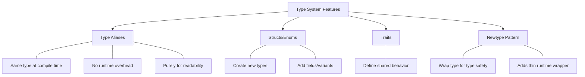

# Rust Type Aliases

## Introduction

When writing Rust code, you might encounter complex type signatures that become cumbersome to type repeatedly or make your code harder to read. Type aliases in Rust allow you to create alternative names for existing types, making your code more readable, maintainable, and expressive.

In this guide, we'll explore how type aliases work in Rust, when to use them, and how they can improve your code quality. Type aliases are a simple yet powerful feature that can significantly enhance your Rust programming experience.

## What Are Type Aliases?

A type alias creates a new name for an existing type. In Rust, we use the `type` keyword to create type aliases:

```rust
// Syntax for type aliases
type NewName = ExistingType;
```

Type aliases don't create new types—they simply provide alternative names for existing types. This is important to understand: the compiler treats the alias and the original type as exactly the same type.

## Basic Usage of Type Aliases

Let's start with some simple examples:

```rust
// Define a type alias
type Integer = i32;

fn main() {
    // Use the type alias
    let x: Integer = 5;
    println!("x: {}", x);
    
    // This works because Integer and i32 are the same type
    let y: i32 = x;
    println!("y: {}", y);
}
```

**Output:**
```
x: 5
y: 5
```

In this example, `Integer` is just another name for `i32`. The compiler sees them as identical.

## Type Aliases for Complex Types

Type aliases are particularly useful for complex types that would be tedious to write repeatedly:

```rust
// Without type alias
fn process_data(items: Vec<(String, Vec<Option<f64>>)>) {
    // function body
}

// With type alias
type DataItem = (String, Vec<Option<f64>>);
type DataCollection = Vec<DataItem>;

fn process_data(items: DataCollection) {
    // same function body, but the signature is much clearer
}

fn main() {
    let data: DataCollection = vec![
        ("Temperature".to_string(), vec![Some(32.5), Some(34.0), None]),
        ("Pressure".to_string(), vec![Some(1013.2), None, Some(1014.1)]),
    ];
    
    process_data(data);
}
```

The type alias makes the function signature much more readable and communicates the intention better.

## Type Aliases with Generic Types

Type aliases can include generic parameters:

```rust
// Generic type alias
type Result<T> = std::result::Result<T, std::io::Error>;

// Using the type alias
fn read_file() -> Result<String> {
    std::fs::read_to_string("file.txt")
}

fn main() {
    match read_file() {
        Ok(content) => println!("File content: {}", content),
        Err(e) => println!("Error reading file: {}", e),
    }
}
```

This example shows how the standard library defines a specialized `Result` type for I/O operations.

## Namespacing with Type Aliases

Type aliases can also help with namespacing by reducing the need to specify full paths:

```rust
use std::collections::HashMap;

// Without type alias
fn process_counts(data: HashMap<String, usize>) {
    // function body
}

// With type alias
type CountMap = HashMap<String, usize>;

fn process_counts(data: CountMap) {
    // function body, but the signature is clearer
}

fn main() {
    let mut counts = CountMap::new();
    counts.insert("apples".to_string(), 5);
    counts.insert("oranges".to_string(), 10);
    
    process_counts(counts);
}
```

## Type Aliases for Function Signatures

Type aliases can make complex function signatures more readable:

```rust
// A complex callback type
type Callback = fn(i32, String) -> bool;

fn register_callback(cb: Callback) {
    // Register the callback function
    let result = cb(42, "test".to_string());
    println!("Callback returned: {}", result);
}

fn my_callback(num: i32, text: String) -> bool {
    println!("Called with {} and '{}'", num, text);
    num > 10
}

fn main() {
    register_callback(my_callback);
}
```

**Output:**
```
Called with 42 and 'test'
Callback returned: true
```

## Common Use Cases for Type Aliases

### 1. Simplifying Complex Types

```rust
// Without type alias
let mut cache: HashMap<String, Vec<(usize, String, Option<f64>)>> = HashMap::new();

// With type aliases
type Record = (usize, String, Option<f64>);
type RecordList = Vec<Record>;
type Cache = HashMap<String, RecordList>;

let mut cache: Cache = HashMap::new();
```

### 2. Creating Domain-Specific Types

```rust
// Banking application example
type AccountNumber = String;
type Balance = f64;
type Currency = String;

struct BankAccount {
    account_number: AccountNumber,
    balance: Balance,
    currency: Currency,
}

fn transfer(from: &AccountNumber, to: &AccountNumber, amount: Balance) {
    println!("Transferring {} from {} to {}", amount, from, to);
    // Implementation details
}

fn main() {
    let account1 = BankAccount {
        account_number: "123456789".to_string(),
        balance: 1000.0,
        currency: "USD".to_string(),
    };
    
    let account2 = BankAccount {
        account_number: "987654321".to_string(),
        balance: 500.0,
        currency: "USD".to_string(),
    };
    
    transfer(&account1.account_number, &account2.account_number, 200.0);
}
```

### 3. Working with External Libraries

```rust
// Simplifying external library types
use some_library::ComplexTypeName;

type MyType = ComplexTypeName;

fn main() {
    let instance: MyType = MyType::new();
    // Rest of the code
}
```

## Differences from Other Language Features

It's important to understand how type aliases differ from similar language features:



## Type Aliases vs. Newtype Pattern

While type aliases provide an alternative name for a type, the "newtype" pattern in Rust creates a new type:

```rust
// Type alias - compiler sees these as the same type
type Meters = f64;

// Newtype - compiler sees this as a different type
struct Kilometers(f64);

fn main() {
    let x: Meters = 5.0;
    let y: f64 = x;  // This works fine - same type
    
    let z: Kilometers = Kilometers(10.0);
    // let w: f64 = z;  // This would not compile - different types
    let w: f64 = z.0;  // This works by extracting the inner value
    
    println!("x: {}, y: {}, z: {}, w: {}", x, y, z.0, w);
}
```

## Best Practices for Type Aliases

1. **Use Descriptive Names**: Make your aliases descriptive of what they represent.

2. **Document Your Aliases**: Add comments or documentation to explain complex aliases.

3. **Consistent Naming**: Use consistent naming conventions for your type aliases.

4. **Avoid Overuse**: Don't create aliases for simple types unless they add semantic meaning.

5. **Use for Readability**: The primary purpose is to improve readability and maintainability.

```rust
// Good: Descriptive and adds semantic meaning
type UserId = u64;
type ConnectionPool = Vec<Connection>;

// Less useful: Doesn't add much value
type Int = i32;
```

## Summary

Type aliases in Rust offer a powerful way to make your code more readable and maintainable without adding runtime overhead. They allow you to:

- Create alternative names for complex types
- Improve code readability and maintainability 
- Add domain-specific context to your types
- Simplify working with complex generic types

Remember that type aliases don't create new types; they simply provide alternative names for existing types. For type safety and ensuring types aren't mixed up, consider using the newtype pattern instead.

## Additional Resources

- [Rust Book: Type Aliases](https://doc.rust-lang.org/book/ch19-04-advanced-types.html#creating-type-synonyms-with-type-aliases)
- [Rust By Example: Type Aliases](https://doc.rust-lang.org/rust-by-example/types/alias.html)

## Exercises

1. Create a type alias for a complex data structure that might be used in a web application.
2. Refactor a function that takes multiple parameters with the same type to use type aliases for better clarity.
3. Create a generic type alias and use it in a function.
4. Compare the newtype pattern with type aliases by implementing both for a temperature conversion system (Celsius and Fahrenheit).
5. Find an existing Rust library and identify how it uses type aliases to simplify its API.