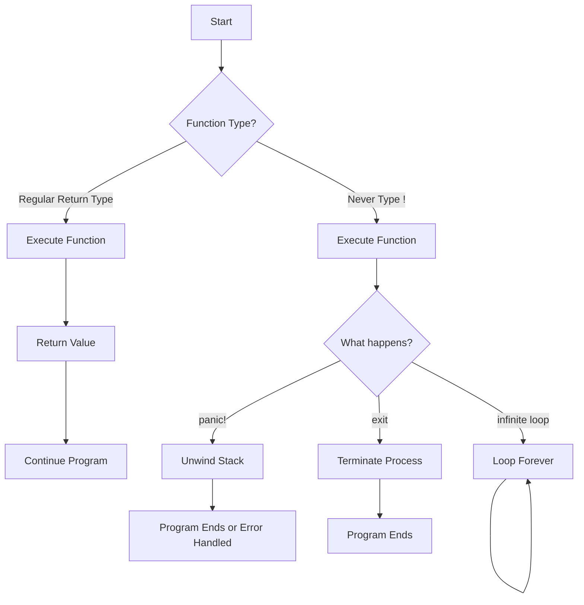

# The Never Type in Rust

## Introduction

When learning Rust, you'll eventually encounter a unique type called the "never type," represented by an exclamation mark (`!`). This special type tells the Rust compiler that a function or expression will never return a value. While this might sound strange at first, the never type is an important part of Rust's type system that enables several powerful patterns and safety guarantees.

In this tutorial, we'll explore:
- What the never type is
- How to use diverging functions
- Practical applications of the never type
- How it interacts with Rust's type system

## Understanding the Never Type

The never type (`!`) is used to denote that a function or expression will never complete normally. Instead of returning a value, a function with the never type might:
- Terminate the program
- Enter an infinite loop
- Panic
- Exit the current process

Let's look at the syntax:

```rust
fn will_never_return() -> ! {
    // This function never returns a value
    panic!("This function will never return!");
}
```

The exclamation mark (`!`) in the return type position indicates that this function will never return a value. This is different from functions that return `()` (the unit type), which do return, but return an empty value.

## Diverging Functions

Functions that return the never type are often called "diverging functions" because they diverge from the normal control flow. The most common examples of diverging functions in Rust's standard library are:

- `panic!`: Terminates the program with an error message
- `std::process::exit`: Exits the current process
- `loop` without a `break`: Creates an infinite loop

Let's see some examples:

```rust
fn infinite_loop() -> ! {
    loop {
        println!("This will print forever...");
        // No break statement, so this loop never ends
    }
}

fn exit_program() -> ! {
    std::process::exit(0);
}
```

**Input/Output Example:**

If you tried to call the `infinite_loop` function, it would continuously print "This will print forever..." until the program is forcibly terminated.

## Type Coercion and the Never Type

One of the most interesting aspects of the never type is how it interacts with Rust's type system. The never type can be coerced to any other type, which makes sense when you think about it: if a function never returns, then it's compatible with any expected return type.

This property makes the never type particularly useful in certain patterns:

```rust
fn get_username() -> String {
    let username = match get_user_input() {
        Some(name) => name,
        None => panic!("No username provided!"),
    };
    
    username
}
```

In the code above, `panic!()` returns `!` (the never type), but it's being used in a `match` arm that needs to return a `String`. This works because the never type can be coerced to any other type.

## Practical Applications

### 1. Error Handling with `unwrap()` and `expect()`

The never type is what makes methods like `unwrap()` and `expect()` work on `Option` and `Result` types:

```rust
// The implementation of unwrap() uses the never type
fn main() {
    let value: Option<i32> = None;
    let unwrapped = value.unwrap(); // This will panic with a "called `Option::unwrap()` on a `None` value" message
    
    println!("We won't reach this line if value is None");
}
```

### 2. Placeholder for Unimplemented Code

The `todo!()` macro uses the never type to provide a placeholder for code you haven't written yet:

```rust
fn calculate_complex_algorithm(data: &[u32]) -> u32 {
    todo!("Implement the complex algorithm here");
    // This compiles even if the function needs to return u32
}
```

### 3. Handling Unreachable Code

The `unreachable!()` macro is useful for code paths that should never be executed:

```rust
fn process_positive_number(num: i32) -> String {
    if num > 0 {
        format!("Processing: {}", num)
    } else {
        unreachable!("This function should only be called with positive numbers!");
    }
}
```

### 4. Custom Control Flow with Continuations

More advanced uses involve creating custom control flow mechanisms:

```rust
enum Command {
    Quit,
    Move { x: i32, y: i32 },
    Write(String),
}

fn process_command(command: Command) -> ! {
    match command {
        Command::Quit => {
            println!("Quitting...");
            std::process::exit(0);
        }
        Command::Move { x, y } => {
            println!("Moving to position ({}, {})", x, y);
            // Get and process next command
            let next_command = get_next_command();
            process_command(next_command) // Recursive call, never returns
        }
        Command::Write(text) => {
            println!("Writing: {}", text);
            // Get and process next command
            let next_command = get_next_command();
            process_command(next_command) // Recursive call, never returns
        }
    }
}

fn get_next_command() -> Command {
    // Implementation would get the next command from user input
    // For example purposes, we'll just return Quit
    Command::Quit
}
```

## Visualizing Control Flow with the Never Type

The never type affects program flow in specific ways. Here's a diagram showing how different functions might return or diverge:



## The Never Type and Rust's Type System

Understanding how the never type works requires some knowledge of Rust's type system. In type theory, the never type is known as the "bottom type" (`⊥`), which is a type that has no values.

This might sound contradictory, but it makes perfect sense in the context of functions that never return: if a function never returns, it can never produce a value of any type.

Because the never type has no values, it can be coerced into any other type. In type theory terms, the never type is a subtype of every other type.

## Summary

The never type (`!`) in Rust is a powerful feature that:

1. Represents functions or expressions that never return a value
2. Is denoted by the exclamation mark (`!`)
3. Can be coerced into any other type
4. Is used in standard library functions that terminate execution or enter infinite loops
5. Enables important patterns like `unwrap()`, `expect()`, `panic!()`, and `unreachable!()`

By using the never type, you can write more expressive code that communicates your intentions clearly to both the compiler and other developers. This leads to safer, more maintainable code with fewer bugs.

## Exercises

1. Write a function that uses the never type to exit the program after logging an error message.
2. Implement a simple command-line application that processes user commands in an infinite loop, using the never type.
3. Explore the source code of `std::panic::panic!` to understand how the never type is used in the standard library.
4. Create a function that uses pattern matching with the never type to handle errors in a way that ensures all cases are covered.

## Additional Resources

- [Rust Reference: Never Type](https://doc.rust-lang.org/reference/types/never.html)
- [RFC 1216: The Never Type](https://github.com/rust-lang/rfcs/blob/master/text/1216-bang-type.md)
- [Rust Blog: Traits and Trait Objects](https://blog.rust-lang.org/2018/05/10/Rust-1.26.html#impl-trait-and-dyn-trait)
- [The Book: Recovering from Errors](https://doc.rust-lang.org/book/ch09-02-recoverable-errors-with-result.html)