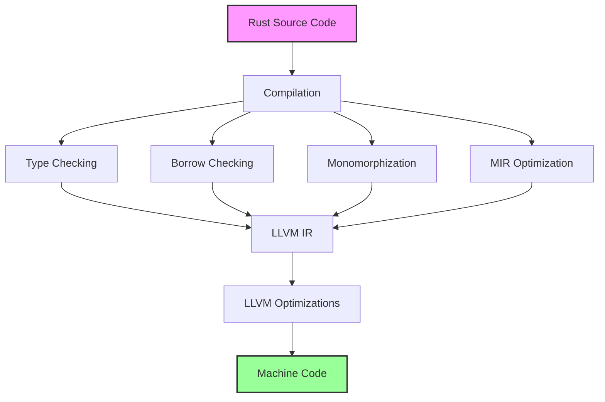

# Rust Zero-Cost Abstractions

## Introduction

One of Rust's most powerful features is its ability to provide high-level abstractions without imposing runtime performance penalties. This concept, known as **zero-cost abstractions**, allows developers to write clear, expressive code without sacrificing execution speed or efficiency.

Bjarne Stroustrup, the creator of C++, first articulated this principle as:

> What you don't use, you don't pay for. And further: What you do use, you couldn't hand code any better.

Rust embraces this philosophy wholeheartedly. In this tutorial, we'll explore how Rust implements zero-cost abstractions and why they're crucial for high-performance systems programming.

## What Are Zero-Cost Abstractions?

Zero-cost abstractions are programming constructs that:

1. Allow you to write code at a higher level of abstraction
2. Generate machine code that is as efficient as if you had written the low-level implementation by hand
3. Incur no additional runtime overhead compared to equivalent hand-written code

This means that in Rust, you can use powerful high-level features without worrying about performance degradation. The compiler handles the heavy lifting of optimizing your code.

## Key Zero-Cost Abstractions in Rust

### 1. Iterators

Let's look at a simple example comparing a traditional loop with iterators:

```rust
// Traditional for loop
fn sum_for_loop(numbers: &[i32]) -> i32 {
    let mut sum = 0;
    for i in 0..numbers.len() {
        sum += numbers[i];
    }
    sum
}

// Iterator-based approach
fn sum_iterators(numbers: &[i32]) -> i32 {
    numbers.iter().sum()
}

fn main() {
    let numbers = vec![1, 2, 3, 4, 5];
    
    println!("Sum using for loop: {}", sum_for_loop(&numbers));
    println!("Sum using iterators: {}", sum_iterators(&numbers));
}
```

**Output:**
```
Sum using for loop: 15
Sum using iterators: 15
```

Despite the iterator version being more concise and higher-level, Rust's compiler will optimize both functions to produce essentially identical machine code. This is because iterators in Rust are zero-cost abstractions.

### 2. Ownership and Borrowing

Rust's ownership system might seem like it adds complexity to your code, but it's a zero-cost abstraction. Memory safety checks happen at compile time, not runtime.

```rust
fn main() {
    // Ownership example
    let s1 = String::from("hello");
    let s2 = s1; // Ownership transferred, no runtime cost
    
    // This would cause a compile-time error, not a runtime check
    // println!("{}", s1);
    
    // Borrowing example
    let s3 = String::from("world");
    print_string(&s3); // Borrowed reference, no runtime cost
    println!("I can still use s3: {}", s3); // Still valid
}

fn print_string(s: &String) {
    println!("{}", s);
}
```

The ownership and borrowing rules might seem restrictive, but they're enforced entirely at compile time. At runtime, there are no garbage collection pauses or reference counting overhead.

### 3. Generics

Rust uses monomorphization for generics, which means the compiler generates specialized code for each type that uses a generic function:

```rust
// Generic function
fn largest<T: PartialOrd>(list: &[T]) -> &T {
    let mut largest = &list[0];
    
    for item in list.iter() {
        if item > largest {
            largest = item;
        }
    }
    
    largest
}

fn main() {
    let numbers = vec![34, 50, 25, 100, 65];
    println!("The largest number is {}", largest(&numbers));
    
    let chars = vec!['y', 'm', 'a', 'q'];
    println!("The largest char is {}", largest(&chars));
}
```

**Output:**
```
The largest number is 100
The largest char is y
```

Unlike languages that use type erasure or virtual dispatch, Rust creates specialized versions of `largest` for each type. This results in optimized code similar to what you would write if you created separate functions for each type.

### 4. Traits and Dynamic Dispatch

Rust allows you to choose between static and dynamic dispatch:

```rust
// Trait definition
trait Animal {
    fn make_sound(&self) -> String;
}

// Implementations
struct Dog;
impl Animal for Dog {
    fn make_sound(&self) -> String {
        "Woof!".to_string()
    }
}

struct Cat;
impl Animal for Cat {
    fn make_sound(&self) -> String {
        "Meow!".to_string()
    }
}

// Static dispatch (zero cost)
fn animal_sounds_static<T: Animal>(animal: T) -> String {
    animal.make_sound()
}

// Dynamic dispatch (small runtime cost)
fn animal_sounds_dynamic(animal: &dyn Animal) -> String {
    animal.make_sound()
}

fn main() {
    let dog = Dog;
    let cat = Cat;
    
    // Static dispatch
    println!("Static dispatch dog: {}", animal_sounds_static(dog));
    println!("Static dispatch cat: {}", animal_sounds_static(cat));
    
    // Dynamic dispatch
    let dog = Dog;
    let cat = Cat;
    println!("Dynamic dispatch dog: {}", animal_sounds_dynamic(&dog));
    println!("Dynamic dispatch cat: {}", animal_sounds_dynamic(&cat));
}
```

**Output:**
```
Static dispatch dog: Woof!
Static dispatch cat: Meow!
Dynamic dispatch dog: Woof!
Dynamic dispatch cat: Meow!
```

With static dispatch (using generics with trait bounds), the compiler creates specialized versions of the functions for each type, resulting in zero-cost abstraction. With dynamic dispatch (using trait objects), there's a small runtime cost for the virtual function call, but it's explicit and minimal.

## The Magic Behind Zero-Cost Abstractions

How does Rust achieve these zero-cost abstractions? Several mechanisms work together:



1. **Monomorphization**: For generic code, Rust generates separate copies of functions for each concrete type used.
2. **Aggressive Inlining**: The compiler inlines small functions to eliminate function call overhead.
3. **LLVM Optimizations**: Rust leverages LLVM's powerful optimizer to further reduce code size and improve performance.
4. **Static Analysis**: The borrow checker and other analyses allow the compiler to make stronger optimization assumptions.

## Real-World Application: Custom Vector Implementation

Let's build a simplified version of Rust's `Vec` type to see zero-cost abstractions in action:

```rust
use std::mem;
use std::ptr;

struct MyVec<T> {
    ptr: *mut T,
    capacity: usize,
    length: usize,
}

impl<T> MyVec<T> {
    // Create a new empty vector
    fn new() -> Self {
        MyVec {
            ptr: ptr::null_mut(),
            capacity: 0,
            length: 0,
        }
    }
    
    // Add an element to the end
    fn push(&mut self, value: T) {
        if self.length == self.capacity {
            self.grow();
        }
        
        unsafe {
            ptr::write(self.ptr.add(self.length), value);
        }
        
        self.length += 1;
    }
    
    // Increase capacity
    fn grow(&mut self) {
        let new_capacity = if self.capacity == 0 { 1 } else { self.capacity * 2 };
        let new_size = new_capacity * mem::size_of::<T>();
        
        let new_ptr = if self.capacity == 0 {
            unsafe { 
                let layout = std::alloc::Layout::from_size_align(new_size, mem::align_of::<T>()).unwrap();
                std::alloc::alloc(layout) as *mut T
            }
        } else {
            unsafe {
                let layout = std::alloc::Layout::from_size_align(
                    self.capacity * mem::size_of::<T>(), 
                    mem::align_of::<T>()
                ).unwrap();
                
                std::alloc::realloc(
                    self.ptr as *mut u8,
                    layout,
                    new_size
                ) as *mut T
            }
        };
        
        self.ptr = new_ptr;
        self.capacity = new_capacity;
    }
    
    // Get element at index
    fn get(&self, index: usize) -> Option<&T> {
        if index >= self.length {
            None
        } else {
            unsafe {
                Some(&*self.ptr.add(index))
            }
        }
    }
    
    // Iterator for the vector
    fn iter(&self) -> MyVecIterator<T> {
        MyVecIterator {
            vec: self,
            index: 0,
        }
    }
}

// Custom iterator implementation
struct MyVecIterator<'a, T> {
    vec: &'a MyVec<T>,
    index: usize,
}

impl<'a, T> Iterator for MyVecIterator<'a, T> {
    type Item = &'a T;
    
    fn next(&mut self) -> Option<Self::Item> {
        if self.index < self.vec.length {
            let item = self.vec.get(self.index);
            self.index += 1;
            item
        } else {
            None
        }
    }
}

// Clean up resources when vector is dropped
impl<T> Drop for MyVec<T> {
    fn drop(&mut self) {
        if self.capacity > 0 {
            // Drop each element
            for i in 0..self.length {
                unsafe {
                    ptr::drop_in_place(self.ptr.add(i));
                }
            }
            
            // Free the memory
            unsafe {
                let layout = std::alloc::Layout::from_size_align(
                    self.capacity * mem::size_of::<T>(),
                    mem::align_of::<T>()
                ).unwrap();
                
                std::alloc::dealloc(self.ptr as *mut u8, layout);
            }
        }
    }
}

fn main() {
    // Create and use our vector
    let mut vec = MyVec::new();
    vec.push(1);
    vec.push(2);
    vec.push(3);
    
    // Use our iterator
    let sum: i32 = vec.iter().sum();
    println!("Sum: {}", sum);
    
    // Manual iteration
    for i in 0..vec.length {
        if let Some(value) = vec.get(i) {
            println!("Value at {}: {}", i, value);
        }
    }
}
```

**Output:**
```
Sum: 6
Value at 0: 1
Value at 1: 2
Value at 2: 3
```

This example demonstrates several zero-cost abstractions:

1. **Generic type parameter `T`**: Our vector works with any type, but the compiled code is as efficient as if we wrote a specialized vector for each type.
2. **Iterator implementation**: We provide a high-level iterator interface, but it compiles down to efficient machine code.
3. **Resource management**: The `Drop` trait implementation ensures proper cleanup without runtime garbage collection overhead.

While our implementation is simplified, it shows how Rust can provide high-level interfaces without sacrificing performance.

## Measuring the Cost (or Lack Thereof)

To verify that these abstractions are truly zero-cost, let's consider a benchmark comparing low-level code with high-level abstractions:

```rust
use std::time::{Duration, Instant};

// Low-level approach
fn sum_array_manually(arr: &[i32]) -> i32 {
    let mut sum = 0;
    let mut i = 0;
    while i < arr.len() {
        sum += arr[i];
        i += 1;
    }
    sum
}

// High-level approach using iterators
fn sum_array_iterators(arr: &[i32]) -> i32 {
    arr.iter().sum()
}

fn benchmark<F>(name: &str, iterations: u32, f: F) -> Duration
where
    F: Fn() -> i32,
{
    let start = Instant::now();
    
    for _ in 0..iterations {
        let result = f();
        // Use the result to prevent optimization from removing the function call
        std::hint::black_box(result);
    }
    
    let duration = start.elapsed();
    println!("{}: {:?}", name, duration);
    duration
}

fn main() {
    let size = 10_000;
    let arr: Vec<i32> = (0..size).collect();
    let iterations = 1_000;
    
    let manual_time = benchmark("Manual sum", iterations, || sum_array_manually(&arr));
    let iterator_time = benchmark("Iterator sum", iterations, || sum_array_iterators(&arr));
    
    println!("Ratio (Iterator/Manual): {:.2}", 
             iterator_time.as_nanos() as f64 / manual_time.as_nanos() as f64);
}
```

When compiled with optimizations (`cargo run --release`), both versions typically perform nearly identically, with a ratio very close to 1.0. This demonstrates that Rust's high-level abstractions like iterators truly are zero-cost.

## Common Pitfalls and Considerations

While Rust's zero-cost abstractions are powerful, there are some important considerations:

1. **Debug vs. Release Mode**: Zero-cost abstractions might have overhead in debug builds. Always benchmark with `--release` for accurate performance assessment.

2. **Not All Abstractions Are Zero-Cost**: Some abstractions, like dynamic dispatch with trait objects, do have a small runtime cost. Rust makes these costs explicit.

3. **Abstraction Layers Can Hide Unexpected Costs**: Composing multiple abstractions might introduce inefficiencies that aren't immediately obvious. Profile your code when performance is critical.

4. **Memory Usage**: Zero-cost refers to runtime performance, not necessarily memory usage. Monomorphization can increase binary size due to code duplication.

## Summary

Rust's zero-cost abstractions allow you to write clean, expressive, high-level code without sacrificing performance. These abstractions are possible thanks to Rust's design choices:

- Static typing and compile-time checks
- Monomorphization of generic code
- Ownership system with compile-time enforcement
- LLVM's powerful optimization passes

By embracing zero-cost abstractions, you can write Rust code that is both elegant and efficient.

## Additional Resources

- [Rust Performance Book](https://nnethercote.github.io/perf-book/)
- [The Rust Programming Language](https://doc.rust-lang.org/book/ch10-01-syntax.html) - Chapter on Generic Types
- [Rust by Example](https://doc.rust-lang.org/rust-by-example/generics.html) - Generics section
- [Rust API Guidelines](https://rust-lang.github.io/api-guidelines/about.html)

## Exercises

1. **Iterator Chains**: Create a function that uses multiple iterator adaptors to transform a vector of integers. Compare its performance with an equivalent implementation using loops.

2. **Generic Data Structure**: Implement a generic binary search tree with methods for insertion, deletion, and traversal. Verify that it works with different types.

3. **Trait Objects vs. Generics**: Create a program that solves the same problem using both dynamic dispatch (trait objects) and static dispatch (generics). Compare the performance and binary size.

4. **Custom Iterator**: Implement a custom iterator for a data structure of your choice. Ensure it follows Rust's zero-cost abstraction principles.

5. **Memory Usage Analysis**: Use tools like `cargo-bloat` to analyze how monomorphization affects binary size in a project with extensive use of generics.