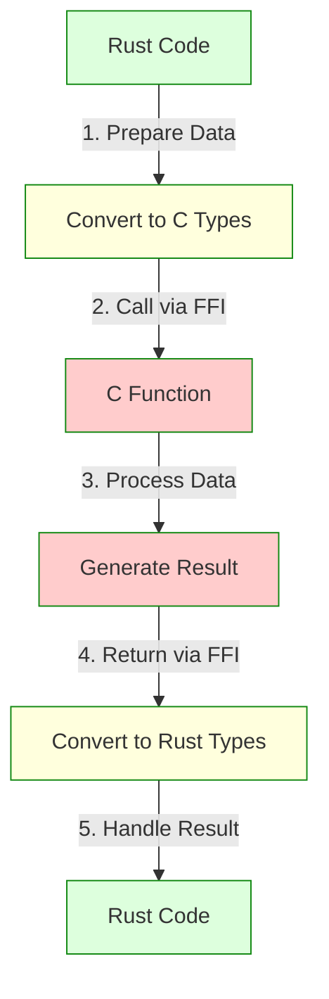

# Rust Foreign Function Interface (FFI)

## Introduction

The Foreign Function Interface (FFI) is one of Rust's most powerful features, allowing your Rust code to interact with code written in other programming languages. This interoperability is essential when you need to:

- Use existing libraries written in languages like C or C++
- Integrate Rust into existing projects
- Create libraries in Rust that can be used from other languages
- Optimize performance-critical parts of your application

In this tutorial, we'll explore how Rust's FFI capabilities work, with a focus on the most common use case: interfacing with C code. By the end, you'll understand how to safely bridge the gap between Rust's memory-safe world and the unsafe-but-ubiquitous world of C.

## Understanding the Basics of FFI

### What is FFI?

Foreign Function Interface refers to the mechanism that allows code written in one programming language to call code written in another language. In Rust's case, the FFI primarily focuses on interfacing with C, given its status as a lingua franca in systems programming.

### Why Use FFI?

There are several compelling reasons to use FFI:

1. **Leverage existing code**: Avoid rewriting established, well-tested libraries
2. **Gradual migration**: Incrementally port applications to Rust
3. **Performance**: Access low-level system features not directly available in Rust
4. **Interoperability**: Create Rust libraries that can be used from other languages

### The Safety Challenge

Rust's main selling point is its strong safety guarantees, particularly around memory safety and concurrency. However, when we cross language boundaries with FFI, we leave Rust's safety net behind. This is why most FFI code in Rust requires the `unsafe` keyword, signaling to both the compiler and other developers that the code needs special attention.

## Calling C Functions from Rust

Let's start by learning how to call C functions from Rust code.

### Step 1: Declaring External Functions

To call a C function, we first need to declare its signature in Rust. This is done using an `extern` block:

```rust
// Declaring the C function printf from the standard C library
extern "C" {
    fn printf(format: *const i8, ...) -> i32;
}

fn main() {
    unsafe {
        // Create a C-compatible string
        let message = std::ffi::CString::new("Hello from Rust calling C!
").unwrap();
        // Call the C function
        printf(message.as_ptr() as *const i8);
    }
}
```

The `extern "C"` block tells Rust that the functions declared inside use the C calling convention (how arguments are passed and results returned).

### Step 2: Handling Data Types

One of the trickiest aspects of FFI is dealing with differences in data types between languages:

```rust
use std::ffi::{CString, CStr};
use std::os::raw::c_char;

extern "C" {
    fn strlen(s: *const c_char) -> usize;
}

fn main() {
    let rust_string = "Measuring this string with C's strlen";
    
    // Convert Rust string to C string
    let c_string = CString::new(rust_string).unwrap();
    
    // Call C's strlen function
    let length = unsafe { strlen(c_string.as_ptr()) };
    
    println!("String: \"{}\"", rust_string);
    println!("Length (via C's strlen): {}", length);
    println!("Length (via Rust's len()): {}", rust_string.len());
}
```

**Output:**
```
String: "Measuring this string with C's strlen"
Length (via C's strlen): 38
Length (via Rust's len()): 38
```

Notice a few important things:
- We use `CString` to create a null-terminated string that C can understand
- We use the `as_ptr()` method to get a raw pointer to pass to C
- The entire C function call must be in an `unsafe` block

### Common Data Type Mappings

Here's a quick reference for mapping between Rust and C types:

| Rust Type | C Type | Notes |
|-----------|--------|-------|
| `i8` | `char` or `signed char` | 8-bit signed integer |
| `u8` | `unsigned char` | 8-bit unsigned integer |
| `i16` | `short` | 16-bit signed integer |
| `u16` | `unsigned short` | 16-bit unsigned integer |
| `i32` | `int` | 32-bit signed integer |
| `u32` | `unsigned int` | 32-bit unsigned integer |
| `i64` | `long long` | 64-bit signed integer |
| `u64` | `unsigned long long` | 64-bit unsigned integer |
| `f32` | `float` | 32-bit floating point |
| `f64` | `double` | 64-bit floating point |
| `*const T` | `const T*` | Immutable pointer |
| `*mut T` | `T*` | Mutable pointer |
| `bool` | `_Bool` (C99) | Boolean value |
| `()` | `void` | Unit type / void |

## Using External Libraries

While calling individual C functions is useful, often we want to use entire C libraries. Rust's ecosystem provides great tools for this.

### Using `pkg-config` and `-sys` Crates

Many C libraries already have corresponding `-sys` crates that provide raw FFI bindings. For example, the `libgit2-sys` crate provides bindings to the libgit2 C library.

Here's how you might use a system library:

1. First, add the dependency to your `Cargo.toml`:

```toml
[dependencies]
libgit2-sys = "0.13"
```

2. Then use it in your code:

```rust
use libgit2_sys::{git_repository, git_repository_open};
use std::ffi::CString;
use std::ptr;

fn main() -> Result<(), String> {
    unsafe {
        // Create a place to store the repository pointer
        let mut repo: *mut git_repository = ptr::null_mut();
        
        // Open a repository
        let path = CString::new(".").unwrap();
        let error_code = git_repository_open(&mut repo, path.as_ptr());
        
        if error_code < 0 {
            return Err(format!("Failed to open repository: error code {}", error_code));
        }
        
        // Do something with the repository...
        
        // Don't forget to free resources when done!
        if !repo.is_null() {
            // Call a function to free the repository
            // (specific function depends on the library)
        }
    }
    
    Ok(())
}
```

This example is simplified - in practice, you'd want to handle errors more robustly and ensure proper resource management.

## Creating C-Compatible Rust Functions

Now let's look at the other direction: exposing Rust functions to C code.

### Step 1: Creating an Exportable Function

To make a Rust function callable from C, we need to:
1. Use the `#[no_mangle]` attribute to prevent name mangling
2. Declare it as `extern "C"` to use C calling convention
3. Use C-compatible types for arguments and return values

```rust
use std::os::raw::{c_char, c_int};
use std::ffi::{CStr, CString};

#[no_mangle]
pub extern "C" fn count_chars(text: *const c_char) -> c_int {
    // Safety check
    if text.is_null() {
        return -1;
    }
    
    // Convert C string to Rust string safely
    let c_str = unsafe { CStr::from_ptr(text) };
    match c_str.to_str() {
        Ok(string) => {
            println!("Counting characters in: {}", string);
            string.chars().count() as c_int
        },
        Err(_) => -1  // Invalid UTF-8
    }
}
```

### Step 2: Building a Shared Library

To compile Rust code as a shared library that C can use, modify your `Cargo.toml`:

```toml
[lib]
name = "myrust"
crate-type = ["cdylib"]  # Creates a dynamic library

[dependencies]
# Add any required dependencies
```

When you run `cargo build --release`, it will produce a shared library (`.so` on Linux, `.dylib` on macOS, or `.dll` on Windows).

### Step 3: Using the Rust Library from C

Here's how you might use your Rust library from C:

```c
// main.c
#include <stdio.h>

// Declare the Rust function
extern int count_chars(const char* text);

int main() {
    const char* message = "Hello from C calling Rust!";
    
    // Call the Rust function
    int count = count_chars(message);
    
    printf("Message: %s
", message);
    printf("Character count: %d
", count);
    
    return 0;
}
```

To compile the C program linking to your Rust library:

```bash
gcc main.c -L./target/release -lmyrust -o myprogram
```

You may need to add the library path to your system's dynamic library search path (using `LD_LIBRARY_PATH` on Linux or `DYLD_LIBRARY_PATH` on macOS).

## Memory Management Across FFI Boundaries

One of the most challenging aspects of FFI is memory management. Rust's ownership system doesn't extend across language boundaries, so we need to be careful.

### Passing Ownership

When Rust needs to give ownership of data to C:

```rust
use std::os::raw::c_char;
use std::ffi::CString;

// This function creates a string and transfers ownership to the caller
#[no_mangle]
pub extern "C" fn create_greeting(name: *const c_char) -> *mut c_char {
    // Safety check
    if name.is_null() {
        return std::ptr::null_mut();
    }
    
    // Convert C string to Rust string
    let c_str = unsafe { std::ffi::CStr::from_ptr(name) };
    let name_str = match c_str.to_str() {
        Ok(s) => s,
        Err(_) => return std::ptr::null_mut(),
    };
    
    // Create the greeting
    let greeting = format!("Hello, {}!", name_str);
    
    // Convert to C string and transfer ownership
    let c_greeting = match CString::new(greeting) {
        Ok(s) => s,
        Err(_) => return std::ptr::null_mut(),
    };
    
    // Transfer ownership to the caller
    c_greeting.into_raw()
}

// The C side must call this function to free the memory properly
#[no_mangle]
pub extern "C" fn free_greeting(ptr: *mut c_char) {
    if !ptr.is_null() {
        unsafe {
            // Take back ownership and drop the CString
            let _ = CString::from_raw(ptr);
        }
    }
}
```

The corresponding C code would look like:

```c
#include <stdio.h>

// Declare the Rust functions
extern char* create_greeting(const char* name);
extern void free_greeting(char* ptr);

int main() {
    // Call Rust to create a greeting
    char* greeting = create_greeting("World");
    
    if (greeting) {
        printf("%s
", greeting);
        
        // Don't forget to free the memory
        free_greeting(greeting);
    }
    
    return 0;
}
```

This pattern ensures that memory is allocated and freed by the same language runtime, preventing memory leaks and crashes.

## Callbacks: Passing Functions Across Boundaries

Another powerful FFI technique is using callbacks, where one language passes a function pointer to another language.

### Passing a C Callback to Rust

```rust
use std::os::raw::{c_int, c_void};

// Define the type of our callback function
type CallbackFn = extern "C" fn(value: c_int, user_data: *mut c_void) -> c_int;

// A Rust function that accepts a C callback
#[no_mangle]
pub extern "C" fn process_values(
    callback: CallbackFn,
    user_data: *mut c_void
) -> c_int {
    let values = [1, 2, 3, 4, 5];
    let mut sum = 0;
    
    for val in values.iter() {
        // Call the C callback for each value
        sum += callback(*val, user_data);
    }
    
    sum
}
```

C code using this function:

```c
#include <stdio.h>

// Define the callback function
int my_callback(int value, void* user_data) {
    int* multiplier = (int*)user_data;
    int result = value * (*multiplier);
    printf("Processing %d * %d = %d
", value, *multiplier, result);
    return result;
}

// Declare the Rust function
extern int process_values(
    int (*callback)(int, void*),
    void* user_data
);

int main() {
    int multiplier = 10;
    
    // Call the Rust function with our callback
    int sum = process_values(my_callback, &multiplier);
    
    printf("Sum of processed values: %d
", sum);
    
    return 0;
}
```

**Output:**
```
Processing 1 * 10 = 10
Processing 2 * 10 = 20
Processing 3 * 10 = 30
Processing 4 * 10 = 40
Processing 5 * 10 = 50
Sum of processed values: 150
```

## Error Handling in FFI

Error handling across language boundaries requires careful planning. Here are some common strategies:

### Using Return Codes

The simplest approach is to use return codes:

```rust
use std::os::raw::{c_int, c_char};
use std::ffi::CStr;

// Error codes
const SUCCESS: c_int = 0;
const ERROR_NULL_POINTER: c_int = -1;
const ERROR_INVALID_UTF8: c_int = -2;
const ERROR_VALUE_TOO_LARGE: c_int = -3;

#[no_mangle]
pub extern "C" fn safe_multiply(
    text: *const c_char,
    multiplier: c_int,
    result: *mut c_int
) -> c_int {
    // Check for null pointers
    if text.is_null() || result.is_null() {
        return ERROR_NULL_POINTER;
    }
    
    // Parse the input text
    let c_str = unsafe { CStr::from_ptr(text) };
    let text_str = match c_str.to_str() {
        Ok(s) => s,
        Err(_) => return ERROR_INVALID_UTF8,
    };
    
    // Parse the text as a number
    let value: i32 = match text_str.parse() {
        Ok(v) => v,
        Err(_) => return ERROR_INVALID_UTF8,
    };
    
    // Check for potential overflow
    match value.checked_mul(multiplier as i32) {
        Some(product) => {
            // Store the result
            unsafe { *result = product as c_int };
            SUCCESS
        },
        None => ERROR_VALUE_TOO_LARGE,
    }
}
```

C code that handles these error codes:

```c
#include <stdio.h>

// Error codes
#define SUCCESS 0
#define ERROR_NULL_POINTER -1
#define ERROR_INVALID_UTF8 -2
#define ERROR_VALUE_TOO_LARGE -3

// Declare the Rust function
extern int safe_multiply(const char* text, int multiplier, int* result);

int main() {
    const char* input = "12345";
    int multiplier = 1000;
    int result;
    
    // Call the Rust function
    int error_code = safe_multiply(input, multiplier, &result);
    
    // Handle different error codes
    switch (error_code) {
        case SUCCESS:
            printf("Result: %d * %d = %d
", atoi(input), multiplier, result);
            break;
        case ERROR_NULL_POINTER:
            printf("Error: Null pointer passed
");
            break;
        case ERROR_INVALID_UTF8:
            printf("Error: Invalid text input
");
            break;
        case ERROR_VALUE_TOO_LARGE:
            printf("Error: Result too large
");
            break;
        default:
            printf("Unknown error: %d
", error_code);
    }
    
    return 0;
}
```

## Real-World Example: Using SQLite from Rust

Let's put everything together with a real-world example: using the SQLite database from Rust.

```rust
use std::ffi::{CStr, CString};
use std::os::raw::{c_char, c_int, c_void};

// SQLite types and constants
type SQLiteDatabase = *mut c_void;
type SQLiteStatement = *mut c_void;
type SQLiteCallback = extern "C" fn(
    arg: *mut c_void,
    col_count: c_int,
    col_values: *mut *mut c_char,
    col_names: *mut *mut c_char
) -> c_int;

const SQLITE_OK: c_int = 0;
const SQLITE_ROW: c_int = 100;
const SQLITE_DONE: c_int = 101;

// SQLite function declarations
extern "C" {
    fn sqlite3_open(filename: *const c_char, db: *mut SQLiteDatabase) -> c_int;
    fn sqlite3_close(db: SQLiteDatabase) -> c_int;
    fn sqlite3_exec(
        db: SQLiteDatabase,
        sql: *const c_char,
        callback: Option<SQLiteCallback>,
        arg: *mut c_void,
        errmsg: *mut *mut c_char
    ) -> c_int;
    fn sqlite3_free(ptr: *mut c_void);
}

// Callback function for query results
extern "C" fn print_row_callback(
    _arg: *mut c_void,
    col_count: c_int,
    col_values: *mut *mut c_char,
    col_names: *mut *mut c_char
) -> c_int {
    for i in 0..col_count as usize {
        unsafe {
            let name = if !col_names.is_null() && !(*col_names.add(i)).is_null() {
                CStr::from_ptr(*col_names.add(i)).to_string_lossy()
            } else {
                "?".into()
            };
            
            let value = if !col_values.is_null() && !(*col_values.add(i)).is_null() {
                CStr::from_ptr(*col_values.add(i)).to_string_lossy()
            } else {
                "NULL".into()
            };
            
            print!("{}: {} | ", name, value);
        }
    }
    println!();
    
    SQLITE_OK  // Continue processing
}

fn main() -> Result<(), String> {
    unsafe {
        // Open database
        let mut db: SQLiteDatabase = std::ptr::null_mut();
        let db_name = CString::new(":memory:").unwrap();
        
        let result = sqlite3_open(db_name.as_ptr(), &mut db);
        if result != SQLITE_OK {
            return Err(format!("Failed to open database: {}", result));
        }
        
        // Create a table and insert data
        let create_sql = CString::new(
            "CREATE TABLE users (id INTEGER PRIMARY KEY, name TEXT, email TEXT);"
        ).unwrap();
        
        let mut err_msg: *mut c_char = std::ptr::null_mut();
        let result = sqlite3_exec(db, create_sql.as_ptr(), None, std::ptr::null_mut(), &mut err_msg);
        
        if result != SQLITE_OK {
            let error = if !err_msg.is_null() {
                let msg = CStr::from_ptr(err_msg).to_string_lossy().to_string();
                sqlite3_free(err_msg as *mut c_void);
                msg
            } else {
                format!("Error code: {}", result)
            };
            
            sqlite3_close(db);
            return Err(format!("SQL error: {}", error));
        }
        
        // Insert data
        let insert_sql = CString::new(
            "INSERT INTO users (name, email) VALUES ('Alice', 'alice@example.com'); \
             INSERT INTO users (name, email) VALUES ('Bob', 'bob@example.com');"
        ).unwrap();
        
        let result = sqlite3_exec(db, insert_sql.as_ptr(), None, std::ptr::null_mut(), &mut err_msg);
        if result != SQLITE_OK {
            let error = if !err_msg.is_null() {
                let msg = CStr::from_ptr(err_msg).to_string_lossy().to_string();
                sqlite3_free(err_msg as *mut c_void);
                msg
            } else {
                format!("Error code: {}", result)
            };
            
            sqlite3_close(db);
            return Err(format!("SQL error: {}", error));
        }
        
        // Query data
        println!("Query results:");
        let query_sql = CString::new("SELECT id, name, email FROM users;").unwrap();
        
        let result = sqlite3_exec(
            db,
            query_sql.as_ptr(),
            Some(print_row_callback),
            std::ptr::null_mut(),
            &mut err_msg
        );
        
        if result != SQLITE_OK {
            let error = if !err_msg.is_null() {
                let msg = CStr::from_ptr(err_msg).to_string_lossy().to_string();
                sqlite3_free(err_msg as *mut c_void);
                msg
            } else {
                format!("Error code: {}", result)
            };
            
            sqlite3_close(db);
            return Err(format!("SQL error: {}", error));
        }
        
        // Close database
        sqlite3_close(db);
    }
    
    Ok(())
}
```

**Output:**
```
Query results:
id: 1 | name: Alice | email: alice@example.com | 
id: 2 | name: Bob | email: bob@example.com | 
```

This example demonstrates:
1. Opening and closing a SQLite database
2. Creating tables and inserting data
3. Querying with a callback function
4. Proper error handling and resource cleanup

In a real application, you'd likely use a higher-level crate like `rusqlite` instead of raw FFI, but this shows what's happening under the hood.

## Best Practices for Rust FFI

When working with FFI, keep these best practices in mind:

### 1. Minimize Unsafe Code

Keep `unsafe` blocks as small as possible. Wrap unsafe FFI code in safe Rust interfaces:

```rust
// Low-level unsafe FFI wrapper
mod ffi {
    use std::os::raw::{c_int, c_char};
    
    extern "C" {
        pub fn some_c_function(input: *const c_char) -> c_int;
    }
}

// Safe Rust interface
pub fn safe_wrapper(input: &str) -> Result<i32, &'static str> {
    let c_string = std::ffi::CString::new(input)
        .map_err(|_| "String contains null bytes")?;
    
    let result = unsafe {
        ffi::some_c_function(c_string.as_ptr())
    };
    
    if result < 0 {
        Err("Function failed")
    } else {
        Ok(result)
    }
}
```

### 2. Use `-sys` Crates for Low-Level Bindings

For substantial C libraries, consider using or creating a `-sys` crate for raw bindings, then build a more Rust-idiomatic API on top:

```rust
// In a hypothetical openssl-sys crate
extern "C" {
    pub fn SSL_new(ctx: *mut SSL_CTX) -> *mut SSL;
    pub fn SSL_free(ssl: *mut SSL);
    // ... many more raw bindings
}

// In a higher-level openssl crate
pub struct Ssl {
    inner: *mut sys::SSL,
}

impl Ssl {
    pub fn new(ctx: &SslContext) -> Result<Ssl, ErrorStack> {
        unsafe {
            let ptr = sys::SSL_new(ctx.as_ptr());
            if ptr.is_null() {
                return Err(ErrorStack::get());
            }
            Ok(Ssl { inner: ptr })
        }
    }
}

impl Drop for Ssl {
    fn drop(&mut self) {
        unsafe { sys::SSL_free(self.inner) }
    }
}
```

### 3. Use Bindgen for Generating Bindings

For complex C libraries, consider using the `bindgen` tool to automatically generate Rust FFI bindings from C header files:

```rust
// build.rs
fn main() {
    let bindings = bindgen::Builder::default()
        .header("wrapper.h")
        .generate()
        .expect("Unable to generate bindings");

    bindings
        .write_to_file("src/bindings.rs")
        .expect("Couldn't write bindings!");
}
```

### 4. Test Thoroughly

Since FFI code bypasses Rust's safety guarantees, thorough testing is crucial:

- Test on all target platforms
- Use tools like Valgrind to detect memory issues
- Write tests for edge cases (null pointers, invalid UTF-8, etc.)

### 5. Document Safety Requirements

Clearly document any assumptions and requirements for using your FFI code safely:

```rust
/// Calls the C function `process_data`.
///
/// # Safety
///
/// The caller must ensure that:
/// - `data` points to a valid, properly aligned buffer of at least `len` bytes
/// - The memory remains valid for the duration of the call
/// - `len` accurately represents the buffer size
unsafe fn call_process_data(data: *const u8, len: usize) -> i32 {
    // ...
}
```

## Understanding FFI Overhead

FFI calls often have some performance overhead compared to pure Rust or pure C code:

1. **Marshalling data**: Converting between Rust and C data structures
2. **Crossing boundaries**: The actual function call across language boundaries
3. **Safety checks**: Additional validation needed for FFI safety

To minimize this overhead:

- Batch operations when possible (make fewer, larger FFI calls)
- Reuse allocations and conversions where possible
- For performance-critical code, consider passing raw data structures

## Advanced FFI Topics

### Using Rust Types with `#[repr(C)]`

To share complex data structures between Rust and C, use `#[repr(C)]` to ensure compatible memory layout:

```rust
// A struct with C-compatible layout
#[repr(C)]
pub struct Point {
    pub x: f64,
    pub y: f64,
}

// Functions that use the struct
#[no_mangle]
pub extern "C" fn distance(a: Point, b: Point) -> f64 {
    let dx = b.x - a.x;
    let dy = b.y - a.y;
    (dx * dx + dy * dy).sqrt()
}
```

Corresponding C code:

```c
// point.h
typedef struct {
    double x;
    double y;
} Point;

// Function declaration
extern double distance(Point a, Point b);

// Usage
int main() {
    Point p1 = {1.0, 2.0};
    Point p2 = {4.0, 6.0};
    
    double dist = distance(p1, p2);
    printf("Distance: %f
", dist);
    
    return 0;
}
```

### Working with Global State

When interfacing with C libraries that use global state, you'll need to manage initialization and cleanup carefully:

```rust
// Bindings to a C library that requires initialization
extern "C" {
    fn lib_initialize() -> c_int;
    fn lib_cleanup() -> c_int;
    fn lib_process(data: *const c_char) -> c_int;
}

// Rust wrapper to ensure proper initialization and cleanup
struct Library {
    initialized: bool,
}

impl Library {
    fn new() -> Result<Self, &'static str> {
        let result = unsafe { lib_initialize() };
        if result != 0 {
            return Err("Failed to initialize library");
        }
        
        Ok(Library { initialized: true })
    }
    
    fn process(&self, data: &str) -> Result<i32, &'static str> {
        if !self.initialized {
            return Err("Library not initialized");
        }
        
        let c_data = std::ffi::CString::new(data)
            .map_err(|_| "Invalid data")?;
            
        let result = unsafe { lib_process(c_data.as_ptr()) };
        
        if result < 0 {
            Err("Processing failed")
        } else {
            Ok(result)
        }
    }
}

impl Drop for Library {
    fn drop(&mut self) {
        if self.initialized {
            unsafe { lib_cleanup() };
        }
    }
}
```

This pattern ensures that initialization and cleanup always happen in pairs, even if there's a panic.

## FFI Architecture Patterns

When designing larger applications that use FFI, consider these architectural patterns:

### 1. Layered Approach

```
┌─────────────────────────────┐
│ High-level Rust API         │
├─────────────────────────────┤
│ Safe Rust FFI Wrappers      │
├─────────────────────────────┤
│ Unsafe FFI Bindings         │
├─────────────────────────────┤
│ C Library                   │
└─────────────────────────────┘
```

This approach isolates unsafe code and provides a progressively more Rust-like API.

### 2. Bridge Module Pattern

Create a dedicated module that handles all FFI concerns:

```rust
// Low-level bindings
mod ffi {
    // Raw FFI declarations
}

// Bridge module
mod bridge {
    use super::ffi;
    
    // Safe wrappers around unsafe FFI
    pub fn safe_function(input: &str) -> Result<String, Error> {
        // Convert Rust types to C types
        // Call unsafe functions
        // Convert results back to Rust types
        // Handle errors
    }
}

// Public API
pub fn user_friendly_function(input: &str) -> Result<String, Error> {
    // Call bridge functions
    // Provide higher-level functionality
}
```

This keeps FFI concerns isolated and makes the codebase easier to maintain.

## Visualizing the FFI Process

Here's a visualization of the data flow when calling from Rust to C and back:



## Summary

Rust's Foreign Function Interface provides powerful tools for inter