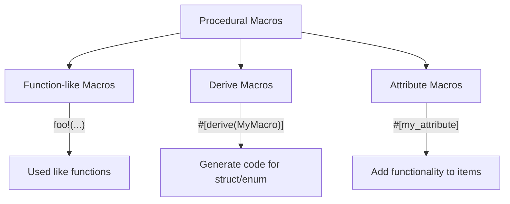

# Rust Procedural Macros

## Introduction

Procedural macros are one of Rust's most powerful features, allowing you to extend the language in ways that would otherwise be impossible. Unlike declarative macros (created with `macro_rules!`), procedural macros are functions that operate on Rust code at compile time. They take code as input, manipulate it, and then output new code.

Procedural macros enable you to:
- Generate code automatically
- Reduce boilerplate code
- Create domain-specific languages
- Implement custom attributes
- And much more!

In this guide, we'll explore how procedural macros work, the different types available, and walk through practical examples to help you understand how to use them in your own projects.

## Prerequisites

Before diving into procedural macros, you should have:
- Basic knowledge of Rust syntax and concepts
- Familiarity with Rust's module system
- Some experience with basic macros (`macro_rules!`)

## Types of Procedural Macros

Rust offers three types of procedural macros:



1. **Function-like macros** - Similar to declarative macros but more powerful
2. **Derive macros** - Applied to structs and enums using `#[derive(MyMacro)]`
3. **Attribute macros** - Define custom attributes with `#[my_attribute]`

## Setting Up a Procedural Macro Crate

Procedural macros must be defined in their own special crate type. Let's start by creating one:

1. Create a new library crate:

```bash
cargo new proc_macro_example --lib
```

2. Configure your `Cargo.toml`:

```toml
[package]
name = "proc_macro_example"
version = "0.1.0"
edition = "2021"

[lib]
proc-macro = true

[dependencies]
syn = "1.0"
quote = "1.0"
proc-macro2 = "1.0"
```

The key parts here are:
- Setting `proc-macro = true`, which identifies this as a procedural macro crate
- Adding the essential dependencies:
  - `syn`: For parsing Rust code into a syntax tree
  - `quote`: For turning syntax trees back into Rust code
  - `proc-macro2`: A stable interface to the compiler's procedural macro API

## Creating a Function-like Procedural Macro

Let's create a simple function-like macro called `inspect_input` that shows us the code we pass to it:

```rust
use proc_macro::TokenStream;
use quote::quote;
use syn::parse_macro_input;

#[proc_macro]
pub fn inspect_input(input: TokenStream) -> TokenStream {
    // Parse the input tokens
    let input_as_string = input.to_string();
    
    // Generate the output code
    let output = quote! {
        {
            println!("The macro received: {}", #input_as_string);
            
            // Just return the original input as is
            #input
        }
    };
    
    // Convert back to TokenStream
    output.into()
}
```

Here's how you would use this macro:

```rust
use proc_macro_example::inspect_input;

fn main() {
    let result = inspect_input!(5 + 6);
    println!("Result: {}", result);
}
```

Output:
```
The macro received: 5 + 6
Result: 11
```

### How It Works

1. The `TokenStream` type represents Rust code as a stream of tokens
2. We convert this to a string for display purposes
3. We use the `quote!` macro to generate new code
4. Inside the `quote!` macro, `#input_as_string` and `#input` are interpolated (inserted) into the generated code
5. The output is converted back to a `TokenStream`

## Creating a Derive Macro

Derive macros are used to automatically implement functionality for structs and enums. Let's create a simple `HelloWorld` derive macro:

```rust
use proc_macro::TokenStream;
use quote::quote;
use syn::{parse_macro_input, DeriveInput};

#[proc_macro_derive(HelloWorld)]
pub fn hello_world_derive(input: TokenStream) -> TokenStream {
    // Parse the input tokens into a syntax tree
    let input = parse_macro_input!(input as DeriveInput);
    
    // Extract the name of the struct or enum
    let name = &input.ident;
    
    // Generate the implementation
    let expanded = quote! {
        impl #name {
            pub fn hello_world() {
                println!("Hello, World! My name is {}", stringify!(#name));
            }
        }
    };
    
    // Convert back to TokenStream
    expanded.into()
}
```

Usage:

```rust
use proc_macro_example::HelloWorld;

#[derive(HelloWorld)]
struct MyStruct;

fn main() {
    MyStruct::hello_world();
}
```

Output:
```
Hello, World! My name is MyStruct
```

### How It Works

1. The `#[proc_macro_derive(HelloWorld)]` attribute tells Rust this is a derive macro named `HelloWorld`
2. We use `parse_macro_input!` to parse the input as a `DeriveInput` struct from the `syn` crate
3. We extract the name of the type with `&input.ident`
4. We generate code that implements a method called `hello_world` for that type
5. `stringify!(#name)` converts the identifier to a string

## Creating an Attribute Macro

Attribute macros allow you to create custom attributes. Let's create a `trace` attribute that prints function entry and exit:

```rust
use proc_macro::TokenStream;
use quote::{quote, format_ident};
use syn::{parse_macro_input, ItemFn, Ident};

#[proc_macro_attribute]
pub fn trace(_attrs: TokenStream, input: TokenStream) -> TokenStream {
    // Parse the function
    let input_fn = parse_macro_input!(input as ItemFn);
    
    // Extract function details
    let fn_name = &input_fn.sig.ident;
    let fn_inputs = &input_fn.sig.inputs;
    let fn_output = &input_fn.sig.output;
    let fn_body = &input_fn.block;
    let fn_vis = &input_fn.vis;
    
    // Generate the wrapped function
    let expanded = quote! {
        #fn_vis fn #fn_name(#fn_inputs) #fn_output {
            println!("Entering function: {}", stringify!(#fn_name));
            
            // Call the original function
            let result = {
                #fn_body
            };
            
            println!("Exiting function: {}", stringify!(#fn_name));
            
            result
        }
    };
    
    // Convert back to TokenStream
    expanded.into()
}
```

Usage:

```rust
use proc_macro_example::trace;

#[trace]
fn add(a: i32, b: i32) -> i32 {
    a + b
}

fn main() {
    let result = add(5, 3);
    println!("Result: {}", result);
}
```

Output:
```
Entering function: add
Exiting function: add
Result: 8
```

### How It Works

1. The `#[proc_macro_attribute]` attribute tells Rust this is an attribute macro
2. It receives two parameters:
   - `_attrs`: Any attributes specified with the macro (we don't use these in this example)
   - `input`: The item the attribute is applied to
3. We parse the input as an `ItemFn` (a function)
4. We extract the various parts of the function
5. We generate a new function that wraps the original one with our tracing code

## Real-World Example: A JSON Serialization Macro

Let's create a more practical example – a `Serialize` derive macro that generates JSON serialization code:

```rust
use proc_macro::TokenStream;
use quote::quote;
use syn::{parse_macro_input, Data, DeriveInput, Fields};

#[proc_macro_derive(Serialize)]
pub fn serialize_derive(input: TokenStream) -> TokenStream {
    // Parse the input
    let input = parse_macro_input!(input as DeriveInput);
    let name = &input.ident;
    
    // Generate different implementations based on the data type
    let implementation = match &input.data {
        Data::Struct(data_struct) => {
            match &data_struct.fields {
                Fields::Named(fields) => {
                    // Get all field names
                    let field_names = fields.named.iter().map(|field| {
                        &field.ident
                    });
                    
                    // Generate code for struct with named fields
                    quote! {
                        let mut json = String::from("{");
                        
                        #(
                            if !json.ends_with("{") {
                                json.push_str(",");
                            }
                            json.push_str(&format!("\"{}\":{}", stringify!(#field_names), self.#field_names.to_json()));
                        )*
                        
                        json.push_str("}");
                        json
                    }
                },
                // Handle other field types (tuple structs, unit structs)
                _ => quote! { String::from("{}") }
            }
        },
        // Handle enums or other data types
        _ => quote! { String::from("{}") }
    };
    
    // Generate the full implementation
    let expanded = quote! {
        impl #name {
            pub fn to_json(&self) -> String {
                #implementation
            }
        }
        
        // Implement ToJson trait if it exists in scope
        impl ToJson for #name {
            fn to_json(&self) -> String {
                self.to_json()
            }
        }
    };
    
    expanded.into()
}
```

Usage:

```rust
use proc_macro_example::Serialize;

// Define a trait for JSON serialization
trait ToJson {
    fn to_json(&self) -> String;
}

// Implementation for primitive types
impl ToJson for i32 {
    fn to_json(&self) -> String {
        self.to_string()
    }
}

impl ToJson for String {
    fn to_json(&self) -> String {
        format!("\"{}\"", self)
    }
}

#[derive(Serialize)]
struct Person {
    name: String,
    age: i32,
}

fn main() {
    let person = Person {
        name: "Alice".to_string(),
        age: 30,
    };
    
    println!("{}", person.to_json());
}
```

Output:
```
{"name":"Alice","age":30}
```

## Debugging Procedural Macros

Procedural macros can be challenging to debug because they run during compilation. Here are some helpful techniques:

1. **Print debugging information**: Use `eprintln!` to output information during macro expansion:

```rust
#[proc_macro_derive(HelloWorld)]
pub fn hello_world_derive(input: TokenStream) -> TokenStream {
    eprintln!("Input: {}", input);
    // Rest of the function...
}
```

2. **Use `cargo expand`**: This tool shows the expanded code after macro processing:

```bash
cargo install cargo-expand
cargo expand
```

3. **Break down complex macros**: Start simple and incrementally add functionality.

4. **Use `panic!` for inspection**: In development, use `panic!` to see what your macro is receiving:

```rust
#[proc_macro_derive(HelloWorld)]
pub fn hello_world_derive(input: TokenStream) -> TokenStream {
    let input_str = input.to_string();
    panic!("This is what the macro received: {}", input_str);
}
```

## Best Practices for Procedural Macros

1. **Provide clear error messages**: Use `syn`'s error handling capabilities:

```rust
return TokenStream::from(
    syn::Error::new(
        proc_macro2::Span::call_site(),
        "This macro only works on structs with named fields"
    ).to_compile_error()
);
```

2. **Document your macros thoroughly**: Explain how to use them, what they generate, and any requirements.

3. **Keep macros focused**: A macro should do one thing well.

4. **Choose the right macro type**:
   - Use derive macros for implementing traits
   - Use attribute macros for modifying or enhancing items
   - Use function-like macros for code generation or DSLs

5. **Test your macros**: Create unit tests to verify your macros generate the expected code.

## Summary

Procedural macros are a powerful feature in Rust that allow you to extend the language in significant ways. In this guide, we've covered:

- The three types of procedural macros: function-like, derive, and attribute
- How to set up a procedural macro crate
- Creating basic examples of each macro type
- A practical example of JSON serialization
- Debugging techniques and best practices

With procedural macros, you can reduce boilerplate, create domain-specific abstractions, and enhance your Rust code in ways that would otherwise be impossible. While they have a steeper learning curve than declarative macros, the power they provide is well worth the investment.

## Additional Resources

- [The Rust Book - Procedural Macros](https://doc.rust-lang.org/book/ch19-06-macros.html#procedural-macros-for-generating-code-from-attributes)
- [The `syn` crate documentation](https://docs.rs/syn)
- [The `quote` crate documentation](https://docs.rs/quote)
- [The Rust Reference on Procedural Macros](https://doc.rust-lang.org/reference/procedural-macros.html)

## Exercises

1. Create a `Debug` derive macro that generates a basic debug implementation for a struct
2. Modify the `trace` attribute macro to also print the function arguments
3. Create a function-like macro that generates a struct with getters and setters
4. Build a procedural macro that turns a struct into a command-line argument parser
5. Create an attribute macro that measures and prints the execution time of a function